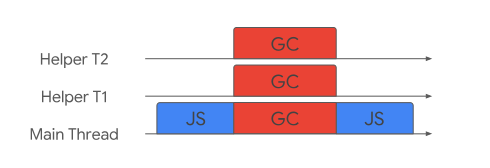

# V8 Memory Management

`Javascript` 开发者在编程的过程中其实很少直接与内存打交道，本身不会对内存精确的控制，也缺乏控制的手段。说到内存泄漏，大家首先想起的也只是早期版本的`IE`中`JavaScript`与`DOM` 交互时发生的问题。如果页面里的内存占用过多，基本等不到进行代码回收，用户已经不耐烦地刷新了当前页面。

随着`Node`的发展，`JavaScript`已经实现了`CommonJS`的生态圈大一统的梦想，`JavaScript`的应用场景早已不再局限在浏览器中。本章将暂时抛开那些短时间执行的场景，比如网页应用、命令行工具等，这类场景由于运行时间短，且运行在用户的机器上，即使内存使用过多或内存泄漏，也只会影响到终端用户。由于运行时间短，随着进程的退出，内存会释放，几乎没有内存管理的必要。但随着`Node`在服务器端的广泛应用，其他语言里存在着的问题在`JavaScript`中也暴露出来了。

基于无阻塞、事件驱动建立的`Node`服务，具有内存消耗低的优点，非常适合处理海量的网络请求。在海量请求的前提下，开发者就需要考虑一些平常不会形成影响的问题。本书写到这里算是正式迈进服务器端编程的领域了，内存控制正是在海量请求和长时间运行的前提下进行探讨的。在服务器端，资源向来就寸土寸金，要为海量用户服务，就得使一切资源都要高效循环利用。

## V8 Memory Structure

首先，让我们看看 `V8`引擎下的内存结构是什么。 由于 `JavaScript` 是单线程的，所以 `V8`也在每个 `JavaScript` 上下文中开启一个独立进程，如果您使用 `service workers`，每一个 `service worker` 会生成一个新的 `V8`进程。 一个正在运行的程序可以由 `V8` 进程中分配的内存表示，这被称为**常驻集(`Resident Set`)**。而常驻集又被分为如下区段：


下面让我们来分别看看被划分的不同的内存区域所储存的数据结构特征：

### Heap Memory

**堆内存`Heap Memory`**，这里是 `V8` 存储对象或者动态数据的地方。这里是最大的内存块区域，也是垃圾收集(`GC`)发生的地方。并非整块的堆内存都会参与垃圾回收，这块区域中只有新生代(`Young generation`)和老生代(`Oldgeneration`)会被垃圾收集管控。堆内存被具体的分为以下几个部分：

+ **New Space：**`New Space` 也被称为新生代(`Young generation`)是用于存储新对象的地方，这里的大部分对象的寿命都比较短暂。这块区域被分为两个半空间`semi-space`，并且由 **Scavenger(Minor GC)** 垃圾回收策略进行管控，这个算法我们稍后介绍。新生代的空间大小可以由 `--min_semi_space_size`(Initial) 和 `--max_semi_space_size`(Max)两个 `v8` 标志位进行管控。
+ **Old Space：**`Old Space` 也被称为老生代(`Old generation`)，在新生代空间中存活了至少两轮 `minor GC`的对象会被移入这个空间。这块空间由 **Major GC(Mark-Sweep & Mark-Compact)** 垃圾回收策略进行管控。老生代的空间大小可以由  `--initial_old_space_size`(Initial) 和 `--max_old_space_size`(Max)两个标志位进行管控。这个区域也被分为两个部分：
  + **Old pointer space**: 老指针区域用于储存包含指向其他对象的指针的存活对象。
  + **Old data space**: 老数据区域只储存数据的对象(不包含任何指向其他对象的指针)。字符串、装箱的数字类型以及未装箱的双精度浮点数数组都会在新生代空间中存活超过两个 `Minor GC` 后移入至此。

+ **Large Object Space：**用于储存超过其他区域内存大小限制的超大对象，这里的每个对象都有自己的[mmap](https://en.wikipedia.org/wiki/Mmap)内存区域。垃圾收集器永远不会移动这块区域中的对象。
+ **Code Space：**这里用于储存即时编译器(`JIT`)编译后的代码块。 这里是唯一具有可执行内存的空间(大对象空间中也可以存在代码，并且那些代码也是可以执行的，但是内存空间本身不具有可执行性)。
+ **Cell space, property cell space, and map space**: 这些空间分别包含`Cell`(单元格)，`PropertyCells`(特征单元格)和 `Maps`(映射)。 这些空间中的每个空间都包含相同大小的对象，并且对它们指向的对象的类型有一些限制，从而简化了收集。

上面的每一个空间中的都由一组页面组成。 页面是操作系统使用[`mmap`或 [MapViewOfFile](https://docs.microsoft.com/zh-cn/windows/win32/api/memoryapi/nf-memoryapi-mapviewoffile)(`on window`)虚拟内存策略]从操作系统分配的连续内存块 。 除了 `Large Object Space` 外，每个页面的大小均为 `1MB`。

### Stack Memory

`Stack` 是储存堆内存的地方，每一个 `V8` 线程都只包含一个运行时栈，这里用于储存静态数据包括函数帧、原始值(`primitive values`)和指向对象的指针，堆内存的大小可以由 `--stack_size` 这个标志位进行控制。

## V8 Memeory Usage

既然我们已经清楚了内存的组织方式，那么让我们来看看实际程序执行过程中的内存使用。

让我们使用下面的 `JavaScript` 程序，该代码并未针对正确性进行优化，因此可以忽略诸如不必要的中间变量之类的问题，因此，重点是可视化堆栈和堆内存的使用情况。

```js
class Employee {
  constructor(name, salary, sales) {
    this.name = name;
    this.salary = salary;
    this.sales = sales;
  }
}
// class
const BONUS_PERCENTAGE = 10;
// constant data
function getBonusPercentage(salary) {
  const percentage = (salary * BONUS_PERCENTAGE) / 100;
  // dynamic data
  return percentage;
}
// function
function findEmployeeBonus(salary, noOfSales) {
  const bonusPercentage = getBonusPercentage(salary);
  const bonus = bonusPercentage * noOfSales;
  return bonus;
}

let john = new Employee("John", 5000, 5);
john.bonus = findEmployeeBonus(john.salary, john.sales);
console.log(john.bonus);
```

下面的轮播图展示了详细的内存使用过程：

<iframe class="speakerdeck-iframe" frameborder="0" src="https://speakerdeck.com/player/e89e2e48a797417eb8692897dcada584?" allowfullscreen="true" mozallowfullscreen="true" webkitallowfullscreen="true" style="box-sizing: border-box; max-width: 100%; border: 0px; background: padding-box rgba(0, 0, 0, 0.1); margin: 0px; padding: 0px; border-radius: 6px; box-shadow: rgba(0, 0, 0, 0.2) 0px 5px 40px; width: 812px; height: 457px;"></iframe>

观察的过程中我们可以发现：

+ 全局作用域中的变量保存在堆栈的全局帧(`global frame`)中；
+ 每个函数调用都作为函数帧块(`frame block`)添加到堆栈内存中；
  + 包括参数和返回值在内的所有局部变量都被保存在上面的的函数帧块中；
+ 所有基本类型(`primitive`)，如 `int` 和 `string`，都直接存储在堆栈上。这既适用于全局作用域也适用于局部作用域。
+ 像`Employee`和`Function`这样的所有对象类型都是在堆上创建的，并使用堆栈指针从堆栈中引用。函数在`JavaScript`中只是对象；
+ 函数调用之后产生的帧块会被推入堆栈的顶部；
+ 函数返回之后帧块会从堆栈的顶部移除掉；
+ 一旦主线程代码执行完成，堆上的对象将不再具有来自 `Stack` 的指针，并成为孤立对象；
+ 除非你显式的复制，否则其他对象中的所有对象引用都是使用引用指针来完成的；

如你所见，栈内存是由操作系统自动管理的，而不是由 `V8` 进行管理的。 因此，我们不必担心栈的内存分配(本来就是一个简单的先进后出的数据结构)。 

不过`Heap` 并不是由操作系统自动管理的，并且因为它是最大的内存空间并保存动态数据，所以它可能会成倍增长，从而导致我们的程序随着时间的推移而耗尽内存。 而且随着时间的流逝，它的空间结构也可能变得支离破碎，从而降低了应用程序的速度，此时垃圾回收就该登场了。

区分堆上的指针和数据对于垃圾收集很重要，`V8` 为此使用了`Tagged Pointer`(标记指针)方法。在这种方法中，它在每个计算机**字**的最后保留一个比特位以指示它是指针还是数据。这种方法需要有编译器的支持，但是实现起来很简单，而且相当高效。

## Garbage collection

现在我们知道了 `V8` 如何分配内存，让我们看看它如何自动管理堆内存，这对应用程序的性能非常重要。当程序试图在 `Heap`上分配比可用内存更多的内存时(取决于 `V8` 标志设置)，我们会遇到内存不足错误。不正确的管理堆也可能导致内存泄漏。

`V8` 通过垃圾收集来管理堆内存。简单地说，它释放**孤立对象**使用的内存以腾出空间来创建新对象。

> [ 孤立对象:]() 不再直接或间接地(通过另一个堆中对象的引用)从堆栈中引用的对象、

任何的垃圾收集器都会定期执行一些基本任务：

+ 标记活动(`live`)/死亡(`dead`)对象；
+ 回收/重用死亡(`dead`)对象占用的内存；
+ 紧凑/整理内存结构(`optional`)；

这些任务可以按顺序执行，也可以任意交叉执行。一种简单的方法是暂停 `JavaScript`执行，并在主线程上依次执行这些任务。不过这可能会导致主线程上的`jank`和延迟问题。

## Major GC (Full Mark-Compact)

`Major GC` 是整个堆所使用的垃圾回收算法(包含新生代和老生代)：


通过上图我们可以看出 `Major GC`分为三个阶段：标记(`marking`)，清除(`sweeping`)和压缩(`compact`)对应我们上面所说的垃圾回收算法的基本能力。

### Marking

确定哪些对象可以是被垃圾收集器回收的是很重要的一环。垃圾收集器通过使用可达性作为存活`live`表现的代理来实现这一点。这意味着运行时内的任何可达对象都必须被保留，任何不可达对象都**可能**被收集。


`Marking`是找到可到达对象的过程。 `GC`从一组已知的对象指针(称为根集`root set`)开始，包括执行堆栈和全局对象。 然后，它跟随每个指向`JavaScript`对象的指针，并将该对象标记为可访问。 `GC`继续会跟踪该对象中的每个指针，然后递归地继续此过程，直到找到并标记了运行时中可以访问的每个对象为止。

### Sweeping

`Sweeping`(清除)是将死对象(`dead object`)留下的内存间隙添加到称为**空闲链表(`free-list`)**的数据结构中的过程。标记完成后，`GC` 会找到无法访问的对象留下的连续间隙并将其添加到适当的空闲链表中。 空闲列表由内存块的大小分隔开，以便快速查找。 将来，当我们要分配内存时，我们只需查看空闲链表，然后找到适当大小的内存块即可。


### Compaction

`Major GC` 还基于碎片启发式(`fragmentation heuristic`)的策略压缩/整理某些页面。我们可以将压缩想象为旧电脑硬盘上的碎片整理，我们将存活(`live`)对象复制到其他当前未压缩的页面中(使用该页面的空闲链表)。 这样，我们可以利用死对象遗留在内存中的细小且分散的间隙。

复制存活对象的垃圾收集器的一个潜在弱点是，如果我们分配许多长寿命对象，我们会付出很高的成本来复制这些对象。这就是为什么我们选择只压缩一些高度分散的页面，对其他页面只执行清除操作，而不会复制尚存的对象的原因。


## The Generational Hypothesis (代际假说)

在垃圾回收中有一个重要的术语 — **“代际假说(`The Generational Hypothesis`)”**。这个假说基本上是在阐述：**大多数对象都在年轻时死亡**。换句话说，从 `GC` 的角度来看，大多数对象被分配后几乎立即变得不可访问。这不仅适用于 `V8`或 `JavaScript`，也适用于大多数动态语言。

## Generational layout (生代布局)

上面我们说了 `v8`的堆结构被分为了两个生代结构，即新生代(`young generation`)和老生代(`old generation`)，新生代又被进而分成两个空间称为`nursery`(托儿所) 和`intermediate`(中级班)两个子生代。

对象首先被分配到托儿所(`nursery`)中。 如果他们有幸在下一届 `GC` 中幸存下来，他们将保留在新生代中，但被认为是中级(`intermediate`)。 这个过程也就是说每次垃圾回收之后新生代的两个半空间会产生一次交换，这个交换只是概念交换不会产生额外的内存复制。再之后如果他们在再一轮 `GC` 中幸存下来，那么他们将被转移到老生代中。


`V8`的生代堆布局就是基于代际假说设计的。`v8`的 `GC` 是一个`compacting/moving GC`，这意味着它复制了可以在垃圾回收后幸存的对象。 

这似乎违反直觉：因为在GC时复制对象非常昂贵会阻塞主线程很长时间。 但是根据代际假设，我们知道实际上只有很小一部分的对象能幸存于垃圾回收。 

通过仅移动尚存(`live`)的对象，把其他所有分配的内存都变成“隐式”的垃圾。 这意味着我们只支付与剩余对象数量成正比的复制成本，而不是和分配内存数量成正比。

## Minor GC (Scavenger)

`V8`中有两个垃圾收集器。 `Major GC(Mark-Compact)`从整个堆中收集垃圾。 `Minor GC(Scavenger)`在新生代中收集垃圾。 这是因为`Major GC`可以有效地从整个堆中收集垃圾，但是代际假设告诉我们，新分配的对象很可能需要立刻进行垃圾收集。

在 `Scavenger` 中，它只在新生代中收集，幸存的对象总是被疏散到一个新页面。`V8` 为新生代使用了半空间(`semi-space`)(对应上文生代布局概念中的`nursery`和`intermediate`)设计。这意味着总空间的一半总是空的，以实现这个疏散过程。在`scavenger`的过程中，这个最初的空区域被称为 `To-Space`。我们复制的区域称为 `From-space`。在最坏的情况下，每个对象都可以在清除中幸存下来，我们将需要复制每个对象。


疏散步骤将所有存活对象移动到连续的内存块(在一个页面内)。 这样做的好处是可以完全消除死对象留下的内存间隙(因为存活对象都被移走了，整个`From-Space`都可以被看做是干净的)。 之后两个空间会进行切换，即`From-Space`变为 `To-Space`，反之亦然。一旦 `GC`完成，新的`From-Space`是紧凑的内存结构，而新的内存分配将发生在 `From-Space` 中的下一个空闲地址。同时是 `To-Space`是完全干净的内存空间。


如果仅用这种策略，我们很快就会耗尽新生代的空间。所以在第二次 `GC` 中存活下来的对象将被转移到老生代，而不是 `To-Space`。

同时在 `Scavenger`过程中，我们还有一组额外的指针，它们是旧到新引用。这些指针在旧空间(`From-space`)中指向新生代中的对象。为防止这组指针的列表被覆盖，我们使用**写屏障**来维护这个引用列表，而不是在每次`Scavengere`过程中跟踪整个的堆以避免其被覆盖。当与堆栈和全局变量结合使用时，我们仅在新生代(这个引用链表)就能拿到所有的对象引用，而不需要遍历老生代空间。

而`scavenging` 的最后一步则是更新已移动的引用原始对象的指针。每个**被复制的**对象都留下一个转发地址，用于更新原始指针，使其指向新的位置(不论是移动到了`From/To-Space` 还是 `Old Generation`)。

在清除过程中，我们实际上做了这三个步骤，标记、清除和指针更新，这三个步骤交错进行(比如移动对象之后就会立刻进行指针更新)，而不是分三个阶段进行。

## Orinoco

上面这些算法和优化中的大多数在垃圾回收文献中很常见，亦可以在许多垃圾回收语言中找到。 但是，最先进的垃圾收集发展了很长时间。 衡量垃圾回收效率的一项重要指标是执行 `GC` 时主线程的暂停的时间。 对于传统的暂停世界(`stop-the-world`)垃圾收集器(大概是说整个世界都被阻塞了)来说，这段时间真的很久，而花在 `GC` 上的时间会直接损害用户体验，导致页面混乱、渲染效果差和延迟。


`Orinoco` 是 `V8 GC` 项目的代号，该项目利用最新、最好的并行(`parallel`)、增量(`incremental`)和并发(`concurrent`)技术进行垃圾收集，以释放主线程。这里的一些术语在 `GC` 上下文中具有特定的含义，值得详细定义它们：

### Parallel

`Parallel` 是指主线程和辅助线程在同一时间点做大致相等的工作。这仍然是一种`暂停世界`的方法，但是总的暂停时间现在除以参与的线程数(加上一些同步开销)。

这是三种技巧中最简单的一种。因为没有`JavaScript`在运行，`JavaScript`的堆会暂停分配，所以每个帮助线程只需要确保对某个对象的访问与其他帮助线程是同步的。



### Incremental

`Incremental`增量式`GC`是指在主线程运行过程中间歇执行少量`GC`工作。 我们不会在一次增量引发的暂停中执行整个`GC`过程，而只完成 `GC` 所需总工作量的一小部分。 这更加困难，因为 `JavaScript` 在每个增量 `GC` 工作段之间执行，这意味着堆的状态已更改，可能会使以前增量`GC`执行的工作无效。


 从图中可以看到，这不会减少花费在主线程上的时间(实际上，它通常会稍微增加)，而只是随着时间的流逝而扩展。 这仍然是解决我们最初的问题之一的好技术：主线程延迟。 通过允许 `JavaScript` 间歇运行，而且还可以继续执行垃圾回收任务，该应用程序仍可以响应用户输入并在动画上取得进展。

### Concurrent

`Concurrent` 是指主线程不间断 `JavaScript` 执行，帮助线程在后台执行完整`GC`的情况。 这是三种技术中最困难的一种：`JavaScript` 堆上的任何内容都可以随时更改，从而使之前所做的工作无效。 


最重要的是，由于帮助线程和主线程同时读取或修改相同的对象，因此现在存在读取/写入争用的问题。 这样做的好处是，主线程完全可以自由执行 `JavaScript`，尽管主线程和帮助线程之间的同步产生了一些同步开销，但是这种开销很小可以接受。

## State of GC in V8

### Minor GC

目前，`V8` 在新生代 `GC` 期间使用**并行清理 `parallel scavenging(Minor GC)`** 将工作派发到多个帮助线程。每个线程接收一些指针(函数栈、全局变量、间接指针、`etc`)，它跟随这些指针，快速地将所有存活(`live`)对象转移到 `To-Space` 中。

我们试图撤离对象时，`scavenger`任务通过原子`read/write/compare-and-swap`进行同步操作。因为另一个`scavenger`任务可能通过不同的指针路径找到相同的对象，并试图移动它，这样可以避免冲突。

移动对象成功后，帮助线程返回并更新指针。它留下一个转发指针，以便到达该对象的其他工作线程在找到以改变的指针时及时的更新它们。


### Major GC

`V8` 中的 `Major GC` 从并发标记开始。随着堆开始动态计算的内存限制，并发标记任务就开始了。 每个帮助线程都会跟踪一些指针，在跟踪对象的所有应用的同时这些帮助线程会标记找到的每一个对象。`JavaScript`在主线程上执行的同时，并发标记在后台运行。在这个过程中写屏障用于在帮助线程标记的同时跟踪 `JavaScript` 创建的对象之间的新引用。


当并发标记完成，或者达到内存动态分配限制时，主线程将执行一个快速结束标记步骤。此阶段开始主线程暂停，此时主线程不会再动态创建新对象。主线程重新扫描根，以确保所有活动对象都被标记，然后与许多帮主线程一起，开始并行压缩`compat`和指针更新。并非旧空间中的所有页面都符合压缩 `compact` 条件——那些不符合压缩条件的页面将使用前面提到的空闲链表进行`sweep`清除空间间隔。

主线程在暂停期间启动并发清理`sweep`任务。`sweep`清理任务并发的和并行压缩任务以及`JS`主线程同时运行——即使`JavaScript`在主线程上运行，它们也可以继续运行。

### Idle-time GC

`JavaScript` 用户不能直接访问垃圾收集器，内核代码没有提供访问的接口。然而，`V8`为提供了嵌入式的触发垃圾收集机制，`GC` 可以发布“`idle task`”，这些可选的工作最终都会被触发。`Chrome`可能有一些空闲时间的概念。例如在 `Chrome` 中，在每秒 `60` 帧的速度下，浏览器大约 有 `16.6` 毫秒的时间来渲染动画的每一帧。如果动画工作提前完成，`Chrome` 可以选择在下一帧之前运行一些`GC`在创建的空闲任务。


## Takeaways

`V8`中的垃圾收集器从一开始就走了很长一段路。向现有`GC`添加并行、增量和并发技术需要多年的努力，但已经取得了成效，将大量工作转移到了后台任务。它极大地改善了暂停时间、延迟和页面加载，使动画、滚动和用户交互更加流畅。并行清查器将主线程年轻代垃圾收集的总时间减少了约`20%-50%`，具体取决于工作负载。空闲时`GC`可以将`Gmail`的`JavaScript`堆内存减少`45%`。同时标记和扫视减少了重型`WebGL`游戏中高达`50%`的暂停时间。

但是这里的工作还没有完成。 减少垃圾收集的暂停时间对于为用户提供最佳的`Web`体验仍然很重要，我们正在研究更高级的技术。 最重要的是，`Blink`（`Chrome`中的渲染器）还具有一个垃圾收集器（称为`Oilpan`），我们正在努力改善两个收集器之间的合作，并将一些新技术从`Orinoco`移植到`Oilpan`。

大多数开发人员在开发`JavaScript`程序时无需考虑`GC`，但了解一些内部知识可以帮助您考虑内存使用情况和有用的编程模式。 例如，对于`V8`堆的生代结构，从垃圾收集器的角度来看，短命的对象实际上非常便宜，因为我们只为在收集中幸存的对象付费。 这些类型的模式对许多垃圾收集的语言（而不只是`JavaScript`）都适用。

