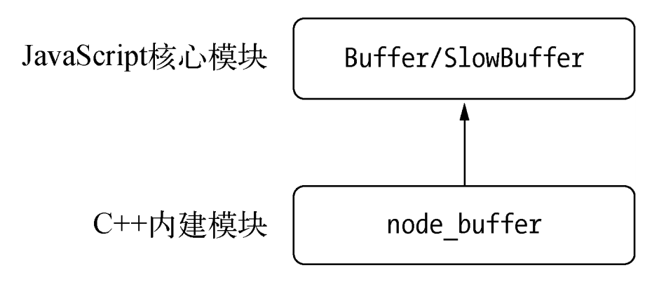
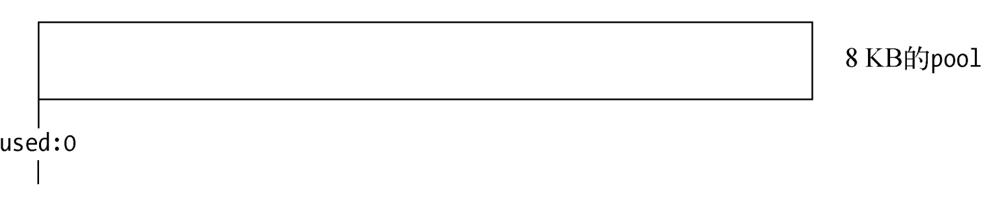
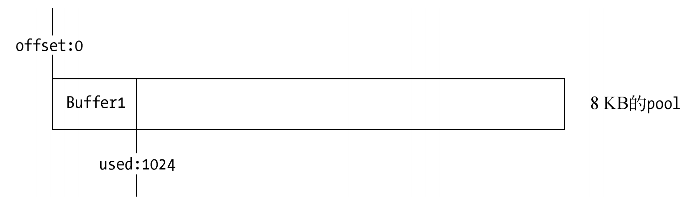
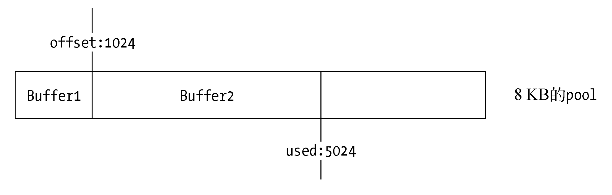

# Buffer 缓冲

在``Node``中，应用需要处理网络协议、操作数据库、处理图片、接收上传文件等，在网络流和文件的操作中，还要处理大量二进制数据，``JavaScript``自有的字符串远远不能满足这些需求，于是``Buffer``对象应运而生。

我们不妨从不使用缓冲的角度分析，我们通过 `DMA` 对文件进行读写的时候每一次读或写新的数据都要进行中断这样的效率会很低，所以这时候我们引入缓存，缓存同时存在于内核空间和用户空间可以节省多次中断请求，但是缓存会涉及到内核空间到用户空间的多次复制，这样也会降低效率。

## Buffer 结构

----

`Buffer` 对象用于表示固定长度的字节序列。 许多 `Node.js API` 都支持 `Buffer`。

`Buffer` 类是 `JavaScript` 的 `Uint8Array` 类的子类，且继承时带上了涵盖额外用例的方法。 只要支持 `Buffer` 的地方，`Node.js API` 都可以接受普通的 `Uint8Array`。

#### 模块结构

`Buffer`是一个典型的`JavaScript`与`C`++结合的模块，它将性能相关部分用`C`++实现，将非性能相关的部分用`JavaScript`实现，如图所示。



`Buffer`所占用的内存不是通过`V8`分配的，属于堆外内存。由于`V8`垃圾回收性能的影响，将常用的操作对象用更高效和专有的内存分配回收策略来管理是个不错的思路。

由于`Buffer`太过常见，`Node`在进程启动时就已经加载了它，并将其放在全局对象（`global`）上。所以在使用`Buffer`时，无须通过`require()`即可直接使用。

#### Buffer对象

`Buffer`对象类似于数组，它的元素为 `16` 进制的两位数 (一个字节)，即`0`到`255`的数值。示例代码如下所示：

```js
console.log(Buffer.from('深入浅出node.js', 'utf8'));
var buf = new Buffer(str, 'utf-8'); 
console.log(buf); 
// => <Buffer e6 b7 b1 e5 85 a5 e6 b5 85 e5 87 ba 6e 6f 64 65 2e 6a 73>
```

由上面的示例可见，不同编码的字符串占用的元素个数各不相同，上面代码中的中文字在`UTF-8`编码下占用`3`个元素，字母和半角标点符号占用`1`个元素。而 `buffer` 本身就类似一个字节数组，无论字符串编码如何，最后存在 `buffer` 中的都是一个一个的字节编码。

`Buffer`受`Array`类型的影响很大，可以访问`length`属性得到长度，也可以通过下标访问元素，在构造对象时也十分相似，代码如下：

```js
var buf = new Buffer.alloc(100); 
console.log(buf.length); 
// => 100
```

#### 内存分配

`Buffer`对象的内存分配不是在`V8`的堆内存中，而是在`Node`的`C`++层面实现内存的申请的。因为处理大量的字节数据不能采用需要一点内存就向操作系统申请一点内存的方式，这可能造成大量的内存申请的系统调用，对操作系统有一定压力。为此`Node`在内存的使用上应用的是在`C`++层面申请内存、在`JavaScript`中分配内存的策略。

为了高效地使用申请来的内存，`Node`采用了`slab`分配机制。`slab`是一种动态内存管理机制，最早诞生于`SunOS`操作系统（`Solaris`）中，目前在一些*`nix`操作系统中有广泛的应用，如`FreeBSD`和`Linux`。简单而言，`slab`就是一块申请好的固定大小的内存区域。`slab`具有如下`3`种状态。

+ `full`：完全分配状态。
+ `partial`：部分分配状态。
+ `empty`：没有被分配状态。

当我们需要一个`Buffer`对象，可以通过以下方式分配指定大小的`Buffer`对象：

```js
Buffer.alloc(size);
```

`Node`以`8 KB`为界限来区分`Buffer`是大对象还是小对象：

```js
Buffer.poolSize = 8 * 1024;
```

这个`8 KB`的值也就是每个`slab`的大小值，在`JavaScript`层面，以它作为单位单元进行内存的分配。

**分配小Buffer对象**

如果指定`Buffer`的大小少于`8 KB`，`Node`会按照小对象的方式进行分配。`Buffer`的分配过程中主要使用一个局部变量`pool`作为中间处理对象，处于分配状态的`slab`单元都指向它。以下是分配一个全新的`slab`单元的操作，它会将新申请的`SlowBuffer`对象指向它：

```js
var pool; 
function allocPool() { 
  pool = new SlowBuffer(Buffer.poolSize); 
  pool.used = 0; 
}
```

构造的 `slab` 数据结构：



构造小 `Buffer` 对象时的代码如下：

```js
new Buffer.alloc(1024);
```

这次构造将会去检查`pool`对象，如果`pool`没有被创建，将会创建一个新的`slab`单元指向它，如果已经被创建了，那么就会检查剩余空间是否足够：

```js
if (!pool || pool.length - pool.used < this.length) allocPool();
```

同时当前`Buffer`对象的`parent`属性指向该`slab`，并记录下是从这个`slab`的哪个位置（`offset`）开始

使用的，`slab`对象自身也记录被使用了多少字节，代码如下：

```js
this.parent = pool; 
this.offset = pool.used; 
pool.used += this.length; 
if (pool.used & 7) pool.used = (pool.used + 8) & ~7;
```

下图为从一个新的`slab`单元中初次分配一个`Buffer`对象的示意图



这时候的`slab`状态为`partial`。

当再次创建一个`Buffer`对象时，构造过程中将会判断这个`slab`的剩余空间是否足够。如果足够，使用剩余空间，并更新`slab`的分配状态。下面的代码创建了一个新的`Buffer`对象，它会引起一次`slab`分配：

```js
new Buffer.alloc(3000);
```

从`slab`单元中再次分配一个`Buffer`对象:



如果`slab`剩余的空间不够，将会构造新的`slab`，原`slab`中剩余的空间会造成浪费。例如，第一次构造`1`字节的`Buffer`对象，第二次构造`8192`字节的`Buffer`对象，由于第二次分配时`slab`中的空间不够，所以创建并使用新的`slab`，第一个`slab`的`8 KB`将会被第一个`1`字节的`Buffer`对象独占。下面的代码一共使用了两个`slab`单元：

```js
new Buffer.alloc(1); 
new Buffer.alloc(8192);
```

这里要注意的事项是，由于同一个`slab`可能分配给多个`Buffer`对象使用，只有这些小`Buffer`对象在作用域释放并都可以回收时，`slab`的`8 KB`空间才会被回收。尽管创建了`1`个字节的`Buffer`对象，但是如果不释放它，实际可能是`8 KB`的内存没有释放。

**分配大的 buffer**

如果需要超过`8 KB`的`Buffer`对象，将会直接分配一个`SlowBuffer`对象作为`slab`单元，这个`slab`单元将会被这个大`Buffer`对象独占。

```js
// Big buffer, just alloc one 
this.parent = new SlowBuffer(this.length); 
this.offset = 0;
```

这里的`SlowBuffer`类是在`C`++中定义的，虽然引用`buffer`模块可以访问到它，但是不推荐直接操作它，而是用`Buffer`替代。

上面提到的`Buffer`对象都是`JavaScript`层面的，能够被`V8`的垃圾回收标记回收。但是其内部的`parent`属性指向的`SlowBuffer`对象却来自于`Node`自身`C`++中的定义，是`C`++层面上的`Buffer`对象，所用内存不在`V8`的堆中。

## Buffer 与字符编码

-----

#### 字符编码

在 `Buffer` 和字符串之间转换时，可以指定字符编码。 如果未指定字符编码，则使用 `UTF-8` 作为默认值。

```js

console.log(Buffer.from('fhqwhgads', 'utf8'));
// 打印: <Buffer 66 68 71 77 68 67 61 64 73>
console.log(Buffer.from('fhqwhgads', 'utf16le'));
// 打印: <Buffer 66 00 68 00 71 00 77 00 68 00 67 00 61 00 64 00 73 00>
```

`Node.js` 当前支持的字符编码如下：

+ '`utf8`': 多字节编码的 `Unicode` 字符。 许多网页和其他文档格式都使用 `UTF-8`。 这是默认的字符编码。 当将 `Buffer` 解码为不专门包含有效 `UTF-8` 数据的字符串时，则会使用 `Unicode` 替换字符 `U`+`FFFD` 来表示这些错误。
+ '`utf16le`': 多字节编码的 `Unicode` 字符。 与 '`utf8`' 不同，字符串中的每个字符都会使用 `2` 个或 `4` 个字节进行编码。 `Node.js` 仅支持 `UTF-16` 的小端序变体。
+ '`latin1`': `Latin-1` 代表 `ISO-8859-1`。 此字符编码仅支持从 `U`+`0000` 到 `U`+`00FF` 的 `Unicode` 字符。 每个字符使用单个字节进行编码。 超出该范围的字符会被截断，并映射成该范围内的字符。

使用以上方法之一将 `Buffer` 转换为字符串，称为解码；将字符串转换为 `Buffer`，称为编码。

#### 字符解码

```js

const buf = Buffer.from('hello world', 'utf8');
console.log(buf.toString('hex'));
// 打印: 68656c6c6f20776f726c64
console.log(buf.toString('base64'));
// 打印: aGVsbG8gd29ybGQ=
```

`Node.js` 还支持以下两种二进制转文本的编码。 对于二进制转文本的编码，其命名约定是相反的：将 `Buffer` 转换为字符串通常称为编码，而将字符串转换为 `Buffer` 则称为解码。

+ '`base64`': `Base64` 编码。 当从字符串创建 `Buffer` 时，此编码也会正确地接受 `RFC 4648` 第 `5` 节中指定的 “`URL` 和文件名安全字母”。 `base64` 编码的字符串中包含的空格字符（例如空格、制表符和换行）会被忽略。

+ '`hex`': 将每个字节编码成两个十六进制的字符。 当解码仅包含有效的十六进制字符的字符串时，可能会发生数据截断。 请参见下面的示例。

  ```js
  Buffer.from('1ag', 'hex');
  // 打印 <Buffer 1a>，当遇到第一个非十六进制的值（'g'）时，则数据会被截断。
  
  Buffer.from('1a7g', 'hex');
  // 打印 <Buffer 1a>，当数据以一个数字（'7'）结尾时，则数据会被截断。
  
  Buffer.from('1634', 'hex');
  // 打印 <Buffer 16 34>，所有数据均可用。
  ```

#### 其他字符编码

还支持以下传统的字符编码：

+ '`ascii`': 仅适用于 `7` 位 `ASCII` 数据。 当将字符串编码为 `Buffer` 时，这等效于使用 '`latin1`'。 当将 `Buffer` 解码为字符串时，则使用此编码会在解码为 '`latin1`' 之前额外取消设置每个字节的最高位。 通常，当在编码或解码纯 `ASCII` 文本时，应该没有理由使用这种编码，因为 '`utf8`'（或者，如果已知的数据始终为纯 `ASCII`，则为 '`latin1`'）会是更好的选择。 这仅为传统的兼容性而提供。
+ '`binary`': '`latin1`' 的别名。 有关此编码的更多背景，请参阅二进制字符串。 该编码的名称可能会引起误解，因为此处列出的所有编码都是在字符串和二进制数据之间转换。 对于在字符串和 `Buffer` 之间进行转换，通常 '`utf-8`' 是正确的选择。
+ '`ucs2`': '`utf16le`' 的别名。 `UCS-2` 以前是指 `UTF-16` 的一种变体，该变体不支持代码点大于 `U`+`FFFF` 的字符。 在 `Node.js` 中，始终支持这些代码点。

## Buffer 与迭代器

------

`uffer` 实例可以使用 `for..of` 语法进行迭代：

```js
const buf = Buffer.from([1, 2, 3]);

for (const b of buf) {
  console.log(b);
}
// 打印:
//   1
//   2
//   3
```

此外，`buf.values()`、`buf.keys()`、和 `buf.entries()` 方法也可用于创建迭代器。

## Buffer 类

----

#### Buffer.alloc(size[, fill[, encoding]])

+ `size`: <integer> 新 `Buffer` 的期望长度。
+ `fill`: <string> | <Buffer> | <Uint8Array> | <integer> 用于预填充新 `Buffer` 的值。默认值: `0`。
+ `encoding`: <string> 如果 `fill` 是一个字符串，则这是它的字符编码。默认值: '`utf8`'。

分配一个大小为 `size` 字节的新 `Buffer`。 如果 `fill` 为 `undefined`，则用零填充 `Buffer`。

```js
const buf = Buffer.alloc(5);

console.log(buf);
// 打印: <Buffer 00 00 00 00 00>
```

如果 `size` 大于 `buffer.constants.MAX`_`LENGTH` 或小于 `0`，则抛出 `ERR`_`INVALID`_`OPT`_`VALUE`。

如果指定了 `fill`，则分配的 `Buffer` 通过调用 `buf.fill(fill)` 进行初始化。

```js
const buf = Buffer.alloc(5, 'a');

console.log(buf);
// 打印: <Buffer 61 61 61 61 61>
```

如果同时指定了 `fill` 和 `encoding`，则分配的 `Buffer` 通过调用 `buf.fill(fill, encoding)` 进行初始化 。

```js
const buf = Buffer.alloc(11, 'aGVsbG8gd29ybGQ=', 'base64');

console.log(buf);
// 打印: <Buffer 68 65 6c 6c 6f 20 77 6f 72 6c 64>
```

#### Buffer.allocUnsafe(size)

创建一个大小为 `size` 字节的新 `Buffer`。 如果 `size` 大于 `buffer.constants.MAX`_`LENGTH` 或小于 `0`，则抛出 `ERR`_`INVALID`_`OPT`_`VALUE`。

+ `size`: <integer> 新 `Buffer` 的期望长度。

以这种方式创建的 `Buffer` 实例的底层内存是未初始化的。 新创建的 `Buffer` 的内容是未知的，可能包含敏感数据。 使用 `Buffer.alloc()` 可以创建以零初始化的 `Buffer` 实例。

```js
const buf = Buffer.allocUnsafe(10);

console.log(buf);
// 打印（内容可能有所不同）: <Buffer a0 8b 28 3f 01 00 00 00 50 32>

buf.fill(0);

console.log(buf);
// 打印: <Buffer 00 00 00 00 00 00 00 00 00 00>
```

#### Buffer.from(array)

使用 `0` – `255` 范围内的字节数组 `array` 来分配一个新的 `Buffer`。 超出该范围的数组条目会被截断以适合它。

```js
// 创建一个包含字符串 'buffer' 的 UTF-8 字节的新 Buffer。
const buf = Buffer.from([0x62, 0x75, 0x66, 0x66, 0x65, 0x72]);
```

如果 `array` 不是一个 `Array` 或适用于 `Buffer.from()` 变量的其他类型，则抛出 `TypeError`。

#### Buffer.from(buffer)

+ `buffer` <Buffer> | <Uint8Array> 要拷贝数据的 `Buffer` 或 `Uint8Array`。

拷贝 `buffer` 的数据到新建的 `Buffer` 实例。

```js
const buf1 = Buffer.from('buffer');
const buf2 = Buffer.from(buf1);

buf1[0] = 0x61;

console.log(buf1.toString());
// 打印: auffer
console.log(buf2.toString());
// 打印: buffer
```

#### Buffer.from(object[, offsetOrEncoding[, length]])

+ `object` <Object> 支持 `Symbol.toPrimitive` 或 `valueOf()` 的对象。
+ `offsetOrEncoding` <integer> | <string> 字节偏移量或字符编码。
+ `length` <integer> 长度。

对于 `valueOf()` 返回值不严格等于 `object` 的对象，返回 `Buffer.from(object.valueOf(), offsetOrEncoding, length)`。

```js
const buf = Buffer.from(new String('this is a test'));
// 打印: <Buffer 74 68 69 73 20 69 73 20 61 20 74 65 73 74>
```

对于支持 `Symbol.toPrimitive` 的对象，会返回 `Buffer.from(object[Symbol.toPrimitive]('string'), offsetOrEncoding)`。

```js
class Foo {
  [Symbol.toPrimitive]() {
    return 'this is a test';
  }
}

const buf = Buffer.from(new Foo(), 'utf8');
// 打印: <Buffer 74 68 69 73 20 69 73 20 61 20 74 65 73 74>
```

如果 `object` 没有提及的方法、或适用于 `Buffer.from()` 变量的其他类型，则抛出 `TypeError`。

#### Buffer.from(string[, encoding])

创建一个包含 `string` 的新 `Buffer`。 `encoding` 参数指定用于将 `string` 转换为字节的字符编码。

```js
const buf1 = Buffer.from('this is a tést');
const buf2 = Buffer.from('7468697320697320612074c3a97374', 'hex');

console.log(buf1.toString());
// 打印: this is a tést
console.log(buf2.toString());
// 打印: this is a tést
console.log(buf1.toString('latin1'));
// 打印: this is a tést
```

如果 `string` 不是一个字符串或适用于 `Buffer.from()` 变量的其他类型，则抛出 `TypeError`。

#### Buffer.isBuffer(obj)

如果 `obj` 是一个 `Buffer`，则返回 `true`，否则返回 `false`。

#### Buffer.isEncoding(encoding)

如果 `encoding` 是支持的字符编码的名称，则返回 `true`，否则返回 `false`。

```js
console.log(Buffer.isEncoding('utf-8'));
// 打印: true

console.log(Buffer.isEncoding('hex'));
// 打印: true

console.log(Buffer.isEncoding('utf/8'));
// 打印: false
```

#### Buffer.byteLength(string[, encoding])

返回当使用 `encoding` 进行编码时，字符串的字节长度。 

+ `string`： <string> | <Buffer> | <TypedArray> | <DataView> | <ArrayBuffer> | <SharedArrayBuffer> 要计算长度的值。
+ `encoding` <string> 如果 `string` 是字符串，则这是它的字符编码。**默认值:** `'utf8'`。
+ 返回: <number> `string` 中包含的字节数。

对于 `'base64'` 和 `'hex'`，此函数会假定输入是有效的。 对于包含非 base64/hex 编码的数据（例如空格）的字符串，返回值可能是大于从字符串创建的 `Buffer` 的长度。

```js
const str = '\u00bd + \u00bc = \u00be';

console.log(`${str}: ${str.length} 个字符, ` +
            `${Buffer.byteLength(str, 'utf8')} 个字节`);
// 打印: ½ + ¼ = ¾: 9 个字符, 12 个字节
```

#### Buffer.compare(buf1, buf2)

比较 `buf1` 与 `buf2`，主要用于 `Buffer` 实例数组的排序。 相当于调用 [`buf1.compare(buf2)`]。

+ `buf1`: <Buffer> | <Uint8Array>
+ `buf2`: <Buffer> | <Uint8Array>
+ 返回: <number> `-1`、 `0` 或 `1`，取决于比较的结果。 

```js
const buf1 = Buffer.from('1234');
const buf2 = Buffer.from('0123');
const arr = [buf1, buf2];

console.log(arr.sort(Buffer.compare));
// 打印: [ <Buffer 30 31 32 33>, <Buffer 31 32 33 34> ]
// (结果相当于: [buf2, buf1])
```

#### Buffer.concat(list[, totalLength])

返回一个合并了 `list` 中所有 `Buffer` 实例的新 `Buffer`。

+ `list` <Buffer[]> | <Uint8Array[]> 要合并的 `Buffer` 数组或 `Uint8Array` 数组。
+ `totalLength` <integer> 合并后 `list` 中的 `Buffer` 实例的总长度。
+ 返回: `<Buffer>`

如果 `list` 中没有元素、或 `totalLength` 为 0，则返回一个长度为 0 的 `Buffer`。

如果没有提供 `totalLength`，则通过将 `list` 中的 `Buffer` 实例的长度相加来计算得出。

如果提供了 `totalLength`，则会强制转换为无符号整数。 如果 `list` 中的 `Buffer` 合并后的总长度大于 `totalLength`，则结果会被截断到 `totalLength` 的长度。

```js
// 用含有三个 `Buffer` 实例的数组创建一个单一的 `Buffer`。
const buf1 = Buffer.alloc(10);
const buf2 = Buffer.alloc(14);
const buf3 = Buffer.alloc(18);

const bufA = Buffer.concat([buf1, buf2, buf3], 20);

console.log(bufA);
// 打印: <Buffer 00 00 00 00 ...>
console.log(bufA.length);
// 打印: 20
```

