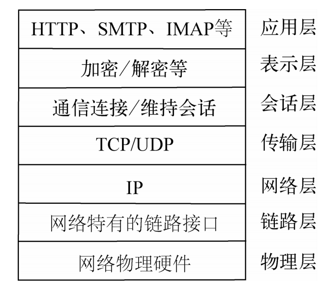
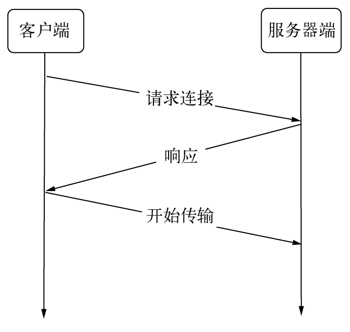

## Socket — TCP

-----

`TCP`全名为传输控制协议，在`OSI`模型（由七层组成，分别为物理层、数据链结层、网络层、传输层、会话层、表示层、应用层）中属于传输层协议。许多应用层协议基于`TCP`构建，典型的是`HTTP`、`SMTP`、`IMAP`等协议。七层协议示意图如图所示。



`TCP` 是面向连接的协议，其显著的特征是在传输之前需要 `3` 次握手形成会话，如图所示。



只有会话形成之后，服务器端和客户端之间才能互相发送数据。在创建会话的过程中，服务器端和客户端分别提供一个套接字，这两个套接字共同形成一个连接。服务器端与客户端则通过套接字实现两者之间连接的操作。

> 端口号拼接到 `(contatenated with) IP` 地址即构成了套接字。  

```go
socket = (IP : PORT)               
```

每一条 TCP 连接唯一地被通信两端的两个端点（即两个套接字）所确定。即：

```go
TCP Connection ::= {socket1, socket2} = {(IP1: port1)，(IP2: port2)}
```

## TCP服务器端

---

