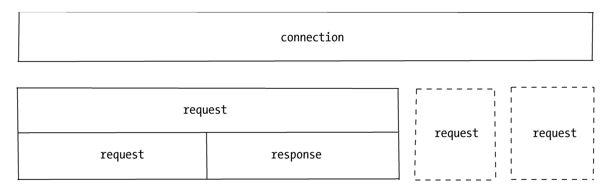
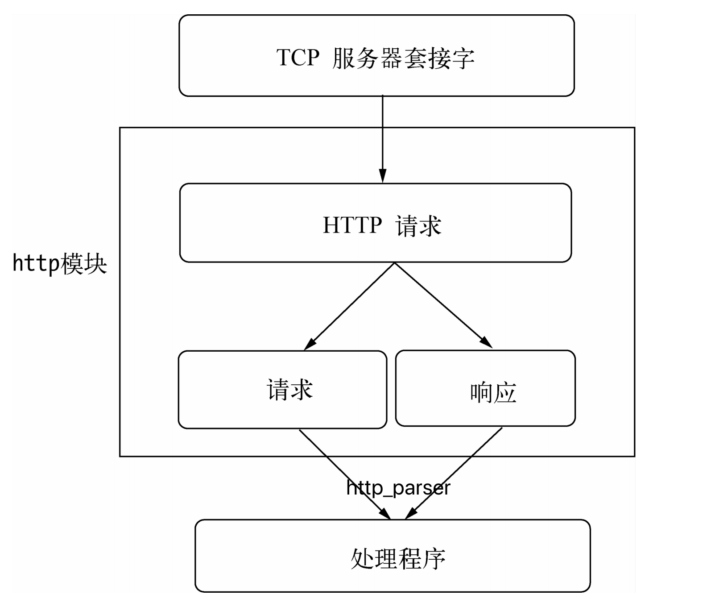

## HTTP 常量

-----

#### `http.METHODS`

打印 `node` 解析器支持的 `HTTP` 方法列表。

```js
console.log(http.METHODS);
[
  'ACL',         'BIND',       'CHECKOUT',
  'CONNECT',     'COPY',       'DELETE',
  'GET',         'HEAD',       'LINK',
  'LOCK',        'M-SEARCH',   'MERGE',
  'MKACTIVITY',  'MKCALENDAR', 'MKCOL',
  'MOVE',        'NOTIFY',     'OPTIONS',
  'PATCH',       'POST',       'PROPFIND',
  'PROPPATCH',   'PURGE',      'PUT',
  'REBIND',      'REPORT',     'SEARCH',
  'SOURCE',      'SUBSCRIBE',  'TRACE',
  'UNBIND',      'UNLINK',     'UNLOCK',
  'UNSUBSCRIBE'
]
```

#### `http.STATUS_CODES`

所有标准 HTTP 响应状态码的集合，以及每个状态码的简短描述。 例如， `http.STATUS_CODES[404] === 'Not Found'`。

```js
{
  '101': 'Switching Protocols',
  '200': 'OK',
}
```

## HTTP 服务

------

`Node`的`http`模块包含对`HTTP`处理的封装。在`Node`中，`HTTP`服务继承自`TCP`服务器（`net`模块），它能够与多个客户端保持连接，由于其采用事件驱动的形式，并不为每一个连接创建额外的线程或进程，保持很低的内存占用，所以能实现高并发。

`HTTP`服务与`TCP`服务模型有区别的地方在于，在开启`keepalive`后，一个`TCP`会话可以用于多次请求和响应。`TCP`服务以`connection`为单位进行服务，`HTTP`服务以`request`为单位进行服务。`http`模块即是将`connection`到`request`的过程进行了封装。



除此之外，`http`模块将连接所用套接字的读写抽象为`ServerRequest`和`ServerResponse`对象，它们分别对应请求和响应操作。在请求产生的过程中，`http`模块拿到连接中传来的数据，调用二进制模块`http_parser`进行解析，在解析完请求报文的报头后，触发`request`事件，调用用户的业务逻辑。



图中的处理程序对应到示例中的代码就是响应 `Hello World` 这部分，代码如下：

```json
function (req, res) { 
  res.writeHead(200, {'Content-Type': 'text/plain'}); 
  res.end('Hello World\n'); 
}
```

#### `http.createServer([options][, requestListener])`

```ts
function createServer(requestListener?: RequestListener): Server;
function createServer(options: ServerOptions, requestListener?: RequestListener): Server;
```

`http.createServer` 用于构建一个 `http` 服务，接收两个参数，第一个参数为 `option`，用于传入服务的参数(可以省略)：

+ `IncomingMessage` 指定要使用的 `IncomingMessage` 类。 对于扩展原始的 `IncomingMessage` 很有用。 
+ `ServerResponse` 指定要使用的 `ServerResponse` 类。 对于扩展原始的 `ServerResponse` 很有用
+ `insecureHTTPParser` 使用不安全的 HTTP 解析器，当为 `true` 时可以接受无效的 `HTTP` 请求头。 应避免使用不安全的解析器。
+ `maxHeaderSize` 请求头的最大长度（以字节为单位）。 默认值: `16384`（`16KB`）。

第二参数是一个函数格式即上面 `Hello World` 函数的格式：

```ts
type RequestListener = (req: IncomingMessage, res: ServerResponse) => void
```

其会返回一个 `http.Server` 的实例。

### http.Server

`http.Server` 继承于 `NetServer` 实现 `HttpBase` 接口拓展了属性：

```ts
interface Server extends HttpBase {}
class Server extends NetServer {}
interface HttpBase {
        setTimeout(msecs?: number, callback?: () => void): this;
        setTimeout(callback: () => void): this;
        maxHeadersCount: number | null;
        timeout: number;
        headersTimeout: number;
        keepAliveTimeout: number;
        requestTimeout: number;
    }
```

#### `server.maxHeadersCount`

限制最大传入请求头数。如果设置为 `0`，则不会应用任何限制，默认值 `2000`。

#### `server.headersTimeout`

限制解析器等待接收完整 `HTTP` 请求头的时间，默认值 `60000`。

如果没有活动，则适用 `server.timeout` 中定义的规则。 如果请求头发送速度非常慢（默认情况下，每 2 分钟最多一个字节），那么基于不活动的超时仍然允许连接保持打开状态。 为了防止这种情况，每当请求头数据到达时，进行额外的检查，自建立连接以来，没有超过 server.headersTimeout 毫秒。 如果检查失败，则在服务器对象上触发 timeout 事件，并且（默认情况下）套接字被销毁。 

## HTTP 请求

-----

对于`TCP`连接的读操作，`http`模块将其封装为`ServerRequest`对象。让我们再次查看前面的请求报文，报文头部将会通过`http`_`parser`进行解析。请求报文的代码如下所示：

```http
GET / HTTP/1.1
User-Agent: curl/7.24.0 (x86_64-apple-darwin12.0) libcurl/7.24.0 OpenSSL/0.9.8r zlib/1.2.5 
Host: 127.0.0.1:1337 
Accept: */*
```

报文头第一行 `GET / HTTP/1.1` 被解析之后分解为如下属性:

+ `req.method`属性：值为`GET`，是为请求方法，常见的请求方法有`GET`、`POST`、`DELETE`、`PUT`、`CONNECT`等几种。
+ `req.url`属性：值为/。
+ `req.httpVersion`属性：值为`1.1`。

其余报头是很规律的``Key``: ``Value``格式，被解析后放置在``req.headers``属性上传递给业务逻辑以供调用，如下所示：

```js
headers: { 
  'user-agent': 'curl/7.24.0 (x86_64-apple-darwin12.0) libcurl/7.24.0 OpenSSL/0.9.8r zlib/1.2.5 ',
  host: '127.0.0.1:1337', 
	accept: '*/*' 
},
```

报文体部分则抽象为一个只读流对象，如果业务逻辑需要读取报文体中的数据，则要在这个数据流结束后才能进行操作，如下所示：

```js
function (req, res) { 
  // console.log(req.headers);
  var buffers = []; 
  req.on('data', function (trunk) { 
    buffers.push(trunk); 
  }).on('end', function () { 
    var buffer = Buffer.concat(buffers); 
    // TODO 
    res.end('Hello world'); 
  }); 
}
```

`HTTP`请求对象和`HTTP`响应对象是相对较底层的封装，现行的`Web`框架如`Connect`和`Express`都是在这两个对象的基础上进行高层封装完成的。

### http.IncomingMessage

`http.IncomingMessage` 是解析完成的 `http` 请求对象，具体的结构体格式如下：

```ts
class IncomingMessage extends stream.Readable {
  aborted: boolean;
  httpVersion: string;
  httpVersionMajor: number;
  httpVersionMinor: number;
  complete: boolean;
  connection: Socket;
  socket: Socket;
  headers: IncomingHttpHeaders;
  rawHeaders: string[];
  trailers: NodeJS.Dict<string>;
  rawTrailers: string[];
  setTimeout(msecs: number, callback?: () => void): this;
  /** Only valid for request obtained from http.Server. */
  method?: string;
  url?: string;
  /**  Only valid for response obtained from http.ClientRequest. */
  statusCode?: number;
  statusMessage?: string;
  destroy(error?: Error): void;
}
```

#### `events` 

`http.IncomingMessage` 支持的事件回调：

| 事件名    | 描述                 |
| --------- | -------------------- |
| `close`   | 表明底层连接已关闭。 |
| `aborted` | 当请求中止时触发。   |

#### `httpVersion`

`httpVersion`: 在服务器请求的情况下，表示客户端发送的 HTTP 版本。 在客户端响应的情况下，表示连接到的服务器的 HTTP 版本。 可能是 `'1.1'` 或 `'1.0'`。

#### `method`、`url`

`method`: 仅对从 `http.Server` 获取的请求有效。请求方法为字符串。 只读。 示例：'GET'、 'DELETE'。

`url`：请求的 `URL` 字符串。 它仅包含实际的 `HTTP` 请求中存在的 `URL`。 

请求的 URL 字符串。 它仅包含实际的 HTTP 请求中存在的 URL。 以下面的请求为例：

```http
GET /status?name=ryan HTTP/1.1
Accept: text/plain
```

要将 URL 解析成各个部分：

```js
new URL(request.url, `http://${request.headers.host}`);
```

当 `request.url` 是 `'/status?name=ryan'` 且 `request.headers.host` 是 `'localhost:3000'` 时：

```js
$ node
> new URL(request.url, `http://${request.headers.host}`)
URL {
  href: 'http://localhost:3000/status?name=ryan',
  origin: 'http://localhost:3000',
  protocol: 'http:',
  username: '',
  password: '',
  host: 'localhost:3000',
  hostname: 'localhost',
  port: '3000',
  pathname: '/status',
  search: '?name=ryan',
  searchParams: URLSearchParams { 'name' => 'ryan' },
  hash: ''
}
```

#### `statusCode`、`statusMessage`

`statusCode`: 仅对从 `http.ClientRequest` 获取的响应有效。`3` 位 `HTTP` 响应状态码。 例如 `404`。

`statusMessage`: 同样仅对从 `http.ClientRequest` 获取的响应有效，`HTTP` 响应状态消息（原因短语）。 例如 `OK` 或 `Internal Server Error`，同样可以通过 `http.STATUS_CODE[message.statusCode]` 获得。

#### `message.headers`

消息头的名称和值的键值对。 消息头的名称都是小写的。

```js
// { 'user-agent': 'curl/7.22.0',
//   host: '127.0.0.1:8000',
//   accept: '*/*' }
console.log(request.headers);
```

原始消息头中的重复项会按以下方式处理，具体取决于消息头的名称：

+ 重复的 `age`、 `authorization`、 `content-length`、 `content-type`、 `etag`、 `expires`、 `from`、 `host`、 `if-modified-since`、 `if-unmodified-since`、 `last-modified`、 `location`、 `max-forwards`、 `proxy-authorization`、 `referer`、 `retry-after`、 `server` 或 `user-agent` 会被丢弃。
+ `set-cookie` 始终是一个数组。重复项都会添加到数组中。
+ 对于重复的 `cookie` 消息头，其值会使用与 '; ' 连接到一起。
+ 对于所有其他消息头，其值会使用 ', ' 连接到一起。

#### `message.rawHeaders`

原始请求头/响应头的列表，与接收到的完全一致。

键和值位于同一列表中。 它不是元组列表。 因此，偶数偏移是键值，奇数偏移是关联的值。消息头名称不是小写的，并且不会合并重复项。

```js
// [ 'user-agent',
//   '这是无效的，因为只能有一个值',
//   'User-Agent',
//   'curl/7.22.0',
//   'Host',
//   '127.0.0.1:8000',
//   'ACCEPT',
//   '*/*' ]
console.log(request.rawHeaders);
```

#### `message.trailers`

请求/响应的尾部消息头对象。 仅在 `'end'` 事件中填充。

#### `message.aborted`

如果请求已中止，则 `message.aborted` 属性为 `true`。

#### `message.complete`

如果已收到并成功解析完整的 HTTP 消息，则 `message.complete` 属性将为 `true`。

此属性可用于判断客户端或服务器在连接终止之前是否完全传输消息：

```js
const req = http.request({
  host: '127.0.0.1',
  port: 8080,
  method: 'POST'
}, (res) => {
  res.resume();
  res.on('end', () => {
    if (!res.complete)
      console.error(
        '消息仍在发送时终止了连接');
  });
});
```

## HTTP 响应

-----

再来看看`HTTP`响应对象。`HTTP`响应相对简单一些，它封装了对底层连接的写操作，可以将其看成一个可写的流对象。它影响响应报文头部信息的`API`为`res.setHeader()`和`res.writeHead()`。在上述示例中：

```js
res.writeHead(200, {'Content-Type': 'text/plain'});
```

其分为`setHeader()`和`writeHead()`两个步骤。它在`http`模块的封装下，实际生成如下报文：

```http
HTTP/1.1 200 OK
Content-Type: text/plain
```

我们可以调用`setHeader`进行多次设置，但只有调用`writeHead`后，报头才会写入到连接中。除此之外，`http`模块会自动帮你设置一些头信息，如下所示：

```http
HTTP/1.1 200 OK
Date: Sat, 06 Apr 2013 08:01:44 GMT
Connection: keep-alive
Transfer-Encoding: chunked
```

报文体部分则是调用`res.write()`和`res.end()`方法实现，后者与前者的差别在于`res.end()`会先调用`write()`发送数据，然后发送信号告知服务器这次响应结束，响应结果如下所示：

```js
Hello World
```

响应结束后，`HTTP`服务器可能会将当前的连接用于下一个请求，或者关闭连接。值得注意的是，报头是在报文体发送前发送的，一旦开始了数据的发送，`writeHead()`和`setHeader()`将不再生效。这由协议的特性决定。

另外，无论服务器端在处理业务逻辑时是否发生异常，务必在结束时调用`res.end()`结束请求，否则客户端将一直处于等待的状态。当然，也可以通过延迟`res.end()`的方式实现客户端与服务器端之间的长连接，但结束时务必关闭连接。

### http.ServerReponse

此对象由 `HTTP` 服务器在内部创建，而不是由用户创建。 它会作为第二个参数传给 `request` 事件。

```ts
class OutgoingMessage extends stream.Writable {
  upgrading: boolean;
  chunkedEncoding: boolean;
  shouldKeepAlive: boolean;
  useChunkedEncodingByDefault: boolean;
  sendDate: boolean;
  /**
         * @deprecated Use `writableEnded` instead.
         */
  finished: boolean;
  headersSent: boolean;
  /**
         * @deprecate Use `socket` instead.
         */
  connection: Socket | null;
  socket: Socket | null;

  constructor();

  setTimeout(msecs: number, callback?: () => void): this;
  setHeader(name: string, value: number | string | ReadonlyArray<string>): void;
  getHeader(name: string): number | string | string[] | undefined;
  getHeaders(): OutgoingHttpHeaders;
  getHeaderNames(): string[];
  hasHeader(name: string): boolean;
  removeHeader(name: string): void;
  addTrailers(headers: OutgoingHttpHeaders | ReadonlyArray<[string, string]>): void;
  flushHeaders(): void;
}

class ServerResponse extends OutgoingMessage {
  statusCode: number;
  statusMessage: string;

  constructor(req: IncomingMessage);

  assignSocket(socket: Socket): void;
  detachSocket(socket: Socket): void;
  // https://github.com/nodejs/node/blob/master/test/parallel/test-http-write-callbacks.js#L53
  // no args in writeContinue callback
  writeContinue(callback?: () => void): void;
  writeHead(statusCode: number, reasonPhrase?: string, headers?: OutgoingHttpHeaders | OutgoingHttpHeader[]): this;
  writeHead(statusCode: number, headers?: OutgoingHttpHeaders | OutgoingHttpHeader[]): this;
  writeProcessing(): void;
}
```

#### `events`

`http.ServerReponse` 支持的事件回调：

| 事件名     | 描述                                                         |
| ---------- | ------------------------------------------------------------ |
| `close`    | 表明响应已完成，或者其底层的连接过早被终止（在响应完成之前）。 |
| `finished` | 响应发送后触发。 更具体地说，当响应头和主体的最后一段已经切换到操作系统以通过网络传输时，触发该事件。这并不意味着客户端已收到任何信息。 |

#### `response.getHeader(name)`

读出已排队但未发送到客户端的响应头。 该名称不区分大小写。 返回值的类型取决于提供给 [`response.setHeader()`](http://nodejs.cn/api/http.html#http_response_setheader_name_value) 的参数。

```js
response.setHeader('Content-Type', 'text/html');
response.setHeader('Content-Length', Buffer.byteLength(body));
response.setHeader('Set-Cookie', ['type=ninja', 'language=javascript']);
const contentType = response.getHeader('content-type');
// contentType 是 'text/html'。
const contentLength = response.getHeader('Content-Length');
// contentLength 的类型为数值。
const setCookie = response.getHeader('set-cookie');
// setCookie 的类型为字符串数组。
```

#### `response.getHeaders()`

返回当前传出的响应头的浅拷贝。 由于使用浅拷贝，因此可以更改数组的值而无需额外调用各种与响应头相关的 http 模块方法。 返回对象的键是响应头名称，值是各自的响应头值。 所有响应头名称都是小写的。

`response.getHeaders()` 方法返回的对象不是从 JavaScript `Object` 原型继承的。 这意味着典型的 `Object` 方法，如 `obj.toString()`、 `obj.hasOwnProperty()` 等都没有定义并且不起作用。

```js
response.setHeader('Foo', 'bar');
response.setHeader('Set-Cookie', ['foo=bar', 'bar=baz']);

const headers = response.getHeaders();
// headers === { foo: 'bar', 'set-cookie': ['foo=bar', 'bar=baz'] }
```

#### `response.hasHeader(name)`

如果当前在传出的响应头中设置了由 `name` 标识的响应头，则返回 `true`。 响应头名称匹配不区分大小写。

```js
const hasContentType = response.hasHeader('content-type');
```

#### `response.removeHeader(name)`

移除排队等待中的隐式发送的响应头。

```js
response.removeHeader('Content-Encoding');
```

#### `response.setHeader(name, value)`

为隐式响应头设置单个响应头的值。 如果此响应头已存在于待发送的响应头中，则其值将被替换。 在这里可以使用字符串数组来发送具有相同名称的多个响应头。 非字符串值将被原样保存。 因此 `response.getHeader()` 可能返回非字符串值。 但是非字符串值将转换为字符串以进行网络传输。

```js
response.setHeader('Content-Type', 'text/html');
```

或：

```js
response.setHeader('Set-Cookie', ['type=ninja', 'language=javascript']);
```

#### `response.writeHead(statusCode[, statusMessage][, headers])`

向请求发送响应头。 状态码是一个 3 位的 HTTP 状态码，如 `404`。 最后一个参数 `headers` 是响应头。 可以可选地将用户可读的 `statusMessage` 作为第二个参数。

返回对 `ServerResponse` 的引用，以便可以链式调用。

```js
const body = 'hello world';
response
  .writeHead(200, {
    'Content-Length': Buffer.byteLength(body),
    'Content-Type': 'text/plain'
  })
  .end(body);
```

此方法只能在消息上调用一次，并且必须在调用 `response.end()` 之前调用。

如果在调用此方法之前调用了 `response.write()` 或 `response.end()`，则将计算隐式或可变的响应头并调用此函数。

当使用 `response.setHeader()` 设置响应头时，则与传给 `response.writeHead()` 的任何响应头合并，且 `response.writeHead()` 的优先。

如果调用此方法并且尚未调用 `response.setHeader()`，则直接将提供的响应头值写入网络通道而不在内部进行缓存，响应头上的 `response.getHeader()` 将不会产生预期的结果。 如果需要渐进的响应头填充以及将来可能的检索和修改，则改用 `response.setHeader()`。

```js
// 返回 content-type = text/plain
const server = http.createServer((req, res) => {
  res.setHeader('Content-Type', 'text/html');
  res.setHeader('X-Foo', 'bar');
  res.writeHead(200, { 'Content-Type': 'text/plain' });
  res.end('ok');
});
```

`Content-Length` 以字节而非字符为单位。 使用 `Buffer.byteLength()` 来判断主体的长度（以字节为单位）。 Node.js 不检查 `Content-Length` 和已传输的主体的长度是否相等。

#### `response.statusCode`

当使用隐式的响应头时（没有显式地调用 `response.writeHead()`），此属性控制在刷新响应头时将发送到客户端的状态码。

```js
response.statusCode = 404;
```

#### `response.statusMessage`

当使用隐式的响应头时（没有显式地调用 `response.writeHead()`），此属性控制在刷新响应头时将发送到客户端的状态消息。 如果保留为 undefined，则将使用状态码的标准消息。

```js
response.statusMessage = 'Not found';
```

#### `response.write(chunk[, encoding][, callback])`

如果调用此方法并且尚未调用 response.writeHead()，则将切换到隐式响应头模式并刷新隐式响应头，这会发送一块响应主体。可以多次调用该方法以提供连续的响应主体片段。

在 `http` 模块中，当请求是 `HEAD` 请求时，则省略响应主体。 同样地， `204` 和 `304` 响应不得包含消息主体。

+ `chunk`：消息体
+ `encoding`：字符编码方式 *默认值:* `'utf8'`。
+ `callback`: 错误回调

`chunk` 可以是字符串或 `buffer`。 如果 `chunk` 是一个字符串，则第二个参数指定如何将其编码为字节流。 当刷新此数据块时将调用 `callback`。

这是原始的 `HTTP` 主体，与可能使用的更高级别的多部分主体编码无关。

第一次调用 `response.write()` 时，它会将缓冲的响应头信息和主体的第一个数据块发送给客户端。 第二次调用 `response.write()` 时，`Node.js` 假定数据将被流式传输，并分别发送新数据。 也就是说，响应被缓冲到主体的第一个数据块。

如果将整个数据成功刷新到内核缓冲区，则返回 `true`。 如果全部或部分数据在用户内存中排队，则返回 `false`。 当缓冲区再次空闲时，则触发 `drain` 事件。

#### `response.end([data[, encoding]][, callback])`

此方法向服务器发出信号，表明已发送所有响应头和主体，该服务器应该视为此消息已完成。 必须在每个响应上调用此 `response.end()` 方法。

如果指定了 data，则相当于调用 `response.write(data, encoding)` 之后再调用 `response.end(callback)`。

如果指定了 `callback`，则当响应流完成时将调用它。

#### `response.addTrailers(headers)`

此方法将 HTTP 尾部响应头（一种在消息末尾的响应头）添加到响应中。

只有在使用分块编码进行响应时才会发出尾部响应头; 如果不是（例如，如果请求是 HTTP/1.0），它们将被静默丢弃。

HTTP 需要发送 `Trailer` 响应头才能发出尾部响应头，并在其值中包含响应头字段列表。 例如：

```js
response.writeHead(200, { 'Content-Type': 'text/plain',
                          'Trailer': 'Content-MD5' });
response.write(fileData);
response.addTrailers({ 'Content-MD5': '7895bf4b8828b55ceaf47747b4bca667' });
response.end();
```

## HTTP 服务的事件

------

如同`TCP`服务一样，`HTTP`服务器也抽象了一些事件，以供应用层使用，同样典型的是，服务器也是一个`EventEmitter`实例。

#### `connection` event

`connection`事件：在开始`HTTP`请求和响应前，客户端与服务器端需要建立底层的`TCP`连接，这个连接可能因为开启了`keep-alive`，可以在多次请求响应之间使用；当这个连接建立时，服务器触发一次`connection`事件。

#### `request` event

建立`TCP`连接后，`http`模块底层将在数据流中抽象出`HTTP`请求和`HTTP`响应，当请求数据发送到服务器端，在解析出`HTTP`请求头后，将会触发该事件；在`res.end()`后，`TCP`连接可能将用于下一次请求响应。当使用 `createServer` 的时候就相当于给此事件注册了一个回调函数。

#### `close` event

与`TCP`服务器的行为一致，调用`server.close()`方法停止接受新的连接，当已有的连接都断开时，触发该事件；可以给`server.close()`传递一个回调函数来快速注册该事件。

#### `checkContinue` event

某些客户端在发送较大的数据时，并不会将数据直接发送，而是先发送一个头部带`Expect`: `100-continue`的请求到服务器，服务器将会触发`checkContinue`事件；如果没有为服务器监听这个事件，服务器将会自动响应客户端`100 Continue`的状态码，表示接受数据上传；如果不接受数据的较多时，响应客户端`400 Bad Request`拒绝客户端继续发送数据即可。需要注意的是，当该事件发生时不会触发`request`事件，两个事件之间互斥。当客户端收到`100 Continue`后重新发起请求时，才会触发`request`事件。

#### `connect`event

当客户端发起`CONNECT`请求时触发，而发起`CONNECT`请求通常在`HTTP`代理时出现；如果不监听该事件，发起该请求的连接将会关闭。

#### `upgrade` event

当客户端要求升级连接的协议时，需要和服务器端协商，客户端会在请求头中带上`Upgrade`字段，服务器端会在接收到这样的请求时触发该事件。这在后文的`WebSocket`部分有详细流程的介绍。如果不监听该事件，发起该请求的连接将会关闭。

#### `clientError` event

连接的客户端触发`error`事件时，这个错误会传递到服务器端，此时触发该事件。