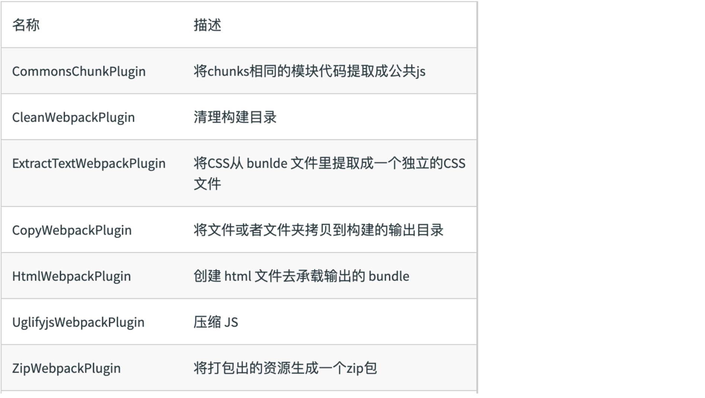

## webpack 核心概念之plugins

**插件**是 webpack 的 [支柱](https://github.com/webpack/tapable) 功能。webpack 自身也是构建于，你在 webpack 配置中用到的**相同的插件系统**之上！

插件目的在于解决 [loader](https://v4.webpack.docschina.org/concepts/loaders) 无法实现的**其他事**。

`loader` 用于转换某些类型的模块，而插件则可以用于执行范围更广的任务。包括：打包优化，资源管理，注入环境变量，作用于整个构建过程。

#### 常见的Plugin



## 剖析

webpack **插件**是一个具有 [`apply`](https://developer.mozilla.org/en-US/docs/Web/JavaScript/Reference/Global_Objects/Function/apply) 方法的 JavaScript 对象。`apply` 方法会被 webpack compiler 调用，并且 compiler 对象可在**整个**编译生命周期访问。

**ConsoleLogOnBuildWebpackPlugin.js**

```javascript
const pluginName = 'ConsoleLogOnBuildWebpackPlugin';

class ConsoleLogOnBuildWebpackPlugin {
  apply(compiler) {
    compiler.hooks.run.tap(pluginName, compilation => {
      console.log('webpack 构建过程开始！');
    });
  }
}
```

`compiler hook` 的 `tap` 方法的第一个参数，应该是驼峰式命名的插件名称。建议为此使用一个常量，以便它可以在所有 `hook` 中复用。

#### Plugin 的使用

想要使用一个插件，你只需要 `require()` 它，然后把它添加到 `plugins` 数组中。多数插件可以通过选项(option)自定义。你也可以在一个配置文件中因为不同目的而多次使用同一个插件，这时需要通过使用 `new` 操作符来创建它的一个实例。

```js
const HtmlWebpackPlugin = require('html-webpack-plugin'); // 通过 npm 安装
const webpack = require('webpack'); // 用于访问内置插件

module.exports = {
  module: {
    rules: [
      { test: /\.txt$/, use: 'raw-loader' }
    ]
  },
  plugins: [
    new HtmlWebpackPlugin({template: './src/index.html'}),
    new webpack.NamedModulesPlugin(),
  ]
};
```

在上面的示例中，`html-webpack-plugin` 为应用程序生成 HTML 一个文件，并自动注入所有生成的 bundle。

## Node API

在使用 Node API 时，还可以通过配置中的 `plugins` 属性传入插件。

**some-node-script.js**

```javascript
const webpack = require('webpack'); //访问 webpack 运行时(runtime)
const configuration = require('./webpack.config.js');

let compiler = webpack(configuration);

new webpack.ProgressPlugin().apply(compiler);

compiler.run(function(err, stats) {
  // ...
});
```