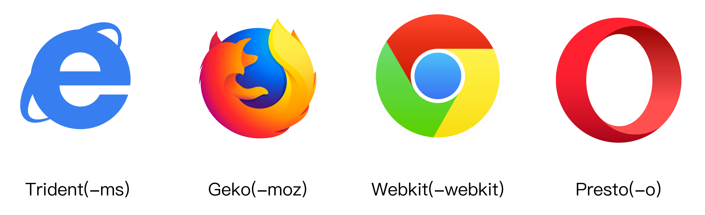

## css文件分离和优化

先来复习一下 `css` 文件的加载方式：`css-loader`⽤用于加载`.css`文件，并且转换成`commonjs`，对象`style-loader`将样式通过`<style>`标签插入到`head`中。注意这个过程是通过 `js` 动态插入的。

```js
const path = require("path");
module.exports = {
    entry: "./src/index.js",
    output: { filename: "bundle.js", path: path.resolve(__dirname, "dist") },
    module: {
        rules: [{ test: /\.css$/, use: ["style-loader", "css-loader"] }],
    },
};
```

`sass-loader`⽤于将`scss`转换成`css`，此外 `sass-loader` 还依赖于 `sass` 和 `fibers`：

```bash
> cnpm i -D sass-loader sass fibers;
```

```js
const path = require("path");
module.exports = {
    entry: "./src/index.js",
    output: { filename: "bundle.js", path: path.resolve(__dirname, "dist") },
    module: {
        rules: [
            {
                test: /\.(scss|sass)$/,
                use: ["style-loader", "css-loader", " less-loader"],
            },
        ],
    },
};
```

目前我们能将 `css` 文件解析并且动态的插入，进一步的我们希望有两种功能：

+ `css` 文件分离；
+ 浏览器兼容前缀补全；

### 前缀补全



前缀补全我们使用 `postcss-loader` ，这是一个使用 `PostCSS` 处理 `CSS` 的 `loader。`

```console
npm install --save-dev postcss-loader postcss postcss-preset-env
```

然后添加本 loader 的相关配置到你的 `webpack` 的配置文件。

```js
module.exports = {
  module: {
    rules: [
      {
        test: /\.css$/i,
        use: [
          "style-loader",
          "css-loader",
          {
            loader: "postcss-loader",
            options: {
              postcssOptions: {
                plugins: [ "postcss-preset-env" ],
              },
            },
          },
        ],
      },
    ],
  },
};
```

或者使用 `PostCSS` 本身的 [配置文件](https://webpack.docschina.org/loaders/postcss-loader/#config)：

```js
module.exports = {
  plugins: [
    [
      "postcss-preset-env",
      {
        // 其他选项
      },
    ],
  ],
};
```

Loader 将会**自动**搜索配置文件。

```js
module.exports = {
  module: {
    rules: [
      {
        test: /\.css$/i,
        use: ["style-loader", "css-loader", "postcss-loader"],
      },
    ],
  },
};
```

最后，通过你喜欢的方式运行 `webpack`。

### 文件分离

本插件会将 `CSS` 提取到单独的文件中，为每个包含 `CSS` 的 `JS` 文件创建一个 `CSS` 文件，并且支持 `CSS` 和 `SourceMaps` 的按需加载。

```shell
npm i mini-css-extract-plugin -D
```

```js
const MiniCssExtractPlugin = require('mini-css-extract-plugin');

module.exports = {
  plugins: [new MiniCssExtractPlugin({
    filename:"[name]_[contenthash:8].css"
  })],
  module: {
    rules: [
      {
        test: /\.css$/i,
        use: [MiniCssExtractPlugin.loader, 'css-loader'],
      },
    ],
  },
};
```
