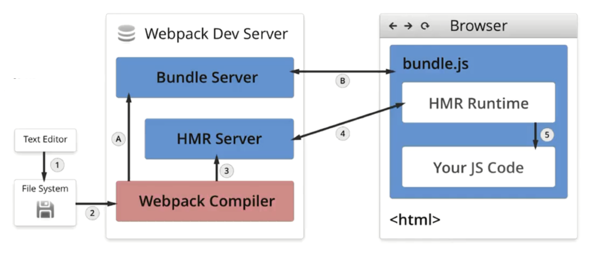

# DevServer

> 在开始前，我们先将 [`mode` 设置为 `'development'`](https://v4.webpack.docschina.org/concepts/mode/#mode-development)。

`watch` 模式可以监听文件变化自动执行编译，而 `devSever` 能在这基础上实现自动刷新。

刷新我们一般分为两种：

- 一种是页面刷新，不保留页面状态，就是简单粗暴，直接`window.location.reload()`。
- 另一种是基于`WDS (Webpack-dev-server)`的模块热替换，只需要局部刷新页面上发生变化的模块，同时可以保留当前的页面状态，比如复选框的选中状态、输入框的输入等。

## webpack-dev-server

`webpack-dev-server` 为你提供了一个简单的 `web server`，并且具有 `live reloading`(实时重新加载) 功能。设置如下：

```bash
npm install --save-dev webpack-dev-server
```

修改配置文件，设置 `dev server`根目录位置：

```diff
  const path = require('path');
  const HtmlWebpackPlugin = require('html-webpack-plugin');
  const CleanWebpackPlugin = require('clean-webpack-plugin');

  module.exports = {
    mode: 'development',
    entry: {
      app: './src/index.js',
      print: './src/print.js'
    },
    devtool: 'inline-source-map',
+   devServer: {
+     contentBase: './dist'
+   },
    plugins: [
      new CleanWebpackPlugin(['dist']),
      new HtmlWebpackPlugin({
        title: 'Development'
      })
    ],
    output: {
      filename: '[name].bundle.js',
      path: path.resolve(__dirname, 'dist')
    }
  };
```

以上配置告知 `webpack-dev-server`，将 `dist` 目录下的文件 serve 到 `localhost:8080` 下。

> 如果不开启 `contentBase`，webpack-dev-server 在编译之后不会写入到任何输出文件。而是将 bundle 文件保留在内存中，然后将它们 serve 到 server 中，就好像它们是挂载在 server 根路径上的真实文件一样。如果你的页面希望在其他不同路径中找到 bundle 文件，则可以通过 dev server 配置中的 [`publicPath`](https://v4.webpack.docschina.org/configuration/dev-server/#devserver-publicpath-) 选项进行修改。

我们添加一个可以直接运行 dev server 的 script：

**package.json**

```diff
  {
    "name": "development",
    "version": "1.0.0",
    "description": "",
    "main": "webpack.config.js",
    "scripts": {
      "test": "echo \"Error: no test specified\" && exit 1",
      "watch": "webpack --watch",
+     "start": "webpack-dev-server --open",
      "build": "webpack"
    }
  }
```

现在，在命令行中运行 `npm start`，我们会看到浏览器自动加载页面。如果你更改任何源文件并保存它们，web server 将在编译代码后自动重新加载。试试看！

### 原理

通过 DevServer 启动的 Webpack 会开启监听模式，当发生变化时重新执行完构建后通知 DevServer。 DevServer 会让 Webpack 在构建出的 JavaScript 代码里注入一个代理客户端用于控制网页，网页和 DevServer 之间通过 WebSocket 协议通信， 以方便 DevServer 主动向客户端发送命令。 DevServer 在收到来自 Webpack 的文件变化通知时通过注入的客户端控制网页刷新。

## HMR

`Hot Module Replacement`，简称`HMR`，无需完全刷新整个页面的同时，更新模块。`HMR`的好处，在日常开发工作中体会颇深：**节省宝贵的开发时间、提升开发体验**。

模块热替换相对于默认的刷新机制能提供更快的响应和更好的开发体验。 模块热替换默认是关闭的，要开启模块热替换，你只需在启动 DevServer 时带上 `--hot` 参数，重启 DevServer 后再去更新文件就能体验到模块热替换的神奇了。

```diff
  {
    "name": "development",
    "version": "1.0.0",
    "description": "",
    "main": "webpack.config.js",
    "scripts": {
+     "start": "webpack-dev-server --hot-open",
    }
  }
```

除了添加参数之外我们还可以通过插件或者 `devServer option` 的形式来开启热更替：

```js
const HotModuleReplacementPlugin = require('webpack/lib/HotModuleReplacementPlugin');

module.exports = {
  entry:{
    // 为每个入口都注入代理客户端
    main:['webpack-dev-server/client?http://localhost:8080/', 'webpack/hot/dev-server','./src/main.js'],
  },
  plugins: [
    // 该插件的作用就是实现模块热替换，实际上当启动时带上 `--hot` 参数，会注入该插件，生成 .hot-update.json 文件。
    new HotModuleReplacementPlugin(),
  ],
  devServer:{
    // 告诉 DevServer 要开启模块热替换模式
    hot: true,      
  }  
};
```

### 原理

`HMR`的核心就是客户端从服务端拉去更新后的文件，准确的说是 `chunk diff (chunk` 需要更新的部分)，实际上 `WDS` 与浏览器之间维护了一个 `Websocket`，当本地资源发生变化时，`WDS` 会向浏览器推送更新，并带上构建时的 `hash`，让客户端与上一次资源进行对比。

客户端对比出差异后会向 `WDS` 发起 `Ajax` 请求来获取更改内容(文件列表、`hash)`，这样客户端就可以再借助这些信息继续向 `WDS` 发起 `jsonp` 请求获取该`chunk`的增量更新。

`webpackCompiler（webpack编译器）`编译文件之后，`buddule-server`提供一个目录的访问。`hmr-server`创建一个`websocket`，代码改变时，打包编译器通知`hmr-server`，`hmr-server`发送更新`json`给`hmr-rutime`，`runtime`进行实时更新。



## devServer 配置

`devServer` 提供了很强大的配置功能：

#### `devServer.hot`

启用 webpack 的 [模块热替换](https://v4.webpack.docschina.org/concepts/hot-module-replacement/) 功能：DevServer 默认的行为是在发现源代码被更新后会通过自动刷新整个页面来做到实时预览，开启模块热替换功能后将在不刷新整个页面的情况下通过用新模块替换老模块来做到实时预览。

**webpack.config.js**

```javascript
module.exports = {
  //...
  devServer: {
    hot: true
  }
};
```

#### `devServer.historyApiFallback`

`devServer.historyApiFallback` 用于方便的开发使用了 [HTML5 History API](https://developer.mozilla.org/en-US/docs/Web/API/History) 的单页应用。 这类单页应用要求服务器在针对任何命中的路由时都返回一个对应的 HTML 文件，例如在访问 `http://localhost/user` 和 `http://localhost/home` 时都返回同一个 `index.html` 文件，浏览器端的 `JavaScript` 代码会从 `URL` 里解析出当前页面的状态，显示出对应的界面。

当使用 [HTML5 History API](https://developer.mozilla.org/en-US/docs/Web/API/History) 时，任意的 `404` 响应都可能需要被替代为 `index.html`。`devServer.historyApiFallback` 默认禁用。通过传入以下启用：

**webpack.config.js**

```javascript
module.exports = {
  //...
  devServer: {
    historyApiFallback: true
  }
};
```

如果你的应用由多个单页应用组成，这就需要 DevServer 根据不同的请求来返回不同的 HTML 文件，配置如下：

```js
historyApiFallback: {
  // 使用正则匹配命中路由
  rewrites: [
    // /user 开头的都返回 user.html
    { from: /^\/user/, to: '/user.html' },
    { from: /^\/game/, to: '/game.html' },
    // 其它的都返回 index.html
    { from: /./, to: '/index.html' },
  ]
}
```

#### `devServer.contentBase`

`devServer.contentBase` 配置 DevServer HTTP 服务器的文件根目录。 默认情况下为当前执行目录，通常是项目根目录，所有一般情况下你不必设置它，除非你有额外的文件需要被 DevServer 服务。 例如你想把项目根目录下的 `public` 目录设置成 DevServer 服务器的文件根目录，你可以这样配置：

```js
devServer:{
  contentBase: path.join(__dirname, 'public')
}
```

这里需要指出可能会让你疑惑的地方，DevServer 服务器通过 HTTP 服务暴露出的文件分为两类：

- 暴露本地文件。
- 暴露 Webpack 构建出的结果，由于构建出的结果交给了 DevServer，所以你在使用了 DevServer 时在本地找不到构建出的文件。

`contentBase` 只能用来配置暴露本地文件的规则，你可以通过 `contentBase:false` 来关闭暴露本地文件。

#### `devServer.publicPath`

用于设置打包文件在浏览器中的访问前缀，假设服务器运行在 `http://localhost:8080` 并且 [`output.filename`](https://v4.webpack.docschina.org/configuration/output/#output-filename) 被设置为 `bundle.js`。默认 `devServer.publicPath` 是 `'/'`，所以你的包(bundle)可以通过 `http://localhost:8080/bundle.js` 访问。

修改 `devServer.publicPath`，将 bundle 放在指定目录下：

**webpack.config.js**

```javascript
module.exports = {
  //...
  devServer: {
    publicPath: '/dist/'
  }
};
```

现在可以通过 `http://localhost:8080/dist/bundle.js` 访问 bundle。

> 确保 `devServer.publicPath` 总是以斜杠(/)开头和结尾。

#### `devServer.port`

指定要监听请求的端口号：

**webpack.config.js**

```javascript
module.exports = {
  //...
  devServer: {
    port: 8080
  }
};
```

CLI 用法

```bash
webpack-dev-server --port 8080
```

#### `devServer.https`

DevServer 默认使用 HTTP 协议服务，它也能通过 HTTPS 协议服务。 有些情况下你必须使用 HTTPS，例如 HTTP2 和 Service Worker 就必须运行在 HTTPS 之上。 要切换成 HTTPS 服务，最简单的方式是：

```js
devServer:{
  https: true
}
```

DevServer 会自动的为你生成一份 HTTPS 证书。

如果你想用自己的证书可以这样配置：

```js
devServer:{
  https: {
    key: fs.readFileSync('path/to/server.key'),
    cert: fs.readFileSync('path/to/server.crt'),
    ca: fs.readFileSync('path/to/ca.pem')
  }
}
```

#### `devServer.compress`

`devServer.compress` 配置是否启用 gzip 压缩。`boolean` 为类型，默认为 `false`。

#### `devServer.open`

`devServer.open` 用于在 DevServer 启动且第一次构建完时自动用你系统上默认的浏览器去打开要开发的网页。 同时还提供 `devServer.openPage` 配置项用于打开指定 URL 的网页。

#### `devServer.lazy` 🔑

当启用 `devServer.lazy` 时，dev-server 只有在请求时才编译包(bundle)。这意味着 webpack 不会监视任何文件改动。我们称之为**惰性模式**。

**webpack.config.js**

```javascript
module.exports = {
  //...
  devServer: {
    lazy: true
  }
};
```

#### `devServer.filename` 🔑

在 [lazy mode(惰性模式)](https://v4.webpack.docschina.org/configuration/dev-server/#devserver-lazy-) 中，此选项可减少编译。 默认在 [lazy mode(惰性模式)](https://v4.webpack.docschina.org/configuration/dev-server/#devserver-lazy-)，每个请求结果都会产生全新的编译。使用 `filename`，可以只在某个文件被请求时编译。

如果 [`output.filename`](https://v4.webpack.docschina.org/configuration/output/#output-filename) 设置为 `'bundle.js'` ，`devServer.filename` 用法如下：

**webpack.config.js**

```javascript
module.exports = {
  //...
  output: {
    filename: 'bundle.js'
  },
  devServer: {
    lazy: true,
    filename: 'bundle.js'
  }
};
```

现在只有在请求 `/bundle.js` 时候，才会编译 bundle。

#### `devServer.headers` 🔑

在所有响应中添加首部内容：

**webpack.config.js**

```javascript
module.exports = {
  //...
  devServer: {
    headers: {
      'X-Custom-Foo': 'bar'
    }
  }
};
```

#### `devServer.clientLogLevel`

`devServer.clientLogLevel` 配置在客户端的日志等级，这会影响到你在浏览器开发者工具控制台里看到的日志内容。 `clientLogLevel` 是枚举类型，可取如下之一的值 `none | error | warning | info`。 默认为 `info` 级别，即输出所有类型的日志，设置成 `none` 可以不输出任何日志。

