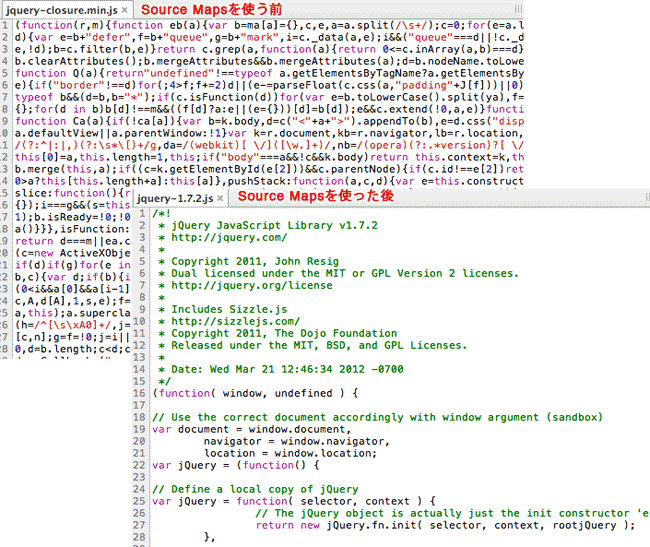
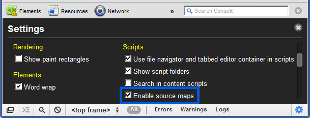

# Source Map

## Source Map

上周，[jQuery 1.9](http://blog.jquery.com/2013/01/15/jquery-1-9-final-jquery-2-0-beta-migrate-final-released/)发布。这是2.0版之前的最后一个新版本，有很多新功能，其中一个就是支持Source Map，访问 http://ajax.googleapis.com/ajax/libs/jquery/1.9.0/jquery.min.js，打开压缩后的版本，滚动到底部，你可以看到最后一行是这样的：

```js
//@ sourceMappingURL=jquery.min.map
```

这就是`Source Map`。它是一个独立的`map`文件，与源码在同一个目录下，你可以点击进去，看看它的样子。

#### 源码转换的问题

JavaScript脚本正变得越来越复杂。大部分源码（尤其是各种函数库和框架）都要经过转换，才能投入生产环境。

常见的源码转换，主要是以下三种情况：

+ 压缩，减小体积。比如`jQuery 1.9`的源码，压缩前是`252KB`，压缩后是`32KB`。
+ 多个文件合并，减少 `HTTP` 请求数。
+ 其他语言编译成 `JavaScript`。最常见的例子就是 `CoffeeScript`。

这三种情况，都使得实际运行的代码不同于开发代码，除错（`debug`）变得困难重重。通常，`JavaScript`的解释器会告诉你，第几行第几列代码出错。但是，这对于转换后的代码毫无用处。举例来说，`jQuery 1.9`压缩后只有`3`行，每行`3`万个字符，所有内部变量都改了名字。你看着报错信息，感到毫无头绪，根本不知道它所对应的原始位置。这就是`Source map`想要解决的问题。

#### 什么是Source map

简单说，`Source map`就是一个信息文件，里面储存着位置信息。也就是说，转换后的代码的每一个位置，所对应的转换前的位置。有了它，出错的时候，除错工具将直接显示原始代码，而不是转换后的代码。这无疑给开发者带来了很大方便。



目前，暂时只有`Chrome`浏览器支持这个功能。在`Developer Tools`的`Setting`设置中，确认选中"`Enable source maps`"。



#### 启用Source map

正如前文所提到的，只要在转换后的代码尾部，加上一行就可以了。

```js
//@ sourceMappingURL=/path/to/file.js.map
```

`map` 文件可以放在网络上，也可以放在本地文件系统。

## Webpack Source map

`webpack`的`sourcemap`是在开发环境下使用的，所以说你的`env`选项最好是`development`，然后再 `devtool` 关键字里面加上对应的`source`选项即可。

#### 关键字

+ `eval`：打包之后不生成.`map`文件，将文件用`eval`包裹放到编译好的入口文件中。
+ `source map`：生成.`map`文件。
+ `inline`：将`map`文件使用`DataURL`嵌入，默认是不生成.`map`文件。
+ `cheap`：只包含列信息。生成的 Source Map 中不会包含列信息，这样计算量更小，输出的 Source Map 文件更小；同时 Loader 输出的 Source Map 不会被采用；
+ `module`：来自 Loader 的 Source Map 被简单处理成每行一个模块；

#### 排列组合

| devtool                 | 含义                                                         |
| ----------------------- | ------------------------------------------------------------ |
| 空                      | 不生成 Source Map                                            |
| eval                    | 每个 module 会封装到 eval 里包裹起来执行，并且会在每个 eval 语句的末尾追加注释 `//# sourceURL=webpack:///./main.js` |
| source-map              | 会额外生成一个单独 Source Map 文件，并且会在 JavaScript 文件末尾追加 `//# sourceMappingURL=bundle.js.map` |
| hidden-source-map       | 和 source-map 类似，但不会在 JavaScript 文件末尾追加 `//# sourceMappingURL=bundle.js.map` |
| inline-source-map       | 和 source-map 类似，但不会额外生成一个单独 Source Map 文件，而是把 Source Map 转换成 base64 编码内嵌到 JavaScript 中 |
| eval-source-map         | 和 eval 类似，但会把每个模块的 Source Map 转换成 base64 编码内嵌到 eval 语句的末尾，例如 `//# sourceMappingURL=data:application/json;charset=utf-8;base64,eyJ2ZXJzaW...` |
| cheap-source-map        | 和 source-map 类似，但生成的 Source Map 文件中没有列信息，因此生成速度更快 |
| cheap-module-source-map | 和 cheap-source-map 类似，但会包含 Loader 生成的 Source Map  |

#### 常用配置

```json
{
	devtool:'source-map'
    //打印入口文件源码
}
```

## How To Choose

Devtool 配置项提供的这么多选项看似简单，但很多人搞不清楚它们之间的差别和应用场景。

如果你不关心细节和性能，只是想在不出任何差错的情况下调试源码，可以直接设置成 `source-map`，但这样会造成两个问题：

- `source-map` 模式下会输出质量最高最详细的 Source Map，这会造成构建速度缓慢，特别是在开发过程需要频繁修改的时候会增加等待时间；
- `source-map` 模式下会把 Source Map 暴露出去，如果构建发布到线上的代码的 Source Map 暴露出去就等于源码被泄露；

为了解决以上两个问题，可以这样做：

- 在开发环境下把 `devtool` 设置成 `cheap-module-eval-source-map`，因为生成这种 Source Map 的速度最快，能加速构建。由于在开发环境下不会做代码压缩，Source Map 中即使没有列信息也不会影响断点调试；
- 在生产环境下把 `devtool` 设置成 `hidden-source-map`，意思是生成最详细的 Source Map，但不会把 Source Map 暴露出去。由于在生产环境下会做代码压缩，一个 JavaScript 文件只有一行，所以需要列信息。

> 在生产环境下通常不会把 Source Map 上传到 HTTP 服务器让用户获取，而是上传到 JavaScript 错误收集系统，在错误收集系统上根据 Source Map 和收集到的 JavaScript 运行错误堆栈计算出错误所在源码的位置。
>
> 不要在生产环境下使用 `inline` 模式的 Source Map， 因为这会使 JavaScript 文件变得很大，而且会泄露源码。

## 加载现有的 Source Map

有些从 Npm 安装的第三方模块是采用 ES6 或者 TypeScript 编写的，它们在发布时会同时带上编译出来的 JavaScript 文件和对应的 Source Map 文件，以方便你在使用它们出问题的时候调试它们；

默认情况下 Webpack 是不会去加载这些附加的 Source Map 文件的，Webpack 只会在转换过程中生成 Source Map。 为了让 Webpack 加载这些附加的 Source Map 文件，需要安装 [source-map-loader](https://github.com/webpack-contrib/source-map-loader) 。 使用方法如下：

```js
module.exports = {
  module: {
    rules: [
      {
        test: /\.js$/,
        // 只加载你关心的目录下的 Source Map，以提升构建速度
        include: [path.resolve(root, 'node_modules/some-components/')],
        use: ['source-map-loader'],
        // 要把 source-map-loader 的执行顺序放到最前面，如果在 source-map-loader 之前有 Loader 转换了该 JavaScript 文件，会导致 Source Map 映射错误
        enforce: 'pre'
      }
    ]
  }
};
```

> 由于 source-map-loader 在加载 Source Map 时计算量很大，因此要避免让该 Loader 处理过多的文件，不然会导致构建速度缓慢。 通常会采用 `include` 去命中只关心的文件。

再安装新引入的依赖：

```bash
npm i -D source-map-loader
```

重启 Webpack 后，你就能在浏览器中调试 `node_modules/some-components/` 目录下的源码了。
