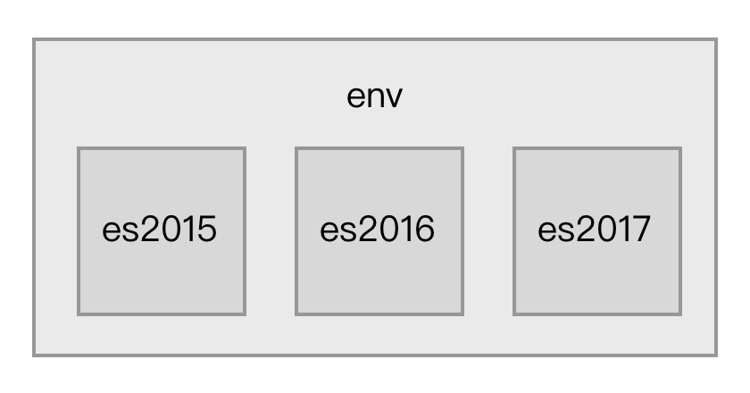

# Babel

Babel 是一个 JavaScript 编译器，能将 ES6 代码转为 ES5 代码，让你使用最新的语言特性而不用担心兼容性问题，并且可以通过插件机制根据需求灵活的扩展。 在 Babel 执行编译的过程中，会从项目根目录下的 `.babelrc` 文件读取配置。`.babelrc` 是一个 JSON 格式的文件，内容大致如下：

```json
{
  "plugins": ["@babel/plugin-transform-arrow-functions"],
  "presets": [
    [
      "@babel/env",
      {
        "useBuiltIns": "usage",
        "corejs": 3,
				"targets": {
          "edge": "17",
          "firefox": "60",
          "chrome": "67",
          "safari": "11.1",
        },
      }
    ]
  ]
}
```

### Plugins

代码转换功能以插件的形式出现，插件是小型的 `JavaScript` 程序，用于指导 `Babel` 如何对代码进行转换。你甚至可以编写自己的插件将你所需要的任何代码转换功能应用到你的代码上。

比如下面的箭头函数转换插件：

```shell
npm install --save-dev @babel/plugin-transform-arrow-functions

./node_modules/.bin/babel src --out-dir lib --plugins=@babel/plugin-transform-arrow-functions
```

### Presets

但是我们的代码中仍然残留了其他 `ES2015`+ 的特性，我们希望对它们也进行转换。我们不需要一个接一个地添加所有需要的插件，我们可以使用一个 "`preset`" （即一组预先设定的插件）。

就像插件一样，你也可以根据自己所需要的插件组合创建一个自己的 `preset` 并将其分享出去。对于当前的用例而言，我们可以使用一个名称为 `env` 的 `preset`。

```shell
npm install --save-dev @babel/preset-env

./node_modules/.bin/babel src --out-dir lib --presets=@babel/env
```

如果不进行任何配置，上述 `preset` 所包含的插件将支持所有最新的 `JavaScript` （`ES2015`、`ES2016` 等）特性。

`presets` 属性告诉 Babel 要转换的源码使用了哪些新的语法特性，一个 Presets 对一组新语法特性提供支持，多个 Presets 可以叠加。 Presets 其实是一组 Plugins 的集合，每一个 Plugin 完成一个新语法的转换工作。Presets 是按照 ECMAScript 草案来组织的，通常可以分为以下三大类：

1. 已经被写入 ECMAScript 标准里的特性，由于之前每年都有新特性被加入到标准里，所以又可细分为：

   - [es2015](https://babeljs.io/docs/plugins/preset-es2015/) 包含在2015里加入的新特性；
   - [es2016](https://babeljs.io/docs/plugins/preset-es2016/) 包含在2016里加入的新特性；
   - [es2017](https://babeljs.io/docs/plugins/preset-es2017/) 包含在2017里加入的新特性；
   - [env](https://babeljs.io/docs/plugins/preset-env/) 包含当前所有 ECMAScript 标准里的最新特性。

   它们之间的关系如图：

   

2. 被社区提出来的但还未被写入 ECMAScript 标准里特性，这其中又分为以下四种：

   - [stage0](https://babeljs.io/docs/plugins/preset-stage-0/) 只是一个美好激进的想法，有 Babel 插件实现了对这些特性的支持，但是不确定是否会被定为标准；
   - [stage1](https://babeljs.io/docs/plugins/preset-stage-1/) 值得被纳入标准的特性；
   - [stage2](https://babeljs.io/docs/plugins/preset-stage-2/) 该特性规范已经被起草，将会被纳入标准里；
   - [stage3](https://babeljs.io/docs/plugins/preset-stage-3/) 该特性规范已经定稿，各大浏览器厂商和 Node.js 社区开始着手实现；
   - stage4 在接下来的一年将会加入到标准里去。

   它们之间的关系如图：

   

1. 为了支持一些特定应用场景下的语法，和 ECMAScript 标准没有关系，例如 `babel-preset-react` 是为了支持 React 开发中的 JSX 语法。

在实际应用中，你需要根据项目源码所使用的语法去安装对应的 Plugins 或 Presets。

## In Webpack

使用`babel-loader`，`babel`的配置⽂文件是：`.babelrc`

```js
> cnpm i -D babel-loader @babel/core @babel/preset-env...
```

```js
const path = require("path");
module.exports = {
    entry: "./src/index.js",()
    output: { filename: "bundle.js", path: path.resolve(__dirname, "dist") },
    module: { rules: [{ test: /\.(js|jsx)$/, use: "babel-loader" }] },
}; 
```

增加 `ES6` 的`babel preset `配置

```json
{
    "presets": ["@babel/preset-env"]
}
```

增加`React` 的 `babel preset` 配置

```json
{
    "presets": ["@babel/preset-env", "@babel/preset-react"],
}
```

#### 