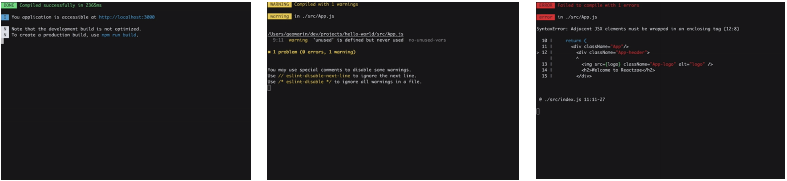
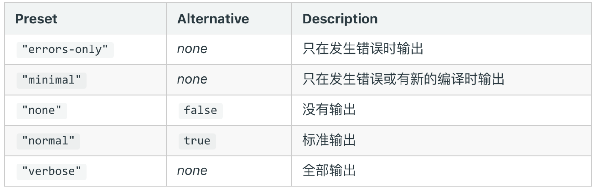

# FriendlyErrorsWebpackPlugin

## FriendlyErrorsWebpackPlugin

使⽤ `friendly-errors-webpack-plugin` 可以优化构建日志提示：

这个插件在 `webpack5` 里不再维护了，我们可以从另一个分支安装：

```bash
$ npm i --save-dev @soda/friendly-errors-webpack-plugin
```

```ts
const FriendlyErrorsWebpackPlugin = require('@soda/friendly-errors-webpack-plugin');

module.exports = {
    plugins: [
        new FriendlyErrorsWebpackPlugin(),
      ]
}
```

使用之后效果如下：



## Stats 对象

`stats` 选项让你更精确地控制 bundle 信息该怎么显示。 如果你不希望使用 `quiet` 或 `noInfo` 这样的不显示信息，而是又不想得到全部的信息，只是想要获取某部分 bundle 的信息，使用 stats 选项是比较好的折衷方式。



```js
module.exports = {
  //...
  stats: 'errors-only',
};
```

