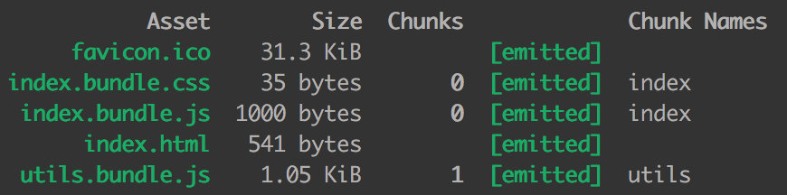
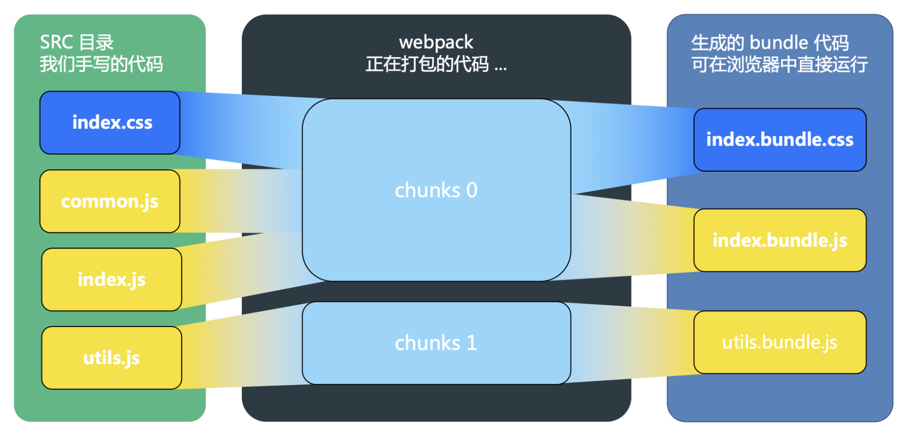

以下，罗列了整个`webpack`生态系统中常用的术语。

### Asset

`Asset`: 这个术语主要是用来描述我们通常在`web`应用或者其他应用中用到的图片、字体文件、音视频，以及其他类型的一些文件。这些资源通常为一个个单独的文件，但在`webpack`中，我们借助`style-loader`或者`css-loader`也能进行适当的管理。

### Module

`Module`: 相比于一个完整的项目，项目中分散的一个个功能性模块能够提供一个对于程序员来说更加专注的视角。一个编写良好的模块能够形成一个很清晰的抽象结构，保证之后的维护基于此能够变得规范化和开发具有明确性。

`Module Resolution`（模块解析）: 一个模块可以作为另一个模块的依赖项，即在另一个模块中通过`import`或者`require`的方式进行引入。模块解析器是一个代码库，通过这个代码库对引入的模块进行解析。我们可以在`resolve.modules`自定义设置自己的解析路径，以更好地方便个人脚本在项目中的引入。

### Chunk

`Chunk`: 这个`webpack`中专用的术语用于管理`webpack`内部的打包进程。`bundle`由许多`chunk`组成，`chunk`有几种类型，比如说“入口”和“子块”。通常`chunk`和输出的`bundle`一一对应，但是，有些是一对多的关系。

### Bundle

`Bundle`: `bundle`通常是由多个不同的模块产生，它是已经加载完毕和被编译后的源代码的最终版本。

`Bundle Splitting`: 这是`webpack`优化代码的一种方法，即将一个单独的应用拆解为多个`bundle`。通过将多个`bundle`中公共引入的模块拆解出来，我们可以减少项目的代码量，从而减小应用的体积，并且通过浏览器缓存，我们可以将代码进一步优化。

### Code Splitting

`Code Splitting`: 它表示将你的代码拆分成多个`bundle`或`chunk`，之后你可以按需加载它们，而不是简单地加载一个单独的文件。

## Chunk And Bundle

`webpack` 官网对 `chunk` 和 `bundle` 的解释，说实话太抽象了，我这里举个例子，给大家形象化的解释一下。

首先我们在 `src` 目录下写我们的业务代码，引入 `index.js`、`utils.js`、`common.js` 和 `index.css` 这 `4` 个文件，目录结构如下：

```bash
src/
├── index.css
├── index.html # 这个是 HTML 模板代码
├── index.js
├── common.js
└── utils.js
```

`index.css` 写一点儿简单的样式：

```css
body {
    background-color: red;
}
```

`utils.js` 文件写个求平方的工具函数：

```javascript
export function square(x) {
    return x * x;
}
```

`common.js` 文件写个 `log` 工具函数：

```javascript
module.exports = {
  log: (msg) => {
    console.log('hello ', msg)
  }
}
```

`index.js` 文件做一些简单的修改，引入 `css` 文件和 `common.js`：

```javascript
import './index.css';
const { log } = require('./common');

log('webpack');
```

`webpack` 的配置如下：

```javascript
{
    entry: {
        index: "../src/index.js",
        utils: '../src/utils.js',
    },
    output: {
        filename: "[name].bundle.js", // 输出 index.js 和 utils.js
    },
    module: {
        rules: [
            {
                test: /\.css$/,
                use: [
                    MiniCssExtractPlugin.loader, // 创建一个 link 标签
                    'css-loader', // css-loader 负责解析 CSS 代码, 处理 CSS 中的依赖
                ],
            },
        ]
    }
    plugins: [
        // 用 MiniCssExtractPlugin 抽离出 css 文件，以 link 标签的形式引入样式文件
        new MiniCssExtractPlugin({
            filename: 'index.bundle.css' // 输出的 css 文件名为 index.css
        }),
    ]
}
```

我们运行一下 `webpack`，看一下打包的结果：



我们可以看出，`index.css` 和 `common.js` 在 `index.js` 中被引入，打包生成的 `index.bundle.css` 和 `index.bundle.js` 都属于 `chunk 0`，`utils.js` 因为是独立打包的，它生成的 `utils.bundle.js` 属于 `chunk 1`。

感觉还有些绕？我做了一张图，你肯定一看就懂：



当我们写的 `module` 源文件传到 `webpack` 进行打包时，`webpack` 会根据文件引用关系生成 `chunk` 文件，`webpack` 会对这个 `chunk` 文件进行一些操作；

`webpack` 处理好 `chunk` 文件后，最后会输出 `bundle` 文件，这个 `bundle` 文件包含了经过加载和编译的最终源文件，所以它可以直接在浏览器中运行。

一般来说一个 `chunk` 对应一个 `bundle`，比如上图中的 `utils.js -> chunks 1 -> utils.bundle.js`；但也有例外，比如说上图中，我就用 `MiniCssExtractPlugin` 从 chunks 0 中抽离出了 `index.bundle.css` 文件。这也就是上面所说的`webpack` 会对这个 `chunk` 文件进行一些操作；

### 总结

`module`，`chunk` 和 `bundle` 其实就是同一份逻辑代码在不同转换场景下的取了三个名字：

我们直接写出来的是 `module`，`webpack` 处理时是 `chunk`，最后生成浏览器可以直接运行的 `bundle`。