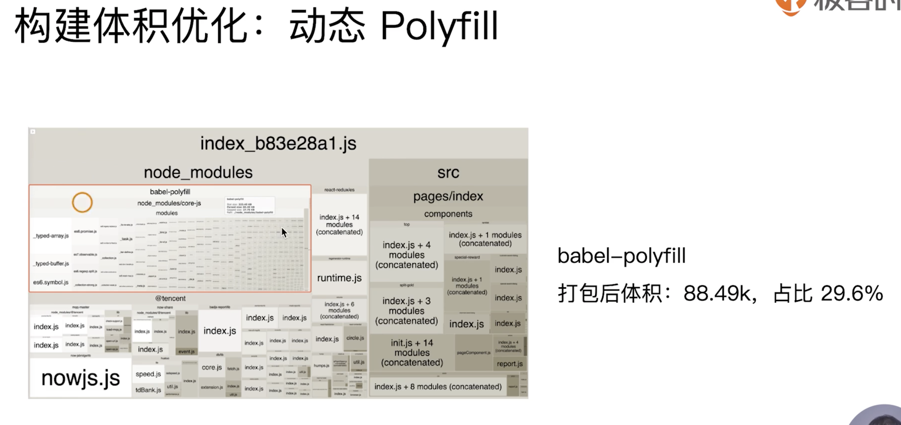

## 缩小构建范围

发布到 npm 的包一般不需要二次 babel 解析：


## 分离基础库

### cdn


### DLLPlugin

`DllPlugin`动态链接库插件，其原理是把网页依赖的基础模块抽离出来打包到`dll`文件中，当需要导入的模块存在于某个`dll`中时，这个模块不再被打包，而是去`dll`中获取。


## 代码分割


## Scope hosting


## 资源内联


## 多进程


### 模块解析

一个happypack创建多个进程池，每个进程池处理一种资源，将依赖分配给进程中的 `worker`，最后通过管道传会给主进程。


### 代码压缩


## 缓存


## 代码擦除


## 代码压缩

### 图片压缩

针对不同的图片格式有不同的压缩算法，还可以设置压缩之后的完整度：


### css压缩

**css-loader?minimize**

cssnano基于PostCSS，不仅是删掉空格，还能理解代码含义，例如把`color:#ff0000` 转换成 `color:red`，css-loader内置了cssnano，只需要使用 `css-loader?minimize` 就可以开启cssnano压缩。

### css

要对 `css` 文件进行压缩需要用到 `optimize-css-assets-webpack-plugin` 和 `cssnano`:

```bash
> cnpm i -D optimize-css-assets-webpack-plugin cssnano
```

```diff
module.exports = {
  plugins: [
+ 	new OptimizeCSSAssetsPlugin({
+ 	assetNameRegExp: /\.css$/g,
+ 	cssProcessor: require('cssnano’),
+ })
  ]
};
```

### html

`html` 文件的压缩只需要修改 `html-webpack-plugin`配置，设置压缩参数：

```js
module.exports = {
        new HTMLWebpackPlugin({
            minify:{
                html5:true,
                collapseWhitespace:true,
                preserveLineBreaks:false,
                minifyCSS:true,
                minifyJS:true,
                removeComments:false
            }
        })
    ]
};
```


## 动态 polefill




