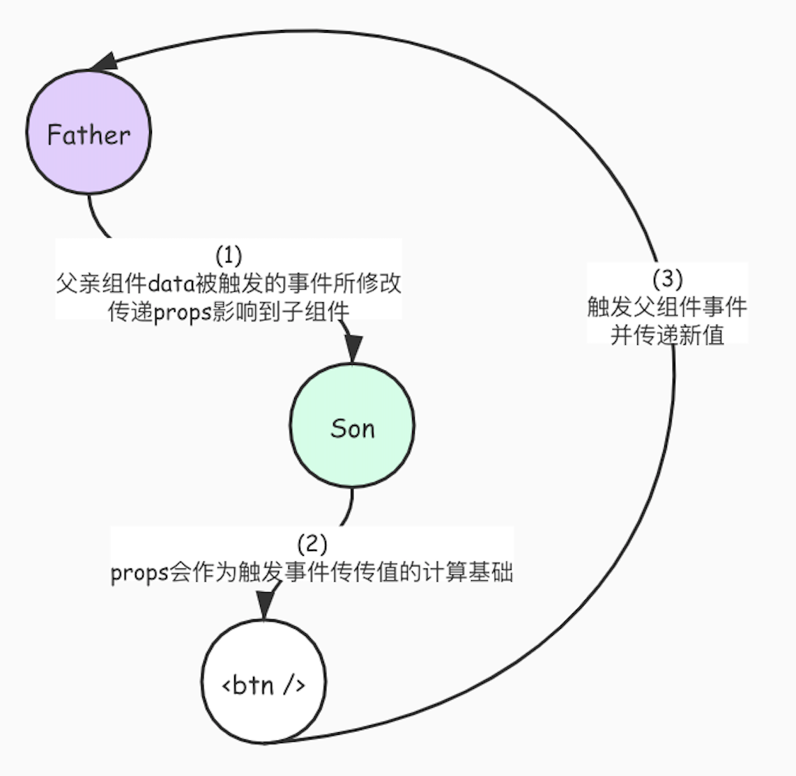

# v-model

直言 `vue` 的双向数据绑定是我所见过最脑瘫最反人类的语法糖了 `ctmd`，但是饭`🍚`还是要恰的，那就只能吃屎`💩`了。说在最前面双向绑定的数据传递流程是下面这样的：




## Vue `2.x`

-------

#### default

在 2.x 中，在组件上使用 `v-model` 相当于绑定 `value` prop 和 `input` 事件，这是默认的绑定结果：

```html
<ChildComponent v-model="pageTitle" />

<!-- 是以下的简写: -->

<ChildComponent :value="pageTitle" @input="pageTitle = $event" />
```

在组件内部我们只要在想要进行双向绑定的地方，绑定传入的 `value`，然后在数据发生改变的时候 `emit('input', value)` 就可以了：

```vue
<input :value="value" @input="(e) => $emit('input', e.target.value);" />

<script>
export default {
	props: ["value"],
}
</script>
```

这也是为什么我们在 `input` 上放一个 `v-model` 就可以实现一个快速的双向绑定：

```vue
<input v-model="pageTitle" />

<!-- 是以下的简写: -->

<input :value="pageTitle" @input="pageTitle = $event(e.target.value)" />
```

#### selfDefined

如果要将属性或事件名称更改为其他名称，则需要在 `ChildComponent` 组件中添加 `model` 选项：

```vue
<!-- ParentComponent.vue -->
<ChildComponent v-model="pageTitle" />
<script>
export default {
  model: {
    prop: 'title',
    event: 'change'
  },
  props: {
    // 这将允许 `value` 属性用于其他用途
    value: String,
    // 使用 `title` 代替 `value` 作为 model 的 prop
    title: {
      type: String,
      default: 'Default title'
    }
  }
}
</script>
```

所以，在这个例子中 `v-model` 是以下的简写：

```html
<ChildComponent :title="pageTitle" @change="pageTitle = $event" />
```

#### 使用 `v-bind.sync`

在某些情况下，我们可能需要对某一个 prop 进行“双向绑定”(除了前面用 `v-model` 绑定 prop 的情况)。为此，我们建议使用 `update:myPropName` 抛出事件。例如，对于在上一个示例中带有 `title` prop 的 `ChildComponent`，我们可以通过下面的方式将分配新 value 的意图传达给父级：

```js
this.$emit('update:title', newValue)
```

如果需要的话，父级可以监听该事件并更新本地 data property。例如：

```html
<ChildComponent :title="pageTitle" @update:title="pageTitle = $event" />
```

为了方便起见，我们可以使用 `.sync` 修饰符来缩写，如下所示：

```html
<ChildComponent :title.sync="pageTitle" />
```