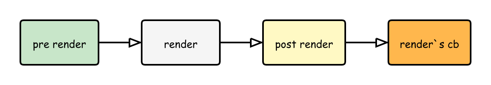

## nextTick

前面 `vue` 的整个渲染调度分为四个阶段：渲染前、渲染中、渲染后以及整体渲染完成之后的回调：



`nextTick` 接收一个回调函数作为参数，调用 `nextTick` 它能保证接收的回调在这个 `DOM` 渲染周期结束之后执行，作为整个渲染的回调

```ts
const resolvedPromise: Promise<any> = Promise.resolve()
let currentFlushPromise: Promise<void> | null = null

export function nextTick(
  this: ComponentPublicInstance | void,
  fn?: () => void
): Promise<void> {
  const p = currentFlushPromise || resolvedPromise
  return fn ? p.then(this ? fn.bind(this) : fn) : p
}
```


将回调推迟到下一个 DOM 更新周期之后执行。在更改了一些数据以等待 DOM 更新后立即使用它。

```js
import { createApp, nextTick } from 'vue'

const app = createApp({
  setup() {
    const message = ref('Hello!')
    const changeMessage = async newMessage => {
      message.value = newMessage
      await nextTick()
      console.log('Now DOM is updated')
    }
  }
})
```

