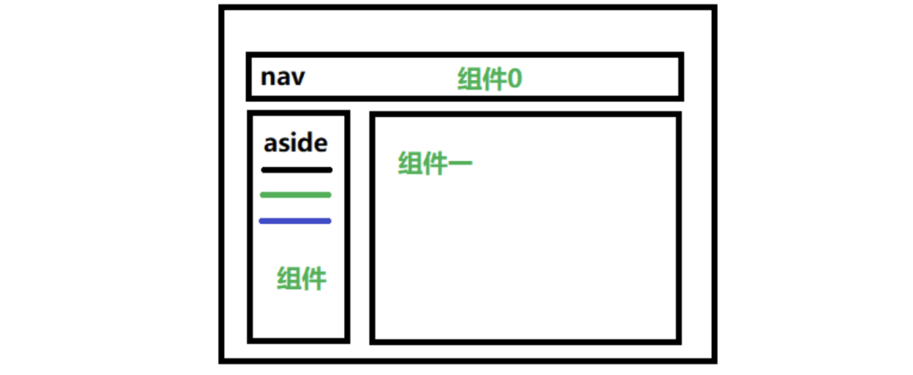

## 简介


Vue Router 是 [Vue.js](http://cn.vuejs.org/) 官方的路由管理器。它和 Vue.js 的核心深度集成，让构建**单页面应用**变得易如反掌。包含的功能有：

- 嵌套的路由/视图表
- 模块化的、基于组件的路由配置
- 路由参数、查询、通配符
- 基于 Vue.js 过渡系统的视图过渡效果
- 细粒度的导航控制
- 带有自动激活的 CSS class 的链接
- HTML5 历史模式或 hash 模式，在 IE9 中自动降级
- 自定义的滚动条行为

## 使用

**router/index.js**

首先在注册router中间件，之后创建路由表，实例化路由对象，创建导航守卫。

```js
import Vue from 'vue'
import VueRouter from 'vue-router'
import Login from '../components/login.vue'
import Home from '../components/home.vue'

Vue.use(VueRouter)

const routes = [
  {
    path: '/',
    component: Login
  },
  {
    path: '/login',
    component: Login
  },
  {
    path: '/home',
    component: Home
  }
]

const router = new VueRouter({
  routes
})

router.beforeEach((to, from, next) => {
  // to and from are both route objects. must call `next`.
  if (to.path === '/login') return next()
  const tokenStr = window.sessionStorage.getItem('token')
  console.log(tokenStr)
  if (!tokenStr) return next('/login')
  return next()
})

export default router

```

**index.js   **

在全局在全局组件中挂载路由对象。

```js
import Vue from 'vue'
import App from './App.vue'
import router from './router'
import store from './store'
import './plugins/element.js'

import 'font-awesome/css/font-awesome.min.css'
import 'normalize.css/normalize.css'
import './assets/css/global.css'

import axios from 'axios'
// 配置axios
axios.defaults.baseURL = 'http://
Vue.prototype.$http = axios

Vue.config.productionTip = false

new Vue({
  router,		// 路由对象
  store,
  render: h => h(App)
}).$mount('#app')

```

在页面中使用，`router-view`负责显示内容，`router-link`负责路由切换。

```vue
<template>
    <div class="box">
        <Header></Header>
        <router-view/>
        <router-link :to="{name:'app'}">app</router-link> 
        					//对应路由表中app的name
        <router-link to="/login">login</router-link> 
        <Footer></Footer>
    </div>
</template>

<script>
import Header from "./assets/todo/header.vue"
import Footer from "./assets/todo/footer.vue"
import Todo from "./assets/todo/todo.vue"
    
export default {
    components:{
        Header,
        Footer,
        Todo
    }
}
</script>
```

> 这种注册完之后是默认的hash路由也就是多页面应用模式。

### 动态路由匹配

我们经常需要把某种模式匹配到的所有路由，全都映射到同个组件。例如，我们有一个 `User` 组件，对于所有 ID 各不相同的用户，都要使用这个组件来渲染。那么，我们可以在 `vue-router` 的路由路径中使用“动态路径参数”(dynamic segment) 来达到这个效果：

```js
const User = {
  template: '<div>User</div>'
}

const router = new VueRouter({
  routes: [
    // 动态路径参数 以冒号开头
    { path: '/user/:id', component: User }
  ]
})
```

现在呢，像 `/user/foo` 和 `/user/bar` 都将映射到相同的路由。

一个“路径参数”使用冒号 `:` 标记。当匹配到一个路由时，参数值会被设置到 `this.$route.params`，可以在每个组件内使用。于是，我们可以更新 `User` 的模板，输出当前用户的 ID：

```js
const User = {
  template: '<div>User {{ $route.params.id }}</div>'
}
```

####  嵌套路由

实际生活中的应用界面，通常由多层嵌套的组件组合而成。同样地，URL 中各段动态路径也按某种结构对应嵌套的各层组件，例如：

```text
/user/foo/profile                     /user/foo/posts
+------------------+                  +-----------------+
| User             |                  | User            |
| +--------------+ |                  | +-------------+ |
| | Profile      | |  +------------>  | | Posts       | |
| |              | |                  | |             | |
| +--------------+ |                  | +-------------+ |
+------------------+                  +-----------------+
```

借助 `vue-router`，使用嵌套路由配置，就可以很简单地表达这种关系。

接着上节创建的 app：

```html
<div id="app">
  <router-view></router-view>
</div>
const User = {
  template: '<div>User {{ $route.params.id }}</div>'
}

const router = new VueRouter({
  routes: [
    { path: '/user/:id', component: User }
  ]
})
```

这里的 `` 是最顶层的出口，渲染最高级路由匹配到的组件。同样地，一个被渲染组件同样可以包含自己的嵌套 ``。例如，在 `User` 组件的模板添加一个 ``：

```js
const User = {
  template: `
    <div class="user">
      <h2>User {{ $route.params.id }}</h2>
      <router-view></router-view>
    </div>
  `
}
```

要在嵌套的出口中渲染组件，需要在 `VueRouter` 的参数中使用 `children` 配置：

```js
const router = new VueRouter({
  routes: [
    { path: '/user/:id', component: User,
      children: [
        {
          // 当 /user/:id/profile 匹配成功，
          // UserProfile 会被渲染在 User 的 <router-view> 中
          path: 'profile',
          component: UserProfile
        },
        {
          // 当 /user/:id/posts 匹配成功
          // UserPosts 会被渲染在 User 的 <router-view> 中
          path: 'posts',
          component: UserPosts
        }
      ]
    }
  ]
})
```

**要注意，以 `/` 开头的嵌套路径会被当作根路径。 这让你充分的使用嵌套组件而无须设置嵌套的路径。**

你会发现，`children` 配置就是像 `routes` 配置一样的路由配置数组，所以呢，你可以嵌套多层路由。

此时，基于上面的配置，当你访问 `/user/foo` 时，`User` 的出口是不会渲染任何东西，这是因为没有匹配到合适的子路由。如果你想要渲染点什么，可以提供一个 空的 子路由：

```js
const router = new VueRouter({
  routes: [
    {
      path: '/user/:id', component: User,
      children: [
        // 当 /user/:id 匹配成功，
        // UserHome 会被渲染在 User 的 <router-view> 中
        { path: '', component: UserHome },

        // ...其他子路由
      ]
    }
  ]
})
```

#### 命名路由

有时候，通过一个名称来标识一个路由显得更方便一些，特别是在链接一个路由，或者是执行一些跳转的时候。你可以在创建 Router 实例的时候，在 `routes` 配置中给某个路由设置名称。

```js
const router = new VueRouter({
  routes: [
    {
      path: '/user/:userId',
      name: 'user',
      component: User
    }
  ]
})
```

要链接到一个命名路由，可以给 `router-link` 的 `to` 属性传一个对象：

```html
<router-link :to="{ name: 'user', params: { userId: 123 }}">User</router-link>
```

这跟代码调用 `router.push()` 是一回事：

```js
router.push({ name: 'user', params: { userId: 123 }})
```

这两种方式都会把路由导航到 `/user/123` 路径。

#### 重定向

重定向也是通过 `routes` 配置来完成，下面例子是从 `/a` 重定向到 `/b`：

```js
const router = new VueRouter({
  routes: [
    { path: '/a', redirect: '/b' }
  ]
})
```

重定向的目标也可以是一个命名的路由：

```js
const router = new VueRouter({
  routes: [
    { path: '/a', redirect: { name: 'foo' }}
  ]
})
```

甚至是一个方法，动态返回重定向目标：

```js
const router = new VueRouter({
  routes: [
    { path: '/a', redirect: to => {
      // 方法接收 目标路由 作为参数
      // return 重定向的 字符串路径/路径对象
    }}
  ]
})
```

注意[导航守卫](https://router.vuejs.org/zh/guide/advanced/navigation-guards.html)并没有应用在跳转路由上，而仅仅应用在其目标上。在下面这个例子中，为 `/a` 路由添加一个 `beforeEach` 或 `beforeLeave` 守卫并不会有任何效果。

#### 路由组件传参

在组件中使用 `$route` 会使之与其对应路由形成高度耦合，从而使组件只能在某些特定的 URL 上使用，限制了其灵活性。

使用 `props` 将组件和路由解耦：

**取代与 `$route` 的耦合**

```js
const User = {
  template: '<div>User {{ $route.params.id }}</div>'
}
const router = new VueRouter({
  routes: [
    { path: '/user/:id', component: User }
  ]
})
```

**通过 `props` 解耦**

```js
const User = {
  props: ['id'],
  template: '<div>User {{ id }}</div>'
}
const router = new VueRouter({
  routes: [
    { path: '/user/:id', component: User, props: true },

    // 对于包含命名视图的路由，你必须分别为每个命名视图添加 `props` 选项：
    {
      path: '/user/:id',
      components: { default: User, sidebar: Sidebar },
      props: { default: true, sidebar: false }
    }
  ]
})
```

这样你便可以在任何地方使用该组件，使得该组件更易于重用和测试。

####  命名视图

有时候想同时 (同级) 展示多个视图，而不是嵌套展示，例如创建一个布局，有 `sidebar` (侧导航) 和 `main` (主内容) 两个视图，这个时候命名视图就派上用场了。你可以在界面中拥有多个单独命名的视图，而不是只有一个单独的出口。如果 `router-view` 没有设置名字，那么默认为 `default`。

```html
<router-view class="view one"></router-view>
<router-view class="view two" name="a"></router-view>
<router-view class="view three" name="b"></router-view>
```

一个视图使用一个组件渲染，因此对于同个路由，多个视图就需要多个组件。确保正确使用 `components` 配置 (带上 s)：

```js
const router = new VueRouter({
  routes: [
    {
      path: '/',
      components: {
        default: Foo,
        a: Bar,
        b: Baz
      }
    }
  ]
})
```

## router 路由对象

### 构建

`Router`实例用于配置全局路由对象，添加基路由等。

```js
import Router from "vue-router"

import routes from "./routes"

export default() =>{
    return new Router({
        routes,
        mode:'history',
        //不使用hash路由（单页应用）
        base:"/vue/",
        //基路由
        linkActiveClass:"active-link",
        //不完全匹配（作用于router-link）
        linkExactActiveClass:"exact-active-link",
        //完全匹配（作用于router-link）
        scrollBehavior(to,from,savedPosition){
            if(savedPosition){
                return savedPosition
            }else{
                return {x:0,y:0}
            }
        },
        //是否记录滚动条位置。
        parseQuery(){
        // 定制query参数，不常用
        },
        stringifyQuery(){
				// 定制query参数，不常用
        },
        failback:true
        //将不支持单页应用的浏览器使用hash模式。(兼容)
    }) 
}
```

#### **mode**

- 类型: `string`

- 默认值: `"hash" (浏览器环境) | "abstract" (Node.js 环境)`

- 可选值: `"hash" | "history" | "abstract"`

  配置路由模式:

  - `hash`: 使用 URL hash 值来作路由。支持所有浏览器，包括不支持 HTML5 History Api 的浏览器。
  - `history`: 依赖 HTML5 History API 和服务器配置。查看 [HTML5 History 模式](https://router.vuejs.org/zh/guide/essentials/history-mode.html)。
  - `abstract`: 支持所有 JavaScript 运行环境，如 Node.js 服务器端。**如果发现没有浏览器的 API，路由会自动强制进入这个模式。**

#### **base**

- 类型: `string`

- 默认值: `"/"`

  应用的基路径。例如，如果整个单页应用服务在 `/app/` 下，然后 `base` 就应该设为 `"/app/"`。

### router实例方法

除了使用 `` 创建 a 标签来定义导航链接，我们还可以借助 router 的实例方法，通过编写代码来实现。

**注意：在 Vue 实例内部，你可以通过 `$router` 访问路由实例。**

####  `router.push(location, onComplete?, onAbort?)`

想要导航到不同的 URL，则使用 `router.push` 方法。这个方法会向 history 栈添加一个新的记录，所以，当用户点击浏览器后退按钮时，则回到之前的 URL。

当你点击 `` 时，这个方法会在内部调用，所以说，点击 `` 等同于调用 `router.push(...)`。

| 声明式 | 编程式             |
| ------ | ------------------ |
| ``     | `router.push(...)` |

该方法的参数可以是一个字符串路径，或者一个描述地址的对象。例如：

```js
// 命名的路由
router.push({ name: 'user', params: { userId: '123' }})

// 带查询参数，变成 /register?plan=private
router.push({ path: 'register', query: { plan: 'private' }})
```

**注意：如果提供了 `path`，`params` 会被忽略，上述例子中的 `query` 并不属于这种情况。取而代之的是下面例子的做法，你需要提供路由的 `name` 或手写完整的带有参数的 `path`：**

#### `router.go(n)`

这个方法的参数是一个整数，意思是在 history 记录中向前或者后退多少步，类似 `window.history.go(n)`，正进复退。

## $router 路由对象

一个**路由对象 (route object)** 表示当前激活的路由的状态信息，包含了当前 URL 解析得到的信息，还有 URL 匹配到的**路由记录 (route records)**，前面我们通过pushApi就会根据我们传入的对象创建一个路由对象。

```js
{
  name: undefined
  meta: {}
  path: "/login"
  hash: ""
  query: {}
  params: {}
  fullPath: "/login"
  matched: [{…}]
}
```

路由对象是不可变 (immutable) 的，每次成功的导航后都会产生一个新的对象。

路由对象出现在多个地方:

- 在组件内，即 `this.$route`

- 在 `$route` 观察者回调内

- `router.match(location)` 的返回值

- 导航守卫的参数：

  ```js
  router.beforeEach((to, from, next) => {
    // `to` 和 `from` 都是路由对象
  })
  ```

###  路由对象属性

- **$route.path**

  - 类型: `string`

    字符串，对应当前路由的路径，总是解析为绝对路径，如 `"/foo/bar"`。

- **$route.params**

  - 类型: `Object`

    一个 key/value 对象，包含了动态片段和全匹配片段，如果没有路由参数，就是一个空对象。

- **$route.query**

  - 类型: `Object`

    一个 key/value 对象，表示 URL 查询参数。例如，对于路径 `/foo?user=1`，则有 `$route.query.user == 1`，如果没有查询参数，则是个空对象。

- **$route.hash**

  - 类型: `string`

    当前路由的 hash 值 (带 `#`) ，如果没有 hash 值，则为空字符串。

- **$route.fullPath**

  - 类型: `string`

    完成解析后的 URL，包含查询参数和 hash 的完整路径。

- **$route.matched**

  - 类型: `Array`

  一个数组，包含当前路由的所有嵌套路径片段的**路由记录** 。路由记录就是 `routes` 配置数组中的对象副本 (还有在 `children` 数组)。

- **$route.name**

  当前路由的名称，如果有的话。

- **$route.redirectedFrom**

  如果存在重定向，即为重定向来源的路由的名字。

### 注入

通过在 Vue 根实例的 `router` 配置传入 router 实例，下面这些属性成员会被注入到每个子组件。

- **this.$router**

  router 实例。

- **this.$route**

  当前激活的[路由信息对象](https://router.vuejs.org/zh/api/#路由对象)。这个属性是只读的，里面的属性是 immutable (不可变) 的，不过你可以 watch (监测变化) 它。

## 路由表

`routes`是实际的路由表，支持路由转发，参数校验，子路由。

```js
import Todo from "./../resource/assets/todo/todo.vue"
import Login from  "./../resource/assets/login/login.vue"

export default[
    {	
        path:'/',
        redirect:'/app'
    },
    {
        path:'/app',
        component:Todo,
        name:'app',
        children:[
             {
                 path:'/test',
                 component:Login
             }
         ]
    },
    {
        path:'/login/:id',
        props:{
            id:213,
        },
        props:(route)=>({
             id:route.query.b
        }),
        component:Login,
        query:{
            name : "111"
        }
    }
]
```

## \<router-link>

### [#](https://router.vuejs.org/zh/api/#to)to

- 类型: `string | Location`

- required

  表示目标路由的链接。当被点击后，内部会立刻把 `to` 的值传到 `router.push()`，所以这个值可以是一个字符串或者是描述目标位置的对象。

  ```html
  <!-- 字符串 -->
  <router-link to="home">Home</router-link>
  <!-- 渲染结果 -->
  <a href="home">Home</a>
  
  <!-- 使用 v-bind 的 JS 表达式 -->
  <router-link v-bind:to="'home'">Home</router-link>
  
  <!-- 不写 v-bind 也可以，就像绑定别的属性一样 -->
  <router-link :to="'home'">Home</router-link>
  
  <!-- 同上 -->
  <router-link :to="{ path: 'home' }">Home</router-link>
  
  <!-- 命名的路由 -->
  <router-link :to="{ name: 'user', params: { userId: 123 }}">User</router-link>
  
  <!-- 带查询参数，下面的结果为 /register?plan=private -->
  <router-link :to="{ path: 'register', query: { plan: 'private' }}"
    >Register</router-link
  >
  ```

### [#](https://router.vuejs.org/zh/api/#replace)replace

- 类型: `boolean`

- 默认值: `false`

  设置 `replace` 属性的话，当点击时，会调用 `router.replace()` 而不是 `router.push()`，于是导航后不会留下 history 记录。

  ```html
  <router-link :to="{ path: '/abc'}" replace></router-link>
  ```

### [#](https://router.vuejs.org/zh/api/#append)append

- 类型: `boolean`

- 默认值: `false`

  设置 `append` 属性后，则在当前 (相对) 路径前添加基路径。例如，我们从 `/a` 导航到一个相对路径 `b`，如果没有配置 `append`，则路径为 `/b`，如果配了，则为 `/a/b`

  ```html
  <router-link :to="{ path: 'relative/path'}" append></router-link>
  ```

### [#](https://router.vuejs.org/zh/api/#tag)tag

- 类型: `string`

- 默认值: `"a"`

  有时候想要 `` 渲染成某种标签，例如 ``。 于是我们使用 `tag` prop 类指定何种标签，同样它还是会监听点击，触发导航。

  ```html
  <router-link to="/foo" tag="li">foo</router-link>
  <!-- 渲染结果 -->
  <li>foo</li>
  ```

## 页面切换动画

<template>
    <div class="box">
        <transition name="fade">
                <router-view/>
        </transition>
    </div>
</template>
```

​```scss
.fade-enter-active , .fade-leave-active{
    transition: opacity .5s
}
.fade-enter,.fade-leave-to{
    opacity: 0
}
```

> css属性只要在组件渲染之前在全局或者在组件内部存在就行了。（全局样式）

