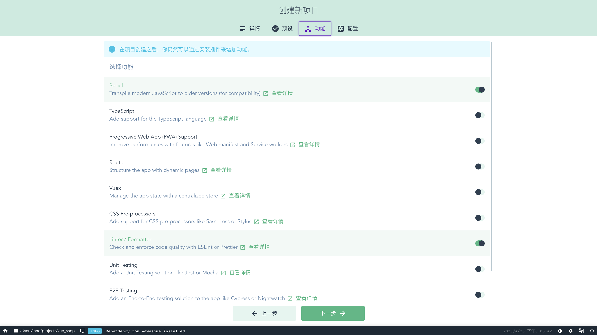
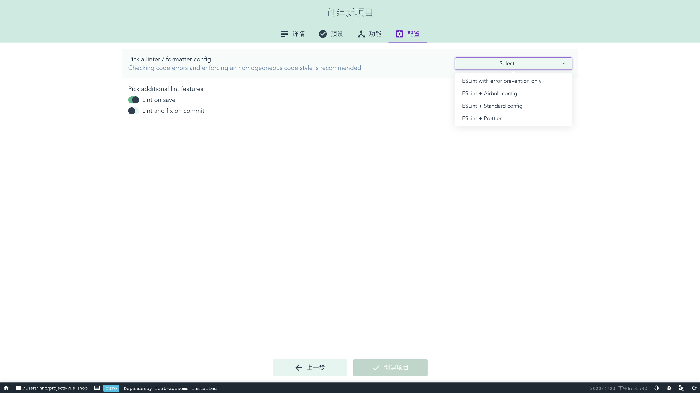
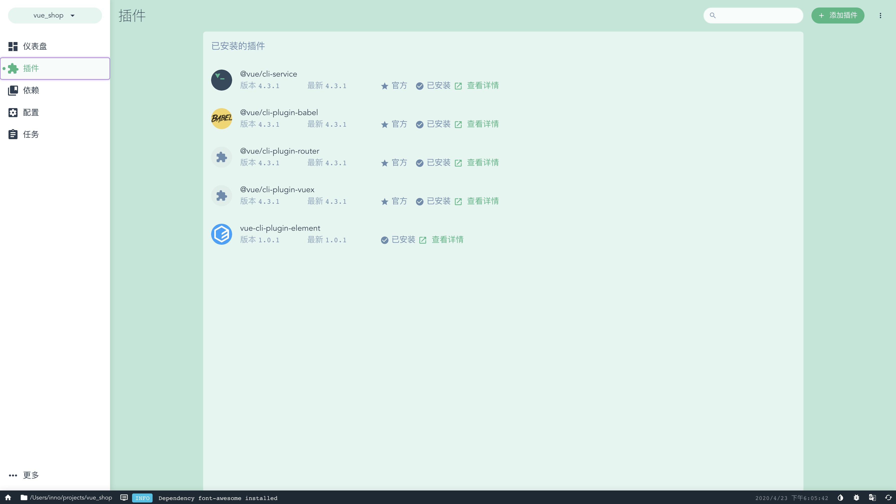
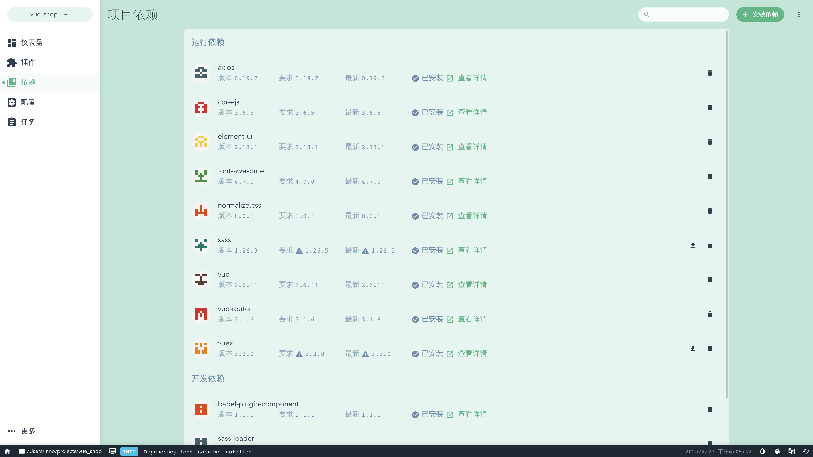
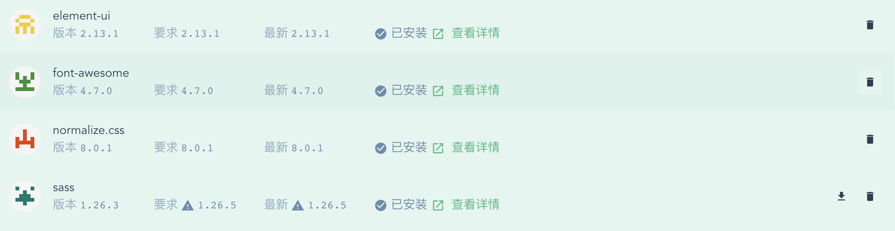
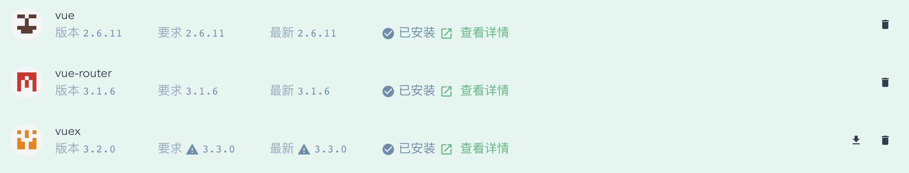
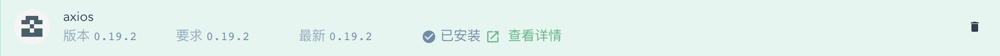

## 1.通过 vue ui 创建项目

### 1-1.设置项目目录、包管理工具、版本管理仓库


### 1-2.添加插件和依赖



### 1-3.定义语法检查规则



## 2.添加项目插件和依赖

### 2-1.通过 vue ui 管理项目插件（vue.use）



### 2-2.添加依赖



#### 样式表依赖



#### 框架依赖



#### 网络请求依赖



#### 项目中配置

```js
import Vue from 'vue'
import App from './App.vue'
// 配置 框架依赖
import router from './router'
import store from './store'
// 配置 ui以及样式 依赖
import './plugins/element.js'
import 'font-awesome/css/font-awesome.min.css'
import 'normalize.css/normalize.css'
import './assets/css/global.css'
// 配置axios
import axios from 'axios'
axios.defaults.baseURL = 'http://jinjinjin.mynatapp.cc/api/private/v1/'
axios.interceptors.request.use(config => {
  config.headers.Authorization = window.sessionStorage.getItem('token')
  return config
})
Vue.prototype.$http = axios
// 关闭生产环境
Vue.config.productionTip = false

new Vue({
  router,
  store,
  render: h => h(App)
}).$mount('#app')

```

## 3.其他配置

### 3-1.编写全局样式

```css
body,
html,
#app {
  width: 100%;
  height: 100%;
  font-size: 16px;
  font-family: Roboto, Avenir, Helvetica, Arial, sans-serif;
}

```

### 3-2.按需导入element-ui

```js
import Vue from 'vue'
import {
  Container,
  Header,
  Aside,
  Main,
  Button,
  Form,
  FormItem,
  Input,
  Message,
  Menu,
  MenuItem,
  Submenu,
  MenuItemGroup
} from 'element-ui'

Vue.use(Container)
Vue.use(Header)
Vue.use(Aside)
Vue.use(Main)
Vue.use(Button)
Vue.use(Form)
Vue.use(FormItem)
Vue.use(Input)
Vue.use(Menu)
Vue.use(MenuItem)
Vue.use(Submenu)
Vue.use(MenuItemGroup)

Vue.prototype.$message = Message
```

