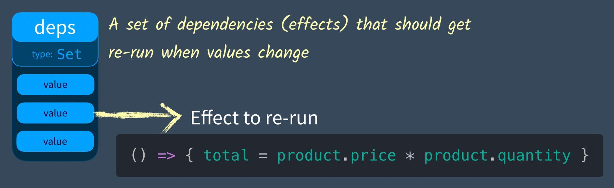

# Reactivity

现在是时候深入了！``Vue`` 最独特的特性之一，是其非侵入性的响应性系统。数据模型是被代理的 ``JavaScript`` 对象。而当你修改它们时，视图会进行更新。这让状态管理非常简单直观，不过理解其工作原理同样重要，这样你可以避开一些常见的问题。

这一章节我们先来介绍几个前置知识，后面再来看看`vue` 关于 `reactivity` 的具体实现。

## What is `reactivity`?

这个术语在程序设计中经常被提及，但这是什么意思呢？响应性是一种允许我们以声明式的方式去适应变化的一种编程范例。人们通常展示的典型例子，是一份 `excel` 电子表格 (一个非常好的例子)。


如果将数字 `2` 放在第一个单元格中，将数字 `3` 放在第二个单元格中并要求提供 `SUM`，则电子表格会将其计算出来给你。不要惊奇，同时，如果你更新第一个数字，`SUM` 也会自动更新。

### In React

先来看看 `react` 中的响应式实例：

```tsx
class List extends React.Component {
  constructor() {
    this.state = {
      price: 5.00,
      quantity: 2,
    };
  }
  addOne = () => {
    this.setState('quantity', this.quantity+1);
  }
  render() {
    return (
      <ul>
        <li>price: {this.state.price}</li>
        <li>sum: {this.state.price * this.state.quanity}</li>
        <button onclick={addOne}>add one</button>
      </ul>
    )
  }
}
```

上面这个小例子所实现的功能就是一个计价器，当我们点击 `btn` 的时候 `sum` 会重新计算，即 `quantity` 改变的时候 `{price * quanity}`也跟着重新计算，这在 `react` 中是怎么实现的呢。

大概来说就是调用 this.setState 的时候会产生一个更新任务加入到 `react` 的调度器中，调度器执行更新任务时会从组件根节点从新构建 `fiberTree`，构建完成之后判断是否对 `dom` 进行更新。

### In Vue

知晓 `react` 的更新流程之后，我们会发现其实 `react` 并不是在更新 `quantity` 的时候检测到了其所有相关的值，而是根据这个新值重新对组件树进行渲染(部分渲染)，当然 `react fiber` 的构建其实很复杂的，效率很高。

再来看看 `vue` 的响应式实例：

```vue
<div id="app">
  <div>Price: ${{ product.price }}</div>
  <div>Total: ${{ product.price * product.quantity }}</div>
  <div>Taxes: ${{ totalPriceWithTax }}</div>
</div>
<script src="https://cdn.jsdelivr.net/npm/vue"></script>
<script>
  var vm = new Vue({
    el: '#app',
    data: {
      product: {
        price: 5.00,
        quantity: 2
      }
    },
    computed: {
      totalPriceWithTax() {
        return this.product.price * this.product.quantity * 1.03
      }
    }
  })
</script>
```

这个例子里面加入了 `computed` 计算属性。`Vue` 的 `reactivity` 系统知道如果 `price` 变化，它应该做三件事：

+ 更新页面上 `price` 价格的显示。
+ 重新计算`price`乘以`quantity`的表达式，并更新页面。
+ 再次调用 `totalPriceWithTax` 函数并更新页面。

但是等等，`Vue` 的 `Reactivity` 系统如何知道在价格变化时要更新什么，以及它如何跟踪一切？因为上面的更新流程不是`javascript` 程序的工作方式：

```js
let product = { price: 5, quantity: 2 }
let total = product.price * product.quantity  // 10 right?
product.price = 20
console.log(`total is ${total}`)
```

你认为它会打印什么？ 由于我们没有使用 ` Vue`，它将打印 `10`。在 `Vue` 中，我们希望在价格或数量更新时更新总数。 我们想要 `40` 作为实时结果。

现在我们弄明白我们想要实现的效果了，来看看 `vue` 的 `reactivity` 实现原理吧。

## Track And Trigger Effects

首先我们先定义三个概念：

+ `effect`：副作用，即某个响应式对象属性或其本身发生变化之后，对其他个体产生的影响。
+ `Track`：跟踪，跟踪即不断记录某个响应式对象属性的副作用。
+ `Trigger`：触发，当某个对象本身/属性发生变化之后，我们需要触发之前 `track` 的所有 `effect`。

实现上面三点，就相当于实现了响应式系统，先来看看我们如何手动的构建 `effect`，并且进行 `Track`和 `trigger`。

### Effect & Track & Trigger

首先，我们需要某种方式来告诉我们的应用程序，“存储我将要运行的代码(`effect`)，我可能需要你在其他时间运行它。” 然后我们运行代码初始化计算。如果价格或数量变量得到更新，再次运行存储的代码。


我们可以通过记录函数(`effect`)来实现这一点，以便再次运行它：

```ts
let product = { price: 5, quantity: 2 }
let total = 0

let effect = () => { total = product.price * product.quantity }

effect() // Also go ahead and run it
```

接下来要实现的是 `track` 函数来储存我们的 `effects`：

```ts
track()  // Remember this in case we want to run it later
```

为了实现 `track`，我们需要一个地方来存储我们定义的 `effect`。 我们创建一个 `dep` 变量作为依赖项。



 我们称之为依赖是因为通常在观察者模式中，依赖有订阅者（这里是 `effects`），当对象改变状态时会得到通知。 由于依赖需要存储的只是一组 `effect`，我们可以简单地创建一个 `Set`。

```javascript
let dep = new Set() // Our object tracking a list of effects
```

然后我们的 track 函数可以简单地将我们的 `effect` 添加到这个依赖中：

```javascript
function track () {
  dep.add(effect) // Store the current effect
}
```

接下来再编写一个 `trigger` 函数来运行我们储存在 `dep` 中的所有 `effect`。

```ts
function trigger() { 
  dep.forEach(effect => effect()) 
}
```

很简单对吧，现在我们就是手动的实现了一个响应式的效果，来看看完整的代码：

```ts
let product = { price: 5, quantity: 2 }
let total = 0
let dep = new Set()

function track() {
  dep.add(effect)
}

function trigger() {
  dep.forEach(effect => effect())
}

let effect = () => {
  total = product.price * product.quantity
}

track()
trigger()

product.price = 20
console.log(total) // => 10

trigger()
console.log(total) // => 40
```

### Multiple Properties

上面的问题还没完，我们的 `reactivity` 对象有不同的属性，每个属性都需要有自己的 `dep`(即一组 `effect`)。比如 `product = {price: 5, quantity: 2}`，`price` 属性需要它自己的 `dep`，`quantity` 也是。

要储存不同属性的 `dep` 很容易的我们想到了 `map` 这种数据结构，所以我们创建一个 `depsMap`，它的类型是`Map`：


现在我们每次将属性值改变之后调用 `track` 和 `trigger`都需要一个新参数就是属性名，上面的代码将会这么被改写：

```ts
const depsMap = new Map()
function track(key, effect) {
  // Make sure this effect is being tracked.
  let dep = depsMap.get(key) // Get the current dep (effects) that need to be run when this key (property) is set
  if (!dep) {
    // There is no dep (effects) on this key yet
    depsMap.set(key, (dep = new Set())) // Create a new Set
  }
  dep.add(effect) // Add effect to dep
}
  }
function trigger(key) {
  let dep = depsMap.get(key) // Get the dep (effects) associated with this key
  if (dep) { // If they exist
    dep.forEach(effect => {
      // run them all
      effect()
    })
  }
}
```

### Multiple Reactive Objects

刚刚我们解决了储存 `reactivity` 对象不同属性的 `dep` 的问题，但是在程序中我们并定会有多个`reactivity` 对象。

现在我们需要另一个 `Map` 为每个对象存储 `depsMap`。不同于 `depMap`，存储`reactivity` 对象我们需要使用 `WeakMap`。 `WeakMap` 是 `JavaScript Map`的扩展，它只使用对象作为键。

下图展示了这种存储结构，使用 `WeakMap` 的好处就是其键名存储的对象不会被垃圾回收器跟踪，也就是说不会参与计数。键名是对象的弱引用（垃圾回收机制不将该引用考虑在内），当键名引用的对象被回收后，`WeakMap`自动移除对应的键值对。


现在我们调用 `track` 或 `trigger` 时，我们现在需要知道我们的目标是哪个对象，下面是修改过后的代码：

```ts
const targetMap = new WeakMap() 
// targetMap stores the effects that each object should re-run when it's updated

function track(target, key) {
  // We need to make sure this effect is being tracked.
  let depsMap = targetMap.get(target) // Get the current depsMap for this target

  if (!depsMap) {
    // There is no map.
    targetMap.set(target, (depsMap = new Map())) // Create one
  }

  let dep = depsMap.get(key) // Get the current dependencies (effects) that need to be run when this is set
  if (!dep) {
    // There is no dependencies (effects)
    depsMap.set(key, (dep = new Set())) // Create a new Set
  }

  dep.add(effect) // Add effect to dependency map
}

function trigger(target, key) {
  const depsMap = targetMap.get(target) // Does this object have any properties that have dependencies (effects)
  if (!depsMap) {
    return
  }

  let dep = depsMap.get(key) // If there are dependencies (effects) associated with this
  if (dep) {
    dep.forEach(effect => {
      // run them all
      effect()
    })
  }
}
```

现在我们有了一种非常有效的方法来跟踪多个 `object` 的依赖，这是我们构建反应系统时的第一步。

## True Reactivity In Vue3

上面我们都是通过手动调用 `track and trigger `来实现响应式，在实际开发的时候我们当然需要这样的过程自动化，这个时候我们就需要一个应式对象属性`get`和`set`方法的 `hook`(钩子)。来让程序在属性改变时自动调用预定义的函数以实现响应式。

+ **GET property => 获取属性的时候我们需要 `track` 这个获取操作产生的 `effect`。**
+ **SET property => 我们需要为此属性触发任何跟踪的依赖项(effects)。**

`Vue 3` 中使用 `ES6 Proxy and Reflect` 来拦截 `GET` 和 `SET` 调用。之前的 `Vue 2` 使用 `Object.defineProperty `完成这个操作。下面来讲解一下具体的实现：

### Proxy & Reflect

该部分需要稍微地了解下 [Proxy](https://developer.mozilla.org/en-US/docs/Web/JavaScript/Reference/Global_Objects/Proxy) 的某些知识，不详细介绍，我们真正需要知道的是 **Proxy 是一个包含另一个对象或函数并允许你对其进行拦截的对象。**

```js
const proxyObj = new Proxy(obj, {
    get(target, key, receiver) {
        return Reflect.get(target, key, receiver);
    },
    set(target, key, val, receiver) {
        return Reflect.set(target, key, val, receiver);
    },
    deleteProperty(target, key) {
        return Reflect.deleteProperty(target, key);
    },
});

```

`Proxy` 支持我们在使用、设置、删除对象的时候进行拦截，一般和 `Reflect` 联用，注意 `Reflect` 存在的意义只是对对象属性操作规范化以及函数式编程的支持，`Reflect` 的 `api` 会返回操作结果。

```diff
+ Reflect.set(target, key, val, receiver) 
- target[key] = val
+ Reflect.deleteProperty(target, key) 
- delete target.key
```

### Combina proxy with Track&Trigger

接下来我们要做的就是将 `Track&Trigger` 和 `proxy` 相结合以实现 `automatic reactive`，整体的思路是很清晰的，通过 `proxy` 拦截对象属性的 `get&set` 操作，然后在合适的位置添加 `track&tigger` 以实现响应式，代码如下：

```ts
const targetMap = new WeakMap() 
// targetMap stores the effects that each object should re-run when it's updated
function track(target, key) {
  // We need to make sure this effect is being tracked.
  let depsMap = targetMap.get(target) // Get the current depsMap for this target
  if (!depsMap) {
    // There is no map.
    targetMap.set(target, (depsMap = new Map())) // Create one
  }
  let dep = depsMap.get(key) 
  // Get the current dependencies (effects) that need to be run when this is set
  if (!dep) {
    // There is no dependencies (effects)
    depsMap.set(key, (dep = new Set())) 
    // Create a new Set
  }
  dep.add(effect) 
  // Add effect to dependency map
}

function trigger(target, key) {
  const depsMap = targetMap.get(target) 
  // Does this object have any properties that have dependencies (effects)
  if (!depsMap) {
    return
  }
  let dep = depsMap.get(key) 
  // If there are dependencies (effects) associated with this
  if (dep) {
    dep.forEach(effect => {
      // run them all
      effect()
    })
  }
}

function reactive(target) {
  const handler = {
    get(target, key, receiver) {
      let result = Reflect.get(target, key, receiver)
      track(target, key) 
      // If this reactive property (target) is GET inside then track the effect to rerun on SET
      return result
    },
    set(target, key, value, receiver) {
      let oldValue = target[key]
      let result = Reflect.set(target, key, value, receiver)
      if (result && oldValue != value) {
        trigger(target, key) 
        // If this reactive property (target) has effects to rerun on SET, trigger them.
      }
      return result
    }
  }
  return new Proxy(target, handler)
}
```

来看看如何去使用，我们将 `product` 变成响应式对象，获取这个对象属性的时候就会 `track effect`，这里 `effect`使我们自己定义的，实际上 `vue` 做了更复杂的判断。而对象属性更新的时候就会 `trigger effects` 来实现响应式。

```ts
let product = reactive({ price: 5, quantity: 2 })
let total = 0

let effect = () => {
  total = product.price * product.quantity
}
effect()

console.log('before updated quantity total = ' + total) // 10
product.quantity = 3
console.log('after updated quantity total = ' + total)  // 15
```

### Nested reactivity

还有最后一点点小细节，当从一个响应式代理中访问一个嵌套对象时，该对象在被返回之前*也*被转换为一个代理：

```js
const handler = {
  get(target, property, receiver) {
    track(target, property)
    const value = Reflect.get(...arguments)
    if (isObject(value)) {
      // 将嵌套对象包裹在自己的响应式代理中
      return reactive(value)
    } else {
      return value
    }
  }
  // ...
}
```

## How to trigger render?

一个组件的模板被编译成一个 [`render`](https://v3.cn.vuejs.org/guide/render-function.html) 函数。渲染函数创建 [VNodes](https://v3.cn.vuejs.org/guide/render-function.html#虚拟-dom-树)，描述该组件应该如何被渲染。它被包裹在一个副作用中，允许 Vue 在运行时跟踪被“触达”的 property。

一个 `render` 函数在概念上与一个 `computed` property 非常相似。Vue 并不确切地追踪依赖关系是如何被使用的，它只知道在函数运行的某个时间点上使用了这些依赖关系。如果这些 property 中的任何一个随后发生了变化，它将触发副作用再次运行，重新运行 `render` 函数以生成新的 VNodes。然后这些举动被用来对 DOM 进行必要的修改。

<iframe allowfullscreen="true" allowpaymentrequest="true" allowtransparency="true" class="cp_embed_iframe " frameborder="0" height="500" width="100%" name="cp_embed_2" scrolling="no" src="https://codepen.io/Vue/embed/wvgqyJK?theme-id=light&amp;height=500&amp;default-tab=result&amp;user=Vue&amp;slug-hash=wvgqyJK&amp;pen-title=Second%20Reactivity%20with%20Proxies%20in%20Vue%203%20Explainer&amp;name=cp_embed_2" title="Second Reactivity with Proxies in Vue 3 Explainer" loading="lazy" id="cp_embed_wvgqyJK" style="width: 1000px; overflow: hidden; display: block;"></iframe>