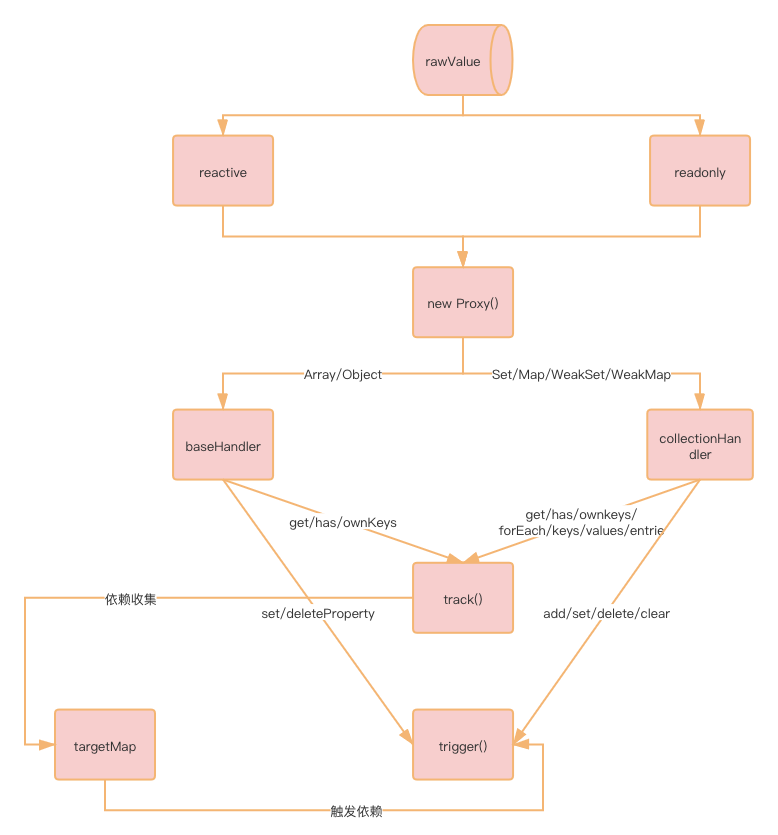

# reactivie package

> This package is inlined into Global & Browser ESM builds of user-facing renderers (e.g. @vue/runtime-dom), but also published as a package that can be used standalone. The standalone build should not be used alongside a pre-bundled build of a user-facing renderer, as they will have different internal storage for reactivity connections. A user-facing renderer should re-export all APIs from this package.

开篇我引用了 `vue` 官方对自己实现的 `reactivie` 包的定义，大概意思是说这个包是内嵌到`vue`的渲染器中`(@vue/runtime-dom)`，但是它也可以单独发布或者被第三方引用，需要注意的是如果你是提供给第三方渲染器使用，其内部可能已经实现了响应机制，可能出现兼容问题。

看完介绍不禁让我想到了 `react` 单独抽离出来的 `scheduler` 调度器，单独分离的包结构可以让我们阅读代码更轻松一些。

## package structure

下方为整个`reactive`的文件结构，忽略掉 `_tests_` 测试文件和一些配置以及说明文件，有意义的代码都在 `src` 和 `index.js` 里面:

```js
.
├── LICENSE
├── README.md
├── __tests__  // 单元测试目录
│   ├── collections
│   │   ├── Map.spec.ts
│   │   ├── Set.spec.ts
│   │   ├── WeakMap.spec.ts
│   │   └── WeakSet.spec.ts
│   ├── computed.spec.ts
│   ├── effect.spec.ts
│   ├── reactive.spec.ts
│   ├── reactiveArray.spec.ts
│   ├── readonly.spec.ts
│   └── ref.spec.ts
├── package.json
├── api-extractor.json
├── index.js
└── src
    ├── baseHandlers.ts 				// 基本类型的处理器
    ├── collectionHandlers.ts  	// Set Map WeakSet WeckMap的处理器
    ├── computed.ts 						// 计算属性，同Vue2
    ├── effect.ts 							// reactive 核心，处理依赖收集，依赖更新
    ├── index.ts
    ├── operations.ts 					// 定义依赖收集，依赖更新的类型
    ├── reactive.ts 						// reactive 入口，内部主要以Proxy实现
    └── ref.ts 									// reactive 的变种方法，Proxy处理不了值类型的响应，Ref来处理
```

## program struct

下面是我阅读之后总结的工作流程图，阅读时建议按照下面的顺序阅读：

1. [/reactivity/reactive](https://vue3js.cn/reactivity/reactive)
2. [/reactivity/baseHandlers](https://vue3js.cn/reactivity/baseHandlers)
3. [/reactivity/effect](https://vue3js.cn/reactivity/effect)
4. [/reactivity/ref](https://vue3js.cn/reactivity/ref)
5. [/reactivity/computed](https://vue3js.cn/reactivity/computed)

`reactive` 的流程图：



