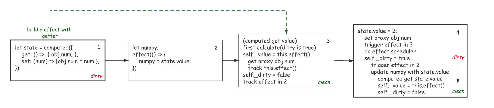

## computed

其实我觉得 `computed` 就是 `effect` 方法和 `ref` 的结合，`effect` 允许传入一个表达式，并且将其视为副作用进行跟踪。而   `ref` 则通过 `value` 属性的拦截器构造一个响应式结构，下面是一个 `computed` 的例子：

```ts
const count = ref(1)
const plusOne = computed({
  get: () => count.value + 1,
  set: (val) => {
    count.value = val - 1
  },
})

plusOne.value = 1
console.log(count.value) // 0
```

`computed`接受一个 `getter` 或者一个 `setter&getterOption` 作为参数返回一个默认不可手动修改的 `ref` 对象，这个入口函数主要做的就是解析出参数中的 `getter` 和 `setter` 然后构造一个 `ComputedRefImpl`：

```ts
export function computed<T>(getter: ComputedGetter<T>): ComputedRef<T>
export function computed<T>(options: WritableComputedOptions<T>): WritableComputedRef<T>
export function computed<T>(getterOrOptions: ComputedGetter<T> | WritableComputedOptions<T>) {
  let getter: ComputedGetter<T>
  let setter: ComputedSetter<T>

  if (isFunction(getterOrOptions)) {
    getter = getterOrOptions
  } else {
    getter = getterOrOptions.get
    setter = getterOrOptions.set
  }

  return new ComputedRefImpl(
    getter,
    setter,
    isFunction(getterOrOptions) || !getterOrOptions.set
  ) as any
}
```

下面是 `Getter` 和 `setter` 的类型定义：

```ts
export type ComputedGetter<T> = (ctx?: any) => T
export type ComputedSetter<T> = (v: T) => void

export interface WritableComputedOptions<T> {
  get: ComputedGetter<T>
  set: ComputedSetter<T>
}
```

最后的返回值也没什么好说的，两个属性在 `ComputedRefImpl` 中都能找到：

```ts
export interface ComputedRef<T = any> extends WritableComputedRef<T> {
  readonly value: T
}

export interface WritableComputedRef<T> extends Ref<T> {
  readonly effect: ReactiveEffect<T>
}
```

### `ComputedRefImpl`

`ComputedRefImpl` 就是 `computed` 的内部实现啦，和 `RefImpl` 类似通过 `_value` 属性缓存值，只不过这个值是由包裹在 `effect` 中的 `getter` 计算而来的。

先来看看属性：

+ `_value`：储存计算值；
+ `_dirty`：完成计算标记位，计算完成为 `false`，有 `reactive` 值改变的时候会变为 `false`；
+ `effect`：缓存延迟执行的 `effect`(`effect`)包裹着我们传入的 `getter` 作为执行函数；
+ `__v_isRef`：`ref` 标志位，表示这个结构是可以解构的，有和 `ref` 相同的特性；
+ `IS_READONLY`：只读标志位，当我们只传递一个 `getter` 参数的时候这个属性为 `true`；

```ts
class ComputedRefImpl<T> {
  private _value!: T
  private _dirty = true

  public readonly effect: ReactiveEffect<T>

  public readonly __v_isRef = true;
  public readonly [ReactiveFlags.IS_READONLY]: boolean
}
```

然后我们先看看 `setter`，发现只是调用了一下传入的 `setter`，这个时候你肯定有疑问，`set` 操作的时候不是应该调用 `trigger` 函数触发引用这个 `computed` 的副作用吗？

> [答：]()这是因为 `setter` 未必导致 `computed`计算值改变，因为 `computed` 是依赖其他响应式对象计算的，只有这些对象改变的时候 `computed` 计算结果才会改变。

```ts
class ComputedRefImpl<T> {
  set value(newValue: T) {
    this._setter(newValue)
  }
}
```



其实 `computed` 的响应式实现还是挺复杂的，如上图是一个比较完整的更新流程：

1. `step1`：构造 `computed state` 内部引用了 `reactive obj`，此时将 `getter` 作为参数构造构造了一个 `effect`，这个 `effect` 有惰性标记不会被立刻执行；
2. `step2`：声明副作用函数 `effect`内部引用 `state.value`这个 `computed ref`；
3. `step3`：`state.value` 触发了 `computed getter`，由下面的代码我们知道第一次执行(`dirty`)会调用 `this.effect`；
   1. `this.effect` 执行之前的 `getter` 参数，并且触发 `obj.num` 的 `getter`，现在 `obj.num track` 了 `this.effect`；
   2. `this.effect` 的计算结果赋值给 `_value` 并且返回，更新 `dirty` 标记位；
   3. 最后 `computed state` 还 `track`  了 `step2` 执行的 `effect`；
4. `step4`：执行一个 `set` 操作，`set`  操作中的 `obj.num=num` 出发了 `obj.num 的 setter` 代理并 `trigger this.effect`;
   1. 由于 `this.effect` 有 `scheduler`，所以不会执行 `getter` 而是会执行 `scheduler`，设置 `dirty` 标记位，并且 `trigger computed deps`；
   2. `computed deps` 包含 `step2` 的 `effect`，重新执行 `numpy = state.value`；
   3. `state.value` 又触发了 `computed getter`，重新计算值，更新脏标记位，这套流程才走完。

现在我们就知道为什么 `trigger` 不发生在 `setter` 里面了，因为只有 `computed` 内部引用的 `reactive` 改变了才应该 `trigger`，但 `computed setter` 内未必对引用的 `reactive` 造成 `setter`。

而引用的 `reactive` 如果触发 `setter`(不管是不是在 `setter`)内，都会触发 `this.effect`，`this.effect` 则会自动触发 `trigger`。

```ts
class ComputedRefImpl<T> {
  constructor(
    getter: ComputedGetter<T>,
    private readonly _setter: ComputedSetter<T>,
    isReadonly: boolean
  ) {
    this.effect = effect(getter, {
      lazy: true,
      scheduler: () => {
        if (!this._dirty) {
          this._dirty = true
          trigger(toRaw(this), TriggerOpTypes.SET, 'value')
        }
      }
    })

    this[ReactiveFlags.IS_READONLY] = isReadonly
  }

  get value() {
    // the computed ref may get wrapped by other proxies e.g. readonly() #3376
    const self = toRaw(this)
    if (self._dirty) {
      self._value = this.effect()
      self._dirty = false
    }
    track(self, TrackOpTypes.GET, 'value')
    return self._value
  }

  set value(newValue: T) {
    this._setter(newValue)
  }
}
```

