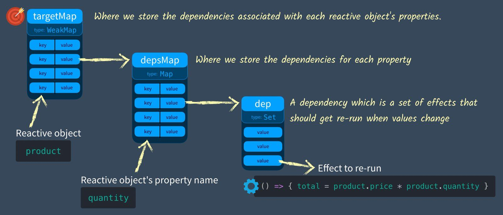
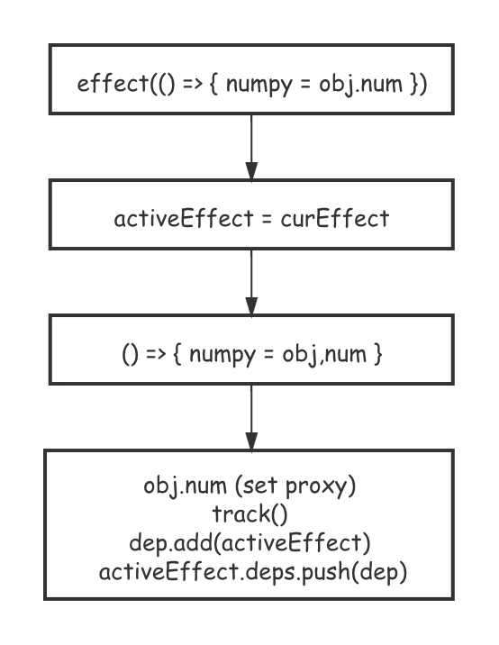
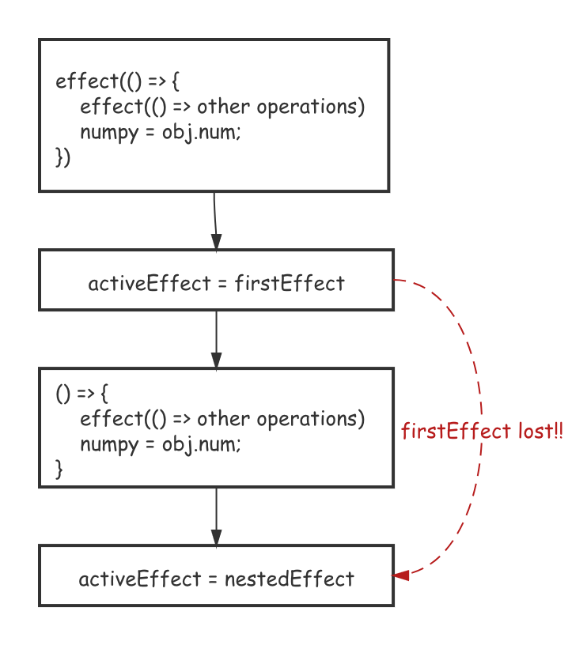
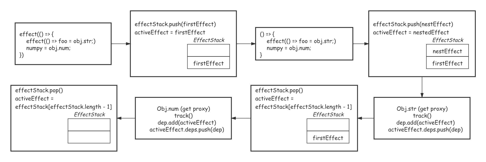

#  Effect

学习 `effect` 源码，先从一个测试用例开始，首先我们构造了一个 `counter` 响应式代理，然后调用了 `effect` 函数传入一个会产生副作用的操作。此时 `effect` 中的函数会自动执行一遍，一是初始化了 `dummy`，二则是在 `counter.num` 的过程中了 `get` 拦截器里的 `track` 操作以跟踪依赖：

```ts
it('should observe basic properties', () => {
  let dummy
  const counter = reactive({ num: 0 })
  effect(() => (dummy = counter.num))

  expect(dummy).toBe(0)
  counter.num = 7
  expect(dummy).toBe(7)
})
```



再来回忆一下之前我们构造的响应式系统的几个概念：

+ `effect`：属性改变带来的副作用函数；
+ `dep`(依赖)：`effect`副作用函数的集合；
+ `depMap`：通过属性 `key` 来映射其对应的依赖；
+ `targetMap`：被代理对象 `target` 到 `depMap` 的集合；

源码中的存储结构大同小异：

```ts
// The main WeakMap that stores {target -> key -> dep} connections.
// Conceptually, it's easier to think of a dependency as a Dep class
// which maintains a Set of subscribers.
type Dep = Set<ReactiveEffect>
type KeyToDepMap = Map<any, Dep>
const targetMap = new WeakMap<any, KeyToDepMap>()

let activeEffect: ReactiveEffect | undefined
```

## Effect

`effect` 函数很简单，内部调用 `createReactiveEffect` 构造一个上面所说的 `ReactiveEffect` 函数结构，如果传入的 `options` 没有 `lazy` 标志位则立刻执行返回的函数结构。

如果传入的 `fn` 本身是一个 `effect` 结构，则解析出其 `raw` 中储存的原函数来构造一个新 `ReactiveEffect`：

```ts
export function effect<T = any>(
  fn: () => T,
  options: ReactiveEffectOptions = EMPTY_OBJ
): ReactiveEffect<T> {
  if (isEffect(fn)) {
    fn = fn.raw
  }
  const effect = createReactiveEffect(fn, options)
  if (!options.lazy) {
    effect()
  }
  return effect
}
```

### `createReactiveEffect`

`createReactiveEffect` 返回的是一个有很多标志位(额外属性)的二加工函数体，属性说明如下：

```ts
export interface ReactiveEffect<T = any> {
  (): T  														// 自身的函数签名；
  _isEffect: true										// ReactiveEffect 标志位，用于 isEffect 检测；
  id: number												// effect 的自增 id(唯一标识)；
  active: boolean										// ?
  raw: () => T											// 传入 effect 的原函数体缓存
  deps: Array<Dep>									// 包含这个 effect 的 dep 指针集，一个 effect 可能同时被多个 dep 包含。
  options: ReactiveEffectOptions		// 选项
  allowRecurse: boolean							// 是否允许递归
}

export function isEffect(fn: any): fn is ReactiveEffect {
  return fn && fn._isEffect === true
}
```

另外还要提及两个全局变量，`uid` 生产 `effect` 的自增 `id` 从 `0` 开始，`activeEffect`

```ts
let uid = 0
let activeEffect: ReactiveEffect | undefined
```

具体来看看 `createReactiveEffect`，先抛开 `reactiveEffect` 的函数体，直接看看后面为 `effect` 添加的属性，属性介绍在代码注释中写了。这里我们要知道这些属性是先被赋值，然后 `effect` 才被执行的。

```ts
function createReactiveEffect<T = any>(
  fn: () => T,
  options: ReactiveEffectOptions
): ReactiveEffect<T> {
  const effect = function reactiveEffect(): unknown {
		// 先忽略
  } as ReactiveEffect
  effect.id = uid++		// 自增 id，从 0 开始；
  effect.allowRecurse = !!options.allowRecurse
  effect._isEffect = true
  effect.active = true
  effect.raw = fn
  effect.deps = []
  effect.options = options
  return effect
}
```

**effectStack**

回过头来分析 `reactiveEffect` 的函数体，这个函数其实还是很复杂的，因为它涉及到两个栈缓存 — `effectStack` 和 `trackEffect`：


为什么要通过 `stack` 的形式缓存 `effect`，这其实和 `effect` 的执行实际有关，如果 `effect` 不是 `nested` 的，那么从 `effect` 被创建到其被记录到某属性的 `dep` 的过程为下图：



流程大概是 `effect` 创建一个` ReactiveEffect` 结构体，然后将其缓存到一个全局变量 `activeEffect` 上。之后执行原函数 `fn`，`fn` 中涉及 `reactive get` 的操作会触发拦截器，`get proxy` 中会将 `activeEffect` 记录到当前属性的 `dep` 上。



如果说 `effect` 不是嵌套的，那这个流程没有任何问题，但是一旦执行的原函数里又执行了一个 `effect` 函数，那么原来记录的 `activeEffect` 就丢失了，所以为了解决嵌套 `effect` 调用的问题，`vue` 采用 `effectStack` 来缓存还没有添加依赖关系的 `effect`。



通过 `effectStack` 改写的执行流程如上图:

```ts
function createReactiveEffect<T = any>(
  fn: () => T,
  options: ReactiveEffectOptions
): ReactiveEffect<T> {
  const effect = function reactiveEffect(): unknown {
    if (!effect.active) {
      // effect.active 这个表示最开始 true，代码走到这里说明我们调用了effect stop 函数；
      // 如果没有调度者，直接返回，否则直接执行fn
      return options.scheduler ? undefined : fn()
    }
    if (!effectStack.includes(effect)) {
      // 如果 effectStack 里面没有这个 effect，说明它是第一次被执行；
      cleanup(effect)
      try {
        enableTracking()
        effectStack.push(effect)
        activeEffect = effect
        return fn()
      } finally {
        effectStack.pop()
        resetTracking()
        activeEffect = effectStack[effectStack.length - 1]
      }
    }
  } as ReactiveEffect
}
```

**trackEffect**

我们可以看到在上面`effect`的执行过程中`fn`前后调用了 `enableTracking` 和 `resetTracking` ，这也就是引出来了 `reactiveEffect`中还有另一个栈 `trackEffect`，这个栈还有三个操作函数，它们是干嘛的？

```ts
let shouldTrack = true
const trackStack: boolean[] = []

export function pauseTracking() {
  trackStack.push(shouldTrack)
  shouldTrack = false
}

export function enableTracking() {
  trackStack.push(shouldTrack)
  shouldTrack = true
}

export function resetTracking() {
  const last = trackStack.pop()
  shouldTrack = last === undefined ? true : last
}
```

为了解释这个问题，我们思考这样一个场景，下面的代码中 `setup` 函数是否会被 `obj.foo` 记录依赖？

```ts
export const Scheduler = defineComponent({
    setup() {
        const obj = reactive({
            foo: 1,
        })
        console.log(obj);
		}
}
```

按理来说应该不会，因为 `setup` 只会执行一次次但是 `track` 判断是否跟踪是依据 `shouldTrack` 标志位，而这个标志位初始是 `true`，也就是说会进行跟踪：

```ts
export function track(target: object, type: TrackOpTypes, key: unknown) {
  if (!shouldTrack || activeEffect === undefined) {
    return
  }
  // 省略一大段代码
  dep.add(activeEffect)
}
```

所以 `vue` 才添加了这个栈来控制上下文的可跟踪性，下面这段代码是 `vue` 执行 `setup` 函数的过程，在调用之前会先进行 `pauseTracking` 停止跟踪，在执行完成之后再解除：

```ts
//..
	// 2. call setup()
  const { setup } = Component
  if (setup) {
    const setupContext = (instance.setupContext =
      setup.length > 1 ? createSetupContext(instance) : null)

    currentInstance = instance
    pauseTracking()
    const setupResult = callWithErrorHandling(
      setup,
      instance,
      ErrorCodes.SETUP_FUNCTION,
      [__DEV__ ? shallowReadonly(instance.props) : instance.props, setupContext]
    )
    resetTracking()
    currentInstance = null
//...
```

### cleanup

`cleanup` 负责在每次 `effect` 执行时重新收集依赖，因为 `effect` 内的实际函数体 `raw` 可能会改变，原先依赖这个 `effect` 的属性 `dep` 可能会变化，所以这里就要先清空之前记录的 `deps` 指向，并且从所有原来记录的 `dep` 中删除这个 `effect`：

```ts
// 每次 effect 运行都会重新收集依赖, deps 是 effect 的依赖数组, 需要全部清空
function cleanup(effect: ReactiveEffect) {
  const { deps } = effect
  if (deps.length) {
    for (let i = 0; i < deps.length; i++) {
      deps[i].delete(effect)
    }
    deps.length = 0
  }
}
```

### `ReactiveEffectOptions`

创建 `effect` 的时候可以传入一个 `option` 属性做配置和调试，每个属性的解释如下：

```ts
export interface ReactiveEffectOptions {
  lazy?: boolean														 // 是否延迟执行 effect
	allowRecurse?: boolean										 // ? 暂时未知
  scheduler?: (job: ReactiveEffect) => void  // ? 暂时未知
  onTrack?: (event: DebuggerEvent) => void	 // track 触发时的回调函数
  onTrigger?: (event: DebuggerEvent) => void // trigger 触发时的回调函数
  onStop?: () => void												 // effect 监听停止时的回调函数
}

export type DebuggerEvent = {
  effect: ReactiveEffect
  target: object
  type: TrackOpTypes | TriggerOpTypes
  key: any
} & DebuggerEventExtraInfo
```

### `stop`

`stop` 函数用于清除某个 `effect` 副作用：

```ts
export function stop(effect: ReactiveEffect) {
  if (effect.active) {
    cleanup(effect)
    if (effect.options.onStop) {
      effect.options.onStop()
    }
    effect.active = false
  }
}
```

## track

`track` 函数本身很简单，你给他一个 `target` 一个 `key`，他帮你把当前的 `activeEffect` 存储到 `target->key->dep`，然后在给你添加一个 `effect -> [dep]` 的反向映射。

这里我们可以看到传递给 `track` 的 `option` 其实没啥用，单纯用来 `debugger` 的文字枚举：

```ts
export function track(target: object, type: TrackOpTypes, key: unknown) {
  if (!shouldTrack || activeEffect === undefined) {
    return
  }
  let depsMap = targetMap.get(target)
  if (!depsMap) {
    targetMap.set(target, (depsMap = new Map()))
  }
  let dep = depsMap.get(key)
  if (!dep) {
    depsMap.set(key, (dep = new Set()))
  }
  if (!dep.has(activeEffect)) {
    dep.add(activeEffect)
    activeEffect.deps.push(dep)
  }
}

// using literal strings instead of numbers so that it's easier to inspect
// debugger events
export const enum TrackOpTypes {
  GET = 'get',
  HAS = 'has',
  ITERATE = 'iterate'
}
```

## trigger

触发依赖会根据传入 `TriggerOpTypes` 的参数来决定 `target`上哪些属性要触发依赖：

+ `TriggerOpTypes.CLEAR`： 对应 `MAP` 等类型的 `clear` 方法，直接收集所有依赖。
+ `key === 'length' && isArray(target)`：改变数组长度属性，收集 `length` 属性以及 `idx >= length` 的所有索引属性的依赖。
+ `key !== void 0`：`void 0` 其实就是 `undefined`，这是 `vue` 为了避免 `undefined` 被当做变量赋值的写法。`key` 不是 `undefined` 说明对 `key` 进行了添加/修改，那就触发那个 `key` 记录的依赖。
+ 剩下的 `ADD/DELETE/SET` 的标志位都对 `MAP_KEY_ITERATE_KEY` 和 `ITERATE_KEY` 这个两个键做了依赖触发，`MAP_KEY_ITERATE_KEY` 对应的是`keys`这个遍历器方法，`ITERATE_KEY`对应的是`forEach/values/keys/entires` 这几个遍历器方法。
  + 由于 `ADD/DELETE` 影响了 `forEach/values/key/entires` 这个几个遍历器方法的结果，所以要触发 `ITERATE_KEY` 和 `MAP_KEY_ITERATE_KEY`对应的依赖。
  + 而 `SET` 则只影响了 `forEach/values/entire`，所以只需要触发 `ITERATE_KEY` 的依赖。

```ts
export const enum TriggerOpTypes {
  SET = 'set',
  ADD = 'add',
  DELETE = 'delete',
  CLEAR = 'clear'
}

export function trigger(
  target: object,
  type: TriggerOpTypes,
  key?: unknown,
  newValue?: unknown,
  oldValue?: unknown,
  oldTarget?: Map<unknown, unknown> | Set<unknown>
) {
  const depsMap = targetMap.get(target)
  if (!depsMap) {
    // never been tracked
    return
  }

  const effects = new Set<ReactiveEffect>()
  const add = (effectsToAdd: Set<ReactiveEffect> | undefined) => {
    if (effectsToAdd) {
      effectsToAdd.forEach(effect => {
        if (effect !== activeEffect || effect.allowRecurse) {
          effects.add(effect)
        }
      })
    }
  }

  if (type === TriggerOpTypes.CLEAR) {
    // collection being cleared
    // trigger all effects for target
    depsMap.forEach(add)
  } else if (key === 'length' && isArray(target)) {
    depsMap.forEach((dep, key) => {
      if (key === 'length' || key >= (newValue as number)) {
        add(dep)
      }
    })
  } else {
    // schedule runs for SET | ADD | DELETE
    if (key !== void 0) {
      add(depsMap.get(key))
    }

    // also run for iteration key on ADD | DELETE | Map.SET
    switch (type) {
      case TriggerOpTypes.ADD:
        if (!isArray(target)) {
          add(depsMap.get(ITERATE_KEY))
          if (isMap(target)) {
            add(depsMap.get(MAP_KEY_ITERATE_KEY))
          }
        } else if (isIntegerKey(key)) {
          // new index added to array -> length changes
          add(depsMap.get('length'))
        }
        break
      case TriggerOpTypes.DELETE:
        if (!isArray(target)) {
          add(depsMap.get(ITERATE_KEY))
          if (isMap(target)) {
            add(depsMap.get(MAP_KEY_ITERATE_KEY))
          }
        }
        break
      case TriggerOpTypes.SET:
        if (isMap(target)) {
          add(depsMap.get(ITERATE_KEY))
        }
        break
    }
  }
	// 依赖执行
}
```

依赖执行部分，先调用 `effect.option` 上的 `onTrigger` 回调做调试，然后如果 `effect` 有 `options.scheduler` 属性说明是 `computed` 计算 构造的响应式，调用 `scheduler` 代替 `effect` 本身。

这个 `scheduler` 在 `computed、watch、watchEffect` 这几个钩子上会被设置，一般是二次封装一下传参时的 `getter`，后面有讲：

```ts
export function trigger(
  target: object,
  type: TriggerOpTypes,
  key?: unknown,
  newValue?: unknown,
  oldValue?: unknown,
  oldTarget?: Map<unknown, unknown> | Set<unknown>
) {
  // 收集依赖
	const run = (effect: ReactiveEffect) => {
    if (__DEV__ && effect.options.onTrigger) {
      effect.options.onTrigger({
        effect,
        target,
        key,
        type,
        newValue,
        oldValue,
        oldTarget
      })
    }
    if (effect.options.scheduler) {
      effect.options.scheduler(effect)
    } else {
      effect()
    }
  }

  effects.forEach(run)
}
```

