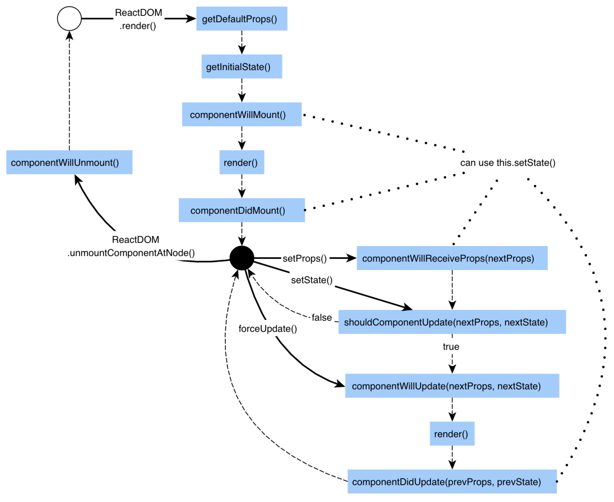
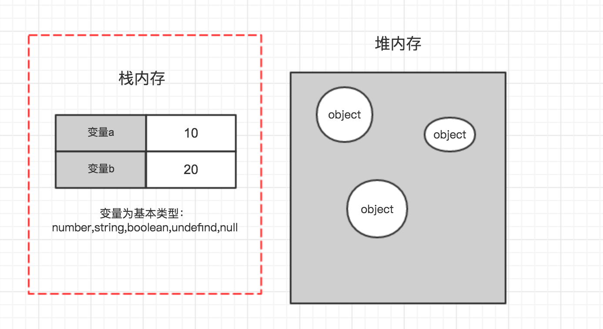
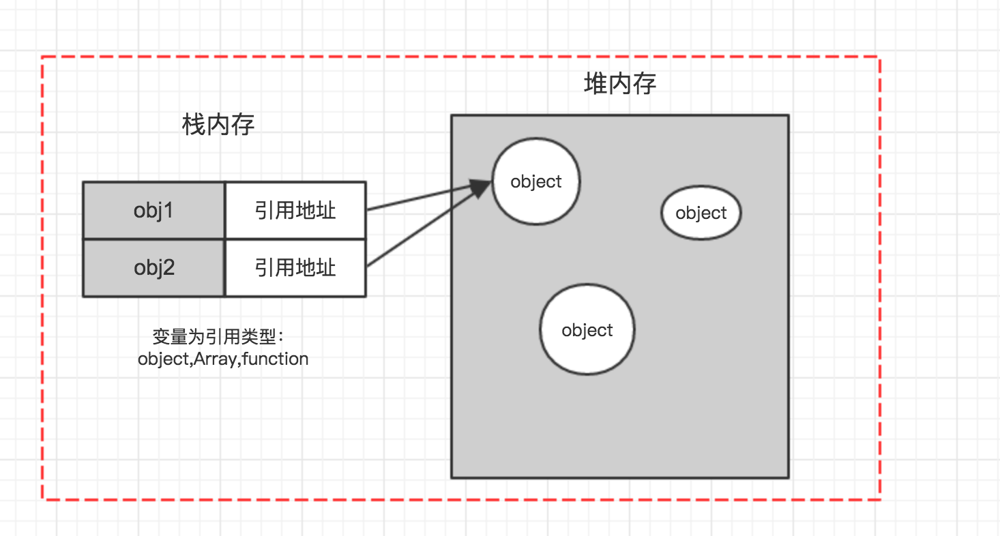

## React v16+ 之前的生命周期函数


#### Initialization

这个生命周期也就是以下代码中类的`构造方法constructor() `，其中`super(props)`用来调用基类的构造方法，也将父组件的`props`注入给子组件，供子组件读取 (组件中props只读不可变，state可变)。

 而`constructor()`用来做一些组件的初始化工作，如初始化`state`，绑定事件处理函数。

```js
import React, { Component } from 'react';

class Test extends Component {
  constructor(props) {
    super(props);
  }
}
```

#### Mounting

**1. componentWillMount**

在组件挂载到`DOM`前调用，且只会被调用一次，因为在这边调用`this.setState`不会引起组件重新渲染，也可以把写在这边的内容提前到`constructor()`中，所以项目中很少用。

**2. render**

根据组件的`props`和`state`（若两者重传递和重赋值，论值是否有变化，都可以引起组件重新`render`） ，`return` 一个React元素（描述组件，即UI），不负责组件实际渲染工作，之后由React自身根据此元素去渲染出页面DOM。

`render`是纯函数`（Pure function：函数的返回结果只依赖于它的参数；函数执行过程里面没有副作用）`，不能在里面执行`this.setState`，会有改变组件状态的副作用。

**3. componentDidMount**

组件挂载到DOM后调用，且只会被调用一次，一般用于发起Ajax请求，并且做一些数据初始化，亦或是设置定时器或订阅事件。

```js
componentDidMount() {
  axios.get("/list").then(res => { this.data = res.data });
}
```

#### updation

在讲述此阶段前需要先明确下`react`组件更新机制。`setState`引起的`state`更新或父组件重新`render`引起的`props`更新，更新后`state和props`相对之前无论是否有变化，都将引起子组件的重新`render`。

**1. componentWillReceiveProps(nextProps)**

父组件`render`方法的调用不能保证重传给当前组件的props是有变化的，所以在此方法中根据`nextProps`和`this.props`来查明重传的`props`是否改变，以及如果改变了要执行啥，比如根据新的`props`调用`this.setState`出发当前组件的重新`render`。

**2. shouldComponentUpdate(nextProps, nextState)**

此方法通过比较`nextProps`，`nextState`及当前组件的`this.props`，`this.state`，返回`true`时当前组件将继续执行更新过程，返回`false`则当前组件更新停止，以此可用来减少组件的不必要渲染，优化组件性能。

```json
shouldComponentUpdate(nextProps, nextState) {
  if (nextProps.content !== this.props.content) {
  	return true;
  } else {
    return false;
  }
}
```

**3.  componentWillUpdate(nextProps, nextState)**

此方法在调用`render`方法前执行，在这边可执行一些组件更新发生前的工作，一般较少用。

**4. render**

render方法在上文讲过，这边只是重新调用。

**5. componentDidUpdate(prevProps, prevState)**

此方法在组件更新后被调用，可以操作组件更新的DOM，`prevProps`和`prevState`两个参数指的是组件更新前的`props`和`state`。我们一般在这个生命周期操作`DOM`，发起`AJAX`请求。

#### Uninstall

**1. componentWillUnmount**

此方法在组件被卸载前调用，可以在这里执行一些清理工作，比如清楚组件中使用的定时器，清除`componentDidMount`中手动创建的DOM元素等，以避免引起内存泄漏。

```jsx
componentWillUnmount() {
  if (this.state.frameId) {
    cancelAnimationFrame(this.state.frameId);
  }
}
```

## React v16+ 之后的生命周期函数


React 在 16+ 版本经历了重大的生命周期函数的更新，取消了`componentWillMount`, `componentWillReceiveProps`和`componentWillUpdate`。增加了两个新函数，为`getDerivedStateFromProps`和`getSnapshotBeforeUpdate`。

可以看到曾经在 `Mounting` 和 `Updating` 阶段名字中有 `Wil`l 的函数都被取消了。究其原因则是 `Fiber` 架构的改变，在 `React 16` 中，某些生命周期可能会被调用多次，这是因为在 `Fiber` 架构下的 `reconciler` 阶段会被调用多次。即包括 `willxxx` 的生命周期都包括。

从语义角度讲，这样重复调用的行为是不符合 `willxxx` 函数的语义，为什么明明已经 `will` 过了又再次 `will` 呢？从安全角度讲，在 `componentWillMount` 函数中，开发者经常初始化状态、操作 `DOM`。如果在重复调用中高频率的操作 `DOM` 导致的页面重绘就会造成性能问题。

#### getDerivedStateFromProps 解决的问题

和其他生命周期不同，此函数是一个静态函数，这也就意味着其不能操作 DOM，不能访问此组件的方法、属性、状态。在文档中，也解释的很清楚：你应该少量谨慎的使用此函数，其只有一个目的，**便是根据属性改变的结果去更新组件的内部状态**。

```jsx
class App extends React.Component {
  constructor() {
    super()
    this.state = {
      m: 0
    }
  }

  static getDerivedStateFromProps(nextProps, prevState) {
    console.log("getDerived", nextProps, prevState);
    if (nextProps.n !== prevState.m) {
      // 这里 return 的对象相当于 setState 了
      return {
        m: nextProps.n
      }
    }

    return null
  }
  
  render() {
    return (
      <div>{m}</div>     
    )
  }
}
```

**注意：** **getDerivedStateFromProps** 前面要加上 static 保留字，声明为静态方法，不然会被react忽略掉


#### getSnapshotBeforeUpdate

`getSnapshotBeforeUpdate` 被调用于`render`之后，可以读取但无法使用`DOM`的时候。它使您的组件可以在可能更改之前从`DOM`捕获一些信息（例如滚动位置）。此生命周期返回的任何值都将作为参数传递给`componentDidUpdate`。

```js
class ScrollingList extends React.Component {
  constructor(props) {
    super(props);
    this.listRef = React.createRef();
  }

  getSnapshotBeforeUpdate(prevProps, prevState) {
    //我们是否要添加新的 items 到列表?
    // 捕捉滚动位置，以便我们可以稍后调整滚动.
    if (prevProps.list.length < this.props.list.length) {
      const list = this.listRef.current;
      return list.scrollHeight - list.scrollTop;
    }
    return null;
  }

  componentDidUpdate(prevProps, prevState, snapshot) {
    //如果我们有snapshot值, 我们已经添加了 新的items.
    // 调整滚动以至于这些新的items 不会将旧items推出视图。
    // (这边的snapshot是 getSnapshotBeforeUpdate方法的返回值)
    if (snapshot !== null) {
      const list = this.listRef.current;
      list.scrollTop = list.scrollHeight - snapshot;
    }
  }

  render() {
    return (
      <div ref={this.listRef}>{/* ...contents... */}</div>
    );
  }
}
```

## `shouldComponentUpdate` 优化

在以这个为主题讨论之前我们首先要知道`react`组件重新渲染的规则：前后改变或者不改变`state`值的`setState`和无数据交换的父组件的重渲染（比如从父父组件接受的props发生变化时）都会导致组件的重渲染。



而在`shouldComponentUpdate`这道两者必经的关口你可以阻止这种浪费性能的行为。

## 比较规则

`shouldComponentUpdate`接收两个参数`nextProps`, `nextState`，这两参数即组件更新之前的`state/props`状态，理论上判断两者的异同就可以做到对

```js
shouldComponentUpdate(nextProps, nextState) {
  // compare nextProps and this.props
  // compare nextState and this.state
  return true // or false
}
```

#### 基本类型

对于`number,string,boolean,undefined,null`这些基本类型变量，值存在栈中：



值本身是不可变的，所以我们判断的时候直接进行比较即可：

```js
shouldComponentUpdate(nextProps, nextState) {
  if (nextProps.content !== this.props.content) {
  	return true;
  } else {
    return false;
  }
}
```

#### 引用类型

对于`object`,` Array`, `function` 这些引用类型变量，引用存在栈中，而不同的引用却可以指向堆内存中的同一个对象：



所以说如果我们比较的是对象的属性，那一定要注意，两个引用其实指向的是同一个对象：

```js
shouldComponentUpdate(nextProps, nextState) {
  if (nextProps.numberObject.number==this.props.numberObject.number) {
  	return false;		// always false
  } else {
    return true;
  }
}
```

为了取到不同的对象，我们有三种解决方案：

- 对象使用`ES6`的扩展语法`Object.assign()`，数组使用`Array.prototype.slice`/`...运算符`进行复制。
- 深拷贝/浅拷贝或利用`JSON.parse(JSON.stringify(data))`
- `immutable.js` (`react`官方推荐使用的第三方库，目前`github`上`20K star`,足见其火热)
- 继承`react`的`PureComponent`组件

下面我们主要介绍第一个和第二个，`Object.assign()`的方法就是说在更新`state`的时候先对对象属性进行拷贝赋值创建一个副本并且更新，这也是`redux`里我们遵循的方式：

```js
export default (state = defaultState, action) => {
    switch (action.type) {
        case actionType.CHANGE_INPUT_VALUE:
            return Object.assign({}, state, {
                thing: action.value,
            });
        case actionType.CLEAR_TODO_LIST:
            return Object.assign({}, state, {
                intended: [],
                completed: [],
            });
        case actionType.ADD_TODO_ITEM:
            let thing = state.thing ? state.thing : "no thing is everything";
            return Object.assign({}, state, {
                intended: [...state.intended, thing],
            });
        case actionType.FINISH_TODO_ITEM:
            return Object.assign({}, state, {
                completed: [...state.completed, state.intended[action.index]],
                intended: [
                    ...state.intended.slice(0, action.index),
                    ...state.intended.slice(action.index + 1),
                ],
            });
        default:
            return state;
    }
};
```

第二种就是深拷贝或者浅拷贝的形式，不推荐通过 `json.Stringify` 实现的深拷贝有损性能：

```js
shouldComponentUpdate(nextProps, nextState) {
  return (
    !isObjEqual(nextProps, this.props) || !isObjEqual(nextState, this.state)
  );
}

function isObjEqual(preObj, obj) {
  return JSON.stringify(preObj) === JSON.stringify(obj);
}
```

这里我们使用的`JSON.stringify`使用一定弊端的：

1.如果`obj`里面有时间对象，则`JSON.stringify`后再`JSON.parse`的结果，时间将只是字符串的形式，而不是对象的形式

```jsx
var test = {
    name: 'a',
    date: [new Date(1536627600000), new Date(1540047600000)],
  };

let b;
b = JSON.parse(JSON.stringify(test))；
```

2.如果obj里有`RegExp(正则表达式的缩写)`、`Error对象`、`File对象`，则序列化的结果将只得到空对象；

```jsx
const test = {
  name: 'a',
  date: new RegExp('\\w+'),
};
// debugger
const copyed = JSON.parse(JSON.stringify(test));
test.name = 'test'
//console.error('ddd', test, copyed)；
console.log(copyed);
```

3、如果`obj`里有函数，`undefined`，则序列化的结果会把函数或 `undefined`丢失；

```jsx
const test = {
  name: 'a',
  date: function hehe() {
    console.log('fff')
  },
};
// debugger
const copyed = JSON.parse(JSON.stringify(test));
test.name = 'test'
console.error('ddd', test, copyed);
```

4、如果`obj`里有`NaN、Infinity和-Infinity`，则序列化的结果会变成`null`。

5、`JSON.stringify()`只能序列化对象的可枚举的自有属性，例如 如果obj中的对象是有构造函数生成的， 则使用`JSON.parse(JSON.stringify(obj))`深拷贝后，会丢弃对象的`constructor`；

```jsx
eg:
function Person(name) {
    this.name = name;
    console.log(name)
  }

  const liai = new Person('liai');

  const test = {
    name: 'a',
    date: liai,
  };
  // debugger
  const copyed = JSON.parse(JSON.stringify(test));
  test.name = 'test'
  console.error('ddd', test, copyed)
```

6、如果对象中存在循环引用的情况也无法正确实现深拷贝；

