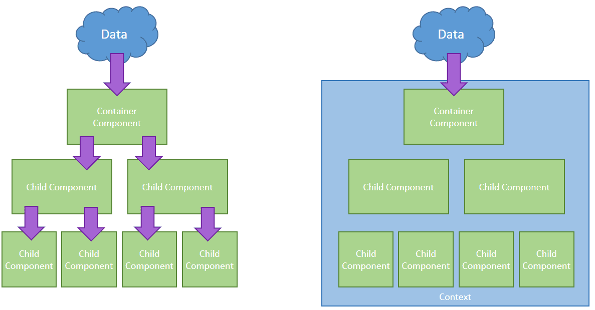

# Context

`Context` 提供了一个无需为每层组件手动添加 `props`，就能在组件树间进行数据传递的方法。在一个典型的 `React` 应用中，数据是通过 `props` 属性自上而下（由父及子）进行传递的，但这种做法对于某些类型的属性而言是极其繁琐的（例如：地区偏好，`UI` 主题），这些属性是应用程序中许多组件都需要的。

 

`Context` 提供了一种在组件之间共享此类值的方式，而不必显式地通过组件树的逐层传递 `props`。

#### 使用场景

`Context` 设计目的是为了共享那些对于一个组件树而言是“全局”的数据，例如当前认证的用户、主题或首选语言。

```jsx
class App extends React.Component {
  render() {
    return <Toolbar theme="dark" />;
  }
}

function Toolbar(props) {

  return (    
    <div>
      <ThemedButton theme={props.theme} />
    </div>  );
}

class ThemedButton extends React.Component {
  render() {
    return <Button theme={this.props.theme} />;
  }
}
```

使用 `context`, 我们可以避免通过中间元素传递 `props`：

```jsx
// Context 可以让我们无须明确地传遍每一个组件，就能将值深入传递进组件树。
// 为当前的 theme 创建一个 context（“light”为默认值）。
const ThemeContext = React.createContext('light');
class App extends React.Component {
  render() {
    // 使用一个 Provider 来将当前的 theme 传递给以下的组件树。
    // 无论多深，任何组件都能读取这个值。
    // 在这个例子中，我们将 “dark” 作为当前的值传递下去。
    return (
      <ThemeContext.Provider value="dark">
        <Toolbar />
      </ThemeContext.Provider>
    );
  }
}

class ThemedButton extends React.Component {
  static contextType = ThemeContext;
  render() {
    return <Button theme={this.context} />;
  }
}
```

#### React.createContext

创建一个 Context 对象。当 React 渲染一个订阅了这个 Context 对象的组件，这个组件会从组件树中离自身最近的那个匹配的 `Provider` 中读取到当前的 context 值。

```tsx
function createContext<T>(defaultValue: T): Context<T>;
```

**只有**当组件所处的树中没有匹配到 Provider 时，其 `defaultValue` 参数才会生效。这有助于在不使用 Provider 包装组件的情况下对组件进行测试。注意：将 `undefined` 传递给 Provider 的 value 时，消费组件的 `defaultValue` 不会生效。

```tsx
interface ITabsContext {
    index?: number;
}

export const TabsContext = createContext<ITabsContext>({ index: 0 });
```

#### Context.Provider

每个 `Context` 对象都会返回一个 `Provider React` 组件，它允许消费组件订阅 `context` 的变化。

```tsx
<MyContext.Provider value={/* T */}>
```

`Provider` 接收一个 `value` 属性，传递给消费组件。一个 `Provider` 可以和多个消费组件有对应关系。多个 `Provider` 也可以嵌套使用，里层的会覆盖外层的数据。

通过新旧值检测来确定变化，使用了与 [`Object.is`](https://developer.mozilla.org/en-US/docs/Web/JavaScript/Reference/Global_Objects/Object/is#Description) 相同的算法。

#### Context.Consumer

一个 React 组件可以订阅 context 的变更，这让你在[函数式组件](https://zh-hans.reactjs.org/docs/components-and-props.html#function-and-class-components)中可以订阅 context。

```tsx
<MyContext.Consumer>
  {value => /* 基于 context 值进行渲染*/}
</MyContext.Consumer>
```

这种方法需要一个[函数作为子元素（function as a child）](https://zh-hans.reactjs.org/docs/render-props.html#using-props-other-than-render)。这个函数接收当前的 context 值，并返回一个 React 节点。传递给函数的 `value` 值等价于组件树上方离这个 context 最近的 Provider 提供的 `value` 值。如果没有对应的 Provider，`value` 参数等同于传递给 `createContext()` 的 `defaultValue`。

#### Context.displayName

context 对象接受一个名为 `displayName` 的 property，类型为字符串。React DevTools 使用该字符串来确定 context 要显示的内容。

示例，下述组件在 DevTools 中将显示为 MyDisplayName：

```tsx
const MyContext = React.createContext(/* some value */);
MyContext.displayName = 'MyDisplayName';
<MyContext.Provider> // "MyDisplayName.Provider" 在 DevTools 中
<MyContext.Consumer> // "MyDisplayName.Consumer" 在 DevTools 中
```

## 栗子🌰

创建一个 `context` 的提供者：

```tsx
interface ITabsContext {
    index?: number;
    type?: TabsTypes;
    onSelect?: SelectCallback;
}

export const TabsContext = createContext<ITabsContext>({ index: 0 });
const Tabs: React.FC<TabsProps> = ({
    defaultIdx,
    style,
    className,
    type,
    children,
    onSelect,
}) => {
    const [curActive, setActive] = useState(defaultIdx);
    const handleSelect = (index: number) => {
        setActive(index);
        if (onSelect) onSelect(index);
    };

    const passedContext: ITabsContext = {
        index: curActive ? curActive : 0,
        type: type,
        onSelect: handleSelect,
    };

    return (
        <div className={classes} style={style} data-testid='test-tabs'>
            <TabsContext.Provider value={passedContext}>
                <div className='tabs-nav'>{renderNav()}</div>
                <div className='tabs-content'>{renderContent()}</div>
            </TabsContext.Provider>
        </div>
    );
};
```

使用 `context`：

```tsx
const TabsItem: React.FC<TabsItemProps> = ({
    index,
    disabled,
    className,
    style,
    children,
}) => {
    const context = useContext(TabsContext);

    const classes = classNames('tabs-item', className, {
        'is-disabled': disabled,
        'is-active': index === context.index,
    });

    const handleClick = () => {
        if (!disabled && context.onSelect && typeof index === 'number') {
            context.onSelect(index);
        }
    };

    return (
        <div className={classes} onClick={handleClick} style={style}>
            {children}
        </div>
    );
};
```

## 消费多个 Context

确保 `context` 快速进行重渲染，`React` 需要使每一个 `consumers` 组件的 `context` 在组件树中成为一个单独的节点。

```tsx
// Theme context，默认的 theme 是 “light” 值
const ThemeContext = React.createContext('light');

// 用户登录 context
const UserContext = React.createContext({
  name: 'Guest',
});

class App extends React.Component {
  render() {
    const {signedInUser, theme} = this.props;

    // 提供初始 context 值的 App 组件
    return (
      <ThemeContext.Provider value={theme}>
        <UserContext.Provider value={signedInUser}>
          <Layout />
        </UserContext.Provider>
      </ThemeContext.Provider>
    );
  }
}

function Layout() {
  return (
    <div>
      <Sidebar />
      <Content />
    </div>
  );
}

// 一个组件可能会消费多个 context
function Content() {
  return (
    <ThemeContext.Consumer>
      {theme => (
        <UserContext.Consumer>
          {user => (
            <ProfilePage user={user} theme={theme} />
          )}
        </UserContext.Consumer>
      )}
    </ThemeContext.Consumer>
  );
}
```

如果两个或者更多的 `context` 值经常被一起使用，那你可能要考虑一下另外创建你自己的渲染组件，以提供这些值。

