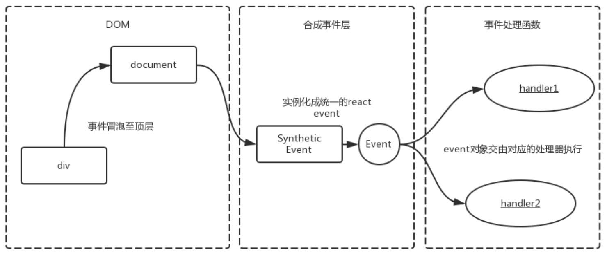

## 事件委托

了解 `react` 的合成事件机制之前我们还需要知道一个概念就是事件委托。

事件委托——这个概念依赖于这样一个事实,如果你想要在大量子元素中单击任何一个都可以运行一段代码，您可以将事件监听器设置在其父节点上，并让子节点上发生的事件冒泡到父节点上，而不是每个子节点单独设置事件监听器。避免在过多的子元素上注册事件可以有效的减小内存消耗。

一个很好的例子是一系列列表项，如果你想让每个列表项被点击时弹出一条信息，您可以将`click`单击事件监听器设置在父元素`<ul>`上，这样事件就会从列表项冒泡到其父元素`<ul>`上。

## SyntheticEvent

`React` 自己实现了这么一套事件机制，它在 `DOM` 事件体系基础上做了改进，减少了内存的消耗，并且最大程度上解决了 `IE` 等浏览器的不兼容问题

+ `React` 上注册的事件最终会绑定在`document`这个 DOM 上，而不是 React 组件对应的 DOM(减少内存开销就是因为所有的事件都绑定在 document 上，其他节点没有绑定事件)。
+ `React` 自身实现了一套事件冒泡机制，所以这也就是为什么我们 `event.stopPropagation()` 无效的原因。
+ `React` 通过队列的形式，从触发的组件向父组件回溯，然后调用他们 JSX 中定义的 callback
+ `React` 有一套自己的合成事件 `SyntheticEvent`。
+ `React` 通过对象池的形式管理合成事件对象的创建和销毁，减少了垃圾的生成和新对象内存的分配，提高了性能。

当我们将事件代码写在 `jsx` 的标签语法里时就相当创建了一个合成事件：

```jsx
class Button extends React.Component {
		handleClick(e: React.MouseEvent) {}
    render() { 
      return <button onClick={this.handleClick}>click</button>; 
    }
}
```

当然我们也可以使用 `dom` 语法创建非合成事件：

```jsx
document.addEventListener('mousedown', function (e) {
  console.log(e.type);
});
```

#### 架构分析

我们在 `ReactBrowserEventEmitter.js` 文件中可以看到，React 合成系统框架图：

```js
/**
 * React和事件系统概述:
 *
 * +------------+    .
 * |    DOM     |    .
 * +------------+    .
 *       |           .
 *       v           .
 * +------------+    .
 * | ReactEvent |    .
 * |  Listener  |    .
 * +------------+    .                         +-----------+
 *       |           .               +--------+|SimpleEvent|
 *       |           .               |         |Plugin     |
 * +-----|------+    .               v         +-----------+
 * |     |      |    .    +--------------+                    +------------+
 * |     +-----------.--->|EventPluginHub|                    |    Event   |
 * |            |    .    |              |     +-----------+  | Propagators|
 * | ReactEvent |    .    |              |     |TapEvent   |  |------------|
 * |  Emitter   |    .    |              |<---+|Plugin     |  |other plugin|
 * |            |    .    |              |     +-----------+  |  utilities |
 * |     +-----------.--->|              |                    +------------+
 * |     |      |    .    +--------------+
 * +-----|------+    .                ^        +-----------+
 *       |           .                |        |Enter/Leave|
 *       +           .                +-------+|Plugin     |
 * +-------------+   .                         +-----------+
 * | application |   .
 * |-------------|   .
 * |             |   .
 * |             |   .
 * +-------------+   .
 *                   .
 */
```

其中 `ReactEventListener `加上 `ReactEventEmitter` 加上`EventPluginHub` 合起来就可以看作是 `react` 合成事件的 `Dispatcher` 派发器，`react`  合成事件在 `dom` 上触发注册的合成事件，而在用户的代码层注册合成事件。整体是一个发布订阅模式。



#### 事件委托

上面说了`React` 上注册的事件最终会绑定在`document`这个 `DOM` 上，而不是 `React` 组件对应的 `DOM`(减少内存开销就是因为所有的事件都绑定在 `document` 上，其他节点没有绑定事件)。

```tsx
handleClick(e: React.MouseEvent) {
  console.log(e.target); 										// <button>
  console.log(e.currentTarget);							// <button>
  console.log(e.nativeEvent.target);				// <button>
  console.log(e.nativeEvent.currentTarget);	// document
}
```

这一点我们可以通过上面的代码验证，可以看到合成事件层虽然伪造了注册节点，但是在 `native` 原生事件中事件其实还是通过事件委托注册在 `document` 上的。

#### 合成事件结构

合成事件的结构基本和原生的 `Event` 是一致的，只是伪装了 `currentTarget` 并且添加了一个 `nativeEvent` 指向原生事件。

```tsx
interface BaseSyntheticEvent<E = object, C = any, T = any> {
  nativeEvent: E;
  currentTarget: C;
  target: T;
  bubbles: boolean;
  cancelable: boolean;
  defaultPrevented: boolean;
  eventPhase: number;
  isTrusted: boolean;
  preventDefault(): void;
  isDefaultPrevented(): boolean;
  stopPropagation(): void;
  isPropagationStopped(): boolean;
  persist(): void;
  timeStamp: number;
  type: string;
}
```

#### 支持的事件

`React` 通过将事件 `normalize` 以让他们在不同浏览器中拥有一致的属性。

以下的事件处理函数在冒泡阶段被触发。如需注册捕获阶段的事件处理函数，则应为事件名添加 `Capture`。例如，处理捕获阶段的点击事件请使用 `onClickCapture`，而不是 `onClick`。

+ [Clipboard Events](https://zh-hans.reactjs.org/docs/events.html#clipboard-events)
+ [Composition Events](https://zh-hans.reactjs.org/docs/events.html#composition-events)
+ [Keyboard Events](https://zh-hans.reactjs.org/docs/events.html#keyboard-events)
+ [Focus Events](https://zh-hans.reactjs.org/docs/events.html#focus-events)
+ [Form Events](https://zh-hans.reactjs.org/docs/events.html#form-events)
+ [Generic Events](https://zh-hans.reactjs.org/docs/events.html#generic-events)
+ [Mouse Events](https://zh-hans.reactjs.org/docs/events.html#mouse-events)
+ [Pointer Events](https://zh-hans.reactjs.org/docs/events.html#pointer-events)
+ [Selection Events](https://zh-hans.reactjs.org/docs/events.html#selection-events)
+ [Touch Events](https://zh-hans.reactjs.org/docs/events.html#touch-events)
+ [UI Events](https://zh-hans.reactjs.org/docs/events.html#ui-events)
+ [Wheel Events](https://zh-hans.reactjs.org/docs/events.html#wheel-events)
+ [Media Events](https://zh-hans.reactjs.org/docs/events.html#media-events)
+ [Image Events](https://zh-hans.reactjs.org/docs/events.html#image-events)
+ [Animation Events](https://zh-hans.reactjs.org/docs/events.html#animation-events)
+ [Transition Events](https://zh-hans.reactjs.org/docs/events.html#transition-events)
+ [Other Events](https://zh-hans.reactjs.org/docs/events.html#other-events)

