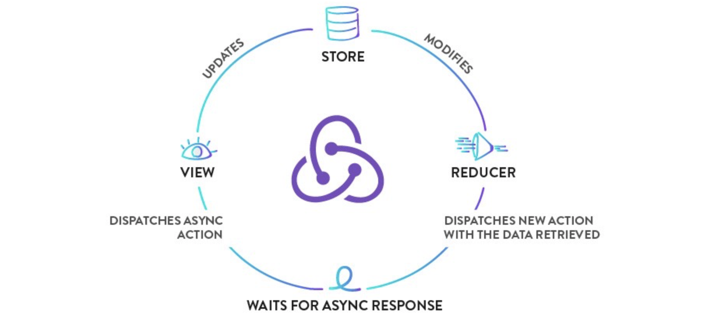

# 异步数据

之前介绍的`redux`状态管理都是关于同步数据的，我们通过用户的操作和输入来更新`state`，接下来我们看看`redux`如何处理异步数据。



## 异步 Action

当调用异步 API 时，有两个非常关键的时刻：发起请求的时刻，和接收到响应的时刻（也可能是超时）。

这两个时刻都可能会更改应用的 `state`；为此，你需要 `dispatch` 普通的同步` action`。一般情况下，每个` API `请求都需要` dispatch` 至少三种` action`：

- **一种通知 reducer 请求开始的 action。**

  对于这种 action，reducer 可能会切换一下 state 中的 `isFetching` 标记。以此来告诉 UI 来显示加载界面。

- **一种通知 reducer 请求成功的 action。**

  对于这种 action，reducer 可能会把接收到的新数据合并到 state 中，并重置 `isFetching`。UI 则会隐藏加载界面，并显示接收到的数据。

- **一种通知 reducer 请求失败的 action。**

  对于这种 action，reducer 可能会重置 `isFetching`。另外，有些 reducer 会保存这些失败信息，并在 UI 里显示出来。

为了区分这三种 action，可能在 action 里添加一个专门的 `status` 字段作为标记位：

```js
{ type: 'FETCH_POSTS', status: 'pending'}
{ type: 'FETCH_POSTS', status: 'error', error: 'Oops' }
{ type: 'FETCH_POSTS', status: 'success', response: { ... } 
```

> **注意：**这种 action 的约定是不受限制的它取决于开发团队的风格。

## 同步 Action 函数

目前我们的`Action`函数只能返回一个对象，所以只能是同步的`Action`函数。下面先给异步 API 响应的数据定义几个同步的 action 类型 和 action 创建函数。

当需要获取指定 uid 的 todo_list 的时候，需要 dispatch `REQUEST_TODO_LIST` action，这个时候UI可能会显示为加载中。

```js
export const REQUEST_TODO_LIST = 'request_todo_list'

export function requestTodoList(uid) {
  return {
    type: REQUEST_TODO_LIST,
    uid
  }
}
```

最后，当收到请求响应时，我们会 dispatch `RECEIVE_TODO_LIST`：

```js
export const RECEIVE_TODO_LIST = 'RECEIVE_TODO_LIST'

export function receiveTodoList(uid, list) {
  return {
    type: RECEIVE_TODO_LIST,
    uid,
    list,
    receivedAt: Date.now()
  }
}
```

#### 设计 state 结构

在写异步代码的时候，需要考虑更多的 state，所以我们要仔细考虑一下。

```json
{
  uid: 1,
 	todoList: {
    isFetching: true,
    intended: [],
    completed: []
  }
}
```

#### 编写 Reducer 函数

`reducer` 里对应两个 `action` 有两种处理方式也决定了 `ui` 的渲染方式。

```js
export default (state = defaultState, action) => {
    switch (action.type) {
	      case actionType.REQUEST_TODO_LIST:
            return Object.assign({}, state, {
              	uid: saction.uid,
                todoList: {
                  isFetching: true,
                }
            });
        case actionType.RECEIVE_TODO_LIST:
            return Object.assign({}, state, {
                todoList: action.list
            });
        default:
            return state;
    }
};
```

#### 发起异步请求

最后我们要在页面里发起异步请求：

```js
class Todo extends React.Component {
	constructor(props) {
    super(props)
    this.state = store.getState()
    this.handleStoreChange = this.handleStoreChange.bind(this)
    store.subscribe(this.handleStoreChange)
  }
  handleStoreChange() {
    this.setState(store.getState())
  }
  ComponentDidMount() {
    let uid = this.state.uid
    let action = requestTodoList(uid)
    store.dispatch(action)
    axios.get("/list").then((res)=> {
      action = receiveTodoList(uid, res.data)
      store.dispatch(action)
    })
  }
}
```

## 异步 Action 函数

为什么我们要设计异步的 `Action` 函数，因为如果我们不能把拉取数据的逻辑从组件中抽离出来，那么组件的逻辑会很难复用，这种数据请求的操作最好还是放在数据层，不要放在组件逻辑里：

#### Middleware

**Redux middleware 提供的是位于 action 被发起之后，到达 reducer 之前的扩展点。**


#### redux-thunk

上面代码中我们的数据和页面是耦合的，这样的代码结构不够公整，想要将数据请求抽离出来放到 `action` 中需要通过使用指定的 `middleware`，这样 `action` 创建函数除了返回 `action` 对象外还可以返回函数。这时，这个 `action` 创建函数就成为了 `thunk`。

```js
import { createStore, applyMiddleware, compose } from "redux";
import reducer from "./reducer";
import thunkMiddleware from "redux-thunk";

const composeEnhancers = window.__REDUX_DEVTOOLS_EXTENSION_COMPOSE__
    ? window.__REDUX_DEVTOOLS_EXTENSION_COMPOSE__
    : compose;

const enhancer = composeEnhancers(applyMiddleware(thunkMiddleware));

const store = createStore(reducer, enhancer);

export default store;
```

添加`redux-thunk`，当 `action` 创建函数返回函数时，这个函数会被 `Thunk middleware` 执行。这个函数并不需要保持纯净；它还可以带有副作用，包括执行异步 `API` 请求。这个函数还可以 `dispatch action`，就像 `dispatch` 前面定义的同步 `action` 一样。

```js
export function fetchTodoList(uid) {

  // Thunk middleware 知道如何处理函数。
  // 这里把 dispatch 方法通过参数的形式传给函数，
  // 以此来让它自己也能 dispatch action。

  return function (dispatch) {

    // 首次 dispatch：更新应用的 state 来通知
    // API 请求发起了。

    dispatch(requestTodoList(uid))

    // thunk middleware 调用的函数可以有返回值，
    // 它会被当作 dispatch 方法的返回值传递。

    // 这个案例中，我们返回一个等待处理的 promise。
    // 这并不是 redux middleware 所必须的，但这对于我们而言很方便。

    return fetch(`http://127.0.0.1:3000/list`)
      .then(
        response => receiveTodoList(uid, response.json()),
        // 不要使用 catch，因为会捕获在 dispatch 和渲染中出现的任何错误，
        // 导致 'Unexpected batch number' 错误。
        error => console.log('An error occurred.', error)
      )
  }
}
```

这样我们页面中的 dispatch 就可以改成这样：

```js
class Todo extends React.Component {
  ComponentDidMount() {
    let uid = this.state.uid
    let action = fetchTodoList(uid)
    store.dispatch(action)
  }
}
```


