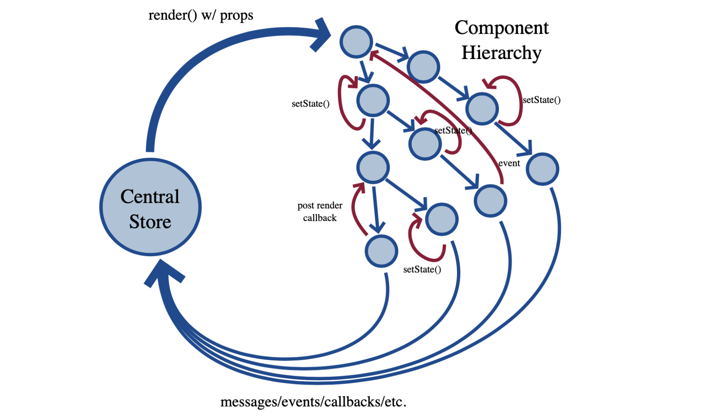
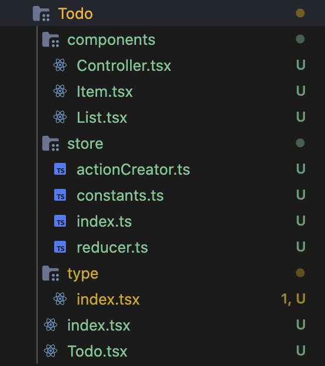

## Why React-redux？

这里需要再强调一下：`Redux` 和` React` 之间没有关系。`Redux`支持 `React、Angular、Ember、jQuery` 甚至纯 `JavaScript`，`react-redux`简化了数据的从上向下层层传递的数据流，而是将UI组件直接和容器组件建立联系。



## React-redux

Redux 的 React 绑定库是基于 [容器组件和展示组件相分离](https://medium.com/@dan_abramov/smart-and-dumb-components-7ca2f9a7c7d0) 的开发思想。

如果一个组件既有 UI 又有业务逻辑，那怎么办？回答是，将它拆分成下面的结构：外面是一个容器组件，里面包了一个UI 组件。前者负责与外部的通信，将数据传给后者，由后者渲染出视图。

|                | UI 组件                | 容器组件                  |
| :------------- | :----------------------- | :------------------------ |
|           作用 | 只负责 UI 的呈现，不带有任何业务逻辑 | 描述如何运行（数据获取、状态更新） |
| 直接使用 Redux | 否                         | 是                                 |
|       数据来源 | props，没有状态（即不使用`this.state`这个变量） | 监听 Redux state                   |
|       数据修改 | 从 props 调用回调函数      | 向 Redux 派发 actions              |
|       调用方式 | 手动                       | 通常由 React Redux 生成            |

技术上讲你可以直接使用 `store.subscribe()` 来编写容器组件。但不建议这么做的原因是无法使用 React Redux 带来的性能优化。也因此，不要手写容器组件，而使用 React Redux 的 `connect()` 方法来生成，后面会详细介绍。

#### 安装

React Redux 依赖 **React 0.14 或更新版本。**

```shell
npm install --save react-redux
```

使用`  typescript`进行开发时还需要额外安装他的类型声明包：

```shell
npm i --save-dev @types/react-redux
```

#### 项目结构

使用 `react-redux` 之后的组件结构一般如下图所示，首先是一个子组件目录，之后是正常的 `store` 而最后的 `Todo.tsx` 一般作为 `UI` 组件，`index.tsx`做为容器组件。



## `connect()`

React-Redux 提供`connect`方法，用于从 UI 组件生成容器组件。`connect`的意思，就是将这两种组件连起来。

```jsx
import { connect } from 'react-redux'
const VisibleTodoList = connect()(TodoList);
```

上面代码中，`TodoList`是 UI 组件，`VisibleTodoList`就是由 React-Redux 通过`connect`方法自动生成的容器组件。

但是，因为没有定义业务逻辑，上面这个容器组件毫无意义，只是 UI 组件的一个单纯的包装层。为了定义业务逻辑，需要给出下面两方面的信息。

1. 输入逻辑：外部的数据（即`state`对象）如何转换为 UI 组件的参数
2. 输出逻辑：用户发出的动作如何变为 Action 对象，从 UI 组件传出去。

因此，`connect`方法的完整 API 如下。

```jsx
import { connect } from 'react-redux'

const VisibleTodoList = connect(
  mapStateToProps,
  mapDispatchToProps
)(TodoList)
```

上面代码中，`connect`方法接受两个参数：`mapStateToProps`和`mapDispatchToProps`。它们定义了 UI 组件的业务逻辑。前者负责输入逻辑，即将`state`映射到 UI 组件的参数（`props`），后者负责输出逻辑，即将用户对 UI 组件的操作映射成 Action。

#### mapStateToProps

`mapStateToProps`是一个函数。它的作用就是像它的名字那样，建立一个从（外部的）`state`对象到（UI 组件的）`props`对象的映射关系。

作为函数，`mapStateToProps`执行后应该返回一个对象，里面的每一个键值对就是一个映射。请看下面的例子。

```jsx
const mapStateToProps = (state) => {
  return {
    todos: getVisibleTodos(state.todos, state.visibilityFilter)
  }
}
```

上面代码中，`mapStateToProps`是一个函数，它接受`state`作为参数，返回一个对象。这个对象有一个`todos`属性，代表 UI 组件的同名参数，后面的`getVisibleTodos`也是一个函数，可以从`state`算出 `todos` 的值。

`mapStateToProps`会订阅 Store，每当`state`更新的时候，就会自动执行，重新计算 UI 组件的参数，从而触发 UI 组件的重新渲染。

`mapStateToProps`的第一个参数总是`state`对象，还可以使用第二个参数，代表容器组件的`props`对象。

```jsx
// 容器组件的代码
//    <FilterLink filter="SHOW_ALL">
//      All
//    </FilterLink>

const mapStateToProps = (state, ownProps) => {
  return {
    active: ownProps.filter === state.visibilityFilter
  }
}
```

使用`ownProps`作为参数后，如果容器组件的参数发生变化，也会引发 UI 组件重新渲染。

`connect`方法可以省略`mapStateToProps`参数，那样的话，UI 组件就不会订阅Store，就是说 Store 的更新不会引起 UI 组件的更新。

#### mapDispatchToProps

`mapDispatchToProps`是`connect`函数的第二个参数，用来建立 UI 组件的参数到`store.dispatch`方法的映射。也就是说，它定义了哪些用户的操作应该当作 Action，传给 Store。它可以是一个函数，也可以是一个对象。

如果`mapDispatchToProps`是一个函数，会得到`dispatch`和`ownProps`（容器组件的`props`对象）两个参数。

```jsx
const mapDispatchToProps = (
  dispatch,
  ownProps
) => {
  return {
    setVisiable: () => {
      dispatch({
        type: 'SET_VISIBILITY_FILTER',
        filter: ownProps.filter
      });
    }
  };
}
```

从上面代码可以看到，`mapDispatchToProps`作为函数，应该返回一个对象，该对象的每个键值对都是一个映射，定义了 UI 组件的参数怎样发出 Action。

## <Provider> 组件

`connect`方法生成容器组件以后，需要让容器组件拿到`state`对象，才能生成 UI 组件的参数。

一种解决方法是将`state`对象作为参数，传入容器组件。但是，这样做比较麻烦，尤其是容器组件可能在很深的层级，一级级将`state`传下去就很麻烦。

React-Redux 提供`Provider`组件，可以让容器组件拿到`state`。

```jsx
import { Provider } from 'react-redux'
import { createStore } from 'redux'
import todoApp from './reducers'
import App from './components/App'

let store = createStore(todoApp);

render(
  <Provider store={store}>
    <App />
  </Provider>,
  document.getElementById('root')
)
```

上面代码中，`Provider`在根组件外面包了一层，这样一来，`App`的所有子组件就默认都可以拿到`state`了。

它的原理是`React`组件的[`context`](https://facebook.github.io/react/docs/context.html)属性，请看源码。

```jsx
class Provider extends Component {
  getChildContext() {
    return {
      store: this.props.store
    };
  }
  render() {
    return this.props.children;
  }
}

Provider.childContextTypes = {
  store: React.PropTypes.object
}
```

上面代码中，`store`放在了上下文对象`context`上面。然后，子组件就可以从`context`拿到`store`，代码大致如下。

```jsx
class VisibleTodoList extends Component {
  componentDidMount() {
    const { store } = this.context;
    this.unsubscribe = store.subscribe(() =>
      this.forceUpdate()
    );
  }

  render() {
    const props = this.props;
    const { store } = this.context;
    const state = store.getState();
    // ...
  }
}

VisibleTodoList.contextTypes = {
  store: React.PropTypes.object
}
```

`React-Redux`自动生成的容器组件的代码，就类似上面这样，从而拿到`store`。