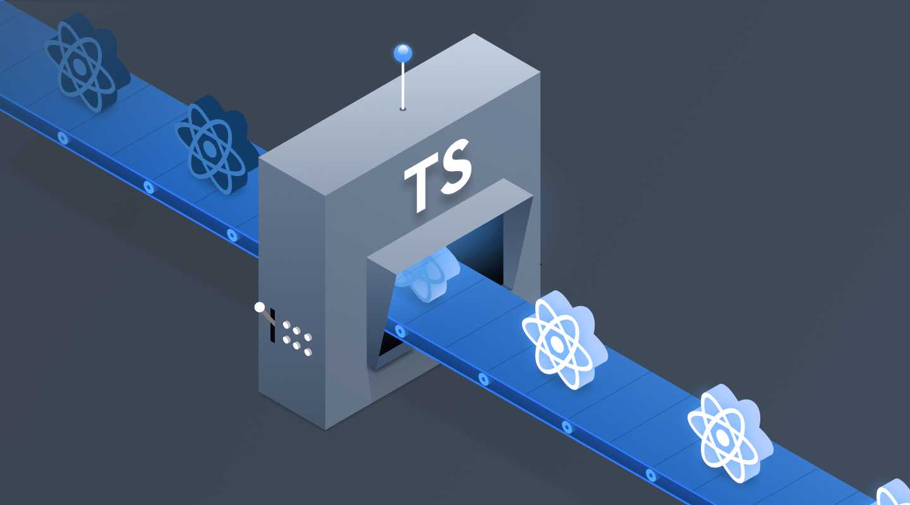

# react-typescript 踩坑集

最近把自己开发的一个`react`项目用`typescript`重构了一遍，使用的技术栈为`react+react-redux+react-router`，迁移的过程中 遇到了很多坑，这就来和大家分享一下。



> 项目地址为：

## 安装

我是用的`create-react-app`来创建的项目，不管是新建一个`react+ts`项目，还是在原有项目中添加ts官方文档都有详细说明：

#### 新建

要使用`TypeScript`启动一个新的`Create React App`项目，可以运行：

```bash
npx create-react-app my-app --template typescript
```

#### 添加

要将`TypeScript`添加到`Create React`应用程序项目中，首先要安装`node，react，react-dom，jest`的声明文件：

```bash
npm install --save typescript @types/node @types/react @types/react-dom @types/jest
```

接下来，将任何文件重命名为`TypeScript`文件（例如，将`src/index.js`更改为`src/index.tsx`），然后重新启动开发服务器，因为默认的`tsconfig`配置是严格模式所以我们接下来需要对代码进行一些更改。

## React for Ts

`ts `已经成功添加到我们的项目中了，接下来我们以一个`HelloTs`应用为例子演示一下如何用`ts`编写一个组件，首先我们要将所有使用到`jsx`语法的文件重命名为`xxx.tsx`，然后组件声明时使用 `Component<P, S>` 泛型参数声明。

#### Props and State

首先组件声明时使用 `Component<P, S>` 泛型参数声明，拿我项目中的代码片段为例，我们需要声明`state`和`prop`并且暴露`prop`类型来代替`PropType`：

```tsx
export interface IGameProps {
    title: string;
    img: string;
    completed: number;
  	selectGame: () => void;
}

interface IGameState {
  	pageName: string;
}

export default class Game extends React.Component<IGameProps, IGameState> {
  	constructor(props: IGameProps) {
      	super(props)
      	this.state = { total: "game" }
    }
    render() {
        let { title, completed, img } = this.props;
        let imgUrl = `url("${img}")`;
        return (
            <div className="g-home__box" style={{ backgroundImage: imgUrl }} onCick={this.props.selectGame}>
                <div>
                    <h1>{title}</h1>
                    <Progress completed={completed}></Progress>
                </div>
            </div>
        );
    }
}
```

## Redux for Ts

#### 插件安装

安装`redux`和`react-redux`以及它们的类型文件做为依赖。

```bash
npm install -S redux react-redux @types/react-redux
```

> 这里我们不需要安装`@types/redux`，因为`Redux`已经自带了声明文件（.d.ts文件）。

#### 开启 devtools

`TypeScript`并不知道`__REDUX_DEVTOOLS_EXTENSION_COMPOSE__`属性的类型，因此，我们需要向全局添加类型声明：

```ts
declare global {
  interface Window {
    __REDUX_DEVTOOLS_EXTENSION_COMPOSE__?: typeof compose;
  }
}

const composeEnhancers = window.__REDUX_DEVTOOLS_EXTENSION_COMPOSE__ || compose;
export const store = createStore(reducer, composeEnhancers())
```

#### 定义 action type

之后我们要在`store`文件夹中创建`constants.ts`，用于定义`action`类型。

```ts
// store constants.ts
export const UPDATE_GAMES = "home/UPDATE_GAMES";
export type UPDATE_GAMES = typeof UPDATE_GAMES;

export const GET_GAMES = "home/GET_GAMES";
export type GET_GAMES = typeof GET_GAMES;
```

> `const/type`模式允许重构TypeScript的字符串字面量类型。

#### 创建 action creator

首先我们要为`actionCreator`创建的`action`定义类型，之后编写好`actionCreator`之后我们需要将`action`类型合并并且暴露，之后再`reducer`中使用：

```ts
export interface IGetGameAction {
    type: GET_GAMES;
}

export const getGames = (): IGetGameAction => {
    return {
        type: GET_GAMES,
    };
};

export interface IUpdateGamesAction {
    type: UPDATE_GAMES;
    data: IGameList;
}

export const updateGames = (data: IGameList): IUpdateGamesAction => {
    return {
        type: UPDATE_GAMES,
        data,
    };
};

export type IGameAction = IUpdateGamesAction | IUpdateGamesAction
```

#### 编写 reducer

编写`reducer`的过程分为两步，首先我们需要声明 `state` 的类型，一般定义在 `$/store/types.ts` 中：

```ts
export interface IGameState {
  games: string;
}
```

而 `reducer` 中我们引入刚刚的类型，并且需要为`action`添加刚刚我们定义的类型即可。

```ts
import * as actionTypes from "./constants";
import { IUpdateGamesAction } from "./actionCreator";
import { IGameState } from "./types"

const defaultState = {
    games: [],
};

export default (state = defaultState, action: IUpdateGamesAction) => {
    switch (action.type) {
        case actionTypes.UPDATE_GAMES:
            return Object.assign({}, state, {
                games: action.data,
            });
        default:
            return state;
    }
};
```

#### 在组件中使用

下面的组件中使用了上面定义的`gameinfopanel`用于展示已存在的游戏项，引用了上面的`IGameProps`，我们主要需要注意的就是`dispatch`和`state`的类型声明，以及在`mapDispatchToProps`定义的函数类型也要在`Prop`中声明。

要注意`Dispatch`是一个泛型函数，泛型参数就是你的`actionCreator`的返回值类型。

```tsx
import Game, { IGameProps } from "./components/Game";
import { IGameState } from "./types"

interface IHomeListItem extends IGameProps {
    url: string;
}

interface IHomeProps {
    games: Array<IHomeListItem>;
    changeHomeData?: () => void;
}

class Home extends React.Component<IHomeProps> {
    render() {
        const { games } = this.props;
        return (
            <div className="g-home__container">
                {games.map((item, index) => {
                    return (
                        <Link key={index} to={item.url}>
                            <Game
                                title={item.title}
                                completed={item.completed}
                                img={item.img}
                            ></Game>
                        </Link>
                    );
                })}
            </div>
        );
    }
    componentDidMount() {
        this.props.changeHomeData();
    }
}

const mapStateToProps = (state: IGameState) => {
    return {
        games: state.games,
    };
};

const mapDispatchToProps = (dispatch: Dispatch<actionCreator.IUpdateGamesAction>) => {
    return {
        changeHomeData() {
            dispatch(actionCreator.getGames());
        },
    };
};

export default connect(mapStateToProps, mapDispatchToProps)(Home);
```

## React-thunk for Ts

暂未学习

## Immutable for Ts

暂未学习

## Other Advises

全局变量或者自定义的 `window` 对象属性，统一在项目根下的 `global.d.ts` 中进行声明定义。

```ts
declare global {
  interface Window {
    __REDUX_DEVTOOLS_EXTENSION_COMPOSE__?: typeof compose;
  }
}
```

对于项目中常用到的接口数据对象，最好在 `interfaces/` 目录下定义好其结构化类型声明。

```js
export interface IGameInfo {
    title: string;
    url: string;
    completed: number;
    img: string;
}

export type IGameList = Array<IGameInfo>;
```

