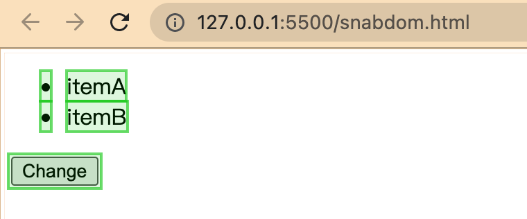
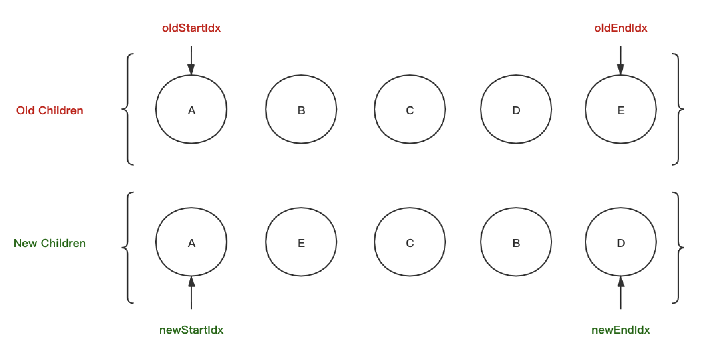
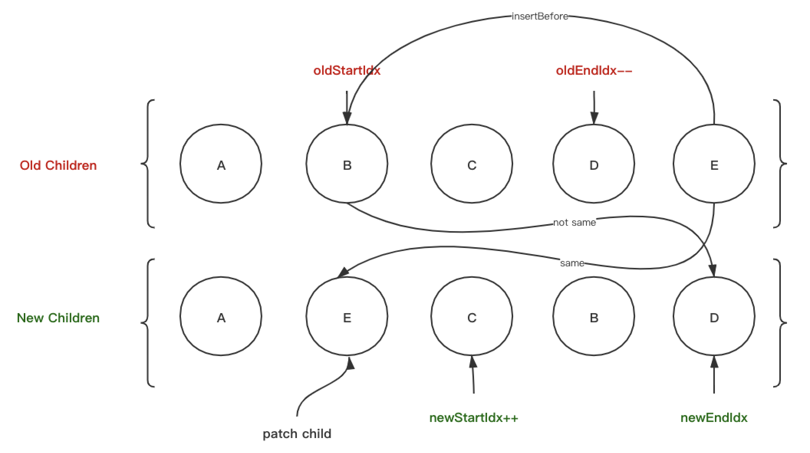

## vdom — why and what

`Virtual DOM`是对`DOM`的抽象，本质上是`JavaScript`对象，这个对象就是更加轻量级的对`DOM`的描述，提高重绘性能。

### Dom

`DOM` 全称为“文档对象模型”（`Document Object Model`），`JavaScript` 操作网页的接口。它的作用是将网页转为一个 `JavaScript` 对象，从而可以用脚本进行各种操作（比如增删内容）。

比如说我们获取随意的一个 `dom` 对象并且打印其属性：

```html
<div id="root"></div>
<script>
  let r = document.getElementById('root');
  let str = '';
  for (let k in r) {
    str += `${k} `;
  }
  console.log(str);
</script>

<!-- 
align title lang translate dir hidden accessKey draggable spellcheck autocapitalize contentEditable isContentEditable inputMode offsetParent offsetTop offsetLeft offsetWidth offsetHeight style innerText outerText onabort onblur oncancel oncanplay oncanplaythrough onchange onclick onclose oncontextmenu oncuechange ondblclick ondrag ondragend ondragenter ondragleave ondragover ondragstart ondrop ondurationchange onemptied onended onerror onfocus onformdata oninput oninvalid onkeydown onkeypress onkeyup onload onloadeddata onloadedmetadata onloadstart onmousedown onmouseenter onmouseleave onmousemove onmouseout...
-->
```

可以看到由于 `HTMLDIVELEMENT` 继承自`Node`、 `Element`、`Attr`、`Eventarget`以及各种事件对象，导致其体积过于庞大，每一次构建的过程都是十分耗时的，如果我们直接使用 `dom` 提供的 `Api`对如此体积的对象进行操作，可以说效率必然是非常低的。

### vDom

`Virtual DOM`（虚拟`DOM`）是对`DOM`的抽象，本质上是`JavaScript`对象，这个对象就是更加轻量级的对`DOM`的描述。简写为`vdom`。

我们以下面这样的一个 `dom` 元素为例：

```html
<ul id='list'>
  <li class='item'>itemA</li>
  <li class='item'>itemB</li>
</ul>
```

其生成的 `vdom` 的结构可能就是这样的：

```js
{
  tag: "ul",
  attr: {
    id: "list"
  },
  children: [{
    tag: "li",
    attrs: {
      className: "item",
    },
    children: ["itemA"]
  }, {
    tag: "li",
    attr: {
      className: "item",
    },
    children: ["itemB"]
  }]
}
```

虚拟 `DOM` 这个对象的参数分析：

+ `tag`:  指定元素的标签类型，案例为：`ul`  （`react` 中用 `type`）。
+ `attrs`:  表示指定元素身上的属性，如`id,class, style`, 自定义属性等（`react`中用`props`）。
+ `children`: 表示指定元素是否有子节点，参数以数组的形式传入,如果是文本就是数组中为字符串。

那么我们为什么要费这么大劲抽象出来一个 `vdom`，上面的对于 `dom` 本身的优化可以作为理由之一，但是不足够：

+ 首先，我们都知道在前端性能优化的一个秘诀就是尽可能少地操作`DOM`，不仅仅是`DOM`相对较慢，更因为频繁变动`DOM`会造成浏览器的**回流或者重绘**，因此我们需要这一层抽象，在`patch`过程中尽可能地一次性将差异更新到`DOM`中。

+ 其次，现代前端框架的一个基本要求就是无须手动操作`DOM (MVVM)`，一方面是因为手动操作`DOM`无法保证程序性能，多人协作的项目中如果`review`不严格，可能会有开发者写出性能较低的代码，另一方面更重要的是省略手动`DOM`操作可以大大提高开发效率。

+ 最后，也是`Virtual DOM`最初的目的，就是更好的跨平台，比如`Node.js`就没有`DOM`，如果想实现`SSR`(服务端渲染)，那么一个方式就是借助`Virtual DOM`，因为`Virtual DOM`本身是`JavaScript`对象。而且在的`ReactNative`，`React VR`、`weex`都是使用了虚拟`dom`。


最后虚拟 `dom` 也不是万能的，如果你的场景是虚拟 `DOM` 大量更改，这是合适的。但是单一的，频繁的更新的话，虚拟 `DOM` 将会花费更多的时间处理计算的工作。比如，你有一个 `DOM` 节点相对较少页面，用虚拟 `DOM`，它实际上有可能会更慢。

## snabdom.js

接下来我们就需要来看看 `vdom` 的核心 `api` 以及其实现了，流行的`vue`框架的虚拟`dom`实现也是参考了`snabbdom.js`的实现。 而`react`的虚拟`dom`也是很相似。

如果要我们自己去实现一个虚拟`dom`，可根据`snabbdom.js`库实现过程的以下三个核心问题处理：

+ `compile`，如何把真实`DOM`编译成`vnode`虚拟节点对象。（通过`h`函数）；
+ `diff`，通过算法，我们要如何知道`oldVnode`和`newVnode`之间有什么变化。（内部`diff`算法）
+ `patch`， 如果把这些变化用打补丁的方式更新到真实`dom`上去；

接下来我们先来了解一下 `snabdom` 的一次虚拟 `dom` 渲染流程：

**第一步：**首先，我们先创建模板并且引入 `snabdom` 的 `cdn`：

```html
<!DOCTYPE html>
<html lang="en">
<head>
  <meta charset="UTF-8">
  <title>Document</title>
  <script src="https://cdn.bootcss.com/snabbdom/0.7.1/snabbdom.js"></script>
  <script src="https://cdn.bootcss.com/snabbdom/0.7.1/snabbdom-class.js"></script>
  <script src="https://cdn.bootcss.com/snabbdom/0.7.1/snabbdom-props.js"></script>
  <script src="https://cdn.bootcss.com/snabbdom/0.7.1/snabbdom-style.js"></script>
  <script src="https://cdn.bootcss.com/snabbdom/0.7.1/snabbdom-eventlisteners.js"></script>
  <script src="https://cdn.bootcss.com/snabbdom/0.7.1/h.js"></script>
</head>
<body>
  <div id="container"></div>
</body>
</html>

```

**第二步：**接下来我们使用 `h` 函数生成虚拟 `dom ` 节点：

```js
let snabbdom = window.snabbdom;
let h = snabbdom.h;

let vnode = h('ul',{ id:'list'},[
  h('li',{'className':'item'},'itemA'),
  h('li',{'className':'item'},'itemB')
]);

console.log(vnode);
```

`h` 函数接受是三个参数，分别代表是 `DOM` 元素的标签名、属性、子节点（`children`有多个子节点），和我们上文描述的 `vdom` 结构完全一致。最终返回一个虚拟 `DOM` 的对象；

```js
{
  sel: "ul",
  data: {id: "list"},
  children: [{
    	sel: "li",
    	data: {className: "item"},
    	text: "itemA"
			children: undefined,
      elm: undefined
      key: undefined
    }, {…}],
  elm: undefined,
  key: undefined,
  text: undefined
}
```

我可以看到在返回的虚拟节点中还有`key`（节点的唯一标识）、`text`（如果是文本节点时对应的内容）。

**第四步：**现在我们准备好了 `vnode`，就可以定义`patch`，给指定的容器更新`vnode`(打补丁)。

```js
//定义 patch
let patch = snabbdom.init([
  snabbdom_class,
  snabbdom_props,
  snabbdom_style,
  snabbdom_eventlisteners
]);
// 获取container的dom
let container = document.getElementById('container');
// 第一次patch 
patch(container,vnode);
```

最后我们在页面上得到的就是我们想要的真实 `dom` 结构：

```html
<ul id='list'>
  <li class='item'>itemA</li>
  <li class='item'>itemB</li>
</ul>
```

不过需要注意的是在第一次`patch`的时候`vnode`是覆盖了 `container` 的`dom`，这跟`react`中的`render`不同，`render`是在此`dom`上增加子节点。

**第五步：**增加按钮，点击触发事件，触发第二次 `patch` 方法。

```html
<button id="btn-change">Change</button>
<script>
		// 添加事件，触发第二次patch
    let btn = document.getElementById('btn-change');
    btn.addEventListener('click',function (params) {
        let newVnode = h('ul#list',{},[
            h('li.item',{},'itemC'),
            h('li.item',{},'itemB'),
            h('li.item',{},'itemD')
        ]);
        // 第二次patch
        patch(vnode,newVnode);
    });
</script>
```

这里我们进行多次点击，可以看到只有第一次点击触发了浏览器的重绘，而后序的点击由于没有改变 `vdom` 结构所以没有触发。



## 源码

下面我们根据上面 `snabdom.js` 的代码发现核心`api`：`h`函数和`patch`函数，我们来深入 `snabdom.js` 的源码，因为是用 `ts` 编写的，所以非常的性感：

#### `vnode`节点

根据我们上面的分析，总结出来了 `{ tagName, attr, children }` 这样的一个 `vnode` 结构，实际的结构也类似：

+ `sel` ：指的就是我们传入的标签选择器语法(`tagName#id.className`)，用于 `diff` 算法的同级比较。
+ `data`：包括传入的 `dom` 属性和自定义属性。
+ `elm`：真实 `dom` 的引用。
+ `text`：纯文本标签的内容。
+ `key`：索引。

```ts
export interface VNode {
  sel: string | undefined
  data: VNodeData | undefined
  children: Array<VNode | string> | undefined
  elm: Node | undefined
  text: string | undefined
  key: Key | undefined
}
```

再来看一看 `data` 属性也就是 `attr` 的具体内容：

+ `[key: string]`：支持我们自定义的各种奇奇怪怪的属性。

```ts
export interface VNodeData {
  props?: Props
  attrs?: Attrs
  class?: Classes
  style?: VNodeStyle
  dataset?: Dataset
  on?: On
  hero?: Hero
  attachData?: AttachData
  hook?: Hooks
  key?: Key
  [key: string]: any // for any other 3rd party module
}
```

最后是一个构造函数 `vnode`： 

```ts
export function vnode (sel: string | undefined,
  data: any | undefined,
  children: Array<VNode | string> | undefined,
  text: string | undefined,
  elm: Element | Text | undefined): VNode {
  const key = data === undefined ? undefined : data.key
  return { sel, data, children, text, elm, key }
}
```

#### `h`函数

现在我们分析完了 `vnode` 的结构，接下来就可以看看 `h` 函数了，这里 `snabdom.js` 使用了一个重载的方式编写，来判断 `sel`、`data`、`children`三个属性的存在性：

```ts
export function h (sel: string): VNode
export function h (sel: string, data: VNodeData | null): VNode
export function h (sel: string, children: VNodeChildren): VNode
export function h (sel: string, data: VNodeData | null, children: VNodeChildren): VNode
export function h (sel: any, b?: any, c?: any): VNode {
  var data: VNodeData = {}
  var children: any
  var text: any
  var i: number
  if (c !== undefined) {
    // 传入 children
    if (b !== null) {
      data = b
    }
    
    if (is.array(c)) {
      children = c // c 是一个节点数组，直接赋值 children。
    } else if (is.primitive(c)) {
      text = c // c 是一个文本数组，直接赋值 text。
    } else if (c && c.sel) {
      children = [c]
      // c 是一个节点，直接赋值 children 为 [c]。
    }
  } else if (b !== undefined && b !== null) {
    if (is.array(b)) {
      children = b // b 是 children
    } else if (is.primitive(b)) {
      text = b // b 是 text children
    } else if (b && b.sel) {
      children = [b] // b 是 child
    } else { data = b } // b 是 data
  }
 
  if (children !== undefined) {
    for (i = 0; i < children.length; ++i) {
      if (is.primitive(children[i])) 
        children[i] = vnode(undefined, undefined, undefined, children[i], undefined)
      	// 先给子元素生成 vnode
    }
  }
  return vnode(sel, data, children, text, undefined)
  // 生成父元素 vnode
};
```

#### `diff` 算法

`diff` 算法是用来对比差异的算法，有 `linux`命令 `diff`（我们`dos`命令中执行`diff` 两个文件可以比较出两个文件的不同）、`git`命令`git diff`、可视化`diff(github`、`gitlab...)`等各种实现。

前端用于节点比较的 `diff` 算法使用下面三种原则来实现 `O(n)` 的复杂度：

+ 广度优先遍历、每次只比较同一层级、不跨级比较。
+ 如果 `tag` 不相同、或者有 `key` 的时候 `key` 不相同，直接删掉节点并且中间、不深度比较。
+ 如果 `tag` 和 `key` 两者都相同则认为该节点本身是一个相同节点、当前节点不再深度比较、但是继续对其子节点进行比较。

#### `patch` 函数

`patch` 函数可以说是 `vdom` 中最重要的函数了，负责个 `vdom` 的对比(`diff` 算法)，以及给真实 `dom` 更新补丁。

参数分析：

+ 首先 `patch` 函数的第一个参数可以是一个 `Element` 也可以是一个 `VNode`，这就对应了上面我们所说的第一次 `patch` 和第 `n+1` 次 `patch`。

```ts
return function patch(oldVnode: VNode | Element, vnode: VNode): VNode {
  if (!isVnode(oldVnode)) {
    oldVnode = emptyNodeAt(oldVnode);
  }
};
```

如果是第一次 `patch` 那么就会将 `ele` 转换为一个空的 `vnode` 并且将 `id` 和 `className` 统统并入 `sel`，以这样的形式：

`tagName#id.classA.classB` ，并且这个空节点会挂载到 `ele` 上，所有的其他属性都会被忽略。

```ts
function emptyNodeAt(elm: Element) {
  const id = elm.id ? "#" + elm.id : "";
  const c = elm.className ? "." + elm.className.split(" ").join(".") : "";
  return vnode(
    api.tagName(elm).toLowerCase() + id + c,
    {},
    [],
    undefined,
    elm
  );
}
```

参数处理完之后就是节点比对与更新的过程了：

```ts
//...
	let i: number, elm: Node, parent: Node;
  const insertedVnodeQueue: VNodeQueue = [];
  
  if (sameVnode(oldVnode, vnode)) {										// diff 算法
    patchVnode(oldVnode, vnode, insertedVnodeQueue);  // 如果 diff 算法过后两节点相等，则进入深层比较。
  }
//...
```

首先如果说经过 `diff` 算法之后，本层认为无需更新，但是不确定下层节点行为，那就进行深度优先遍历 `patchVnode`

```ts
// ...
	else {
    elm = oldVnode.elm!;										// 找到 oldVnode 的挂载节点
    parent = api.parentNode(elm) as Node; 	// 找到挂载节点的父节点

    createElm(vnode, insertedVnodeQueue);		// 创建新 vnode 的 dom 结构

    if (parent !== null) {
      api.insertBefore(parent, vnode.elm!, api.nextSibling(elm)); // 插入新节点
      removeVnodes(parent, [oldVnode], 0, 0);											// 移除老节点
    }
  }

  return vnode;
//...
```

如果算法认为真实节点需要更新，那么就根据 `vnode` 构建  `dom` 结构，并且插入老节点的父级节点，并且移除掉过时的 `dom`。

判断节点是否需要重建的规则就遵循上面的 `diff` :

+ 不跨级比较；
+ 如果 `tag` 和 `key` 两者都相同则认为该节点本身是一个相同节点、当前节点不再深度比较、但是继续对其子节点进行比较。

```ts
function sameVnode(vnode1: VNode, vnode2: VNode): boolean {
  return vnode1.key === vnode2.key && vnode1.sel === vnode2.sel;
}
```

接下来就该看看两个节点`tag` 和 `key` 两者都相同如何对子节点或者 `text` 进行比较了，进入 `patchVnode` 之后首先我们要给新元素一个挂载点、同时获取新旧元素的子元素。

```js
function patchVnode(
    oldVnode: VNode,
    vnode: VNode,
    insertedVnodeQueue: VNodeQueue
  ) {
    // 给新的 vnode 一个挂载点
    const elm = (vnode.elm = oldVnode.elm!);
    // 获取新旧子元素
    const oldCh = oldVnode.children as VNode[];
    const ch = vnode.children as VNode[];
}
```

之后进入具体的比较过程首先比较 `oldVnode` 和 `vnode` 两者的内容可能有如下几种情况：

+ `oldVnode` 有 `children`、`newVnode` 有 `children`：对每一个 `children` 进行对比。
+ `oldVnode` 什么也没有、`newVnode` 有 `children`：更新 `dom`。
+ `oldVnode` 有 `text`、`newVnode` 有 `children`：清空 `text` 、更新 `dom`。
+ `oldVnode` 有 `text`、`newVnode` 什么也没有：清空 `text`。
+ `oldVnode` 有 `text`、`newVnode` 有 `text`：更新 `text`。

```js
//...
      // 如果 vnode.text 为undefined，那么 vnode.children 大概率有值
      if (isUndef(vnode.text)) {
        // 新旧 vnode 都有 children 而且二者不相等
        if (isDef(oldCh) && isDef(ch)) {
          if (oldCh !== ch) updateChildren(elm, oldCh, ch, insertedVnodeQueue);
        } else if (isDef(ch)) {
          // 新的 vnode 上有children，且旧的 vnode 有 text
          if (isDef(oldVnode.text)) api.setTextContent(elm, "");// 清除 dom 内 text
          // 添加新节点
          addVnodes(elm, null, ch, 0, ch.length - 1, insertedVnodeQueue);
        // 老的 vnode 上有 children，新的没有
        } else if (isDef(oldCh)) {
          // 在 dom 上移除旧的 children
          removeVnodes(elm, oldCh, 0, oldCh.length - 1);
        } else if (isDef(oldVnode.text)) {
          // 老的 dom 上有 text，新的没有，设置 dom 内容为空
          api.setTextContent(elm, "");
        }
        // 如果 vnode.text 不为空则比较前后节点的内容
      } else if (oldVnode.text !== vnode.text) {
        if (isDef(oldCh)) {
          removeVnodes(elm, oldCh, 0, oldCh.length - 1);
          // 移除 dom 上旧的 children
        }
        api.setTextContent(elm, vnode.text!);
        // 在 dom 上设置新的文本内容
      }
  }
}
```

从上面我们就可以看出来，只有`oldVnode` 有 `children`、`newVnode` 有 `children`需要继续进行深度的对比、其余情况只需要删掉重建或者对内容进行更新。

那么最后我们就可以看看最复杂的子节点比较 `updateChildren` 的代码了：

```js
function updateChildren(
  parentElm: Node,
  oldCh: VNode[],
  newCh: VNode[],
  insertedVnodeQueue: VNodeQueue
) {
  let oldStartIdx = 0;
  let newStartIdx = 0;
  let oldEndIdx = oldCh.length - 1;
  let newEndIdx = newCh.length - 1;
  let oldStartVnode = oldCh[0];
  let oldEndVnode = oldCh[oldEndIdx];
  let newStartVnode = newCh[0];
  let newEndVnode = newCh[newEndIdx];
  //...
```

一进入到这个函数，出现在我们面前的就是四个索引变量、分别对应下图两个 `children` 的前后节点：



准备好了这四个节点，我们就可以开始循环比较，而循环的终止条件就是前后指针相遇，循环的过程中要避开空节点：

```js
// ...
  while (oldStartIdx <= oldEndIdx && newStartIdx <= newEndIdx) {
 		// skip all null nodes
    if (oldStartVnode == null) {
      oldStartVnode = oldCh[++oldStartIdx]; // Vnode might have been moved left
    } else if (oldEndVnode == null) {
      oldEndVnode = oldCh[--oldEndIdx];
    } else if (newStartVnode == null) {
      newStartVnode = newCh[++newStartIdx];
    } else if (newEndVnode == null) {
      newEndVnode = newCh[--newEndIdx];
    }
    // do compare
  }
//...
```

接下来是具体的节点比较代码，首先 `Start` 和 `Start` 的比较、 `End` 和 `End` 的比较。这一部分的逻辑很简单、`diff` 比较结果相同就递归其子节点、并且移动指针，因为当前层级已经不需要比较了。


```js
//...
  while (oldStartIdx <= oldEndIdx && newStartIdx <= newEndIdx) {
    //...    
    // 如果 oldStartVnode 和 newStartVnode diff比较相同则比较其子代、并且跳过这两个节点：
    if (sameVnode(oldStartVnode, newStartVnode)) {
      patchVnode(oldStartVnode, newStartVnode, insertedVnodeQueue);
      oldStartVnode = oldCh[++oldStartIdx];
      newStartVnode = newCh[++newStartIdx];
    } else if (sameVnode(oldEndVnode, newEndVnode)) {
      patchVnode(oldEndVnode, newEndVnode, insertedVnodeQueue);
      oldEndVnode = oldCh[--oldEndIdx];
      newEndVnode = newCh[--newEndIdx];
    }
    //...
  }
//...
```

前前和后后的比较完成之后，我们就要进行两次前后的比较，一旦出现相同的节点，就说明当前层级的两个节点可以看做相同，继续比较他们的子节点。同时当前层级的二者可以看做是只移动了位置，那么对应真实 `dom` 同样只需要移动一下位置：



```js
//...
  while (oldStartIdx <= oldEndIdx && newStartIdx <= newEndIdx) {
    //...    
		else if (sameVnode(oldStartVnode, newEndVnode)) {
      // Vnode moved right
      patchVnode(oldStartVnode, newEndVnode, insertedVnodeQueue);
      api.insertBefore(
        parentElm,
        oldStartVnode.elm!,
        api.nextSibling(oldEndVnode.elm!)
      );
      oldStartVnode = oldCh[++oldStartIdx];
      newEndVnode = newCh[--newEndIdx];
    } else if (sameVnode(oldEndVnode, newStartVnode)) {
      // Vnode moved left
      patchVnode(oldEndVnode, newStartVnode, insertedVnodeQueue);
      api.insertBefore(parentElm, oldEndVnode.elm!, oldStartVnode.elm!);
      oldEndVnode = oldCh[--oldEndIdx];
      newStartVnode = newCh[++newStartIdx];
    }
    //...
  }
//...
```

循环迭代的最后一步，也是最精妙的一步，如果上面的`前-前` 、`后-后`、`前-后` 四次比较都没命中、都认为不是相同节点，那么就对 `newStartIdx` 进行处理，依次和 `old children` 中的所有节点进行比较、看看能否出现 `diff` 相等，有就深层次比较并且移动节点。没有就直接插入 `newStartIdx`对应的节点并且移动其指针：


> 这里的代码很巧妙：`oldKeyToIdx = createKeyToOldIdx(oldCh, oldStartIdx, oldEndIdx);
> idxInOld = oldKeyToIdx[newStartVnode.key as string];`

```js
//...
  while (oldStartIdx <= oldEndIdx && newStartIdx <= newEndIdx) {
    //...    
  	else {
        if (oldKeyToIdx === undefined) {
          oldKeyToIdx = createKeyToOldIdx(oldCh, oldStartIdx, oldEndIdx);
          // 获取一个范围是oldStartIdx->oldEndIdx 的 key-idx map。
        }
        idxInOld = oldKeyToIdx[newStartVnode.key as string];
      	// 看看剩余的老节点的key中是否有和 newStartVnode.key 相等的。
        if (isUndef(idxInOld)) {
          // New element
          // 没有就直接插到 dom 中新节点队列的最后面。
          api.insertBefore(
            parentElm,
            createElm(newStartVnode, insertedVnodeQueue),
            oldStartVnode.elm!
          );
        } else {
          // 如果有相等的 key 值，则新旧节点可能相同、也可能不相同(取决于 sel)。
          elmToMove = oldCh[idxInOld];
          if (elmToMove.sel !== newStartVnode.sel) {
            // sel 不相同则认为没有相同节点直接插入到已插入队列的最末端
            api.insertBefore(
              parentElm,
              createElm(newStartVnode, insertedVnodeQueue),
              oldStartVnode.elm!
            );
          } else {
            // sel 相同则可以认为是 diff 相同、深层比较并且移动节点。
            patchVnode(elmToMove, newStartVnode, insertedVnodeQueue);
            oldCh[idxInOld] = undefined as any;
            api.insertBefore(parentElm, elmToMove.elm!, oldStartVnode.elm!);
          }
        }
        // 移动头指针
        newStartVnode = newCh[++newStartIdx];
      }
    }
//...
```

最后的最后，循环的内容已经结束了，现在我们可以跳出循环处理最后一种情况，`old children` 和 `new children` 的长度很有可能是不相同的，如何处理呢？

很简单 `oldStartIdx > oldEndIdx` 说明有新增节点、只要插入就可以了，`oldStartIdx < oldEndIdx` 说明有删除节点，只要删除多余的节点即可。

```js
//...
	if (oldStartIdx <= oldEndIdx || newStartIdx <= newEndIdx) {
    if (oldStartIdx > oldEndIdx) {
      before = newCh[newEndIdx + 1] == null ? null : newCh[newEndIdx + 1].elm;
      addVnodes(
        parentElm,
        before,
        newCh,
        newStartIdx,
        newEndIdx,
        insertedVnodeQueue
      );
    } else {
      removeVnodes(parentElm, oldCh, oldStartIdx, oldEndIdx);
    }
  }
//...
```

