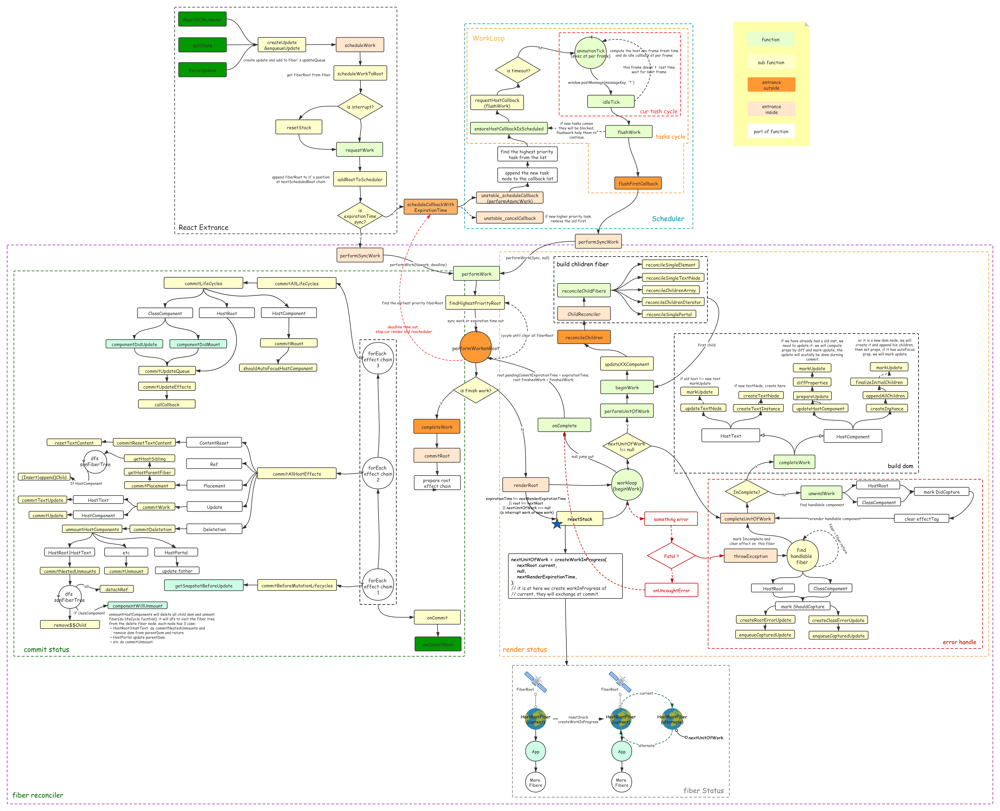

## React 基础包结构

`react` 工程目录的 `packages` 包含 `30` 多个包(`@16.8.0`版本)，其中与`web`开发相关的核心包共有 `5` 个。下面是 `react` 更新过程的整体流程图。

每一个板块代表一个核心包，橙色模块代表包对外提供的函数入口，肉色模块代表包内部入口，绿色模块代表普通执行函数，黄色模块为子函数，白色模块为方法逻辑拆分。 

#### react

`react` 基础包, 提供操作 `react` 对象(`ReactElement`)的全局 `api`。

#### react-dom

`react` 渲染器之一, 是 react 与 web 平台连接的桥梁(可以在浏览器和 nodejs 环境中使用)。

#### react-reconciler

`react` 工作空间核心包(综合协调`react-dom`,`react`,`scheduler`各包之间的调用与配合). 管理 react 的输入和输出. 接受输入(`schedulerUpdateOnFiber`), 将输入信息进行处理(涉及调度机制, `fiber`树形结构, `update`队列, 调和算法等), 处理完成之后再次调用渲染器(如`react-dom`, `react-native`等)进行输出。

#### scheduler

`react` 调度机制的核心实现, 控制`react-reconciler`中的`render`过程, 在`concurrent`模式下实现任务分片。

#### legacy-events

`react` 原生事件的包装器, 封装合成事件, 提供一套可插拔的插件体系给渲染器(如`react-dom`)使用。

