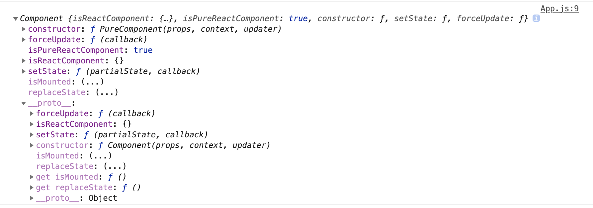

## ClassCompoent

使用 `React.Component` 类组件是我们在使用 `react` 时很常见的一种开发模式：

```ts
class Demo extends React.Component {}
```

源码中的这个包处于 `react` 核心包的 `ReactBaseClasses.js`，代码中的注释也说了，`BaseClass` 是用来提供组件更新 `state` 能力的，所以主要函数只有 `setState` 和 `forceUpdate`：

[react/src/ReactBaseClasses.js]()

```TS
/**
 * Base class helpers for the updating state of a component.
 */
function Component(props, context, updater) {
  this.props = props;
  this.context = context;
  // If a component has string refs, we will assign a different object later.
  this.refs = emptyObject;
  // We initialize the default updater but the real one gets injected by the
  // renderer.
  this.updater = updater || ReactNoopUpdateQueue;
}

Component.prototype.isReactComponent = {};

Component.prototype.setState = function(partialState, callback) {
  this.updater.enqueueSetState(this, partialState, callback, 'setState');
};

Component.prototype.forceUpdate = function(callback) {
  this.updater.enqueueForceUpdate(this, callback, 'forceUpdate');
};
```

不过原型链上的这两个函数都是调用 `updater` 的方法，而 `updater` 在上面代码中有说明是在 `render` 阶段注入的，这个过程发生在 `constructClassInstance` 第一次渲染类组件实例的时候：

[react-reconciler/src/ReactFiberClassComponent.js]()

```ts
function constructClassInstance(
  workInProgress: Fiber,
  ctor: any,
  props: any,
  renderExpirationTime: ExpirationTime,
): any {
    /...
    adoptClassInstance(workInProgress, instance);
    /...
    return instance;
}
```

调用的 `adoptClassInstance` 不仅仅会在实例和`fiber` 之间构建连接，还会注入 `updater`：

[react-reconciler/src/ReactFiberClassComponent.js]()

```ts
function adoptClassInstance(workInProgress: Fiber, instance: any): void {
  instance.updater = classComponentUpdater;
  workInProgress.stateNode = instance;
  // The instance needs access to the fiber so that it can schedule updates
  ReactInstanceMap.set(instance, workInProgress);
}
```

找到更新器了，不过暂时不进行讲解，后面会以这几个函数作为入口开启我们的 `react` 主流程之旅：

[react-reconciler/src/ReactFiberClassComponent.js]()

```ts
const classComponentUpdater = {
  isMounted,
  enqueueSetState(inst, payload, callback) {
    const fiber = ReactInstanceMap.get(inst);
    const currentTime = requestCurrentTime();
    const expirationTime = computeExpirationForFiber(currentTime, fiber);

    const update = createUpdate(expirationTime);
    update.payload = payload;
    if (callback !== undefined && callback !== null) {
      update.callback = callback;
    }

    enqueueUpdate(fiber, update);
    scheduleWork(fiber, expirationTime);
  },
  enqueueReplaceState(inst, payload, callback) {
    const fiber = ReactInstanceMap.get(inst);
    const currentTime = requestCurrentTime();
    const expirationTime = computeExpirationForFiber(currentTime, fiber);

    const update = createUpdate(expirationTime);
    update.tag = ReplaceState;
    update.payload = payload;

    if (callback !== undefined && callback !== null) {
      update.callback = callback;
    }

    enqueueUpdate(fiber, update);
    scheduleWork(fiber, expirationTime);
  },
  enqueueForceUpdate(inst, callback) {
    const fiber = ReactInstanceMap.get(inst);
    const currentTime = requestCurrentTime();
    const expirationTime = computeExpirationForFiber(currentTime, fiber);

    const update = createUpdate(expirationTime);
    update.tag = ForceUpdate;

    if (callback !== undefined && callback !== null) {
      update.callback = callback;
    }

    enqueueUpdate(fiber, update);
    scheduleWork(fiber, expirationTime);
  },
};

```

### deprecatedAPIs

对于 `isMounted` 和 `replaceState` 这样已经废弃的 `api` 使用的过程会抛出警告：

```ts
if (__DEV__) {
  const deprecatedAPIs = {
    isMounted: [
      'isMounted',
      'Instead, make sure to clean up subscriptions and pending requests in ' +
        'componentWillUnmount to prevent memory leaks.',
    ],
    replaceState: [
      'replaceState',
      'Refactor your code to use setState instead (see ' +
        'https://github.com/facebook/react/issues/3236).',
    ],
  };
  const defineDeprecationWarning = function(methodName, info) {
    Object.defineProperty(Component.prototype, methodName, {
      get: function() {
        lowPriorityWarning(
          false,
          '%s(...) is deprecated in plain JavaScript React classes. %s',
          info[0],
          info[1],
        );
        return undefined;
      },
    });
  };
  for (const fnName in deprecatedAPIs) {
    if (deprecatedAPIs.hasOwnProperty(fnName)) {
      defineDeprecationWarning(fnName, deprecatedAPIs[fnName]);
    }
  }
}
```

## PureComponent

`PureComponent` 纯净组件，本身结构和` Component` 差不多，只是多了一个属性 `isPureReactComponent`：

[react/src/ReactBaseClasses.js]()

```ts
function PureComponent(props, context, updater) {
  this.props = props;
  this.context = context;
  // If a component has string refs, we will assign a different object later.
  this.refs = emptyObject;
  this.updater = updater || ReactNoopUpdateQueue;
}

function ComponentDummy() {}
ComponentDummy.prototype = Component.prototype;

const pureComponentPrototype = (PureComponent.prototype = new ComponentDummy());
pureComponentPrototype.constructor = PureComponent;
// Avoid an extra prototype jump for these methods.
Object.assign(pureComponentPrototype, Component.prototype);
pureComponentPrototype.isPureReactComponent = true;
```

不过 `react` 这里实现继承的过程还是很有趣的，由于 `react` 使用的 `es` 版本比较低，没有 `setPrototype` 和 `Object.create` 这样的大杀器来设置原型，所以说只能采用下面这用方式实现差异继承：

```ts
sonPrototype = Son.prototype = new Father();
// {__proto__: Father.prototype}
sonPrototype.constructor = Son;
// {__proto__: Father.prototype, constructor: Father}
```

不过这样的继承方式会在调用 `new Father`的时候 产生副作用，为了解决这个问题，`react` 将 `Component` 换成了 `ComponentDummy` 这个空的构造函数，原型则不变，之后就是上面的继承操作了。

最后要说的是下面这行，浅拷贝了一层减少了一层的 `prototype` 查找，将所有`Component`上的方法搬到`PureComponent`的原型上了，但是很迷为什么要连续搞两层？

```ts
// Avoid an extra prototype jump for these methods.
Object.assign(pureComponentPrototype, Component.prototype);
```

推测原因是先实现继承表明 `PureComponent` 继承于` Component` ，但是还是为了优化操作效率减少一层` prototype` 查找：

