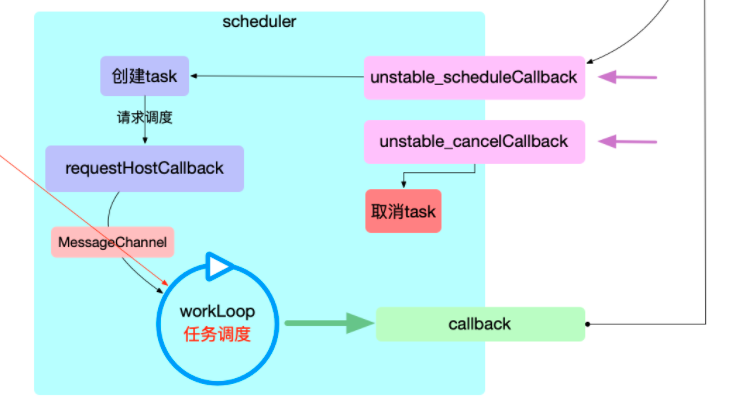
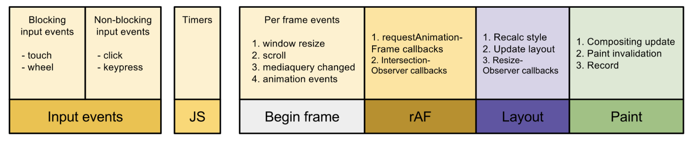

# scheduler 调度器

前文说过 `react` 有两个主要循环，任务调度循环和 `fiber` 构建循环。在任务调度循环中页面的每一次变动(初次 `render` 和后续 `update` ), 都可以看成是一个`更新任务(task)`(节点的新增, 修改, 删除).



调度中心`scheduler`是 react 应用的实际控制者, 通过`任务调度循环`来调度`task`，`task`的实现逻辑被封装到 `react-reconciler`包中，在上文已经介绍过。

## 调度接口

`scheduler` 本身是一个独立的包，其只提供一个 `callback` 队列的控制，至于执行什么样的 `callback` 它并不关心，我们可以从 `react-reconciler`中接入 `scheduler` 的部分开始来探索 `scheduer`。

回顾一下 任务调度循环的入口，如果 `expirationTime` 不为 `Sync` 那走的就是异步任务调用的是 `scheduleCallbackWithExpirationTime`：

```ts
function requestWork(root: FiberRoot, expirationTime: ExpirationTime) {
	// ...
  // TODO: Get rid of Sync and use current time?
  if (expirationTime === Sync) {
    performSyncWork();
  } else {
    scheduleCallbackWithExpirationTime(root, expirationTime);
  }
}
```

`scheduleCallbackWithExpirationTime`这个函数异步的调度更新，`callbackID` 相当于是某个调度队列的 `id` 

为什么这里要缓存一个 `callbackExpirationTime` 和  `callbackID`？ //TODO

[react-reconciler/src/ReactFiberScheduler.js]()

```ts
let callbackExpirationTime: ExpirationTime = NoWork;
let callbackID: *;

function scheduleCallbackWithExpirationTime (
  root: FiberRoot,
  expirationTime: ExpirationTime,
) {
  // 之前已经有 callback 在执行
  if (callbackExpirationTime !== NoWork) {
    // A callback is already scheduled. Check its expiration time (timeout).
    if (expirationTime > callbackExpirationTime) {
      // 当前优先级低，那后调度
      // Existing callback has sufficient timeout. Exit.
      return;
    } else {
      if (callbackID !== null) {
        // 取消之前的 callback
        unstable_cancelCallback(callbackID);
      }
    }
    // The request callback timer is already running. Don't start a new one.
  }

  callbackExpirationTime = expirationTime;
  const currentMs = now() - originalStartTimeMs;
  // 现在时间 (ms)
  const expirationTimeMs = expirationTimeToMs(expirationTime);
  // 将来时间 (ms)
  const timeout = expirationTimeMs - currentMs;
  // 调用新的 callback 并且返回新的 callback id，其实是一个 taskNode
  callbackID = unstable_scheduleCallback(performAsyncWork, {timeout});
}
```

## 调度入口

### 全局变量

==firstCallbackNode== 存储任务节点的链表，实际上是一个环形链表：

```ts
// Callbacks are stored as a circular, doubly linked list.
var firstCallbackNode = null;
```

==currentPriorityLevel== 当前的任务循环优先级？在 `react` 中基本没有使用：

```ts
var ImmediatePriority = 1;
var UserBlockingPriority = 2;
var NormalPriority = 3;
var IdlePriority = 4;

var currentPriorityLevel = NormalPriority;
```

### 开启调度

调用了 `unstable_scheduleCallback` 之后的逻辑就完全由 `task` 调度器负责了，这个时候我们最好将前面的东西统统忘掉，`callback` 就单纯是一个回调函数：

[scheduler/src/Scheduler.js]()

```ts
function unstable_scheduleCallback(callback, deprecated_options) {
  var startTime = getCurrentTime();
  // 获取当前时间为任务起始时间
  var expirationTime;
  if (
    typeof deprecated_options === 'object' &&
    deprecated_options !== null &&
    typeof deprecated_options.timeout === 'number'
  ) {
    // FIXME: Remove this branch once we lift expiration times out of React.
    expirationTime = startTime + deprecated_options.timeout;
    // 计算新的 expirationTime，消除函数执行的误差
  } else {
    // 这里是以后把`expirationTime`从React中抽离出来之后的逻辑，暂时还没有完成，不用考虑
  }

  var newNode = {
    callback,
    priorityLevel: currentPriorityLevel, // 省略
    expirationTime,
    next: null,
    previous: null,
  };
  // 创建新的新的 task 节点

  if (firstCallbackNode === null) {
		// 如果没有任务节点那新加入的节点的next和pre全指向自己
    firstCallbackNode = newNode.next = newNode.previous = newNode;
    // ensureHostCallbackIsScheduled 进行一次调度
    ensureHostCallbackIsScheduled();
  } else {
    var next = null;
    var node = firstCallbackNode;
    do {
      if (node.expirationTime > expirationTime) {
				// 找到新节点该在的位置，拿到第一个比他的优先级小的任务节点
        next = node;
        break;
      }
      node = node.next;
    } while (node !== firstCallbackNode);

    if (next === null) {
      next = firstCallbackNode;
      // 如果说 newNode 的优先级最小，那它就应该放在最末
    } else if (next === firstCallbackNode) {
			// 如果 newNode 优先级最大则放在最前，并且要进行一次任务调度
      firstCallbackNode = newNode;
      ensureHostCallbackIsScheduled();
    }
		
    // 简单的环形链表连接
    var previous = next.previous;
    previous.next = next.previous = newNode;
    newNode.next = next;
    newNode.previous = previous;
  }

  return newNode;
}
```

阅读完上面的代码我们大概知道了 `unstable_scheduleCallback` 做了如下几件事：

+ 计算任务超时时间，创建一个新的任务节点 `newNode`。
+ `expirationTime`优先级的顺序加入到`CallbackNode`链表：
  + 如果新节点是唯一的节点或者头节点，那么就调用`ensureHostCallbackIsScheduled` 开启任务循环。
  + 如果不是则插入到它该在的地方，等待任务调度，此时循环应该是正在进行的不需要调用上面的方法。

### 取消调度

通过 `unstable_cancelCallback` 可以取消任务调度循环里的某个 `callback`，就是删除对应的节点：

[scheduler/src/Scheduler.js]()

```ts
function unstable_cancelCallback(callbackNode) {
  var next = callbackNode.next;
  if (next === null) {
		// 链表里没有任务
    return;
  }

  if (next === callbackNode) {
		// 清空链表
    firstCallbackNode = null;
  } else {
		// 删除节点
    if (callbackNode === firstCallbackNode) {
      firstCallbackNode = next;
    }
    var previous = callbackNode.previous;
    previous.next = next;
    next.previous = previous;
  }

  callbackNode.next = callbackNode.previous = null;
}
```

## 调度循环

### 全局变量

==scheduledHostCallback==

在`requestHostCallback`设置，值一般为`flushWork`，代表下一个调度要做的事情。

```ts
var scheduledHostCallback = null;
```

==isAnimationFrameScheduled==

是否已经开始调用`requestAnimationFrame`。

```ts
var isAnimationFrameScheduled = false;
```

==activeFrameTime==

给一帧渲染用的时间，默认是 `33`，也就是 `1` 秒 `30` 帧。

```ts
var activeFrameTime = 33;
```

==frameDeadline==

记录当前帧的到期时间，他等于`currentTime + activeFraeTime`，也就是`requestAnimationFrame`回调传入的时间，加上一帧的时间。

```ts
var frameDeadline = 0;
```

==isFlushingHostCallback==

是否正在执行`callback`。

```ts
var isFlushingHostCallback = false;
```

==isMessageEventScheduled==

是否已经发送调用`idleTick`的消息，在`animationTick`中设置为`true`

```ts
var isMessageEventScheduled = false;
```

==timeoutTime==

表示过期任务的时间，在`idleTick`中发现第一个任务的时间已经过期的时候设置

```ts
var timeoutTime = -1;
```

### 开启调度循环

`ensureHostCallbackIsScheduled` 开启回调循环：

+ 如果已经在调用回调了，就 `return`，因为本来就会继续调用下去，`isExecutingCallback`在`flushWork`的时候会被修改为`true`，此时调用`ensureHostCallbackIsScheduled`会直接返回。
+ 如果`isHostCallbackScheduled`为`false`，也就是还没开始调度，那么设为`true`，如果已经开始了，就直接取消，因为顺序可能变了。
+ 最后调用`requestHostCallback`开始调度。

[scheduler/src/Scheduler.js]()

```ts
function ensureHostCallbackIsScheduled() {
  if (isExecutingCallback) {
    // Don't schedule work yet; wait until the next time we yield.
    // 防止重复调度
    return;
  }
  // Schedule the host callback using the earliest expiration in the list.
  var expirationTime = firstCallbackNode.expirationTime;
  if (!isHostCallbackScheduled) {
    isHostCallbackScheduled = true;
  } else {
    // Cancel the existing host callback.
    // 停止那次调度，重新进行
    cancelHostCallback();
  }
  requestHostCallback(flushWork, expirationTime);
}
```

`requestHostCallback` 这个函数为开始调度做准备并且调用调度接口：

+ 设置调度的内容，用`scheduledHostCallback`和`timeoutTime`这两个全局变量记录包装后的回调函数和对应的过期时间。
+ 如果 `isFlushingHostCallback` 和 `absoluteTimeout < 0` 命中则表示任务已经超时，立即执行，这里应该是 `react` 为 `scheduler` 单独准备的立即执行任务，在 `react` 中没有用到。
+ 否则调用`requestAnimationFrameWithTimeout`，其实就是调用`requestAnimationFrame`在加上设置了一个`100ms`的定时器，防止`requestAnimationFrame`太久不触发。调用回调`animtionTick`并设置`isAnimationFrameScheduled`全局变量为`true`

[scheduler/src/Scheduler.js]()

```js
requestHostCallback = function(callback, absoluteTimeout) {
  scheduledHostCallback = callback
  timeoutTime = absoluteTimeout
  if (isFlushingHostCallback || absoluteTimeout < 0) {
    // Don't wait for the next frame. Continue working ASAP, in a new event.
    window.postMessage(messageKey, '*')
  } else if (!isAnimationFrameScheduled) {
    isAnimationFrameScheduled = true
    requestAnimationFrameWithTimeout(animationTick)
  }
}
```

### 模拟 requestIdleCallback

因为`requestIdleCallback`这个 API 目前还处于草案阶段，所以浏览器实现率还不高，所以在这里 React 直接使用了`polyfill`的方案。

这个方案简单来说是通过`requestAnimationFrame`在浏览器渲染一帧之前做一些处理，然后通过`postMessage`在`macro task`（类似 setTimeout）中加入一个回调，在因为接下去会进入浏览器渲染阶段，所以主线程是被 block 住的，等到渲染完了然后回来清空`macro task`。

总体上跟`requestIdleCallback`差不多，**等到主线程有空的时候回来调用**

==requestAnimationFrameWithTimeout==

要弄清楚这个过程我们先回道上面的 `requestIdleCallback` 来，这个函数很简单，就是封装出来了一个能在某个超时时间内执行的  `requestAnimationFrame` ：

[scheduler/src/Scheduler.js]()

```ts
var ANIMATION_FRAME_TIMEOUT = 100;
var rAFID;
var rAFTimeoutID;
var requestAnimationFrameWithTimeout = function(callback) {
  // schedule rAF and also a setTimeout
  rAFID = localRequestAnimationFrame(function(timestamp) {
    // cancel the setTimeout
    localClearTimeout(rAFTimeoutID);
    callback(timestamp);
  });
  rAFTimeoutID = localSetTimeout(function() {
    // cancel the requestAnimationFrame
    localCancelAnimationFrame(rAFID);
    callback(getCurrentTime());
  }, ANIMATION_FRAME_TIMEOUT);
};
```

首先调用本地的 `requestAnimationFrame`，同时同步的调用一个 `setTimeout`，之后有两种情况：

+ 正常来说每 `33ms(一帧)` `rAF`应该都能进行一次执行，此时正常执行 `callback` 并且取消 `setTimeOut`。
+ 如果浏览器一直没有空闲，一直在计算那 `setTimeOut` 的宏任务回调就会执行，同样的也会取消 `rAF`。

这个超时时间被定为 `100ms` 也就是三帧。

==animationTick==

回到调度循环的开始 `requestAnimationFrameWithTimeout(animationTick)`，`rAFTO` 这个函数传进去的参数为 `animationTick` 这个函数的主要作用为计算浏览器(宿主环境)的刷新频率。

具体原理如下，可以看到这个函数一开始直接调用了 `requestAnimationFrameWithTimeout(animationTick)`，我们知道 `rAF` 如果在可用的情况下是一帧一帧执行的，而每一帧的间隔时间正是浏览器的刷新频率，`rafTime`就是当前 `rAF` 执行的时间戳，具体计算分为如下步骤：

1. 首次执行预估的 `nextFrameTime` 为 `raf+33`，表示 `100Hz` 的刷新率，所以第一次 `if` 不会命中，二十几记录 `previousFrameTime` 为 `raf+33` 对下一次执行来说表示上一次计算的的刷新率。并且记录 `frameDeadline` 为 `raf+33`。
2. 第二次执行，比如宿主环境刷新率为 `8ms`，那么 `nextFrameTime` 就会等于宿主环境刷新率并且小于 `activeFrameTime`，此时 `if` 判断就会命中，刷新率 `activeFrameTime` 会被更新。`frameDeadline` 也会被更新为新的刷新率计算下的任务片段截止时间。
3. 最后 `isMessageEventScheduled`如果没发送过那么就执行 `window.postMessage` 发消息通知任务执行。

`rAF` 会一直执行到 `scheduledHostCallback` 里面的函数为 `null`，也就是没有新的调度产生，此时会标记 `isAnimationFrameScheduled` 。也就是说 `rAF` 的递归同时只会存在一个由`isAnimationFrameScheduled`控制

[scheduler/src/Scheduler.js]()

```ts
var activeFrameTime = 33;
var frameDeadline = 0;
var isMessageEventScheduled = false; // 是否已发送 idle tick 消息
var animationTick = function(rafTime) {
  if (scheduledHostCallback !== null) {
    requestAnimationFrameWithTimeout(animationTick)
  } else {
    isAnimationFrameScheduled = false
    return
  }

  var nextFrameTime = rafTime - frameDeadline + activeFrameTime
  if (nextFrameTime < activeFrameTime && previousFrameTime < activeFrameTime) {
    if (nextFrameTime < 8) {
      nextFrameTime = 8
    }
    activeFrameTime =
      nextFrameTime < previousFrameTime ? previousFrameTime : nextFrameTime
  } else {
    previousFrameTime = nextFrameTime
  }
  frameDeadline = rafTime + activeFrameTime
  if (!isMessageEventScheduled) {
    isMessageEventScheduled = true
    window.postMessage(messageKey, '*')
  }
}
```

> [注意：]()`react` 能接受的最高刷新率为 `125HZ`。

==idleTick==

知道 `animationTick` 执行了什么之后，我们可能还是很懵逼，只知道它调用了 `rAF` 更新了几个全局变量，然后调用 `window.postMessage` 发送了消息，可是我们的任务是如何执行的？`idleCallback`  又是如何模拟的？

很简单我们要先知道 `idleCallback` 的执行原理，首先浏览器在每一帧中执行任务会按照下面这张图来执行：



假如某一帧里面要执行的任务不多，比如在不到 `16ms（1000/60)` 的时间内就完成了上述任务的话，那么这一帧就会有一定的空闲时间，这段时间就恰好可以用来执行 `requestIdleCallback` 的回调，如下图所示：


所以我们知道了`idleCallback` 的执行时间点是在渲染之后新的 `Event` 回调之前，而上面我们正好是在 `rAF` 中调用 `window.PostMessage` 来触发回调 `Event`，新的 `Event` 正好会在渲染完成之后执行(`prefect`)。

首先我们找到 `message` 回调定义的地方，这里触发了 `idleTick` 可以看作 `idle callback`：

```ts
window.addEventListener('message', idleTick, false);
```

这个函数被触发的时候，时间片可能已经用完了也可能没用完，所以我们还要在里面做一层判断，如果说时间片耗尽，我们就要判断 `isAnimationFrameScheduled` 当前是否有 `rAF` 在执行，没有就重新执行 `rAF`，总之最后就是会执行 `scheduledHostCallback` 回调。

```js
var timeoutTime = -1;
var idleTick = function(event) {
  if (event.source !== window || event.data !== messageKey) { // 检测支持性
    return
  }

  isMessageEventScheduled = false

  var prevScheduledCallback = scheduledHostCallback
  var prevTimeoutTime = timeoutTime	// 上一次任务超时时间
  scheduledHostCallback = null
  timeoutTime = -1 // 准备记录这次超时时间

  var currentTime = getCurrentTime() // 获取当前时间

  var didTimeout = false	// 是否超时标记
  if (frameDeadline - currentTime <= 0) { // frameDeadline 时间片截止时间计算是否超时
    if (prevTimeoutTime !== -1 && prevTimeoutTime <= currentTime) {
      didTimeout = true // 超时标记
    } else {
      if (!isAnimationFrameScheduled) { // 如果此时已经有 rAF 在执行那就不用了
        isAnimationFrameScheduled = true
        requestAnimationFrameWithTimeout(animationTick)
        // 时间片耗尽重新调用
      }
      scheduledHostCallback = prevScheduledCallback // 因为没执行，所以要归位
      timeoutTime = prevTimeoutTime
      return
    }
  }

  if (prevScheduledCallback !== null) {
    // 执行 prevScheduledCallback 就是 flushWork
    isFlushingHostCallback = true
    // 标记正在执行 callback
    try {
      prevScheduledCallback(didTimeout)
    } finally {
      isFlushingHostCallback = false
    }
  }
}
```

值得注意的是这个判断分支，这个判断分支会在连续两次超时的时候执行(可能是)，这个时候  `didTimeout` 会被设置为 `true`。

```ts
if (prevTimeoutTime !== -1 && prevTimeoutTime <= currentTime) {
  didTimeout = true // 超时标记
}
```

在后文会用到哦。

==flushWork==

终于到执行回调的时候，首先他判断这个任务的执行是不是已经超时了，现在分为连个情况：

+ 已超时：清空所有超时的任务，为什么里外有两个循环呢？因为 `callback` 链可能又新添加了任务，而新任务可能还没过期也可能过期了，所以例外两个循环判断条件不一致。
+ 没超时：不断执行 `flushFirstCallback` 清空 `firstCallbackNode` 任务节点直到时间片耗尽 `getFrameDeadline() - getCurrentTime() > 0`。

```ts
function flushWork(didTimeout) {
  isExecutingCallback = true; // 已经有 callback 正在执行了
  deadlineObject.didTimeout = didTimeout;
  try {
    if (didTimeout) {
      while (firstCallbackNode !== null) {
        var currentTime = getCurrentTime();
        if (firstCallbackNode.expirationTime <= currentTime) {
          do {
            flushFirstCallback();
          } while (
            firstCallbackNode !== null &&
            firstCallbackNode.expirationTime <= currentTime
          );
          continue;
        }
        break;
      }
    } else {
      // Keep flushing callbacks until we run out of time in the frame.
      if (firstCallbackNode !== null) {
        do {
          flushFirstCallback();
        } while (
          firstCallbackNode !== null &&
          getFrameDeadline() - getCurrentTime() > 0
        );
      }
    }
  } finally {
    isExecutingCallback = false;
    if (firstCallbackNode !== null) {
      // There's still work remaining. Request another callback.
      ensureHostCallbackIsScheduled();
    } else {
      isHostCallbackScheduled = false;
    }
  }
}
```

上面这个函数中清空节点任务的函数如下，就是删除链表中第一个节点然后执行函数嘛：

```ts
var currentPriorityLevel = NormalPriority;
var currentEventStartTime = -1;
var currentExpirationTime = -1;

function flushFirstCallback() {
  var flushedNode = firstCallbackNode;
	// 缓存要执行的 callback node
  var next = firstCallbackNode.next;
  if (firstCallbackNode === next) {
		// 链表里只有一个节点，清空链表
    firstCallbackNode = null;
    next = null;
  } else {
    var lastCallbackNode = firstCallbackNode.previous;
    firstCallbackNode = lastCallbackNode.next = next;
    next.previous = lastCallbackNode;
    // 删掉第一个节点
  }

  flushedNode.next = flushedNode.previous = null;
  // 断掉 flushedNode 的两端

  var callback = flushedNode.callback; // 找到要执行的函数
  var expirationTime = flushedNode.expirationTime; // 记录超时时间
  var priorityLevel = flushedNode.priorityLevel; // 只有一种优先级
  var previousPriorityLevel = currentPriorityLevel;	
  var previousExpirationTime = currentExpirationTime;
  currentPriorityLevel = priorityLevel;	// 缓存这一次的执行时间和优先级，不知道干嘛
  currentExpirationTime = expirationTime; 
  var continuationCallback;
  try {
    callback(deadlineObject); // 执行函数，传入这个 deadlineObject
  } finally {
    currentPriorityLevel = previousPriorityLevel;
    currentExpirationTime = previousExpirationTime;
  }
}
```

==deadlineObject==

`deadlineObject` 这里之所以单独讲解这个函数是因为以后可能会用到，这个函数会在 `scheduler` 执行 `callback` 的时候传入，用以告诉调用者这个回调的执行是否超时。

因为此时一定是执行 `firstCallbackNode` 中回调的时机所以全局只需要一个 `deadlineObj`，计算 `timeRemaining` 也只需要计算 `firstCallbackNode` 的剩余时间。

```ts
var deadlineObject = {
  timeRemaining,
  didTimeout: false,
};

timeRemaining = function() {
    if (
      firstCallbackNode !== null &&
      firstCallbackNode.expirationTime < currentExpirationTime
    ) {
      // A higher priority callback was scheduled. Yield so we can switch to
      // working on that.
      return 0;
    }
    // We assume that if we have a performance timer that the rAF callback
    // gets a performance timer value. Not sure if this is always true.
    var remaining = getFrameDeadline() - performance.now();
    return remaining > 0 ? remaining : 0;
  };
```


