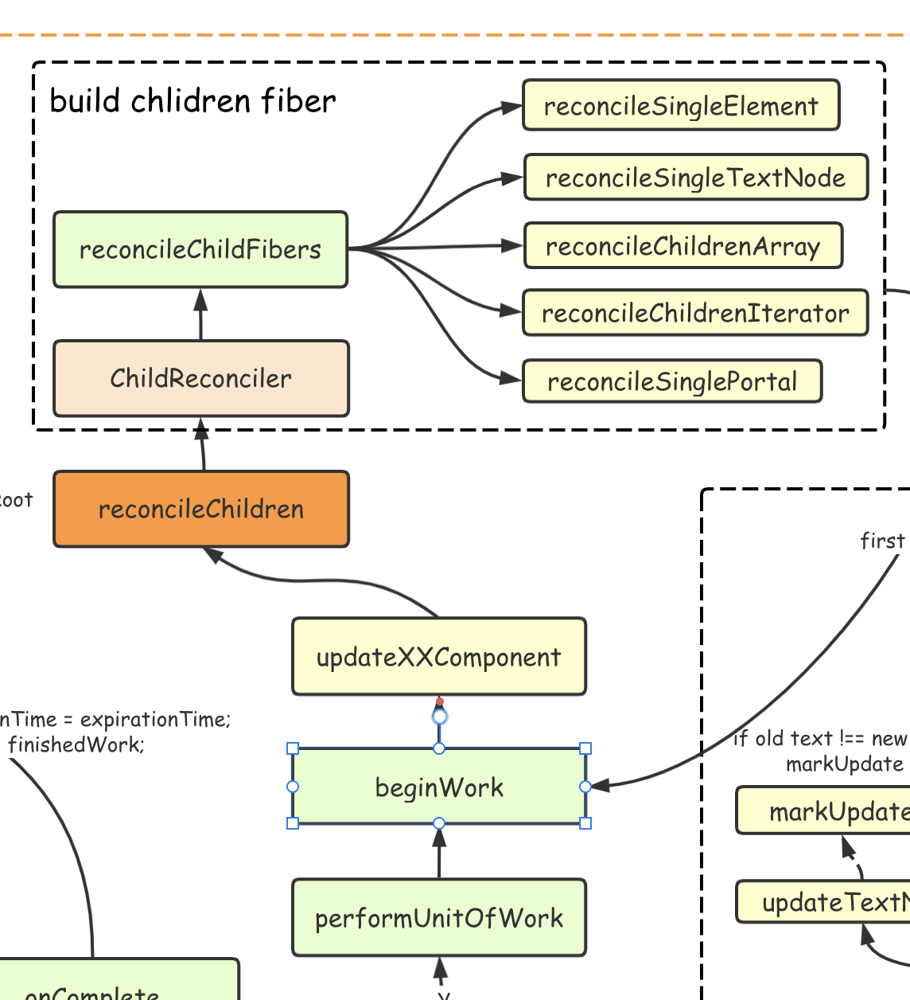
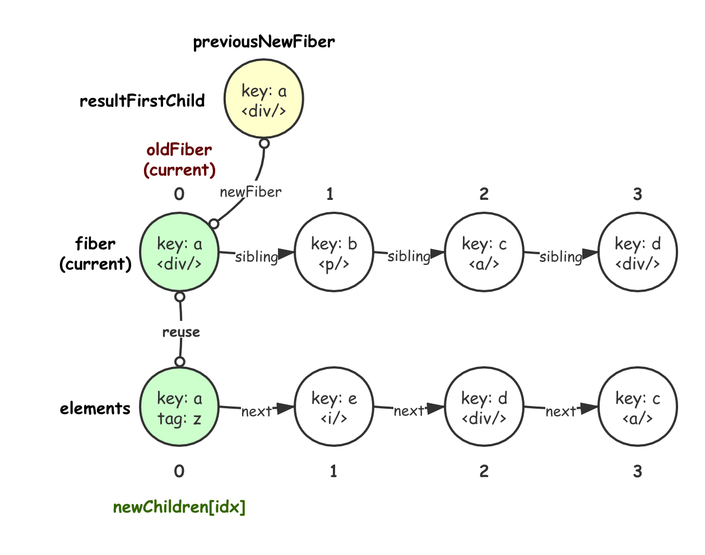
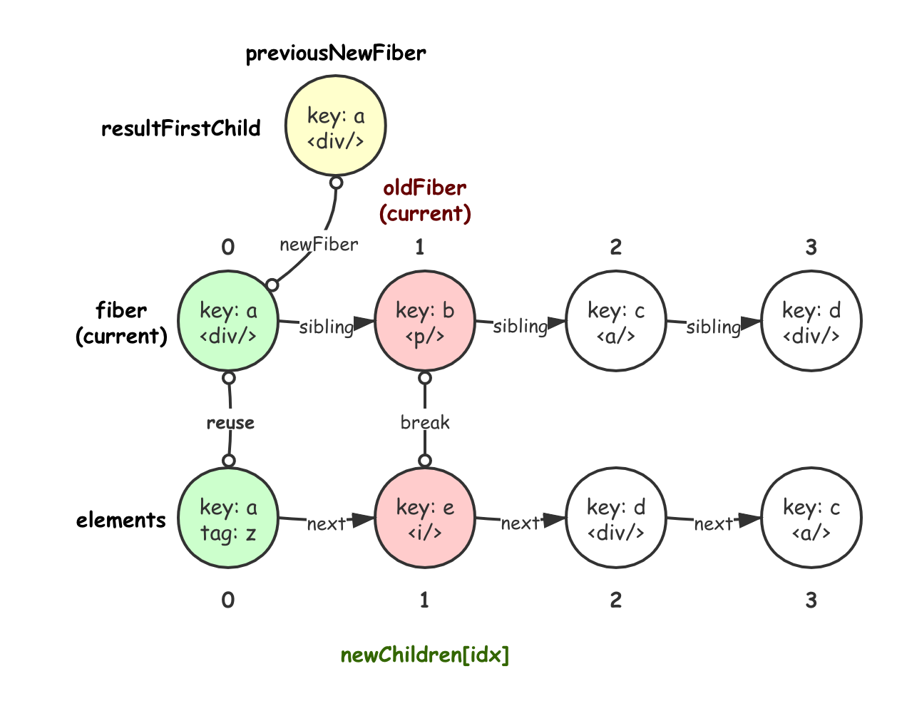
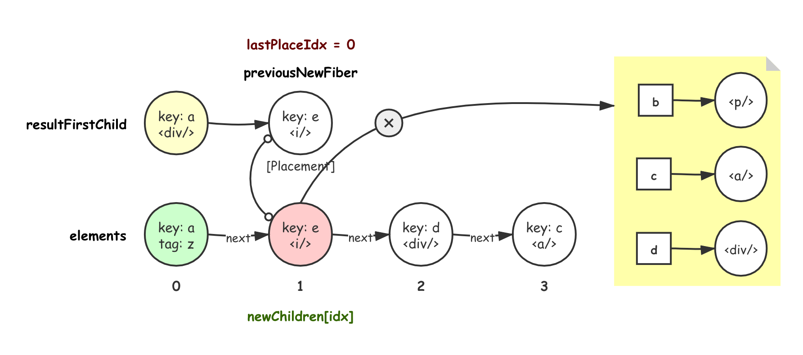
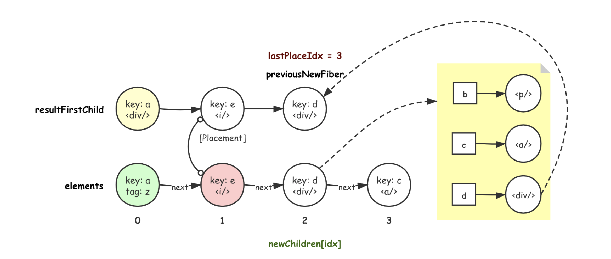
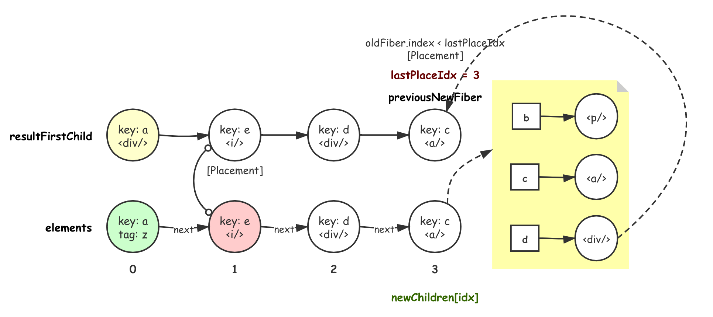
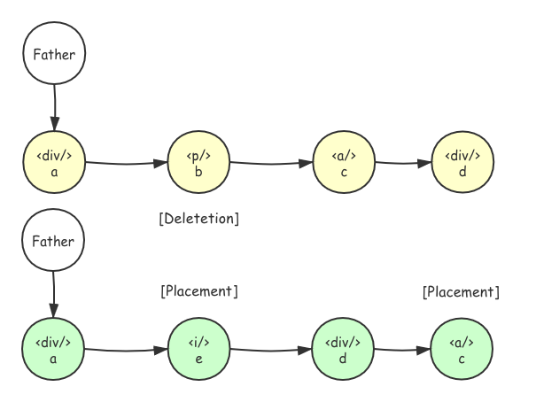

#  beginWork

[react-reconciler/src/ReactFiberScheduler.js]()

```ts
function performUnitOfWork(workInProgress: Fiber): Fiber | null {
  const current = workInProgress.alternate;
  let next = beginWork(current, workInProgress, nextRenderExpirationTime);
  return next;
}
```

> 为什么 `current` 在这里被当做 `alternate`？
>
> 因为每次更新完之后 `current` 和 `alternate` 都要交换位置。



老规矩先回顾一下入口函数的调用(删除了很多逻辑)来承上启下，`beginWork`用于计算出当前任务单元的 `fiber`.这个函数会根据各种不同的 `ElementType` 来使用不同的优化和生成子级 `Fiber` 策略，同时还会设置生成过程中产生的副作用标记位：

这个入口函数的执行分两种情况：

+ 第一种情况就是当前的 `fiber` 没有任何的更新任务：

  ```ts
  if (current !== null) 
      if (
  			oldProps === newProps &&
        !hasLegacyContextChanged() &&
        (updateExpirationTime === NoWork ||
          updateExpirationTime > renderExpirationTime)
       )
  ```

  这个时候会执行一些关于 `context` 的操作，然后执行 `bailoutOnAlreadyFinishedWork`，这个函数会再次判断子节点是否有更新任务，没有他就返回 `null` 来停止向下遍历，如果子节点有任务它会跳过当前节点。

  ```ts
  function bailoutOnAlreadyFinishedWork(
    current: Fiber | null,
    workInProgress: Fiber,
    renderExpirationTime: ExpirationTime,
  ): Fiber | null {
    // Check if the children have any pending work.
    const childExpirationTime = workInProgress.childExpirationTime;
    if (
      childExpirationTime === NoWork ||
      childExpirationTime > renderExpirationTime
    ) {
      return null;
    } else {
      cloneChildFibers(current, workInProgress);
      return workInProgress.child;
    }
  }
  ```

+ 如果 `fiber` 上有更新任务，首先它会标记 `workInProgress.expirationTime = NoWork;` 清空节点的 `expirationTime`。然后对与不同的组件执行不同的`fiber` 更新|构建方案。

[react-reconciler/src/ReactFiberBeginWork.js]()

```ts
function beginWork(
  current: Fiber | null,
  workInProgress: Fiber,
  renderExpirationTime: ExpirationTime,
): Fiber | null {
  const updateExpirationTime = workInProgress.expirationTime;

  if (current !== null) {
    const oldProps = current.memoizedProps;
    const newProps = workInProgress.pendingProps;
    if (
      oldProps === newProps &&
      !hasLegacyContextChanged() &&
      (updateExpirationTime === NoWork ||
        updateExpirationTime > renderExpirationTime)
    ) {
      // This fiber does not have any pending work. Bailout without entering
      // the begin phase. There's still some bookkeeping we that needs to be done
      // in this optimized path, mostly pushing stuff onto the stack.
      switch (workInProgress.tag) {
        case HostRoot:
          pushHostRootContext(workInProgress);
          resetHydrationState();
          break;
        case HostComponent:
          pushHostContext(workInProgress);
          break;
        case ClassComponent: {
          const Component = workInProgress.type;
          // ComponentType, if host element it will be a string likes 'div'
          if (isLegacyContextProvider(Component)) {
            pushLegacyContextProvider(workInProgress);
          }
          break;
        }
        case HostPortal:
          pushHostContainer(
            workInProgress,
            workInProgress.stateNode.containerInfo,
          );
          break;
        case ContextProvider: {
          const newValue = workInProgress.memoizedProps.value;
          pushProvider(workInProgress, newValue);
          break;
        }
        case Profiler:
          if (enableProfilerTimer) {
            workInProgress.effectTag |= Update;
          }
          break;
        case SuspenseComponent: {
          const state: SuspenseState | null = workInProgress.memoizedState;
          const didTimeout = state !== null && state.didTimeout;
          if (didTimeout) {
            // If this boundary is currently timed out, we need to decide
            // whether to retry the primary children, or to skip over it and
            // go straight to the fallback. Check the priority of the primary
            // child fragment.
            const primaryChildFragment: Fiber = (workInProgress.child: any);
            const primaryChildExpirationTime =
              primaryChildFragment.childExpirationTime;
            if (
              primaryChildExpirationTime !== NoWork &&
              primaryChildExpirationTime <= renderExpirationTime
            ) {
              // The primary children have pending work. Use the normal path
              // to attempt to render the primary children again.
              return updateSuspenseComponent(
                current,
                workInProgress,
                renderExpirationTime,
              );
            } else {
              // The primary children do not have pending work with sufficient
              // priority. Bailout.
              const child = bailoutOnAlreadyFinishedWork(
                current,
                workInProgress,
                renderExpirationTime,
              );
              if (child !== null) {
                // The fallback children have pending work. Skip over the
                // primary children and work on the fallback.
                return child.sibling;
              } else {
                return null;
              }
            }
          }
          break;
        }
      }
      return bailoutOnAlreadyFinishedWork(
        current,
        workInProgress,
        renderExpirationTime,
      );
    }
  }

  // Before entering the begin phase, clear the expiration time.
  workInProgress.expirationTime = NoWork;

  switch (workInProgress.tag) {
    case IndeterminateComponent: {
      const elementType = workInProgress.elementType;
      return mountIndeterminateComponent(
        current,
        workInProgress,
        elementType,
        renderExpirationTime,
      );
    }
    case LazyComponent: {
      const elementType = workInProgress.elementType;
      return mountLazyComponent(
        current,
        workInProgress,
        elementType,
        updateExpirationTime,
        renderExpirationTime,
      );
    }
    case FunctionComponent: {
      const Component = workInProgress.type;
      // ComponentType, if host element it will be a string likes 'div'
      const unresolvedProps = workInProgress.pendingProps;
      // future props which has not been resolved
      const resolvedProps =
        workInProgress.elementType === Component
          ? unresolvedProps
          : resolveDefaultProps(Component, unresolvedProps);
          // SuspenseComponent 异步需要resolve
      return updateFunctionComponent(
        current,
        workInProgress,
        Component,
        resolvedProps,
        renderExpirationTime,
      );
    }
    case ClassComponent: {
      const Component = workInProgress.type;
      const unresolvedProps = workInProgress.pendingProps;
      const resolvedProps =
        workInProgress.elementType === Component
          ? unresolvedProps
          : resolveDefaultProps(Component, unresolvedProps);
      return updateClassComponent(
        current,
        workInProgress,
        Component,
        resolvedProps,
        renderExpirationTime,
      );
    }
    case HostRoot:
      return updateHostRoot(current, workInProgress, renderExpirationTime);
    case HostComponent:
      return updateHostComponent(current, workInProgress, renderExpirationTime);
    case HostText:
      return updateHostText(current, workInProgress);
    case SuspenseComponent:
      return updateSuspenseComponent(
        current,
        workInProgress,
        renderExpirationTime,
      );
    case HostPortal:
      return updatePortalComponent(
        current,
        workInProgress,
        renderExpirationTime,
      );
    case ForwardRef: {
      const type = workInProgress.type;
      const unresolvedProps = workInProgress.pendingProps;
      const resolvedProps =
        workInProgress.elementType === type
          ? unresolvedProps
          : resolveDefaultProps(type, unresolvedProps);
      return updateForwardRef(
        current,
        workInProgress,
        type,
        resolvedProps,
        renderExpirationTime,
      );
    }
    case Fragment:
      return updateFragment(current, workInProgress, renderExpirationTime);
    case Mode:
      return updateMode(current, workInProgress, renderExpirationTime);
    case Profiler:
      return updateProfiler(current, workInProgress, renderExpirationTime);
    case ContextProvider:
      return updateContextProvider(
        current,
        workInProgress,
        renderExpirationTime,
      );
    case ContextConsumer:
      return updateContextConsumer(
        current,
        workInProgress,
        renderExpirationTime,
      );
    case MemoComponent: {
      const type = workInProgress.type;
      const unresolvedProps = workInProgress.pendingProps;
      const resolvedProps = resolveDefaultProps(type.type, unresolvedProps);
      return updateMemoComponent(
        current,
        workInProgress,
        type,
        resolvedProps,
        updateExpirationTime,
        renderExpirationTime,
      );
    }
    case SimpleMemoComponent: {
      return updateSimpleMemoComponent(
        current,
        workInProgress,
        workInProgress.type,
        workInProgress.pendingProps,
        updateExpirationTime,
        renderExpirationTime,
      );
    }
    case IncompleteClassComponent: {
      const Component = workInProgress.type;
      const unresolvedProps = workInProgress.pendingProps;
      const resolvedProps =
        workInProgress.elementType === Component
          ? unresolvedProps
          : resolveDefaultProps(Component, unresolvedProps);
      return mountIncompleteClassComponent(
        current,
        workInProgress,
        Component,
        resolvedProps,
        renderExpirationTime,
      );
    }
    default:
      invariant(
        false,
        'Unknown unit of work tag. This error is likely caused by a bug in ' +
          'React. Please file an issue.',
      );
  }
}
```

> [小贴士：]()解读完这几种情况的处理我发现，`FunctionComponent` 和 `ClassComponent` 都不会渲染 `props.children` 而是会渲染 `return`返回的或者 `render` 返回的内容。

## 1. FunctionComponent

[react-reconciler/src/ReactFiberBeginWork.js]()

```ts
// Before entering the begin phase, clear the expiration time.
workInProgress.expirationTime = NoWork;

switch (workInProgress.tag) {
  case FunctionComponent: {
    const Component = workInProgress.type;
    // ComponentType, if host element it will be a string likes 'div'
    const unresolvedProps = workInProgress.pendingProps;
    // future props which has not been resolved
    const resolvedProps =
         workInProgress.elementType === Component
    			? unresolvedProps
    			: resolveDefaultProps(Component, unresolvedProps);
    // SuspenseComponent 异步需要resolve
    return updateFunctionComponent(
      current,
      workInProgress,
      Component,
      resolvedProps,
      renderExpirationTime,
    );
  }
}
```

先从最简单的 `FunctionComponent`开始分析一下 `fiber` 构建的流程，首先 `Component = workInProgress.type;` 其实就是获取函数组件的那个函数，然后声明两个属性 `unresolvedProps` 和 `resolvedProps` 分别代表未计算和计算完成的 `prop`，然后调用 `updateFunctionComponent`。

### 1.1 updateFunctionComponent

[react-reconciler/src/ReactFiberBeginWork.js]()

```ts
// 删除了 context 以及 DEV 相关代码：
function updateFunctionComponent(
  current,
  workInProgress,
  Component,
  nextProps: any,
  renderExpirationTime,
) {
  let nextChildren = Component(nextProps, context); // 计算出子节点

  // React DevTools reads this flag. 只是用来表明这个组件有被更新
  workInProgress.effectTag |= PerformedWork;
  reconcileChildren( 
    // component(ReactElement) -> Children Fibers
    current,
    workInProgress,
    nextChildren,
    renderExpirationTime,
  );
  return workInProgress.child;
}
```

这个函数的流程也很简单，就是计算出子节点(执行一下函数组件)，然后改变标识位，调用 `reconcileChildren`，将计算出的子节点映射到子 `fiber` 并返回计算出的子 `fiber`。

### 1.2 reconcileChildren

[react-reconciler/src/ReactFiberBeginWork.js]()

```ts
export function reconcileChildren(
  current: Fiber | null,
  workInProgress: Fiber,
  nextChildren: any,
  renderExpirationTime: ExpirationTime,
) {
  if (current === null) {
    workInProgress.child = mountChildFibers(
      workInProgress,
      null,
      nextChildren,
      renderExpirationTime,
    );
  } else {
    workInProgress.child = reconcileChildFibers(
      workInProgress,
      current.child,
      nextChildren,
      renderExpirationTime,
    );
  }
}
```

`reconcileChildren` 根据 `current`是否为 `null`(`fiber`是否首次更新)，调用 `mountChildFibers` 或者 `reconcileChildFibers` 生成子 `fiber` 并且挂载。

## 2. ChildReconciler

[react-reconciler/src/ReactChildFiber.js]()

```ts
export const reconcileChildFibers = ChildReconciler(true);
export const mountChildFibers = ChildReconciler(false);
```

这个函数是本片的重头戏，是真正负责 `fiber` 节点计算(新建、更新、删除、`etc`)的部分，通过标识位衍生出 `reconcileChildFibers` 和 `mountChildFibers` 两个函数作为对外暴露的接口。

[react-reconciler/src/ReactChildFiber.js]()

```ts
function ChildReconciler(shouldTrackSideEffects) {
  function deleteChild()	// ok
  function deleteRemainingChildren()	// ok
  function mapRemainingChildren()
  function useFiber() // ok
  function placeChild() // done
  function placeSingleChild() 
  function updateTextNode() // done
  function updateElement() // done
  function updatePortal()
  function updateFragment() // done
  function createChild() // done
  function updateSlot() // done
  function updateFromMap() // done
  function warnOnInvalidKey()
  function reconcileChildrenArray() // done
  function reconcileChildrenIterator() // done
  function reconcileSingleTextNode() // ok
  function reconcileSingleElement() // ok
  function reconcileSinglePortal()
  function reconcileChildFibers() // ok
  return reconcileChildFibers;
}
```

对于这个大的闭包，它的参数要注意一下：`shouldTrackSideEffects`，第一次更新的时候，子 `fiber` 还没有构建，所以有一些副作用不会产生，`shouldTrackSideEffects` 为 `false`。

因为负责的任务太多，所以这个函数实在是又臭又长(设计太多子函数闭包)，不过返回值清晰明了，就是函数 `reconcileChildFibers` 所以先从这个函数入手看看：

### 2.1 reconcileChildFibers

代码太长了我们拆开来看，第一步计算出 `isUnkeyedTopLevelFragment`，用于判断新元素的顶级节点是不是一个 `Fragment` 类型，如果说是那么将其子节点作为新的节点 `newChild = newChild.props.children;`：

[react-reconciler/src/ReactChildFiber.js]()

```ts
  function reconcileChildFibers(
    returnFiber: Fiber,
    currentFirstChild: Fiber | null,
    newChild: any,
    expirationTime: ExpirationTime,
  ): Fiber | null {
    const isUnkeyedTopLevelFragment =
      typeof newChild === 'object' &&
      newChild !== null &&
      newChild.type === REACT_FRAGMENT_TYPE &&
      newChild.key === null;
      // 判断顶层节点是不是一个 Fragment 节点， <></>
    if (isUnkeyedTopLevelFragment) {
      newChild = newChild.props.children;
      // 直接跳过 Fragment
    }
// ...
```

之后判断 `newChild` 是不是一个对象，如果是对象那一般是由 `React.createElement` 或者 `createPortal` 等等内置函数或者 `jsx` 解析出来的对象 `$$typeof` 一般为 `REACT_ELEMENT_TYPE`或者其他，这个时候就会走 `reconcileSingleElement` 或者 `placeSingleChild`。

```ts
// ...
    // Handle object types
    const isObject = typeof newChild === 'object' && newChild !== null;

    if (isObject) {
      switch (newChild.$$typeof) {
        case REACT_ELEMENT_TYPE:
          return placeSingleChild(
            reconcileSingleElement(
              returnFiber,
              currentFirstChild,
              newChild,
              expirationTime,
            ),
          );
        case REACT_PORTAL_TYPE:
          return placeSingleChild(
            reconcileSinglePortal(
              returnFiber,
              currentFirstChild,
              newChild,
              expirationTime,
            ),
          );
      }
    }
// ...
```

内建对象解析完之后就还剩下面几种情况：

+ `newChild` 是一个数组，调用 `reconcileChildrenArray`。
+ `newChild` 是一个 文本节点，调用 `reconcileSingleTextNode`。
+ `newChild`是一个有遍历器接口的对象，调用 `reconcileChildrenIterator`。

如果上面这些判断都没命中，同时其还是一个对象那说明传入参数不合法，直接抛出错误。

```ts
//...
		if (typeof newChild === 'string' || typeof newChild === 'number') {
      return placeSingleChild(
        reconcileSingleTextNode(
          returnFiber,
          currentFirstChild,
          '' + newChild,
          expirationTime,
        ),
      );
    }

    if (isArray(newChild)) {
      return reconcileChildrenArray(
        returnFiber,
        currentFirstChild,
        newChild,
        expirationTime,
      );
    }

    if (getIteratorFn(newChild)) {
      return reconcileChildrenIterator(
        returnFiber,
        currentFirstChild,
        newChild,
        expirationTime,
      );
    }

    if (isObject) {
      throwOnInvalidObjectType(returnFiber, newChild);
    }
//...
```

如果说最后发现 `newChild` 是 `undefined` ，说明组件没有返回，这个时候 `react` 会做一些提示，但是不会抛出错误，并且会调用 `deleteRemainingChildren` 删除子树。

```ts
//...
		if (typeof newChild === 'undefined' && !isUnkeyedTopLevelFragment) {
      switch (returnFiber.tag) {
        case ClassComponent: {
          // do some report on dev mode
        }

        case FunctionComponent: {
          const Component = returnFiber.type;
          invariant(
            false,
            '...',
            Component.displayName || Component.name || 'Component',
          );
        }
      }
    }

    // Remaining cases are all treated as empty.
    return deleteRemainingChildren(returnFiber, currentFirstChild);
  }
```

### 2.2 reconcileSingleElement

先从分支的第一中情况，只有一个子元素开始，这个元素首先是一个简单的 `ReactElement` (可能是宿主节点)，调用这个函数之后我们传入四个参数：

+ `returnFiber`： 当前 `fiber` 节点，即调用 `ChildReconciler` 的节点。
+ `currentFirstChild`：☝️的第一个子节点，可能是 `null`(首次渲染)。
+ `element`：子 `fiber` 对应的 `ReactElement`。
+ `expirationTime`：传家宝。

这个函数可以分为两种情况，`currentFirstChild` 不是 `null`，说明是更新 `fiber` 那么很有可能某个老的子 `fiber` 和新的 `ReactElement`的 `key` 相同，并且两者类型(`type`)相同，或者两者的类型都是 `Fragment` 。

此时根据 `diff` 算法规则，这两个节点是可以看作相同节点的。

所以此时我们要遍历 `child`  找到可能存在的相同节点，找到了就可以调用 `useFiber` 保留此节点做一些必要的更新，然后调用 `deleteRemainingChildren` 删除其兄弟节点，因为 `reconcileSingleElement` 表示只有一个节点。

不过如果我们发现 `key` 相同的节点的 `type` 和 `elementType` 不相同，此时表示不可能存在可复用节点，所以全部删掉重建：`deleteRemainingChildren`。

```ts
  function reconcileSingleElement(
    returnFiber: Fiber,
    currentFirstChild: Fiber | null,
    element: ReactElement,
    expirationTime: ExpirationTime,
  ): Fiber {
    const key = element.key;
    // key
    let child = currentFirstChild;
    
    while (child !== null) {
      // TODO: If key === null and child.key === null, then this only applies to
      // the first item in the list.
      if (child.key === key) {
        if (
          child.tag === Fragment
            ? element.type === REACT_FRAGMENT_TYPE
            : child.elementType === element.type
        ) {
          deleteRemainingChildren(returnFiber, child.sibling);
          const existing = useFiber(
            child,
            element.type === REACT_FRAGMENT_TYPE
              ? element.props.children
              : element.props,
            expirationTime,
          );
          existing.ref = coerceRef(returnFiber, child, element);
          existing.return = returnFiber;
          return existing;
        } else {
          deleteRemainingChildren(returnFiber, child);
          break;
        }
      } else {
        deleteChild(returnFiber, child);
      }
      child = child.sibling;
    }
// ...
```

没有走复用的情况就只能新建节点了，分为两种情况：

+ `Fragment`：调用 `createFiberFromFragment`。
+ `Element`：调用 `createFiberFromElement`。

两者都要衔接 `return` 链条，`createFiberFromElement` 还要对 `ref` 做额外的操作。

```ts
//...
		if (element.type === REACT_FRAGMENT_TYPE) {
      const created = createFiberFromFragment(
        element.props.children,
        returnFiber.mode,
        expirationTime,
        element.key,
      );
      created.return = returnFiber;
      return created;
    } else {
      const created = createFiberFromElement(
        element,
        returnFiber.mode,
        expirationTime,
      );
      created.ref = coerceRef(returnFiber, currentFirstChild, element);
      created.return = returnFiber;
      return created;
    }
  }
```

#### 2.2.1 deleteChild

这里碰巧用到了 `deleteChild`(同样是`ChildReconciler`的子函数)那就来讲解一下，这个函数主要是更改了要删除 `fiber` 的 `effect chain`，将要删除的 `fiber` 添加进去并且标记 `effectTag` 为 `Deletion`，做一个伪删除，最后执行在 `commit` 阶段。

值得注意的是对于 `Deletetion` 的标记要直接添加对应 `fiber` 到 `effectChain`，这是因为我们在 `completeWork` 阶段会遍历新的 `fiberTree` 来收集 `effectTag`构造 `effectChain`，而 `Deletion` 存在于老的`fiberTree`上拿不到，所以这里要手动添加。

```ts
  function deleteChild(returnFiber: Fiber, childToDelete: Fiber): void {
    if (!shouldTrackSideEffects) {
      // Noop.
      return;
    }
    // Deletions are added in reversed order so we add it to the front.
    // At this point, the return fiber's effect list is empty except for
    // deletions, so we can just append the deletion to the list. The remaining
    // effects aren't added until the complete phase. Once we implement
    // resuming, this may not be true.
    const last = returnFiber.lastEffect;
    if (last !== null) {
      last.nextEffect = childToDelete;
      returnFiber.lastEffect = childToDelete;
    } else {
      returnFiber.firstEffect = returnFiber.lastEffect = childToDelete;
    }
    childToDelete.nextEffect = null;
    childToDelete.effectTag = Deletion;
  }
```

> 这个 `effect` 是作用在 `current` 上的，所以不再 `completeWork` 那里添加。

#### 2.2.2 deleteRemainingChildren

就是对 `deleteChild` 做一个迭代，没什么好说的：

```ts
  function deleteRemainingChildren(
    returnFiber: Fiber,
    currentFirstChild: Fiber | null,
  ): null {
    if (!shouldTrackSideEffects) {
      // Noop.
      return null;
    }

    let childToDelete = currentFirstChild;
    while (childToDelete !== null) {
      deleteChild(returnFiber, childToDelete);
      childToDelete = childToDelete.sibling;
    }
    return null;
  }
```

#### 2.2.3 useFiber

`useFiber` 根据原本可复用的 `fiber(current)` 构建一个 `WIP`，并且重置他的 `sibling`：

```ts
  function useFiber(
    fiber: Fiber,
    pendingProps: mixed,
    expirationTime: ExpirationTime,
  ): Fiber {
    // We currently set sibling to null and index to 0 here because it is easy
    // to forget to do before returning it. E.g. for the single child case.
    const clone = createWorkInProgress(fiber, pendingProps, expirationTime);
    clone.index = 0;
    clone.sibling = null;
    return clone;
  }
```

> `createWorkInProgress` 和 `createFiberFromElement` 这种关于 `fiber` 的函数，在 `fiber` 那章讲解。

### 2.3 reconcileSingleTextNode

如果说 `newChild` 是一个文本节点，那就会走这个入口，同样是一个复用和新建的过程，只是调用 `ReactFiber` 提供的 `API` 不同：

```ts
  function reconcileSingleTextNode(
    returnFiber: Fiber,
    currentFirstChild: Fiber | null,
    textContent: string,
    expirationTime: ExpirationTime,
  ): Fiber {
    // There's no need to check for keys on text nodes since we don't have a
    // way to define them.
    if (currentFirstChild !== null && currentFirstChild.tag === HostText) {
      // We already have an existing node so let's just update it and delete
      // the rest.
      deleteRemainingChildren(returnFiber, currentFirstChild.sibling);
      const existing = useFiber(currentFirstChild, textContent, expirationTime);
      existing.return = returnFiber;
      return existing;
    }
    // The existing first child is not a text node so we need to create one
    // and delete the existing ones.
    deleteRemainingChildren(returnFiber, currentFirstChild);
    const created = createFiberFromText(
      textContent,
      returnFiber.mode,
      expirationTime,
    );
    created.return = returnFiber;
    return created;
  }
```

### 2.4 reconcileChildrenArray

`reconcileChildrenArray` 对应 `newChildren` 是一个 `Array` 的情况，这种情况下涉及到两个数组的 `diff`比较，`react`使用了一种算法尽量做到最小的时间复杂度：

#### 2.4.1 第一次循环

第一个循环顺序遍历 `oldFiber` 和 `newChildren[newIdx]`，遍历过程分为乱序和没乱序两种情况：

+ 一旦遇到乱序节点，说明可能操作者 `hack`了 `fiberTree` 导致 `oldFiber`的 `index`乱序了，此时设置 `oldFiber` 为 `null`，调用 `updateSlot` 创建 `newFiber` 的第二个参数就是 `null`，那么基本上 `updateSlot` 返回的  `newFiber` 都是 `null`，此时 `oldFiber` 归位跳出循环。

+ 如果没遇到乱序节点，那在 `updateSlot` 中会进行 `key` 的比较，如果 `key` 相同在选用不同的策略比较 `tag`(详见 `updateSlot`)，总之前后节点 `key` 相同就一定不会返回 `null` 不会跳出循环：

  + `tag` 相同那 `updateSlot` 调用的子函数可能复用了这个 `oldFiber`。

  + `tag` 不相同，`newFiber` 是新建的，没复用 `oldFiber` 这个时候走到这个判断：

    ```ts
    if (shouldTrackSideEffects&& (oldFiber && newFiber.alternate === null)
    ```

    在 `shouldTrackSideEffects` 的情况下(非第一次创建)要删除 `oldFiber`。

+ 现在新节点 `newFiber` 已经创建，该删除的 `oldFiber` 已经标记，此时要调用 `placeChild` 放置节点。

+ 之后在 `resultingFirstChild` 放置 `newFiber`。

```ts
  function reconcileChildrenArray(
    returnFiber: Fiber,
    currentFirstChild: Fiber | null,
    newChildren: Array<*>,
    expirationTime: ExpirationTime,
  ): Fiber | null {
    let oldFiber = currentFirstChild; // null in first render
    let nextOldFiber = null;
 
    let newIdx = 0;
		let lastPlacedIndex = 0;
      
    let resultingFirstChild: Fiber | null = null;
    let previousNewFiber: Fiber | null = null;
    
    for (; oldFiber !== null && newIdx < newChildren.length; newIdx++) {
      // 顺序遍历
      if (oldFiber.index > newIdx) { // 乱序了
        nextOldFiber = oldFiber;
        oldFiber = null;
      } else {
        nextOldFiber = oldFiber.sibling;
      }
      const newFiber = updateSlot(
        returnFiber,
        oldFiber,
        newChildren[newIdx],
        expirationTime,
      );
      if (newFiber === null) {
        if (oldFiber === null) {
          oldFiber = nextOldFiber;
        }
        break;
      }
      if (shouldTrackSideEffects) {
        if (oldFiber && newFiber.alternate === null) {
          // We matched the slot, but we didn't reuse the existing fiber, so we
          // need to delete the existing child.
          deleteChild(returnFiber, oldFiber);
        }
      }
      lastPlacedIndex = placeChild(newFiber, lastPlacedIndex, newIdx);
      if (previousNewFiber === null) {
        resultingFirstChild = newFiber;
      } else {
        // TODO: Defer siblings if we're not at the right index for this slot.
        // I.e. if we had null values before, then we want to defer this
        // for each null value. However, we also don't want to call updateSlot
        // with the previous one.
        previousNewFiber.sibling = newFiber;
      }
      previousNewFiber = newFiber;
      oldFiber = nextOldFiber;
    }
// ....
```

**栗子 🌰**

来看一个具体的例子，首先第一次比较节点，`key` 和 `tag` 都相同，所以复用节点，并且更新 `previousNewFiber` 为这个`newFiber` ，然后设置 `newFiber` 为 `resultFisrtChild` 的头节点，更新 ` lastPlaceElement=0`。



第二轮，对比两节点 `key` 不相同，`updateSlot` 返回 `null`，`newFiber === null`， 直接跳出循环：



#### 2.4.2 第二个循环

第一个循环会在碰到第一个无法重建或者重用的`fiber`节点(乱序、`key\tag`不一致、`etc`)的时候退出。可能有下面两种简单情况：

+ 全部节点都走完了 `newIdx === newChildren.length`，此时删除所有剩余的 `oldFiber`，返回 `resultingFirstChild`。
+ `oldFiber`  走完了，`newChildren` 全部新建 `fiber` 并且插入到 `resultingFirstChild` 中返回。

```ts
// ...
		if (newIdx === newChildren.length) {
      // We've reached the end of the new children. We can delete the rest.
      deleteRemainingChildren(returnFiber, oldFiber);
      return resultingFirstChild;
    }

    if (oldFiber === null) {
      // If we don't have any more existing children we can choose a fast path
      // since the rest will all be insertions.
      for (; newIdx < newChildren.length; newIdx++) {
        const newFiber = createChild(
          returnFiber,
          newChildren[newIdx],
          expirationTime,
        );
        if (!newFiber) {
          continue;
        }
        lastPlacedIndex = placeChild(newFiber, lastPlacedIndex, newIdx);
        if (previousNewFiber === null) {
          // TODO: Move out of the loop. This only happens for the first run.
          resultingFirstChild = newFiber;
        } else {
          previousNewFiber.sibling = newFiber;
        }
        previousNewFiber = newFiber;
      }
      return resultingFirstChild;
    }
//...
```

#### 2.4.3 第三个循环

还有最后一种较为复杂的情况就是两个都没走完，这个时候我们就需要使用一种算法来让 `oldFiber` 中 `key` 和 `newChildren` 一致的进行快速匹配，分为如下两个步骤：

+ `mapRemainingChildren(returnFiber, oldFiber);`给剩余的 `oldFibers` 通过 `key` 或者 `index` 做一个映射。
+ 之后顺序遍历 `newChildren`，使用`updateFromMap`创建新 `fiber` 或者更新老 `fiber`，总之只要 `newChildren` 是合法的就可以创建 `fiber`。
+ 之后根据 `newFiber` 的 `key` 或者 `idx` 删除 `oldfiber`。
+ `placeChild` 对 `newFiber` 进行移动。
+ 将新的 `newFiber` 加入到 `resultingFirstChild` 中。

```ts
//...
    // Add all children to a key map for quick lookups.
    const existingChildren = mapRemainingChildren(returnFiber, oldFiber);

    // Keep scanning and use the map to restore deleted items as moves.
    for (; newIdx < newChildren.length; newIdx++) {
      const newFiber = updateFromMap(
        existingChildren,
        returnFiber,
        newIdx,
        newChildren[newIdx],
        expirationTime,
      );
      if (newFiber) {
        if (shouldTrackSideEffects) {
          if (newFiber.alternate !== null) {
            // The new fiber is a work in progress, but if there exists a
            // current, that means that we reused the fiber. We need to delete
            // it from the child list so that we don't add it to the deletion
            // list.
            existingChildren.delete(
              newFiber.key === null ? newIdx : newFiber.key,
            );
          }
        }
        lastPlacedIndex = placeChild(newFiber, lastPlacedIndex, newIdx);
        if (previousNewFiber === null) {
          resultingFirstChild = newFiber;
        } else {
          previousNewFiber.sibling = newFiber;
        }
        previousNewFiber = newFiber;
      }
    }
// ...
```

最后防止老的 `oldfiber` 比较多(比 `newChildren`)，还要再遍历 `existingChildren` 赶尽杀绝。

```ts
    if (shouldTrackSideEffects) {
      // Any existing children that weren't consumed above were deleted. We need
      // to add them to the deletion list.
      existingChildren.forEach(child => deleteChild(returnFiber, child));
    }

    return resultingFirstChild;
  }
```

最后返回 `resultingFirstChild` 就是新的 `child` 链条了。

**栗子 🌰**

第一步先根据 `oldFiber` 的 `index` 和 `key` 做一个节点映射，之后从 `newChild` 做匹配，对于 `key: e`没拿到任何的对应节点，所以` Placement` 一个 `newFiber`：



之后到了 `key: d` 在` map`里面找到了对应的节点，尝试并且成功复用节点，`placeChild`的时候回更新 `lastPlaceIdx = 3`，也就是 `oldFiber` 上的 `index`，现在我们知道了这个局部变量的含义 `lastPlaceIdx：目前最后一个复用的节点id`，也就是说只要复用节点的 `index` 比 `lastPlaceIdx`大，就说明没有乱序。



最后一个节点，同样在映射里面找到，并且可以复用。但是 `placeChild` 中由于 `lastPlaceIdx：目前最后一个复用的节点id` 比这个复用的节点的 `id`要大，说明乱序了，所以要标记 `Placement`。



最后的构建结果就是这个样子的，新老` fiberTree`差异很大，最后在 `commit`阶段会根据 `Deletetion`删除掉 `<p>`，然后根据 `Placement` 改变 `dom` 节点位置：



#### 2.4.1 updateSlot

`updateSlot` 是 `reconcileChildrenArray` 用来执行单元任务的，它比较 `oldFiber` 和 `newChild`，如果 `key` 相同则更新，不然返回 `null`：

第一种情况中 `old` 和 `new` 都都没有 `key`，并且 `newChild` 还是一个文本节点，那就走 `updateTextNode` 其内部会决定是重建还是更新：

```ts
  function updateSlot(
    returnFiber: Fiber,
    oldFiber: Fiber | null,
    newChild: any,
    expirationTime: ExpirationTime,
  ): Fiber | null {
    // Update the fiber if the keys match, otherwise return null.

    const key = oldFiber !== null ? oldFiber.key : null;
    // 如果乱序了这里是不会有 key 的
    if (typeof newChild === 'string' || typeof newChild === 'number') {
      // Text nodes don't have keys. If the previous node is implicitly keyed
      // we can continue to replace it without aborting even if it is not a text
      // node.
      if (key !== null) {
        return null;
      }
      return updateTextNode(
        returnFiber,
        oldFiber,
        '' + newChild,
        expirationTime,
      );
    }
//...
```

之后都有 `key` 的情况就对 `$$typeof` 做一个判断，具体的更新的逻辑细化到  `updateFragment`、`updateElement`、`updatePortal` 中。

```ts
//...
    if (typeof newChild === 'object' && newChild !== null) {
      switch (newChild.$$typeof) {
        case REACT_ELEMENT_TYPE: {
          if (newChild.key === key) {
            if (newChild.type === REACT_FRAGMENT_TYPE) {
              return updateFragment(
                returnFiber,
                oldFiber,
                newChild.props.children,
                expirationTime,
                key,
              );
            }
            return updateElement(
              returnFiber,
              oldFiber,
              newChild,
              expirationTime,
            );
          } else {
            return null;
          }
        }
        case REACT_PORTAL_TYPE: {
          if (newChild.key === key) {
            return updatePortal(
              returnFiber,
              oldFiber,
              newChild,
              expirationTime,
            );
          } else {
            return null;
          }
        }
      }

      if (isArray(newChild) || getIteratorFn(newChild)) {
        if (key !== null) {
          return null;
        }

        return updateFragment(
          returnFiber,
          oldFiber,
          newChild,
          expirationTime,
          null,
        );
      }

      throwOnInvalidObjectType(returnFiber, newChild);
    }
    return null;
  }
```

#### 2.4.2 updateTextNode

`current` 为 `null` 或者 `current.tag !== HostText` 都表示 `current` 不能复用为 `TextNode` 此时需要新建，否则可以使用 `useFiber` 复用。

```ts
  function updateTextNode(
    returnFiber: Fiber,
    current: Fiber | null,
    textContent: string,
    expirationTime: ExpirationTime,
  ) {
    if (current === null || current.tag !== HostText) {
      // Insert
      const created = createFiberFromText(
        textContent,
        returnFiber.mode,
        expirationTime,
      );
      created.return = returnFiber;
      return created;
    } else {
      // Update
      const existing = useFiber(current, textContent, expirationTime);
      existing.return = returnFiber;
      return existing;
    }
  }
```

#### 2.4.3 updateElement

和上面的类似，只是可复用条件变成了 `current.elementType === element.type`：

```ts
  function updateElement(
    returnFiber: Fiber,
    current: Fiber | null,
    element: ReactElement,
    expirationTime: ExpirationTime,
  ): Fiber {
    if (current !== null && current.elementType === element.type) {
      // Move based on index
      const existing = useFiber(current, element.props, expirationTime);
      existing.ref = coerceRef(returnFiber, current, element);
      existing.return = returnFiber;
      return existing;
    } else {
      // Insert
      const created = createFiberFromElement(
        element,
        returnFiber.mode,
        expirationTime,
      );
      created.ref = coerceRef(returnFiber, current, element);
      created.return = returnFiber;
      return created;
    }
  }
```

#### 2.4.4 updateFragment

和上面的类似，只是可复用条件变成了 `current.tag == Fragment`：

```ts
  function updateFragment(
    returnFiber: Fiber,
    current: Fiber | null,
    fragment: Iterable<*>,
    expirationTime: ExpirationTime,
    key: null | string,
  ): Fiber {
    if (current === null || current.tag !== Fragment) {
      // Insert
      const created = createFiberFromFragment(
        fragment,
        returnFiber.mode,
        expirationTime,
        key,
      );
      created.return = returnFiber;
      return created;
    } else {
      // Update
      const existing = useFiber(current, fragment, expirationTime);
      existing.return = returnFiber;
      return existing;
    }
  }
```

#### 2.4.5 placeChild

如果这个 `newFiber` 是更新来的，那么比较他和 `oldFiber` 的位置关系(通过 `alternate`)，如果这个节点是新插入的，或者他移动过，那就标记 `effectTag` 为 `Placement`。

在这里我们知道了 `lastPlacedIndex` 的含义， `lastPlaceIdx：目前最后一个复用且没乱序的节点id`，每次碰到复用节点如果没乱序就会更新这个变量，记录目前复用的最大 `idx`，`oldFiber.index < lastPlaceIdx`就说明乱序了。

```ts
  function placeChild(
    newFiber: Fiber,
    lastPlacedIndex: number,
    newIndex: number,
  ): number {
    newFiber.index = newIndex;
    // 设置 index
    if (!shouldTrackSideEffects) {
      // Noop.
      return lastPlacedIndex;
    }
    const current = newFiber.alternate;
    if (current !== null) {
      const oldIndex = current.index;
      if (oldIndex < lastPlacedIndex) {
        // This is a move.
        newFiber.effectTag = Placement;
        return lastPlacedIndex;
      } else {
        // This item can stay in place.
        return oldIndex;
      }
    } else {
      // This is an insertion.
      newFiber.effectTag = Placement;
      return lastPlacedIndex;
    }
  }
```

#### 2.4.6 mapRemainingChildren

给剩余的 `oldFibers` 通过 `key` 或者 `index` 做一个映射。

```ts
  function mapRemainingChildren(
    returnFiber: Fiber,
    currentFirstChild: Fiber,
  ): Map<string | number, Fiber> {
    // Add the remaining children to a temporary map so that we can find them by
    // keys quickly. Implicit (null) keys get added to this set with their index
    // instead.
    const existingChildren: Map<string | number, Fiber> = new Map();

    let existingChild = currentFirstChild;
    while (existingChild !== null) {
      if (existingChild.key !== null) {
        existingChildren.set(existingChild.key, existingChild);
      } else {
        existingChildren.set(existingChild.index, existingChild);
      }
      existingChild = existingChild.sibling;
    }
    return existingChildren;
  }

```

#### 2.4.7 updateFromMap

这个方法和 `updateSlot` 实在没什么区别，我都不想写下来了，就是判断一下有没有相同`key` 或者  `idx` 的老节点然后构造新节点或者更新老节点。

```ts
  function updateFromMap(
    existingChildren: Map<string | number, Fiber>,
    returnFiber: Fiber,
    newIdx: number,
    newChild: any,
    expirationTime: ExpirationTime,
  ): Fiber | null {
    if (typeof newChild === 'string' || typeof newChild === 'number') {
      const matchedFiber = existingChildren.get(newIdx) || null;
      return updateTextNode(...);
    }

    if (typeof newChild === 'object' && newChild !== null) {
      switch (newChild.$$typeof) {
        case REACT_ELEMENT_TYPE: {
          const matchedFiber =
            existingChildren.get(
              newChild.key === null ? newIdx : newChild.key,
            ) || null;
          if (newChild.type === REACT_FRAGMENT_TYPE) {
            return updateFragment(...);
          }
          return updateElement(...);
        }
        case REACT_PORTAL_TYPE: {
          const matchedFiber =
            existingChildren.get(
              newChild.key === null ? newIdx : newChild.key,
            ) || null;
          return updatePortal(...);
        }
      }

      if (isArray(newChild) || getIteratorFn(newChild)) {
        const matchedFiber = existingChildren.get(newIdx) || null;
        return updateFragment(...);
      }

      throwOnInvalidObjectType(returnFiber, newChild);
    }
    return null;
  }

```

