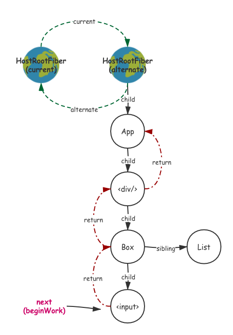

# complete$Work

[react-reconciler/src/ReactFiberScheduler.js]()

```ts
function performUnitOfWork(workInProgress: Fiber): Fiber | null {
  const current = workInProgress.alternate;
	//...
 	next = beginWork(current, workInProgress, nextRenderExpirationTime);
	workInProgress.memoizedProps = workInProgress.pendingProps;
  if (next === null) {
    // If this doesn't spawn new work, complete the current work.
    next = completeUnitOfWork(workInProgress);
  }
  return next;
}

function renderRoot(
  root: FiberRoot,
  isYieldy: boolean,
  isExpired: boolean,
): void {
  do {
    try {
      while (nextUnitOfWork !== null) {
        nextUnitOfWork = performUnitOfWork(nextUnitOfWork);
      }
    } catch (thrownValue) {
      if (nextUnitOfWork === null) { // 致命错误，nextUnitOfWork即使抛出错误也不应该 == null
        // This is a fatal error.
        didFatal = true;
        onUncaughtError(thrownValue);
      } else {
        const failedUnitOfWork: Fiber = nextUnitOfWork;
        const sourceFiber: Fiber = nextUnitOfWork;
        let returnFiber = sourceFiber.return;
        if (returnFiber === null) { // 致命错误
          didFatal = true;
          onUncaughtError(thrownValue);
        } else {
          throwException(
            root,
            returnFiber,
            sourceFiber,
            thrownValue,
            nextRenderExpirationTime,
          );
          nextUnitOfWork = completeUnitOfWork(sourceFiber);
          continue;
        }
      }
    }
    break;
  } while (true);
}
```

回到`renderRoot` ，当 `performUnitOfWork`中 `beginWork` 已经不断深度优先的顺序遍历到了最后一个 `fiber`，目前 `next`指针指向的是这个棵树最底层的 `child`：



在这里我们要执行 `completeUnitOfWork` 向兄弟拓展，或者向上返回，具体来看代码，最外层是一个 `while(true)`，`returnFiber` 标记父节点，`siblingFiber` 标记兄弟节点：

+ `NoIncomplete`这种情况表示在更新的过程中没有错误抛出，走的是 `completeWork`进入 `completeUnitOfWork` 的 入口也是上面的第一种入口。
  + 调用 `completeWork` 处理当前 `fiber` 的一些更新。
  + 调用 `resetChildExpirationTime`，因为 `completeWork` 是从下往上进行的，所以更新已完成要重置 `ChildExpirationTime`。
  + 之后是对副作用 `effect` 的设置，首先副作用的处理最后会一层一层传递拼接到 `fiberRoot`的 `firstEffect` 上，所以在任意一个 `fiber` 上首先会将自己的 `Effect` 链条拼接到 `returnFiber` 的 `Effect` 链条上(这个链条是已经处理完的子节点的不是这个 `fiber` 自己的)，之后判断 `effectTag > PerformedWork`，表示这个 `fiber` 是否有副作用操作，如果有把它自己也扔到 `returnFiber`的 `Effect` 链条上。
  + 最后判断 `siblingFiber !== null`，回忆一下 `beginWork` 的过程，我们不断向下递归，这个过程只初始化了每一层的第一个 `fiber` ，所以在这个里要向右拓展有兄弟节点就返回兄弟节点，之后就会继续走 `beginWork`。
  + 不然就继续对父节点执行 `completeUnitOfWork`，直到没有 `returnFiber`(到达 `RootFiber`)为止，这个时候 `workLoop` 也会退出。

[react-reconciler/src/ReactFiberScheduler.js]()

```ts
function completeUnitOfWork(workInProgress: Fiber): Fiber | null {
  // Attempt to complete the current unit of work, then move to the
  // next sibling. If there are no more siblings, return to the
  // parent fiber.
  while (true) {
    // The current, flushed, state of this fiber is the alternate.
    // Ideally nothing should rely on this, but relying on it here
    // means that we don't need an additional field on the work in
    // progress.
    const current = workInProgress.alternate;

    const returnFiber = workInProgress.return;   // 父节点
    const siblingFiber = workInProgress.sibling; // 兄弟节点

    if ((workInProgress.effectTag & Incomplete) === NoEffect) {
      // This fiber completed.
      nextUnitOfWork = completeWork(
        current,
        workInProgress,
        nextRenderExpirationTime,
      );
      resetChildExpirationTime(workInProgress, nextRenderExpirationTime);

      if (
        returnFiber !== null &&
        // Do not append effects to parents if a sibling failed to complete
        (returnFiber.effectTag & Incomplete) === NoEffect
      ) {
        if (returnFiber.firstEffect === null) {
          returnFiber.firstEffect = workInProgress.firstEffect;
        }
        if (workInProgress.lastEffect !== null) {
          if (returnFiber.lastEffect !== null) {
            returnFiber.lastEffect.nextEffect = workInProgress.firstEffect;
          }
          returnFiber.lastEffect = workInProgress.lastEffect;
        }
        const effectTag = workInProgress.effectTag;
        // Skip both NoWork and PerformedWork tags when creating the effect list.
        // PerformedWork effect is read by React DevTools but shouldn't be committed.
        if (effectTag > PerformedWork) {
          if (returnFiber.lastEffect !== null) {
            returnFiber.lastEffect.nextEffect = workInProgress;
          } else {
            returnFiber.firstEffect = workInProgress;
          }
          returnFiber.lastEffect = workInProgress;
        }
      }
      if (siblingFiber !== null) {
        // If there is more work to do in this returnFiber, do that next.
        return siblingFiber;
      } else if (returnFiber !== null) {
        // If there's no more work in this returnFiber. Complete the returnFiber.
        workInProgress = returnFiber;
        continue;
      } else {
        // We've reached the root.
        return null;
      }
    } else {
      // This fiber did not complete because something threw. Pop values off
      // the stack without entering the complete phase. If this is a boundary,
      // capture values if possible.
      const next = unwindWork(workInProgress, nextRenderExpirationTime);

      if (next !== null) {
        // If completing this work spawned new work, do that next. We'll come
        // back here again.
        // Since we're restarting, remove anything that is not a host effect
        // from the effect tag.
        next.effectTag &= HostEffectMask;
        return next;
      }

      if (returnFiber !== null) {
        // Mark the parent fiber as incomplete and clear its effect list.
        returnFiber.firstEffect = returnFiber.lastEffect = null;
        returnFiber.effectTag |= Incomplete;
      }

      if (siblingFiber !== null) {
        // If there is more work to do in this returnFiber, do that next.
        return siblingFiber;
      } else if (returnFiber !== null) {
        // If there's no more work in this returnFiber. Complete the returnFiber.
        workInProgress = returnFiber;
        continue;
      } else {
        return null;
      }
    }
  }

  // Without this explicit null return Flow complains of invalid return type
  // TODO Remove the above while(true) loop
  // eslint-disable-next-line no-unreachable
  return null;
}
```

## 2. completeWork

`completeWork` 这个函数在 `beginWork`完成阶段对 `fiber` 进行一些操作，不过除了 `HostComponent` 和 `HostText` 之外基本都是无操作，`SuspenseComponent` 和 `Ref` 日后单独讲解：

[react-reconciler/src/ReactFiberCompleteWork.js]()

```ts
function completeWork(
  current: Fiber | null,
  workInProgress: Fiber,
  renderExpirationTime: ExpirationTime,
): Fiber | null {
  const newProps = workInProgress.pendingProps;

  switch (workInProgress.tag) {
    case IndeterminateComponent:
      break;
    case LazyComponent:
      break;
    case SimpleMemoComponent:
    case FunctionComponent:
      break;
    case ClassComponent: {
      break;
    }
    case HostRoot: {
      updateHostContainer(workInProgress);
      break;
    }
    case HostComponent: {
      // fucking long code
      break;
    }
    case HostText: {
      // not very long code
      break;
    }
    case ForwardRef:
      break;
    case SuspenseComponent: {
      const nextState = workInProgress.memoizedState;
      const prevState = current !== null ? current.memoizedState : null;
      const nextDidTimeout = nextState !== null && nextState.didTimeout;
      const prevDidTimeout = prevState !== null && prevState.didTimeout;
      if (nextDidTimeout !== prevDidTimeout) {
        // If this render commits, and it switches between the normal state
        // and the timed-out state, schedule an effect.
        workInProgress.effectTag |= Update;
      }
      break;
    }
    case Fragment:
      break;
    case Mode:
      break;
    case Profiler:
      break;
    case HostPortal:
      updateHostContainer(workInProgress);
      break;
    case ContextProvider:
      break;
    case ContextConsumer:
      break;
    case MemoComponent:
      break;
    case IncompleteClassComponent: {
      break;
    }
    default:
      invariant...
  }

  return null;
}
```

### 2.1 HostRoot

对 `hostComponent` 执行 `completeWork` 的时候，其实这个 `updateHostContainer` 在 `react-dom` 环境下什么也不会执行所以和直接 `break` 没差。

```ts
if (supportsMutation) {
	updateHostContainer = function(workInProgress: Fiber) {
    // Noop
  };
}
```

### 2.2 HostComponent

```ts
case HostComponent: {
  const rootContainerInstance = getRootHostContainer(); // context
  const type = workInProgress.type;
  if (current !== null && workInProgress.stateNode != null) {
    updateHostComponent(
      current,
      workInProgress,
      type,
      newProps,
      rootContainerInstance,
    );
  } else {
    let instance = createInstance(
      type,
      newProps,
      rootContainerInstance,
      currentHostContext,
      workInProgress,
    );

    appendAllChildren(instance, workInProgress, false, false);

    // Certain renderers require commit-time effects for initial mount.
    // (eg DOM renderer supports auto-focus for certain elements).
    // Make sure such renderers get scheduled for later work.
    if (
      finalizeInitialChildren(
        instance,
        type,
        newProps,
        rootContainerInstance,
        currentHostContext,
      )
    ) {
      markUpdate(workInProgress);
    }
    workInProgress.stateNode = instance;
  }
  break;
}
```

完成 `HostCompoent` 的渲染分为两种情况：

+ 第一种是非初次渲染有 `current` 和 `stateNode`，走 `updateHostComponent`。
+ 第二种是初次渲染这个时候要先创建 `createInstance` 实例然后添加他的 `dom` 子节点，最后通过 `finalizeInitialChildren` 初始化事件机制和 `dom` 属性；
+ 最后都要添加 `stateNode`；

> [小贴士：]()之所以我们能添加子节点，是因为我们是从下往上遍历的，没错 `domTree` 是在 `complete`阶段自下而上构建的. 

#### 2.2.1 updateHostComponent

`HostComponent` 的 `updateQueue` 和 `Component` 的不太一样，是一个 `[...k, v]` 的数组记录的是要更新的 `props` 最后会在 `commit` 阶段更新，并不是 `update` 对象。

`updateHostComponent` 这个函数用于对已有 `HostComponent`的 `fiber` 做更新，涉及一种 `diff` 比较，添加所有属性变化到一个 `updatePayload` 里面然后赋给 `wip.updateQueue`，然后 `markUpdate(workInProgress.effectTag |= Update;)`添加更新标记位。当然如果 `oldProps === newProps`那就表示完全没有属性改变：

> [注意：]()这里只是对 `HostComponent` 的 `fiber` 的` props` 做更新标记，通过 `updateQueue` 缓存更新内容，实际的 `dom` 属性更新在 `commit` 阶段进行。

[react-reconciler/src/ReactFiberCompleteWork.js]()

```ts
updateHostComponent = function(
 current: Fiber,
 workInProgress: Fiber,
 type: Type,
 newProps: Props,
 rootContainerInstance: Container,
) {
  // If we have an alternate, that means this is an update and we need to
  // schedule a side-effect to do the updates.
  const oldProps = current.memoizedProps;
  if (oldProps === newProps) {
    // In mutation mode, this is sufficient for a bailout because
    // we won't touch this node even if children changed.
    return;
  }

  // If we get updated because one of our children updated, we don't
  // have newProps so we'll have to reuse them.
  // TODO: Split the update API as separate for the props vs. children.
  // Even better would be if children weren't special cased at all tho.
  const instance: Instance = workInProgress.stateNode;
  const currentHostContext = getHostContext();
  // TODO: Experiencing an error where oldProps is null. Suggests a host
  // component is hitting the resume path. Figure out why. Possibly
  // related to `hidden`.
  const updatePayload = prepareUpdate(
    instance,
    type,
    oldProps,
    newProps,
    rootContainerInstance,
    currentHostContext,
  );
  // TODO: Type this specific to this type of component.
  workInProgress.updateQueue = (updatePayload: any);
  // If the update payload indicates that there is a change or if there
  // is a new ref we mark this as an update. All the work is done in commitWork.
  if (updatePayload) {
    markUpdate(workInProgress);
  }
};

function markUpdate(workInProgress: Fiber) {
  // Tag the fiber with an update effect. This turns a Placement into
  // a PlacementAndUpdate.
  workInProgress.effectTag |= Update;
}
```

`prepareUpdate` 调用 `diffProperties` 进行 `dom` 属性比较，将有更新更新的属性添加到 `updatePayload` 之中，大概分一下几个步骤：

+ 添加要在 `oldProps` 删除的属性
+ 添加 `nextProps` 新增的属性；

首先对于 `input|option|select|textarea`这几个元素一定会生成 `updatePayload`，因为这几个可能是非受控组件：

[react-dom/src/client/ReactDOMComponent.js]()

```ts
export function prepareUpdate(
  domElement: Instance,
  type: string,
  oldProps: Props,
  newProps: Props,
  rootContainerInstance: Container,
  hostContext: HostContext,
): null | Array<mixed> {
  return diffProperties(
    domElement,
    type,
    oldProps,
    newProps,
    rootContainerInstance,
  );
}
// Calculate the diff between the two objects.
export function diffProperties(
  domElement: Element,
  tag: string,
  lastRawProps: Object,
  nextRawProps: Object,
  rootContainerElement: Element | Document,
): null | Array<mixed> {
  let updatePayload: null | Array<any> = null;

  let lastProps: Object;
  let nextProps: Object;
  switch (tag) {
    case 'input':
      lastProps = ReactDOMInput.getHostProps(domElement, lastRawProps);
      nextProps = ReactDOMInput.getHostProps(domElement, nextRawProps);
      updatePayload = [];
      break;
    case 'option':
      lastProps = ReactDOMOption.getHostProps(domElement, lastRawProps);
      nextProps = ReactDOMOption.getHostProps(domElement, nextRawProps);
      updatePayload = [];
      break;
    case 'select':
      lastProps = ReactDOMSelect.getHostProps(domElement, lastRawProps);
      nextProps = ReactDOMSelect.getHostProps(domElement, nextRawProps);
      updatePayload = [];
      break;
    case 'textarea':
      lastProps = ReactDOMTextarea.getHostProps(domElement, lastRawProps);
      nextProps = ReactDOMTextarea.getHostProps(domElement, nextRawProps);
      updatePayload = [];
      break;
    default:
      lastProps = lastRawProps;
      nextProps = nextRawProps;
      if (
        typeof lastProps.onClick !== 'function' &&
        typeof nextProps.onClick === 'function'
      ) {
        // TODO: This cast may not be sound for SVG, MathML or custom elements.
        trapClickOnNonInteractiveElement(((domElement: any): HTMLElement));
      }
      break;
  }
/...
```

之后是一个循环遍历 `lastProps` 的  `propKey`，这个循环用于检测 `nextProps` 没有但是 `lastProps` 上有的属性(删除的属性)，根据属性不同有不同的执行效果：

+ `STYLE`：清空老的 `prop` 的`style`对象的所有属性的值，但是保留这个 `style` 对象以及它的键。
+ `etc`：给老的 `prop`的属性的值都赋予 `null` 进行清空。

```ts
  let propKey;
  let styleName;
  let styleUpdates = null;
  for (propKey in lastProps) {
    if (
      nextProps.hasOwnProperty(propKey) ||
      !lastProps.hasOwnProperty(propKey) ||
      lastProps[propKey] == null
    ) {
      continue;
    }
    if (propKey === STYLE) {
      const lastStyle = lastProps[propKey];
      for (styleName in lastStyle) {
        if (lastStyle.hasOwnProperty(styleName)) {
          if (!styleUpdates) {
            styleUpdates = {};
          }
          styleUpdates[styleName] = '';
        }
      }
    } else if (propKey === DANGEROUSLY_SET_INNER_HTML || propKey === CHILDREN) {
      // Noop. This is handled by the clear text mechanism.
    } else if (
      propKey === SUPPRESS_CONTENT_EDITABLE_WARNING ||
      propKey === SUPPRESS_HYDRATION_WARNING
    ) {
      // Noop
    } else if (propKey === AUTOFOCUS) {
      // Noop. It doesn't work on updates anyway.
    } else if (registrationNameModules.hasOwnProperty(propKey)) {
      // This is a special case. If any listener updates we need to ensure
      // that the "current" fiber pointer gets updated so we need a commit
      // to update this element.
      if (!updatePayload) {
        updatePayload = [];
      }
    } else {
      // For all other deleted properties we add it to the queue. We use
      // the whitelist in the commit phase instead.
      (updatePayload = updatePayload || []).push(propKey, null);
    }
  }
```

这个是遍历所有新的 `props` 上🈶️且和老的 `props` 上不相同的属性（新属性）：

+ `STYLE`：这个略有不同首先它这个 `styleUpdate` 先在 `lastProp` 上收集了 `styleName` 全部设置为 `""`空字符串，然后在 `newProp` 上收集了 `styleName` 给刚刚的对象赋予值，这样就既有了删除的属性又有新增的属性。
+ 总之新属性会以一个 `key` 一个 `value` 的形式推入`updatePayload`。

```ts
  for (propKey in nextProps) {
    const nextProp = nextProps[propKey];
    const lastProp = lastProps != null ? lastProps[propKey] : undefined;
    if (
      !nextProps.hasOwnProperty(propKey) ||
      nextProp === lastProp ||
      (nextProp == null && lastProp == null)
    ) {
      continue;
    }
    if (propKey === STYLE) {
      if (lastProp) {
        // Unset styles on `lastProp` but not on `nextProp`.
        for (styleName in lastProp) {
          if (
            lastProp.hasOwnProperty(styleName) &&
            (!nextProp || !nextProp.hasOwnProperty(styleName))
          ) {
            if (!styleUpdates) {
              styleUpdates = {};
            }
            styleUpdates[styleName] = '';
          }
        }
        // Update styles that changed since `lastProp`.
        for (styleName in nextProp) {
          if (
            nextProp.hasOwnProperty(styleName) &&
            lastProp[styleName] !== nextProp[styleName]
          ) {
            if (!styleUpdates) {
              styleUpdates = {};
            }
            styleUpdates[styleName] = nextProp[styleName];
          }
        }
      } else {
        // Relies on `updateStylesByID` not mutating `styleUpdates`.
        if (!styleUpdates) {
          if (!updatePayload) {
            updatePayload = [];
          }
          updatePayload.push(propKey, styleUpdates);
        }
        styleUpdates = nextProp;
      }
    } else if (propKey === DANGEROUSLY_SET_INNER_HTML) {
      const nextHtml = nextProp ? nextProp[HTML] : undefined;
      const lastHtml = lastProp ? lastProp[HTML] : undefined;
      if (nextHtml != null) {
        if (lastHtml !== nextHtml) {
          (updatePayload = updatePayload || []).push(propKey, '' + nextHtml);
        }
      } else {
        // TODO: It might be too late to clear this if we have children
        // inserted already.
      }
    } else if (propKey === CHILDREN) {
      if (
        lastProp !== nextProp &&
        (typeof nextProp === 'string' || typeof nextProp === 'number')
      ) {
        (updatePayload = updatePayload || []).push(propKey, '' + nextProp);
      }
    } else if (
      propKey === SUPPRESS_CONTENT_EDITABLE_WARNING ||
      propKey === SUPPRESS_HYDRATION_WARNING
    ) {
      // Noop
    } else if (registrationNameModules.hasOwnProperty(propKey)) {
      if (nextProp != null) {
        // We eagerly listen to this even though we haven't committed yet.
        if (__DEV__ && typeof nextProp !== 'function') {
          warnForInvalidEventListener(propKey, nextProp);
        }
        ensureListeningTo(rootContainerElement, propKey);
      }
      if (!updatePayload && lastProp !== nextProp) {
        // This is a special case. If any listener updates we need to ensure
        // that the "current" props pointer gets updated so we need a commit
        // to update this element.
        updatePayload = [];
      }
    } else {
      // For any other property we always add it to the queue and then we
      // filter it out using the whitelist during the commit.
      (updatePayload = updatePayload || []).push(propKey, nextProp);
    }
  }
  if (styleUpdates) {
    (updatePayload = updatePayload || []).push(STYLE, styleUpdates);
  }
  return updatePayload;
}
```

#### 2.2.2 createInstance

[react-dom/src/client/ReactDOMHostConfig.js]()

 ```ts
export function createInstance(
  type: string,
  props: Props,
  rootContainerInstance: Container,
  hostContext: HostContext,
  internalInstanceHandle: Object,
): Instance {
  const domElement: Instance = createElement(
    type,
    props,
    rootContainerInstance,
    parentNamespace,
  );
  precacheFiberNode(internalInstanceHandle, domElement);
  updateFiberProps(domElement, props);
  return domElement;
}
 ```

这个函数用于创建一个 `dom` 元素实例并且和 `fiber ` 建立联系，其中 `createElement` 的代码我单独放到`  dom`相关操作的部分讲解。

其中的 `precacheFiberNode` 用于在`instance` 上和  `workInProgress`建立联系：

```ts
const randomKey = Math.random()
  .toString(36)
  .slice(2);
const internalInstanceKey = '__reactInternalInstance$' + randomKey;

export function precacheFiberNode(hostInst, node) {
  node[internalInstanceKey] = hostInst;
}
```

而 `updateFiberProps` 用于将 `instance` 和 `props` 建立联系：

```ts
export function updateFiberProps(node, props) {
  node[internalEventHandlersKey] = props;
}
```

#### 2.2.3 appendAllChildren

[react-reconciler/src/ReactFiberCompleteWork.js]()

```ts
function appendAllChildren(
 parent: Instance,
 workInProgress: Fiber,
 needsVisibilityToggle: boolean,
 isHidden: boolean,
) {
  let node = workInProgress.child;
  while (node !== null) {
    if (node.tag === HostComponent || node.tag === HostText) {
      appendInitialChild(parent, node.stateNode);
    } else if (node.tag === HostPortal) {
      // If we have a portal child, then we don't want to traverse
      // down its children. Instead, we'll get insertions from each child in
      // the portal directly.
    } else if (node.child !== null) {
      node.child.return = node;
      node = node.child;
      continue;
    }
    if (node === workInProgress) {
      return;
    }
    while (node.sibling === null) {
      if (node.return === null || node.return === workInProgress) {
        return;
      }
      node = node.return;
    }
    node.sibling.return = node.return;
    node = node.sibling;
  }
};
```

这个函数的工作是将 `parent` 下的第一层 `HostCompoentInstance|HostTextInstance` 插入到其子节点下：

.png)

上图是这个函数实现的大概效果，实际的实现过程也很简单，他的遍历顺序如下：

+ 假设一开始我们在第一个子节点的位置，如果这个节点是一个原生节点，那就使用  `appendInitialChild` 进行插入，之后 `node = node.sibling` 走他的兄弟节点；
+ 如果这个节点不是原生节点，那就走 `node = node.child` 向下深入一层；
+ 当我们不断深入直到找到第一个原生节点(或者没找到)，这个时候找兄弟节点 `node = node.sibling`，对 `node.sibling` 再执行一遍上述逻辑，最后会在没有 `sibling` 的时候不断返回回到 `WIP` 终止。

`appendInitialChild` 这个函数就比较简单：

[react-dom/src/client/ReactDOMHostConfig.js]()

```ts
export function appendInitialChild(
  parentInstance: Instance,
  child: Instance | TextInstance,
): void {
  parentInstance.appendChild(child);
}
```

#### 2.2.4 finalizeInitialChildren

`finalizeInitialChildren` 这个函数主要做了两件事：

+ 调用 `setInitialProperties` 在 `dom` 实例上初始化属性(详见[dom](//TODO))，调用 `shouldAutoFocusHostComponent` 返回元素是否 `autoFocus`：

[react-dom/src/client/ReactDOMHostConfig.js]() 

```ts
export function finalizeInitialChildren(
  domElement: Instance,
  type: string,
  props: Props,
  rootContainerInstance: Container,
  hostContext: HostContext,
): boolean {
  setInitialProperties(domElement, type, props, rootContainerInstance);
  return shouldAutoFocusHostComponent(type, props);
}
```

`autoFocus`这个属性只有表单相关元素可以设置，所以 `shouldAutoFocusHostComponent` 做了一些判断：

[react-dom/src/client/ReactDOMHostConfig.js]() 

```ts
function shouldAutoFocusHostComponent(type: string, props: Props): boolean {
  switch (type) {
    case 'button':
    case 'input':
    case 'select':
    case 'textarea':
      return !!props.autoFocus;
  }
  return false;
}
```

这里有`autoFocus`属性还要设置一下 `update` 标记位，`autoFocus`会在 `commit` 阶段被设置：

```ts
function markUpdate(workInProgress: Fiber) {
  // Tag the fiber with an update effect. This turns a Placement into
  // a PlacementAndUpdate.
  workInProgress.effectTag |= Update;
}
```

### 2.3 HostText

[react-reconciler/src/ReactFiberCompleteWork.js]()

```ts
case HostText {
  let newText = newProps;
  if (current && workInProgress.stateNode != null) {
    const oldText = current.memoizedProps;
    // If we have an alternate, that means this is an update and we need
    // to schedule a side-effect to do the updates.
    updateHostText(current, workInProgress, oldText, newText);
  } else {
    if (typeof newText !== 'string') {
      invariant(
        workInProgress.stateNode !== null,
        'We must have new props for new mounts. This error is likely ' +
        'caused by a bug in React. Please file an issue.',
      );
      // This can happen when we abort work.
    }
    const rootContainerInstance = getRootHostContainer();
    workInProgress.stateNode = createTextInstance(
      newText,
      rootContainerInstance,
      currentHostContext,
      workInProgress,
    );
  }
	break;
}
```

这个函数也分两种情况：

+ 第一次更新，第一次更新的话调用 `createTextInstance` 来创建一个 `textNode`。
+ 第 `n+1` 次更新，调用 `updateHostText` 进行节点更新。

`updateHostText` 就是判断 `oldText === newText` 来决定是否调用 `markUpdate`：

[react-reconciler/src/ReactFiberCompleteWork.js]()

```ts
updateHostText = function(
current: Fiber,
 workInProgress: Fiber,
 oldText: string,
 newText: string,
) {
  // If the text differs, mark it as an update. All the work in done in commitWork.
  if (oldText !== newText) {
    markUpdate(workInProgress);
  }
};
```

`createTextInstance` 用于创建一个文本节点，它根据传入的 `rootContainerInstance` 判断 `Document` 的文档环境。`precacheFiberNode` 用于建立` textNode` 和 `fiber` 的联系。

[react-dom/src/client/ReactDOMHostConfig.js]()

```ts
export function createTextInstance(
  text: string,
  rootContainerInstance: Container,
  hostContext: HostContext,
  internalInstanceHandle: Object,
): TextInstance {
  const textNode: TextInstance = createTextNode(text, rootContainerInstance);
  precacheFiberNode(internalInstanceHandle, textNode);
  return textNode;
}
```

## 3. resetChildExpirationTime

每一次  `completeWork`之后代表一个 `fiber` 的更新阶段(渲染 `render` 阶段)已经完成，所以要重置 `ChildExpirationTime`(子节点中的最高优先级)，就是在 `WIP`的 `child` 中寻找最高优先级的 `expirationTime` 和 `ChildExpirationTime`来个 `WIP` 做更新：

```ts
function resetChildExpirationTime(
  workInProgress: Fiber,
  renderTime: ExpirationTime,
) {
  if (renderTime !== Never && workInProgress.childExpirationTime === Never) {
    // The children of this component are hidden. Don't bubble their
    // expiration times.
    return;
  }

  let newChildExpirationTime = NoWork;

  // Bubble up the earliest expiration time.
  if (enableProfilerTimer && workInProgress.mode & ProfileMode) {
    // We're in profiling mode.
    // Let's use this same traversal to update the render durations.
    let actualDuration = workInProgress.actualDuration;
    let treeBaseDuration = workInProgress.selfBaseDuration;

    // When a fiber is cloned, its actualDuration is reset to 0.
    // This value will only be updated if work is done on the fiber (i.e. it doesn't bailout).
    // When work is done, it should bubble to the parent's actualDuration.
    // If the fiber has not been cloned though, (meaning no work was done),
    // Then this value will reflect the amount of time spent working on a previous render.
    // In that case it should not bubble.
    // We determine whether it was cloned by comparing the child pointer.
    const shouldBubbleActualDurations =
      workInProgress.alternate === null ||
      workInProgress.child !== workInProgress.alternate.child;

    let child = workInProgress.child;
    while (child !== null) {
      const childUpdateExpirationTime = child.expirationTime;
      const childChildExpirationTime = child.childExpirationTime;
      if (
        newChildExpirationTime === NoWork ||
        (childUpdateExpirationTime !== NoWork &&
          childUpdateExpirationTime < newChildExpirationTime)
      ) {
        newChildExpirationTime = childUpdateExpirationTime;
      }
      if (
        newChildExpirationTime === NoWork ||
        (childChildExpirationTime !== NoWork &&
          childChildExpirationTime < newChildExpirationTime)
      ) {
        newChildExpirationTime = childChildExpirationTime;
      }
      if (shouldBubbleActualDurations) {
        actualDuration += child.actualDuration;
      }
      treeBaseDuration += child.treeBaseDuration;
      child = child.sibling;
    }
    workInProgress.actualDuration = actualDuration;
    workInProgress.treeBaseDuration = treeBaseDuration;
  } else {
    let child = workInProgress.child;
    while (child !== null) {
      const childUpdateExpirationTime = child.expirationTime;
      const childChildExpirationTime = child.childExpirationTime;
      if (
        newChildExpirationTime === NoWork ||
        (childUpdateExpirationTime !== NoWork &&
          childUpdateExpirationTime < newChildExpirationTime)
      ) {
        newChildExpirationTime = childUpdateExpirationTime;
      }
      if (
        newChildExpirationTime === NoWork ||
        (childChildExpirationTime !== NoWork &&
          childChildExpirationTime < newChildExpirationTime)
      ) {
        newChildExpirationTime = childChildExpirationTime;
      }
      child = child.sibling;
    }
  }

  workInProgress.childExpirationTime = newChildExpirationTime;
}
```

