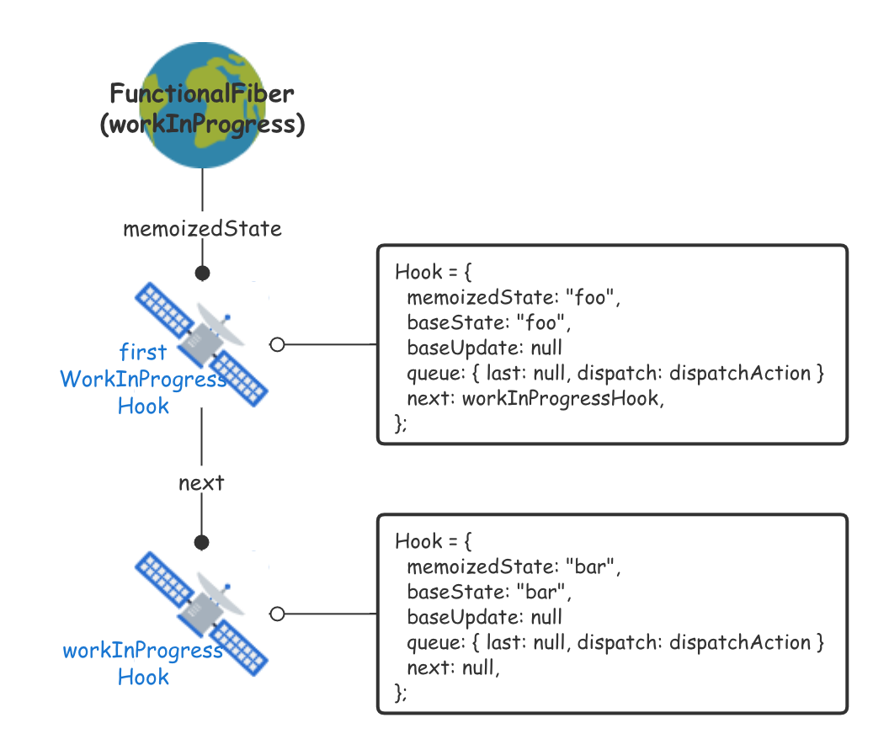

# useState

先来看看最常用的 `useState`，这个函数可以让函数式组件拥有自己的状态。`useState` 接收一个具体值或者返回具体值的函数，内部调用了 `useReducer` 传入 `basicStateReducer`以及传入 `useState`的 `initialState`：

[react-reconciler/src/ReactFiberHooks.js]()

```ts
export function useState<S>(
  initialState: (() => S) | S,
): [S, Dispatch<BasicStateAction<S>>] {
  return useReducer(
    basicStateReducer,
    // useReducer has a special case to support lazy useState initializers
    (initialState: any),
  );
}
```

## basicStateReducer

`basicStateReducer` 返回的就是 `action`，`action` 就是我们调用 `setState` 传入的参数：

```ts
function basicStateReducer<S>(state: S, action: BasicStateAction<S>): S {
  return typeof action === 'function' ? action(state) : action;
}
```

## Wokr Flow

来看看 `useState` 的状态初始化以及更新流程：

```tsx
export default () => {
    const [foo, setFoo] = useState('foo');
    const [bar, setBar] = useState('bar');

    return (<input type="text" onChange={(e) => setFoo(e.target.value)} />);
};
```

先来看看第一次渲染执行两次`useState` 的过程，会构建两个 `Hook`，他们的 `memoizedState` 就是 `setState` 第一次设置的初始值，`queue` 一开始是空的，`dispatch` 是 `setFoo` 和 `setBar`：



之后我们两次触发 `onChange`，执行两次 `dispatchAction(就是setFoo("fxk")和setFoo("love"))`。假设这两次更新一前一后执行，首先 `fxk`被推入到队列并且被处理，更新值计算到 `memoizedState` 上面。不过处理完之后队列不会被清空，`last` 指针也不会改变。只是 `baseUpdate` 被设置为 `updaye{action: fxk}`。

.png)

紧接着 `setFoo('love')` 被推入更新，`dispatchAction` 会将上一次的 `update` 和 这一次创建的 `update` 连接成环形链表：

.png)

当 `scheduler` 再次调度到这个 `fiber` 的时候就会处理这个更新，首先断开环形链表，因为 `last` 存储的是最后一个更新，所以断开环形链表就相当于删除了之前所有的更新。我们从 `last.next` 开始执行更新，重设 `memoizeState` 和 `baseState`，虽然没清空队列，但是由于 `last->first` 指针已经断开，就相当于清空队列。`baseUpdate` 这次就更新到了 `action: love`：

.png)


