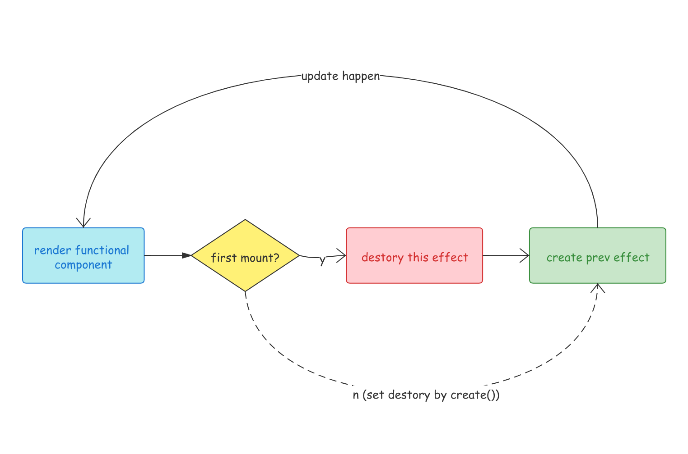

# useEffect

`React Hook` 提供了 `useLayoutEffect` 和 `useEffect` 两种 `api`，这两个 `hook` 都能让组件拥有副作用，执行的时间点在 都 `fp` 渲染之后，会先对上一次 `effect` 产生的副作用进行清除，再执行本次的副作用：



再来说说这两种 `api` 的区别，`useLayoutEffect` 的执行实际和 `componentDidUpdate/Mount` 一致会在浏览器渲染`dom` 之前同步的执行，而 `useEffect` 会在浏览器渲染之后的空闲时间异步的执行。

两种 `effect` 差别主要在 `effectTag` 和 `hostEffectTag` 上面：

+ `useLayoutEffect`：
  + `effectTag`：`UpdateEffect`
  + `hookEffectTag`：`UnmountMutation | MountLayout`
+ `useEffect`：
  + `effectTag`：`UpdateEffect | PassiveEffect`
  + `hookEffectTag`：`UnmountPassive | MountPassive`

```ts
export function useLayoutEffect(
  create: () => mixed,
  inputs: Array<mixed> | void | null,
): void {
  useEffectImpl(UpdateEffect, UnmountMutation | MountLayout, create, inputs);
}

export function useEffect(
  create: () => mixed,
  inputs: Array<mixed> | void | null,
): void {
  useEffectImpl(
    UpdateEffect | PassiveEffect,
    UnmountPassive | MountPassive,
    create,
    inputs,
  );
}
```

## useEffectImpl

`useEffectImpl` 是 `useEffect` 和 `useLayoutEffect` 的具体实现。

`resolveCurrentlyRenderingFiber` 和 `createWorkInProgressHook` 前面我们说了所有 `hookApi` 都要在 `funcFiber.memorizedState` 上创建 `workInProgressHook`。

之后 `create` 就是我们传入 `useEffect` 的副作用函数，`inputs` 是更新标记位，如果我们没传这些标志位，那匿名函数会作为是否本轮更新的判断基础(`nextInputs`)。

**1.** 如果说 `currentHook!== null`  说明这不是首次更新，调用 `areHookInputsEqual` 判断 `nextInputs` 和 `prevEffect` 是否相等。其实就是给每一个成员惊进行一次 `Object.is`：

```ts
export default function areHookInputsEqual(arr1: any[], arr2: any[]) {
  for (let i = 0; i < arr1.length; i++) {
    const val1 = arr1[i];
    const val2 = arr2[i];
    if (
      (val1 === val2 && (val1 !== 0 || 1 / val1 === 1 / val2)) ||
      (val1 !== val1 && val2 !== val2) // eslint-disable-line no-self-compare
    ) {
      continue;
    }
    return false;
  }
  return true;
}
```

如果相等执行 `pushEffect(NoHookEffect, fn, prevEffect.destroy, nextInputs)`

```ts
function useEffectImpl(fiberEffectTag, hookEffectTag, create, inputs): void {
  currentlyRenderingFiber = resolveCurrentlyRenderingFiber();
  workInProgressHook = createWorkInProgressHook();

  let nextInputs = inputs !== undefined && inputs !== null ? inputs : [create];
  let destroy = null;
  if (currentHook !== null) {
    const prevEffect = currentHook.memoizedState;
    destroy = prevEffect.destroy;
    if (areHookInputsEqual(nextInputs, prevEffect.inputs)) {
      pushEffect(NoHookEffect, create, destroy, nextInputs);
      return;
    }
  }

  currentlyRenderingFiber.effectTag |= fiberEffectTag;
  workInProgressHook.memoizedState = pushEffect(
    hookEffectTag,
    create,
    destroy,
    nextInputs,
  );
}
```

### pushEffect

`pushEffect` 通过我们传入的 `hookTag`、`fn`、`destroy`、`inputs` 构建一个 `effect` 。

然后初始化 `componentUpdateQueue` 这个全局变量，拼接新的 `effect` 上去，注意这个队列也是环形队列，头结点存储的是尾指针。

```ts
let componentUpdateQueue: FunctionComponentUpdateQueue | null = null;

function pushEffect(tag, create, destroy, inputs) {
  const effect: Effect = {
    tag,
    create,
    destroy,
    inputs,
    // Circular
    next: (null: any),
  };
  if (componentUpdateQueue === null) {
    componentUpdateQueue = createFunctionComponentUpdateQueue();
    componentUpdateQueue.lastEffect = effect.next = effect;
  } else {
    const lastEffect = componentUpdateQueue.lastEffect;
    if (lastEffect === null) {
      componentUpdateQueue.lastEffect = effect.next = effect;
    } else {
      const firstEffect = lastEffect.next;
      lastEffect.next = effect;
      effect.next = firstEffect;
      componentUpdateQueue.lastEffect = effect;
    }
  }
  return effect;
}

function createFunctionComponentUpdateQueue(): FunctionComponentUpdateQueue {
  return {
    lastEffect: null,
  };
}

export type FunctionComponentUpdateQueue = {
  lastEffect: Effect | null,
};
```

`componentUpdateQueue` 最后会在 `finishHooks` 中被挂载到 `renderedWork.updateQueue` 上面。这样我们在渲染完 `functionalComponent` 之后，组件上标记了 `effectTag`  并且在 `updateQueue` 里存储了 `hookEffectChain`，`hookEffectChain` 上的每一个 `hookEffect`  都有 `hookEffectTag`。这些副作用最后会在 `commit` 阶段被执行。

```ts
export function finishHooks(
  Component: any,
  props: any,
  children: any,
  refOrContext: any,
): any {
  // ...
  renderedWork.updateQueue = (componentUpdateQueue: any);
	// ...
}
```

## commitHookEffectList

`commitHookEffectList` 执行 `fiber` 中所有有特定标签(`hookEffectTag`)的副作用 `hook`，接收两个参数 `unmountTag` 和 `mountTag`。

如果 `unmountTag` 命中就会执行 `destroy` 来 `umountHook`，如果 `mountTag` 命中就会执行 `create` 来执行副作用。比如`useLayoutEffect` 和 `useEffect`：

+ `useEffect`：
  + `hookEffectTag`：`UnmountMutation | MountLayout`
+ `useLayoutEffect`：
  + `hookEffectTag`：`UnmountPassive | MountPassive`

```ts
function commitHookEffectList(
  unmountTag: number,
  mountTag: number,
  finishedWork: Fiber,
) {
  if (!enableHooks) {
    return;
  }
  const updateQueue: FunctionComponentUpdateQueue | null = (finishedWork.updateQueue: any);
  let lastEffect = updateQueue !== null ? updateQueue.lastEffect : null;
  if (lastEffect !== null) {
    const firstEffect = lastEffect.next;
    let effect = firstEffect;
    do {
      if ((effect.tag & unmountTag) !== NoHookEffect) {
        // Unmount
        const destroy = effect.destroy;
        effect.destroy = null;
        if (destroy !== null) {
          destroy();
        }
      }
      if ((effect.tag & mountTag) !== NoHookEffect) {
        // Mount
        const create = effect.create;
        let destroy = create();
        effect.destroy = destroy;
      }
      effect = effect.next;
    } while (effect !== firstEffect);
  }
}
```

## commitRoot

`effectHook`的实际处理都在 `commitRoot` 里面，有 `hook` 版本的 `commitRoot` 多了一些代码(我阉割了不少代码)，主要就是对 `effectHooks` 的处理，主要的三个循环体是不变的，一三循环内部调用的处理函数发生了一些改变，循环结束了之后还有对 `useEffect` 的处理逻辑，下面来具体分析：

[react-reconciler/src/ReactFiberCommitWork.js]()

```ts
function commitRoot(root: FiberRoot, finishedWork: Fiber): void {
  let firstEffect = finishedWork.firstEffect；
  nextEffect = firstEffect;
  while (nextEffect !== null) {
    let didError = false;
    let error;
    try {
      commitBeforeMutationLifecycles();
    } catch (e) {
      didError = true;
      error = e;
    }
    if (didError) {
      captureCommitPhaseError(nextEffect, error);
      // Clean-up
      if (nextEffect !== null) {
        nextEffect = nextEffect.nextEffect;
      }
    }
  }

  // Commit all the side-effects within a tree. We'll do this in two passes.
  // The first pass performs all the host insertions, updates, deletions and
  // ref unmounts.
  nextEffect = firstEffect;
  while (nextEffect !== null) {
    let didError = false;
    let error;
    try {
      commitAllHostEffects();
    } catch (e) {
      didError = true;
      error = e;
    }
    if (didError) {
      captureCommitPhaseError(nextEffect, error);
      // Clean-up
      if (nextEffect !== null) {
        nextEffect = nextEffect.nextEffect;
      }
    }
  }

  // The work-in-progress tree is now the current tree. This must come after
  // the first pass of the commit phase, so that the previous tree is still
  // current during componentWillUnmount, but before the second pass, so that
  // the finished work is current during componentDidMount/Update.
  root.current = finishedWork;

  // In the second pass we'll perform all life-cycles and ref callbacks.
  // Life-cycles happen as a separate pass so that all placements, updates,
  // and deletions in the entire tree have already been invoked.
  // This pass also triggers any renderer-specific initial effects.
  nextEffect = firstEffect;
  startCommitLifeCyclesTimer();
  while (nextEffect !== null) {
    let didError = false;
    let error;
    try {
      commitAllLifeCycles(root, committedExpirationTime);
    } catch (e) {
      didError = true;
      error = e;
    }
    if (didError) {
      captureCommitPhaseError(nextEffect, error);
      if (nextEffect !== null) {
        nextEffect = nextEffect.nextEffect;
      }
    }
  }

  if (
    enableHooks &&
    firstEffect !== null &&
    rootWithPendingPassiveEffects !== null
  ) {
    // This commit included a passive effect. These do not need to fire until
    // after the next paint. Schedule an callback to fire them in an async
    // event. To ensure serial execution, the callback will be flushed early if
    // we enter rootWithPendingPassiveEffects commit phase before then.
    let callback = commitPassiveEffects.bind(null, root, firstEffect);
    if (enableSchedulerTracing) {
      // TODO: Avoid this extra callback by mutating the tracing ref directly,
      // like we do at the beginning of commitRoot. I've opted not to do that
      // here because that code is still in flux.
      callback = Schedule_tracing_wrap(callback);
    }
    passiveEffectCallbackHandle = Schedule_scheduleCallback(callback);
    passiveEffectCallback = callback;
  }

  isCommitting = false;
  isWorking = false;
  stopCommitLifeCyclesTimer();
  stopCommitTimer();
  onCommitRoot(finishedWork.stateNode);
}
```

### commitBeforeMutationLifecycles

`commitBeforeMutationLifecycles` 原本执行一些在可变性生命周期前的生命周期(`getSnapshotBeforeUpdate`)，再加入 `hook` 之后还多了对函数式组件的处理。主要就是执行 `UnmountSnapshot`(`UnmountHookEffectTag`)类型的 `commitHookEffectList`，这个及没命中 `useEffect` 也没命中 `useLayoutEffect` 所以不多做解释。

[react-reconciler/src/ReactFiberCommitWork.js]()

```ts
function commitBeforeMutationLifecycles() {
  while (nextEffect !== null) {
    const effectTag = nextEffect.effectTag;
    if (effectTag & Snapshot) {
      recordEffect();
      const current = nextEffect.alternate;
      commitBeforeMutationLifeCycles(current, nextEffect);
    }

    nextEffect = nextEffect.nextEffect;
  }
}

function commitBeforeMutationLifeCycles(
  current: Fiber | null,
  finishedWork: Fiber,
): void {
  switch (finishedWork.tag) {
    case FunctionComponent:
    case ForwardRef:
    case SimpleMemoComponent: {
      commitHookEffectList(UnmountSnapshot, NoHookEffect, finishedWork);
      return;
    }
    case ClassComponent: 
    case HostRoot:
    case HostComponent:
    case HostText:
    case HostPortal:
    case IncompleteClassComponent:
      // Nothing to do for these component types
      return;
    default: 
  }
}
```

### commitAllLifeCycles(处理LayoutEffect)

`commitLifeCycles` 这个声明周期函数原本对类组件执行 `componentDidUpdate` 以及 `componentDidMount` 生命周期，现在 还 触发 `LayoutEffectHook` 的卸载以及挂载函数，注意是先卸载再挂载。

所以说 `useLayoutEffect` 这个 `hook`  和类组件的声明周期是最为相似的，注意这个 `effect` 的卸载也在 `mount` 的时候发生。

`useLayoutEffect`：

+ `hookEffectTag`：`UnmountPassive | MountPassive`

[react-reconciler/src/ReactFiberCommitWork.js]()

```ts
export function commitPassiveHookEffects(finishedWork: Fiber): void {
  commitHookEffectList(UnmountPassive, NoHookEffect, finishedWork);
  commitHookEffectList(NoHookEffect, MountPassive, finishedWork);
}

function commitLifeCycles(
  finishedRoot: FiberRoot,
  current: Fiber | null,
  finishedWork: Fiber,
  committedExpirationTime: ExpirationTime,
): void {
  switch (finishedWork.tag) {
    case FunctionComponent:
    case ForwardRef:
    case SimpleMemoComponent: {
      commitHookEffectList(UnmountLayout, MountLayout, finishedWork);
      break;
    }
    case ClassComponent: {
      const instance = finishedWork.stateNode;
      if (finishedWork.effectTag & Update) {
        if (current === null) {
          instance.componentDidMount();
        else {
          const prevProps =
            finishedWork.elementType === finishedWork.type
              ? current.memoizedProps
              : resolveDefaultProps(finishedWork.type, current.memoizedProps);
          const prevState = current.memoizedState;
          instance.componentDidUpdate(
            prevProps,
            prevState,
            instance.__reactInternalSnapshotBeforeUpdate,
          ); 
        }
      }
      const updateQueue = finishedWork.updateQueue;
      commitUpdateQueue(
        finishedWork,
        updateQueue,
        instance,
        committedExpirationTime,
      );
      return;
    }
    case HostRoot: 
    case HostComponent: 
    case HostText: {
      // We have no life-cycles associated with text.
      return;
    }
    case HostPortal: {
      // We have no life-cycles associated with portals.
      return;
    }
    case Profiler: {
    case SuspenseComponent:
      break;
    case IncompleteClassComponent:
      break;
    default: {}
  }
}
```

### commitPassiveEffects(处理Effect)

在 `commitRoot` 的后面有这样的新代码，大概的意思就是如果 `fiber` 有 `PassiveEffectTag`  就会执行 `Schedule_scheduleCallback(commitPassiveEffects.bind(null, root, firstEffect))` 将 `commitPassiveEffects.bind` 加入 `scheduler` 调度循环(在浏览器下次空闲的时候执行)：

`useEffect`：

+ `hookEffectTag`：`UnmountPassive | MountPassive`

```ts
function commitRoot(root: FiberRoot, finishedWork: Fiber): void {
  // ...
	if (
    enableHooks &&
    firstEffect !== null &&
    rootWithPendingPassiveEffects !== null
  ) {
    // This commit included a passive effect. These do not need to fire until
    // after the next paint. Schedule an callback to fire them in an async
    // event. To ensure serial execution, the callback will be flushed early if
    // we enter rootWithPendingPassiveEffects commit phase before then.
    let callback = commitPassiveEffects.bind(null, root, firstEffect);
    if (enableSchedulerTracing) {
      // TODO: Avoid this extra callback by mutating the tracing ref directly,
      // like we do at the beginning of commitRoot. I've opted not to do that
      // here because that code is still in flux.
      callback = Schedule_tracing_wrap(callback);
    }
    passiveEffectCallbackHandle = Schedule_scheduleCallback(callback);
    passiveEffectCallback = callback;
  }
  // ...
}
```

`commitPassiveEffects` 内部给 `firstEffect` 处理 `effect`：

```ts
function commitPassiveEffects(root: FiberRoot, firstEffect: Fiber): void {
  rootWithPendingPassiveEffects = null;
  passiveEffectCallbackHandle = null;
  passiveEffectCallback = null;

  // Set this to true to prevent re-entrancy
  const previousIsRendering = isRendering;
  isRendering = true;

  let effect = firstEffect;
  do {
    if (effect.effectTag & Passive) {
      let didError = false;
      let error;
      try {
        commitPassiveHookEffects(effect);
      } catch (e) {
        didError = true;
        error = e;
      }
      if (didError) {
        captureCommitPhaseError(effect, error);
      }
    }
    effect = effect.nextEffect;
  } while (effect !== null);

  isRendering = previousIsRendering;

  // Check if work was scheduled by one of the effects
  const rootExpirationTime = root.expirationTime;
  if (rootExpirationTime !== NoWork) {
    requestWork(root, rootExpirationTime);
  }
}

export function commitPassiveHookEffects(finishedWork: Fiber): void {
  commitHookEffectList(UnmountPassive, NoHookEffect, finishedWork);
  commitHookEffectList(NoHookEffect, MountPassive, finishedWork);
}
```

