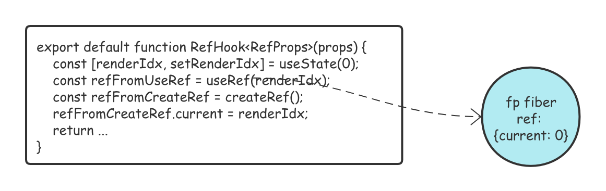
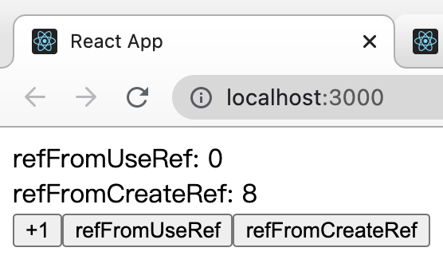

# useRef

讲解 `useRef` 之前先来回忆一下`createRef` ，这个函数就是单纯的返回一个 `refObject`，每次调用都会重新创建：

```ts
// an immutable object with a single mutable value
export function createRef(): RefObject {
  const refObject = {
    current: null,
  };
  return refObject;
}
```

`useRef` 返回一个可变的 `ref` 对象，其 `.current` 属性被初始化为传入的参数（`initialValue`）。这个 `ref` 的存储结构会被挂载到 `functionComponent` 的 `fiber` 上面，每次我们对函数式组件触发更新时返回的都是同一个引用：

```ts
function useRef<T>(initialValue: T): {current: T} {
  currentlyRenderingComponent = resolveCurrentlyRenderingComponent();
  workInProgressHook = createWorkInProgressHook();
  const previousRef = workInProgressHook.memoizedState;
  if (previousRef === null) {
    const ref = {current: initialValue};
    workInProgressHook.memoizedState = ref;
    return ref;
  } else {
    return previousRef;
  }
}
```

为什么要这么设计？首先我们知道 `react` 每次渲染函数组件都会重新执行一遍，如果是 `createRef` 每次渲染都会返回一个新的引用，这样的结果不仅如人意。

我们需要的 `ref` 应该就像一个盒子，盒子只会初始化一次，后序只有我们手动更改了盒子里面的值，盒子的内容才会发生改变。



而 `useRef` 正好每次都会返回相同的引用，它以 `fiber.memorizedState.hook.memorizedState` 作为存储媒介，每次渲染函数组件时去 `fiber` 里拿到引用返回，而不是创建新的引用。

如果你还不太理解, 没关系. 我们再用一个例子来加深理解 `createRef` 和 `useRef` 的不同之处.

```tsx
export default function RefHook<RefProps>(props: RefProps) {
    const [renderIdx, setRenderIdx] = useState(0);
    const refFromUseRef = useRef(renderIdx);
    const refFromCreateRef = createRef();

    // @ts-ignore
    refFromCreateRef.current = renderIdx;
    return (
        <div>
            refFromUseRef: {refFromUseRef.current}
            <br />
            refFromCreateRef: {refFromCreateRef.current}
            <br />
            <button onClick={() => setRenderIdx((prev) => prev + 1)}>+1</button>
        </div>
    );
}
```

仔细看上面的代码. 它会输出什么？算组件重新渲染, 由于 `refFromUseRef` 在 `fiber` 上取值，`useRef` 不会重新赋值，所以不论点击多少次，更改的都只有 `refFromCreateRef`：



## Example

为什么要设计 `useRef` 这个 `API ?` 我们来结合实际的应用场景来看看. 看一个经典的例子：

```tsx
export default function RefHook(props: {}) {
    const [count, setCount] = useState(0);

    let handleClick = () => {
        setTimeout(() => {
            alert(count);
        }, 2000);
    };
    return (
        <div>
            you clicked for {count} times
            <br />
            <button onClick={() => setCount((prev) => prev + 1)}>+1</button>
            <button onClick={handleClick}>show alert!</button>
        </div>
    );
}
```

你猜 ``alert`` 会弹出什么？是界面上 ``count`` 的实时状态 ？ 还是在点击 ``button`` 时 ``count`` 的快照 ？


为什么不是界面上 `count` 的实时状态？，其实很简单首先定时器里的匿名函数是一个闭包，缓存的 `count` 是你点的那次渲染时函数组件 `count` 的快照。

当我们更新状态的时候, `React` 会重新渲染组件, 每一次渲染都会拿到独立的 `count` 状态, 并重新渲染一个 `handleAlertClick` 函数. 每一个 `handleAlertClick` 里面都有它自己的 `count` 。

如何让点击的时候弹出实时的 `count`？

```tsx
export default function RefHook(props: {}) {
    const [count, setCount] = useState(0);
		const latestCount = useRef();
  
  	useEffect(() => {
      latestCount.current = count;
    })
  
    let handleClick = () => {
        setTimeout(() => {
            alert(latest.current);
        }, 2000);
    };
  
    return (
        <div>
            you clicked for {count} times
            <br />
            <button onClick={() => setCount((prev) => prev + 1)}>+1</button>
            <button onClick={handleClick}>show alert!</button>
        </div>
    );
}
```

`useRef` 每次都会返回同一个引用，所以在 `useEffect` 中修改的时候，在 `alert` 中也会同时被修改。这样子，点击的时候就可以弹出实时的 `count` 了。

## 面试题 usePreviousHooks

我们希望在获取 `setState` 变化之前的上一个值？如何实现？

```ts
import { useEffect, useRef } from 'react';

const usePrevious = (state: any) => {
    const prevRef = useRef();
    useEffect(() => {
        console.log('after render');
        prevRef.current = state;
    });

    console.log('durning render');
    return prevRef.current;
};

export default usePrevious;
```

很简单，使用 `useRef` 配合 `useEffect` 在类似 `componentDidUpdate/Mount` 的时机通过 `state` 更新 `ref` 设置实时的值。而渲染时发生在 `useEffect` 之前的，所以还是 `ref` 还是上一次的值。

## 面试题 no rerender

代码大致如下，子组件有自己的状态但受父组件的控制，当父组件`count`更新的时候，需要将子组件的`number`和父组件的`count`保持同步，但是使用`useEffect`和`useMemo`都会让子组件`render`两次，有什么方法可以只`render`一次吗？

```tsx
unction A() {
  const [count, setCount] = useState(0)

  return <div>
    <p>我是父组件</p>
    <p>父组件的count是{count}</p>
    <button onClick={() => setCount(count + 1)}>click</button>
    <B count={count} />
  </div>
}

const B = React.memo(({count}: {count: number}) => {
  const [number, setNumber] = useState(0)
  useMemo(() => {
    setNumber(count)
  }, [count])

  console.log('子组件render')
  return <div>
    <p>我是子组件</p>
    <p>子组件的number是{number}</p>
    <button onClick={() => setNumber(number + 1)}>click</button>
  </div>
})

export default A
```

### Answer

首先分析一下为什么会触发两次渲染，由于我们通过 `useMemo` 在 `count` 属性有更新的时候在函数组件 `render` 过程中触发了 `setNumber`，这会导致本轮渲染完之后立刻进行下一次渲染(就是重新执行一遍函数组件)。

所以如果想要避免两次渲染，我们就不能使用 `setState` 来存储状态，而是要使用 `useRef`：

```tsx
function A() {
    const [count, setCount] = useState(0);

    return (
        <div>
            <p>我是父组件</p>
            <p>父组件的count是{count}</p>
            <button onClick={() => setCount(count + 1)}>click</button>
            <B count={count} />
        </div>
    );
}

const B = React.memo(({ count }: { count: number }) => {
    const numberRef = useRef(0);
    const [, update] = useState({});
  
    useMemo(() => {
        numberRef.current = count;
    }, [count]);
  
    const updateNumber = () => {
        numberRef.current++;
        update({});
    };
  
    console.log('子组件render');

    return (
        <div>
            <p>我是子组件</p>
            <p>子组件的number是{numberRef.current}</p>
            <button onClick={updateNumber}>click</button>
        </div>
    );
});
```

实现很简单 `useMemo` 里面根据 `count` 更新 `ref`，只是这样我们更新的时候就有点麻烦了，更改 `numberRef.current` 肯定不会触发渲染，所以要借助一个 `useState`，强制触发更新。