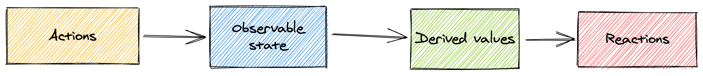

# 核心

## Concepts 概念

`MobX` 在应用程序中区分了以下三个概念：

1. **State**
2. **Actions**
3. **Derivations**

让我们在下面更深入地了解这些概念。

### 1. Define state and make it observable

状态是驱动应用程序的数据。通常，作用于特定的视图或者组件。`State` 就像包含值的电子表格单元格。

使用任何你喜欢的数据结构存储状态如：普通对象、数组、类、环形数据结构(循环链表)或数据结构的引用。类型对 `mobx` 来说毫不重要，只要确保所有你想要跟踪改变的属性都被标记为可观察的(`obversable`)，这样 `MobX` 就可以跟踪它们。

```ts
import { makeObservable, observable, action } from "mobx"

class Todo {
    id = Math.random()
    title = ""
    finished = false

    constructor(title) {
        makeObservable(this, {
            title: observable,
            finished: observable,
            toggle: action
        })
        this.title = title
    }

    toggle() {
        this.finished = !this.finished
    }
}
```

### 2. Update state using actions

`Actions` 值的是任何改变状态的代码。用户交互事件，拉取后端数据，调度任务触发等。

在上面的 `Todo demo` 中，我们有一个 `toggle` 方法，可以更改 `finish` 的值。这就是一个 `action`，我们在构造函数里调用 `makeObserverable` 标记 `toggle` 为 **`action`**。

`mobx` 将更改可观察对象的任何代码段标记为 **`action`**。通过这种方式，`MobX` 可以自动应用事务，从而获得最佳性能。

使用 `action` 有助于您构建代码防止我们无意中更改状态。

### 3. Create derivations that automatically respond to state changes

任何从状态衍生出来、不需要进一步交互作用的结果，都是 `derivation`。`derivation` 有很多种形式：

+ 用户界面重渲染；
+ 衍生数据变化，例如剩余 `TODOS` 的数量；
+ 触发后端更新，例如向服务器提交数据变化；

`MobX` 区分了两种状态衍生(`derivation`)：

+ `Computed values`，可以通过纯函数(`pure function`)从某个可观察(`observable`)状态衍生而出。
+ `reaction`，当状态变化时会产生的副作用(比如视图渲染)。
  + 使用 `MobX` 时，人们往往会过度使用 `reaction`。黄金法则是，如果基于当前状态创建值，则始终使用 `computed`。

#### 3.1. Model derived values using computed

要创建一个计算值，使用 `getter` 方法关键字  `get` 定义一个属性，并用 `makobservable` 将其标记为计算值。

```ts
import { makeObservable, observable, computed } from "mobx"

class TodoList {
    todos = []
    get unfinishedTodoCount() {
        return this.todos.filter(todo => !todo.finished).length
    }
    constructor(todos) {
        makeObservable(this, {
            todos: observable,
            unfinishedTodoCount: computed
        })
        this.todos = todos
    }
}
```

`MobX` 保证当添加一个 `todo` 或修改一个已完成 `todo` 的属性时，`unfinishedTodoCount` 将自动更新。

#### 3.2. Model side effects using reactions

作为用户需要能够在界面上看到状态或计算值的更改，此时重新绘制 `GUI`的 `reaction`。

`reaction` 类似于 `Computed`，但是不产生衍生数据，而是会产生副作用，如打印到控制台，进行网络请求，更新组件树等。

**Custom reactions**

简单的响应副作用可以通过 `autorun` 来创建。例如，下面的 `autorun` 每次都会打印日志消息，每次未完成任务的数量：

```ts
// A function that automatically observes the state.
autorun(() => {
    console.log("Tasks left: " + todos.unfinishedTodoCount)
})
```

**Reactive React components**

如果要使用 `React`，想让组件渲染成为副作用，您可以通过数据绑定包 `mobx-react` 中的 `observer` 函数来包装组件，来使组件具有响应性。在本例中，我们将使用更轻量级的 `mobx-react-lite` 包。

```tsx
import * as React from "react"
import { render } from "react-dom"
import { observer } from "mobx-react-lite"

const TodoListView = observer(({ todoList }) => (
    <div>
        <ul>
            {todoList.todos.map(todo => (
                <TodoView todo={todo} key={todo.id} />
            ))}
        </ul>
        Tasks left: {todoList.unfinishedTodoCount}
    </div>
))

const TodoView = observer(({ todo }) => (
    <li>
        <input type="checkbox" checked={todo.finished} onClick={() => todo.toggle()} />
        {todo.title}
    </li>
))

const store = new TodoList([new Todo("Get Coffee"), new Todo("Write simpler code")])
render(<TodoListView todoList={store} />, document.getElementById("root"))
```

## Principles 原则

`MobX`使用单向数据流，通过操作改变状态，进而更新所有受影响的计算数据，最后更新依赖响应式数据改变的视图。



+ 当状态改变时，所有的 `derivation` 都会自动原子级地更新。因此，我们永远也不可能观察到中间状态。
+ 默认情况下，所有 `derivation` 的更新都是同步的。这意味着可以在`action`改变状态后直接安全地检查计算值(`computed`)。
+ `computed` 值的计算是惰性的，任何没有被使用的计算值都不会自动更新，只有当他们被用到的时候才会更新计算值，如果视图都不再使用计算值，计算值会被自动的垃圾回收。
+ 所有计算值都应该是**纯**的，且不应该改变状态。


