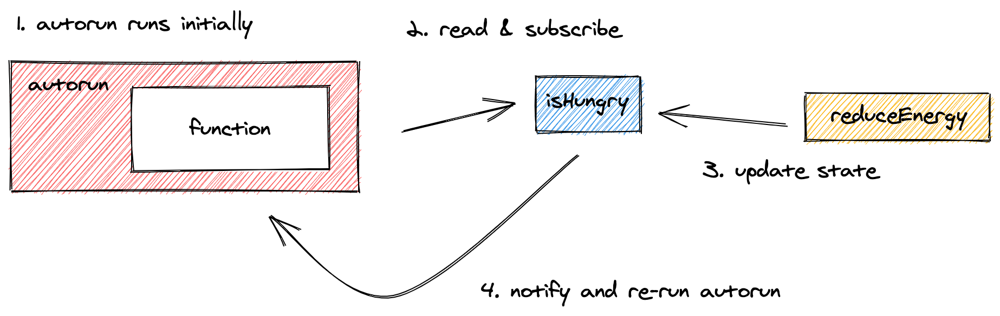

# Running side effects with reactions

`Reaction` 构建自动发生的副作用。他们可以为您的可观察状态创造消费者，并在可观察对象变化的时候时自动运行副作用。

其实 `mobx` 本身提供的 `reaction API` 很少被使用的，实际项目开发时我们使用的都是 `mobx-react` 中提供的绑定到视图更新的反应。

## Autorun

> `autorun(effect: (reaction) => void)`

`autorun` 接受一个函数，每次其依赖的对象(可观察对象)到更改都运行。`autorun` 本身在创建时也运行一次。它只响应可观察状态的变化。

### How tracking works

`autorun` 通过运行响应式上下文来工作。在执行提供的函数期间，`MOBX`会通过 `effect` 跟踪所有被直接或间接读取的 `observable`值和`computed`值。

一旦函数完成，`MOBX` 会收集并订阅函数执行过程中读取的所有可观察对象，并且等待直到它们中的任何一个再次变化。一旦发生变化 `autorun` 会重新触发，重复整个过程。



```ts
import { makeAutoObservable, autorun } from "mobx"

class Animal {
    name
    energyLevel

    constructor(name) {
        this.name = name
        this.energyLevel = 100
        makeAutoObservable(this)
    }

    reduceEnergy() {
        this.energyLevel -= 10
    }

    get isHungry() {
        return this.energyLevel < 50
    }
}

const giraffe = new Animal("Gary")

autorun(() => {
    console.log("Energy level:", giraffe.energyLevel)
})

autorun(() => {
    if (giraffe.isHungry) {
        console.log("Now I'm hungry!")
    } else {
        console.log("I'm not hungry!")
    }
})

console.log("Now let's change state!")
for (let i = 0; i < 10; i++) {
    giraffe.reduceEnergy()
}
```

## Reaction

> `reaction(() => value, (value, previousValue, reaction) => { sideEffect }, options?)`

`reaction` 类似于 `auto`，但提供了更细粒度的可观察对象跟踪控制。

它接受两个函数作为参数，第一个参数是一个函数跟踪并且返回 `data` ，这个 `data` 用作第二个`effect`函数的输入数据。重要的是

需要注意的是，`effect` 只对在 `data` 函数中访问的数据有 `reaction` 效果，这些数据可能比 `effect` 函数中实际使用的数据要少。

不同于 `autorun` 的是当创建时`effct` 函数不会直接运行，只有在**数据表达式首次返回一个新值后**才会运行。 在执行 `effect` 函数时访问的任何 `observable` 对象都不会被追踪。也就是说跟踪是发生在第一个参数的。

### Example

下面的例子里，`reaction` 不会因为 ` giraffe.energyLevel` 改变而触发，只有 ` giraffe.energyLevel` 降低到阈值的时候触发了 `isHungry` 的改变，才会导致 `reaction` 的 `effect` 函数执行。

```javascript
import { makeAutoObservable, reaction } from "mobx"

class Animal {
    name
    energyLevel

    constructor(name) {
        this.name = name
        this.energyLevel = 100
        makeAutoObservable(this)
    }

    reduceEnergy() {
        this.energyLevel -= 10
    }

    get isHungry() {
        return this.energyLevel < 50
    }
}

const giraffe = new Animal("Gary")

reaction(
    () => giraffe.isHungry,
    isHungry => {
        if (isHungry) {
            console.log("Now I'm hungry!")
        } else {
            console.log("I'm not hungry!")
        }
        console.log("Energy level:", giraffe.energyLevel)
    }
)

console.log("Now let's change state!")
for (let i = 0; i < 10; i++) {
    giraffe.reduceEnergy()
}
```

## When

> 1. `when(predicate: () => boolean, effect?: () => void, options?)`
> 2. `when(predicate: () => boolean, options?): Promise`

`when` 方法执行并且跟踪 `predicate` 函数，直到它返回 `true` 的时候，给定的 `effect` 副作用函数会被执行。

`when `方法返回一个处理器，允许你将它手动的取消。

如果你不传递第二个参数 `effect`，那么这个方法返回一个 `promise`，你可以通过 `.then`的形式链式的调用副作用函数。因为执行实际是相同的。这个 `promise` 有一个 `cancel` 方法允许你取消副作用。

举个例子，在下面的例子里，一旦当 `isVisiable` 变为 `false` 的时候，`dispose` 触发来 `clean up MyResource`。

```ts
import { when, makeAutoObservable } from "mobx"

class MyResource {
    constructor() {
        makeAutoObservable(this, { dispose: false })
        when(
            // Once...
            () => !this.isVisible,
            // ... then.
            () => this.dispose()
        )
    }

    get isVisible() {
        // Indicate whether this item is visible.
    }

    dispose() {
        // Clean up some resources.
    }
}
```

### `await when(...)`

当没有提供effect函数返回 `Promise` 时。`when` 可以与 `async / await` 很好地结合在一起，让你在可观察状态中等待变化。

```ts
async function() {
    await when(() => that.isVisible)
    // etc...
}
```

## Always dispose of reactions

传递给 `autorun`, `reaction` 和 `when`的函数只会在他们依赖的所有可观察值被垃圾回收之后才会自动的垃圾回收，

```ts
const counter = observable({ count: 0 })

// Sets up the autorun and prints 0.
const disposer = autorun(() => {
    console.log(counter.count)
})

// Prints: 1
counter.count++

// Stops the autorun.
disposer()

// Will not print.
counter.count++
```

`mobx` 强烈建议在声明的副作用不需要再被使用之后调用这些函数返回的 `dispose` 方法来清除副作用，如果你不这么作很有可能发生内存泄漏。

> [注意：]() `when` 方法返回 `promise` 值的时候需要调用 `promise.cancel` 来清除副作用。

## Rules

有一些规则适用于任何响应上下文：

+ 默认情况下，如果一个可观察对象被改变，受影响的反应会立即(同步)运行。但是，它们不会在当前最外层`action`操作结束之前运行。
+ `Autorun` 只跟踪在所提供函数的同步执行期间读取的可观察对象，但它不会跟踪异步发生的任何事情。

## Option

上面的函数都接受一个 `option` 参数：

- `fireImmediately`: 布尔值，用来标识效果函数是否在数据函数第一次运行后立即触发。默认值是 `false` 。
- `delay`: 可用于对效果函数进行去抖动的数字(以毫秒为单位)。如果是 `0`(默认值) 的话，那么不会进行去抖。
- `equals`: 默认值是 `comparer.default` 。如果指定的话，这个比较器函数被用来比较由 *数据* 函数产生的前一个值和后一个值。只有比较器函数返回 false *效果* 函数才会被调用。此选项如果指定的话，会覆盖 `compareStructural` 选项。
- `name`: 字符串，用于在例如像 [`spy`](https://cn.mobx.js.org/refguide/spy.html) 这样事件中用作此 `reaction` 的名称。
- `onError`: 用来处理 `reaction` 的错误，而不是抛出它们。
- `scheduler`: 设置自定义调度器以决定如何调度 `autorun` 函数的重新运行

## State sensing (状态感应)

> 不建议使用 `when`，逻辑容易混乱，文档后面有更好使用方式。

`when`、`reaction` 需定义在 `constructor` 中，不要放在 `action` 中，容易造成监听混乱

```ts
import { makeAutoObservable, reaction, when } from 'mobx';

class TestStore {
  isReady = false;
  count = 0;

  constructor() {
    makeAutoObservable(this);
    // 监听isReady，当 isReady 变为 true 时，执行 doSomething（一次性行为）
    when(() => this.isReady, () => this.doSomething());
    // 监听amount，当 amount 每次变化后，都会输出 value, previousValue
    reaction(
      () => this.amount,
      (value, previousValue) => {
        console.log(value, previousValue);
      }
    );
  }
  
  doReady(): void {
    this.isReady = true;
  }
  
  doSomething(): void {
    ...
  }
  
  increment(): void {
    this.amount++;
  }  
}

export default new TestStore();
```

### multiStore sensing (多状态感应)

> 也不建议使用。

**testStore.ts**

```ts
// testStore.ts
import { makeAutoObservable, when } from 'mobx';
import userStore from './userStore.ts';

class TestStore {
  amount = 1;

  constructor() {
    makeAutoObservable(this);
    // 当 userStore.isReady 变为 true时，立即执行自己的 init 方法
    when(
      () => userStore.isReady,
      () => this.init()
    );
  }

  get price(): string {
    return `$${this.amount * 100}`;
  }

  init(): void {
    console.log('testStore init...')
  }

  increment(): void {
    this.amount++;
  }
}

export default new TestStore();
```

**userStore.ts**

```ts
// userStore.ts
import { makeAutoObservable, runInAction } from 'mobx';
import * as userService from '@service/user.ts';

class UserStore {
  userInfo = {};
  isReady = false;

  constructor() {
    makeAutoObservable(this);
  }

  async init(): Promise<void> {
    await this.getUserInfo();
  }

  async getUserInfo(): Promise<void> {
    try {
      const data = await userService.getUserData();
      runInAction(() => {
        this.userInfo = data;
        this.isReady = true;
      });
    } catch (e) {
      throw new Error(e);
    }
  }
}

export default new UserStore();
```

