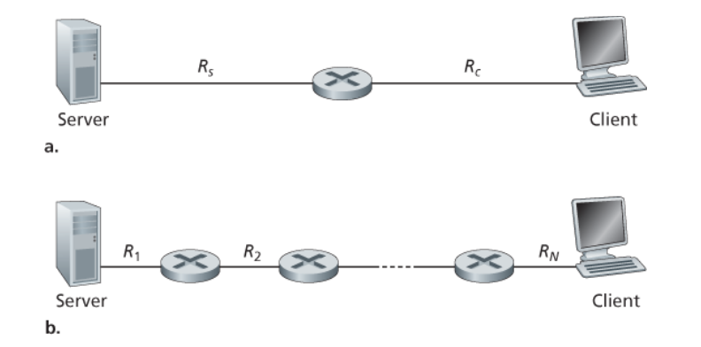
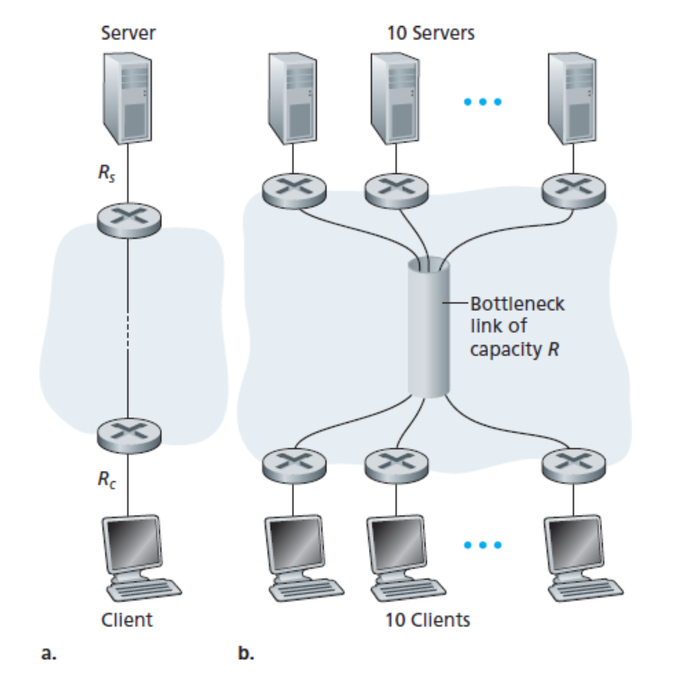

# 因特网概述

## 什么是因特网？

#### 从具体构成出发：

因特网是一个世界范围的计算机网络，他是一个互联了编辑全球数十亿计算设备的网络。

对于因特网术语而言，所有设接入的设备都被称为**`主机(host)`**或者是**`端系统(end)`**，端系统通过**`通信链路(communication link)`**和**`分组交换机(packet switch)`**连接在一起。当一台端系统要向另一台端系统发送数据的时候 ，发送端将数据分段，并且为每段加上首部字段。由此形成的信息包称之为**`分组(packet)`**,分组交换机通过其一条通信链路接收到达的分组，并且从其另一条通信链路转发出去。两种比较常见的分组交换机包括**`路由器(roter)`**和**`链路层交换机(link-layer switch)`**,其中链路层交换机常用于接入网中，而路由器常用于网络核心。**从发送端到接收端系统，一个分组所经过的所有通信链路和分组交换机成为通过该网络的`路径(route或者path)`。**端系统一般通过**`因特网服务提供商(Internet Service Provider, ISP)`**接入因特网。因特网中的每一个部件，交换机，端系统都要遵循一系列**`协议(protocol)`**，这些协议控制这因特网中的信息发送和接受。

#### 从服务出发：

人们在因特网上享受的应用程序涉及多个端系统之间的数据交换，所以他们被称为**`分布式应用服务(distributed app)`**,重要的是这些应用服务并不运行在分组交换机中反而是运行在处于网络边缘的端系统之中，那么一个端系统上的应用程序如何向另一个端系统上的应用程序发送数据呢，对于所有与因特网相连端系统提供了一个**`套接字接口(socket interface)`**,该系统规定了因特网上一个端系统向另一个端系统交付数据的方式。

#### 什么是协议：

**`协议(protocol)`**定义了在两个或者多个通信实体之间交换的报文格式和顺序，以及发送和接受一条报文或者其他事件所采取的动作。

# 网络边缘

端系统也称为主机，因为它们容纳(即运行)应用程序，如 `Web`浏览器程序、 `Web` 服务器程序、电子邮件阅读程序或电子邮件服务器程序等。本书通篇将交替使用主机和端系统这两个术语，即主机=端系统。主机又被进一步划分为两类:**`客户(client)`** 和 **`服务器 (server)`** 。 客户非正式地等同于桌面应用、移动PC 和智能手机等，而服务器非正式地等同于更为强大的机器，用于存储和发布 `Web`页面、流视频、中继电子邮件等。今天，大部分提供搜索结果、电子邮件、`Web` 页面和视频的服务器都属于大型**`数据中心(data center)`** 。 

## 接入网

**`接入网 ( access network)`**，这是指将端系统连接到其`边缘路由器(edge router)`的物理链路。边缘路由器是端系统到任何其他远程端系统的路径上的第一台路由器。 

### 家庭接人: DSL、电缆、 FTTH、拨号和卫星

##### DSL

宽带住宅接人有两种最流行的类型:**`数字用户线 (Digital Subscriber Line , DSL)`**和电缆。住户通常从提供本地电话接人的本地电话公司处获得 `DSL` 因特网接人。 因此，当使用 `DSL` 时，用户的本地电话公司也是它的 `ISP`。

##### 电缆

当 DSL 利用本地电话公司现有的本地电话基础设施时， **`电缆因特网接入 (cable lnlemet access)`** 利用了有线电视公司现有的有线电视基础设施。 电缆因特网接人需要特殊的调制解调器，称为**`电缆调制解调器 (cable modem)`** 。 如同 `DSL` 调制解调器，电缆调制解调器通常是一个外部设备，通过一个以太网端口连接到家庭 `PC` 。

##### FTTH

**`光纤到户( Fiber To The Home ，FTTH)`** ,`FTTH` 概念简单，从本地中心局直接到家庭提供了一条光纤路径。  从本地巾心局到家庭有几种s竞争性的光纤分布方案。 最简单的光纤分布网络称为直接 光纤，从本地中心局到每户设置一根光纤。 更为一般的是，从中心局出来的每根光纤实际 上由许多家庭共享，直到相对接近这些家庭的位置，该光纤才分成每户一根光纤。 进行这 种划分的有两种竞争性的光纤分布体系结构:**`主动光纤网络 (Aclive Optical Network , AON)`**和**`被动光纤网络 (Presive Optical Network , PON)`**,其中AON 基本上就是交换因特网， `FTTH` 有潜力提供每秒千兆比特范围的因特网接人速率。 

### 企业和家庭接人:以太网和 WiFi 

##### 以太网

在公司和大学校园以及在越来越多的家庭环境中，通常是用**`局域网 (LAN)`** 将端用户 连接到边缘路由器。 尽管有许多不同类型的局域网技术，但是以太网到目前为止是当前公 司、大学和家庭网络中最为流行的接人技术。使用以太网接人，用户通常以 **100Mbps** 速率接人以太 网交换机，而服务器可能具有 **lGbps 甚至lOGbps** 的接人速率。

##### WIFI

越来越多的人从便携机、智能手机、平板电脑和其他设备无线接人因特网。在无线 LAN 环境中，无线用户从一个接人点发送/接收分组，该接人点与企业网连接(很可能包括有线以太网) ，该企业网再与有线因特网相连。一个无线 LAN 用户通常必须位于接人点的几十米范围内 。 基于 IEEE 802.11 技术的无钱 LAN 接人，更为通俗地称为 WiFi 

##### 常见家用网络

今天许多家庭正在将宽带住宅接人(即电缆调制解调器或DSL)与廉价的无线局域网技术结合起来，以产生强大的家用网络，图 1-9 显示了典型的家庭网络。 这个家庭网络组成如下:一台漫游的便携机和 l 台有线 PC; 一个与无线 PC 通信的基站(无线接人点); 一个提供与因特网宽带接人的电缆调制解调器; 以及一台互联了基站及带有电缆调制解调器的固定 PC 的路由器。该网络允许家庭成员经宽带接人因特网，其中一个成员可以在厨房、院子或卧室漫游上网。

### 广域无线接人: 3G 和 LTE 

##### 3G

 3G 为分组交换广域 无线因特网接人提供了超过 1Mbps 的速率。 甚至更高速率的广域接人技术及第四代(4G) 广域无线网络已经在部署中。

## 物理媒介

考虑一个比特从一个端系统开始传输，通过一系列链路和路由器，到达另一个端系统。这个比特被传输许许多多次，源端系统首先传输这个比特，不久后其中的第一台路由器接收该比特、第一台路由器传输该比特，接着不久后第二台路由器接收该比特。 因此，这个比特当从源到目的地传输时，通过一系列"传输器-接收器"对。对于每个传输器-接收器，通过跨越一种`物理媒体 (physical medium)` 传播电磁波或光脉冲来发送该比特。 

>  物理媒体划分为两类:**`导引型媒体 (guided media)`** 和**`非导引型媒体(unguided media)`** 。 对于导引型媒体，电波沿着固体媒体前行，如光缆、双绞铜线或同轴电缆。 对于非导引型媒体，电波在空气或外层空间中传播，例如在无线局域网或数字卫星频道。 

### 双绞铜线 

双绞线由两根隔离的铜线组成，每根大 约 lmm 粗，以规则的螺旋形式排列着。这两根线被绞合起来，以减少来自邻近类似的双 绞线的电气干扰。通常许多双绞线捆扎在一起形成一根电缆，并在这些双绞线外面覆盖上保护性防护层。 一对电线构成了一个通信链路。**`无屏蔽双绞线 (Unsbielded TwisLed Pair, UTP)`** 常用在建筑物内的计算机网络中，即用于**`局域网 (LAN)`** 中。 目前局域网中的双绞 线的数据速率从 `10Mbps` 到`1OGbps` 所能达到的数据传输速率取决于线的粗细以及传输方和接收方之间的距离。 

### 同轴电缆 

与双绞线类似，同轴电缆由两个铜导体组成，但是这两个导体是同心的而不是并行的。借助于这种结构及特殊的绝缘体和保护层，同轴电缆能够达到较高的数据传输速率。电缆电视系统最近与电缆调制解调器结合起来，为住宅区用户提供数`10Mbps` 速率的因特网接人。 

### 光纤 

光纤是一种细而柔软的、能够导引光脉冲的媒体，每个脉冲表示一个比特。一根光纤能够支持极高的比特速率，高达数十甚至数百`Gbps`它们不受电磁干扰，长达`100km`的光缆信号衰减极低，井且很难窃听。这些特征使得光纤成为长途引导型传输媒体，特别是跨海链路。

### 陆地无线电信道 

它不需要安装物理线路，并具有穿透墙壁、提供与移动用户的连接以及长距离承载信号的能力，因而成为一种有吸引力的媒体。 无线电信 道的特性极大地依赖于传播环境和传输信号的距离。

陆地无线电信道能够大致划分为三类:一类运行在很短距离(如 1 米或 2 米) ;另一类 运行在局域，通常跨越数十到几百米;第三类运行在广域，跨越数万米。 个人设备如元线头 戴式耳机、键盘和医疗设备跨短距离运行，在无线 LAN 技术使用了局域无线电信道;蜂窝接入技术使用了广域无线电信道。

### 卫星无线电信道 

近地轨道卫星技术未来也许能够用于因特网接人。

# 网络核心

即由互联因特网端系统的分组交换机和链路构成的网状网络。

## 分组交换

在各种网络应用中，端系统彼此交换**`报文(message)`**。 报文能够包含协议设计者需要的任何东西。为了从源端系统向目的端系统发送一个报文，将长报文划分为较小的数据块，称之为**`分组(packet)`** 。在源和目的之间，每个分组都通过**`通信链路`**和**`分组交换机 (packet switch) (交换机主要有两类: 路由器和链路层交换机)`**传送。分组以等于该链路最大传输速率的速度传输通过通信链路。 因此，如果某源端系统或分组交换机经过一条链路发送一个`L比特`的分组，链路的传输速率为 `R 比特/秒`，则传输该分组的时间为 `L/R 秒`。 

接下来我们详细的描述一下分组交换原则

### 存储转发传输 

多数分组交换机在链路的输入端使用**`存储转发传输(store and forward packet switching)`** 机制，当路由器已经接收完了该分组的所有比特后，它才能开始向出链路传输(即"转发")该分组。

为了深刻领悟得储转发传输，我们现在计算一下从源开始发送分组到目的地收到整个分组所经过的时间。源在时刻`0`开始传输，在时刻 `L/R 秒`，因为该路由器刚好接收到整个分组，所以它能够朝着目的地向出链路开始传输分组;在时刻 `2L/R`，路由器已经传输了整个分组，并且整个分组已经被目的地接收。 所以，总时延是 `2L/R`。如果交换机一旦比特到达就转发比特(不必首先收到整个分组) , 则因为比特没有在路由器保持，总时延将是`L/R`。 

> [**上面L表示bit总量，R表示Rmbps，若一条线路的传输速率为1mbps，传输速率于距离看作无关，只与bit量有关。**]()

现在我们来计算从源开始发送第一个分组直到目的地接收到所有三个分组所需的时间，与前面一样，在时刻`L/R`，路由器开始转发第一个分组，而在时刻 `L/R`， 源也开始发送第二个分组，因为它已经完成了发送整个第一个分组。因此，在时刻 `2L/R`， 目的地已经收到第一个分组并且路由器已经收到第二个分组。 类似地，在时刻 `3L/R`， 目的地已经收到前两个分组并且路由器已经收到第三个分组。最后，在时刻 `4L/R`， 目的地已经收到所 有 `3` 个分组。

我们现在来考虑通过由 `N` 条速率均为 `R` 的链路组成的路径(所以，在源和目的地之间有`N-1`台路由器) ，从源到目的地发送一个分组的总体情况。 应用如上相同的逻辑，我们看到端到端时延是:
$$
d_{end~to~end} = N\frac{L}{R}
$$

### 排队时延和分组丢失

每个分组交换机有多条链路与之相连。对于每条相连的链路，该分组交换机具有一个 **`输出缓存 (output buffer) (也称为输出队列 output queue)`** ，它用于存储路由器准备发往那条链路的分组。 该输出缓存在分组交换中起着重要的作用。如果到达的分组需要传输到某条链路，但发现该链路正忙于传输其他分组，该到达分组必须在该输出缓存中等待。 

除了存储转发时延以外，分组还要承受输出缓存的**`排队时延 (queue delay)`** 。 这些时延是变化的，变化的程度取决于网络中的拥塞程度。 因为缓存空间的大小是有限的， 一个到达的分组可能发现该缓存已被其他等待传输的分组完全充满了。此情况下，将出现分组丢失**`丢包(packet lost)`** ，刚到达的分组或已经排队的分组之一将被丢弃。

### 转发表和路由选择协议

路由器从与它相连的一条通信链路得到分组，将其向与它相连的另一 条通信链路转发。但是该路由器怎样决定它应当向哪条链路进行转发呢?

在因特网，每个端系统具有一个称为 IP 地址的地址。当源主机要向目的端系统发送一个分组时，源在该分组的首部包含了目的地的`IP地址`。当一个分组到达网络中的路由器时，路由器检查该分组的目的地址的一部分，并向一台相邻路由器转发该分组。更特别的是，每台路由器具有一个**`转发表 (forwarding table)`**，用于将目的地址(或目的地址的一部分)映射成为输出链路。 当某分组到达一台路由器时，路由器检查该地址，并用这个目的地址搜索其转发表，以发现适当的出链路。路由器则将分组导向该出链路。此外因特网具有一些特殊的**`路由选择协议 (routing protocol)`**，用于自动地设置这些转发表。例如，一个路由选择协议可以决定从每台路由器到每个目的地的最短路径，并使用这些最短路径结果来配置路由器中的转发表。 

## 网络的网络

端系统经过一个接人 `ISP` 与因特网相连。 该**接入ISP** 能够提供有线或无线连接，使用了包括 `DSL、电缆、 FITH、 WiFi 和蜂窝等多种接入技术`。  但为端用户和内容提供商提供与接人 ISP 的连接仅解 决了连接难题中的很小一部分，因为因特网是由数以亿计的用户构成的。要解决这个难题，接人`lSP` 自身必须互联。 通过创建网络的网络可以做到这一点，理解这个短语是理解因特网的关键。年复一年，构成因特网的"网络的网络"已经演化成为一个非常复杂的结构。 这种演化很大部分是由经济和国家策略驱动的，而不是由性能考虑驱动的。 

### 网络结构 0

使每个接人`ISP` 直接与每个其他接人 ISP 连接。 当然，这样的网状设计 对于接人 `ISP` 费用太高，因为这将要求每个接人 ISP 与世界上数十万个其他接人 `ISP` 有一 条单独的通信链路。

### 网络结构 1

用单一的全球承载 `ISP` 互联所有接人 `ISP`。 我们 假想的`全球承载 ISP` 是一个由路由器和通信链路构成的网络，该网络不仅跨越全球，而且 至少具有一个路由器靠近数十万接人 `ISP` 中的每一个 当然，对于全球承载 `ISP`，建造这 样一个大规模的网络将耗资巨大。 为了有利可图，自然要向每个连接的接人 `ISP` 收费，其价格反映(并不一定正比于)一个接人 `ISP` 经过全球 `ISP` 交换的流量大小。 因为接人 `ISP` 向全球承载 `ISP` 付费，故接人 ISP 被认为是**`客户(customer)`** .而全球承载 `ISP` 被认为是**`提供商(provider)`** 。 

### 网络结构 2

它由数十万接人 `ISP` 和多个全球承载 `ISP` 组成。 接人 `ISP` 无疑喜欢网络结构 2 胜过喜欢网络结构 1 , 因为它们现在能够根据价格和服务的函数，在多个竞争的全球承载提供商之间进行选择。值得注意的是，这些全球承载 `ISP` 之间必须是互联的。不然的话，与某个全球承载 `lSP` 连接的接人 ISP 将不能与连接到其他全球承载 `ISP` 的接人 `ISP` 通信。 

### 网络结构 3

在任何给定的区域，可能有一个**`区域 ISP (reginal ISP)`**，区域中的接入`lSP`与之连接。每个区域`lSP` 则与第一层 `ISP` (tier-1 ISP) 连接。 第一层 `ISP` 类似于我们假想的全球承载 `ISP` 尽管第一层 `ISP` 不 是在世界上每个城市巾都存在，但它确实存在。 有大约十几个第一层 `ISP`，包括`Level3 通信、 AT&T、 SprinL 和 NTT`。 有趣的是，没有组织正式认可第一层状态。 俗话说:如果必须 问你是有是一个组织的成员，你可能不是。 

### 网络结构 3.5

为了建造一个与今天因特网更为相似的网络，我们必须在等级结构的网络结构3上增加**`存在点 (Point of Presence, PoP)`** 、多宿、对等和**`因特网交换点 (Jnternet exchange point , IXP)`** PoP 存在于等级结构的所有层次，但底层(接人 `ISP`) 等级除外。一个`PoP` 只是提 供商网络巾的一台或多台路由器(在相同位置)群组，其中客户ISP 能够与提供商`ISP`连 接。对于要与提供商`PoP` 连接的客户网络，它能从第三方通信提供商租用高速链路直接将它的路由器之一连接到位于该`PoP` 的一台路由器。任何 `ISP` (除了第一层 `ISP`)可以选择 为`多宿 (multi-home)`，即可以与两个或更多提供商`ISP` 连接。例如，一个接人 ISP 可能与 两个区域 `ISP` 多宿，或者可以与两个区域 `ISP` 多宿，也可以与多个第一层 `ISP` 多宿。当一个 `ISP` 多宿时，即使它的提供商之一出现故障，它仍然能够继续发送和接收分组。

### 网络结构4

客户 `ISP` 向它们的提供商 ISP 付费以获得全球因特网互联能力客户 `ISP` 支付给提供商 `ISP` 的费用数额反映了它通过提供商交换的流量，为了减少这些费用，位于相同等级结构层次的邻近一对 ISP 能够对等。当两个 `ISP` 对等时，通常不进行结算，即任一个 `ISP` 不向其对等付费如前面提到的那样，第一层 `ISP` 也与另一个第一层 `ISP`等，它们之间无结算。沿着这些相同路线，地方公司创建一个`因特网交换点 (InLemet Exchange Point)` ,` IXP`是一个汇合点，多个 `ISP` 能够在这里共同对等。在今天的因特网中有大约300个`IXP`。我们称这个系统为生态系统，由接人`ISP`、以区域`ISP`、第一层`ISP`、`POP`、多宿、对等和 `IXP` 组成，这个系统作为网络结构 4。 

### 网络结构5

我们现在最终到达了网络结构5，它通过在顶部增加**`内容提供商网络 (conLent provider net work)`** 构建而成。  

# 分组交换网中的时延和丢包、吞吐量

计算机网络必定要限制在端系统之间的吞吐量(每秒能够传送的数据盘) ，在端系统之间引入时延，而且实际上能够丢失分组。

## 时延和丢包 

### 分组交换网中的时延概述

当分组从一个**结点(主机或路由器)**沿着·**后继结点(主机或路由器)**，该分组在沿途的每个结点经受了几种不同类型的时延。这些时延最为重要的是**结点处理时延(nodal processing delay)**、**排队时延(queuing delay)**、**传输时延(ansmission delay)** 和**传播时延 (propagalÍon delay)**，这些时延总体累加起来是**结点总时延(nodal delay)** 。

### 时延的类型 

**传输的条件：**

- 路由器 A 具有通往路由器 B 的出链路。
- 当在该链路没有其他分组正在传输并且没有其他分组排在该队列前面时，才能在这条链路上传输该分组。

#### 处理时延

检查分组首部和决定将该分组导向何处所需要的时间是处理时延的一部分。高速路由器的处理时延通常是微秒或更低的数量级。在这种结点处理之后，路由器将该分组引向通往路由器 B 链路之前的队列。

#### 排队时延 

在队列中，当分组在链路上等待传输时，它经受排队时延。一个特定分组的排队时延长度将取决于先期到达的正在排队等待向链路传输的分组数量。

#### 传输时延

假定分组以先到先服务方式传输，这在分组交换网中是常见的方式，仅当所有已经到达的分组被传输后，才能传输刚到达的分组。用 `L` 比特表示该分组的长度，用 `R bps (即 b/s)` 表示从路由器 A 到路由器 B 的链路传输速率。 例如，对于一条 `10Mbps` 的以太网链路，速率`R = 10Mbps`; 对于 `100Mbps` 的以太网链路，速率 `R = 100Mbps`，传输时延是`L/R`。这是将所有分组的比特推向链路所需要的时间。

#### 传播时延 

从该链路的起点到路由器 B 传播所需要的时间是传播时延。 该比特以该链路的传播速率传播。 该传播速率取决于该链 路的物理媒体(即光纤、双绞铜线等)，其速率等于或略小于光速。该传播时延等于两台路由器之间的距离除以传播速率。即传播时延是d/s，其中 d 是路由器 A 和路由器 B 之间的距离，s是该链路的传播速率。 一旦该分组的最后一个比特传播到结点 B ，该比特及前面的所有比特被存储于路由器 B。 整个过程将随着路由器 B 执行转发而持续下去。

#### 总结

如果我们令**`d(prod)、d(queue)、d(trans)、d(prop)`**分别表示处理时延、排队时延、传输时延和传播时延，则结点的总时延由下式给定: 
$$
d_{nodal}~=~d_{prod}~+~d_{queue}~+~d_{trans}~+~d_{prop}
$$
处理时延`d(proc)`通常是微不足道的，然而，它对一台路由器的最大吞吐量有重要影响，最大吞吐量是一台路由器能够转发分组的最大速率。

### 排队时延和丢包

**排队时延**

结点时延的最为复杂和有趣的成分是排队时延 `d(queue)`，例如，如果 10 个分组同时到达空队列，传输的第一个分组没有排队时延，而传输的最后一个分组将经受相对大的排队时延(这时它要等待其他9个分组被传输)。因此，当计算排队时延时，人们通常使用统计量测度，如平均排队时延、排队时延的方差和排队时延超过某些特定值的概率。 

为了更深入地领会某些要点，令 `α` 表示**`分组到达队列的平均速率 (α 的单位是分组/ 秒，即 pkt/s)`** 。 前面讲过 `R` 是传输速率，即从队列中**`推出比特的速率(以 bps 即 b/s 为单位)`** 。为了简单起见，也假定所有分组都是由 `L` 比特组成的。 则比特到达队列的平均速率 是 `Lα bps`。 最后，假定队列非常大，因此它基本能容纳无限数量的比特。`比率 Lα/R`  称为**`流量强度( traffic intensity)`**，它在估计排队时延的范围方面经常起着重要的作用。 如果 `La/R > 1` ，则 比特到达队列的平均速率超过从该队列传输出去的速率。在这种不幸的情况下，该队列趋向于无界增加，并且排队时延将趋向无穷大！因此流量工程中的一条金科玉律是：**设计系统时流量强度不能大于 1** 。 

**丢包**

我们已经假设队列能够容纳无穷多的分组。在现实中，一条链路前的队列只有有限的容量，尽管**排队容量极大地依赖于路由器设计和成本**。 因为该排队容量是有限的，随着流量强度接近 1 ，排队时延并不实际趋向无穷大。 相反，到达的分组将发现 一个满的队列。 由于没有地方存储这个分组，路由器将`丢弃(drop)` 该分组，即该分组将会`丢失(lost)` 。

### 端到端时延

 我们现在考虑从源到目的地的总时延。 为了能够理解这个概念，假定在源主机和日的主机之间有`N-1` 台路由器。 我们还要假设该网络此时是无拥塞的(因此排队时延是微不足道的) ，在每台路由器和源主机上的处理时延是`d(proc)`，每台路由器和源主机的输出速率是`R bps`，每条链路的传播时延是 `d(prop)`。 结点时延累加起来，得到端到端时延: 
$$
d_{end~to~end}~=~N*(d_{prod}~+~d_{trans}~+~d_{prop})
$$

## 计算机网络中的吞吐量

### 吞吐量的定义

为了定义吞吐量，考虑从**主机A**到**主机B**跨越计算机网络传送个大文件。 例如，也许是从一个**P2P文件**共享系统中的一个对等方向另一个对等方传送一个大视频片段。在任何时间瞬间的**`瞬时吞吐量( instantaneous throughput)`** 是主机B接收到该文件的速率(以**bps**计)。如果该文件由F比特组成，主机**B**接收到所有**F**比特用去**T**秒，则文件传送的**`平均吞吐量(average throughput)`**是**`F/T bps`**。对于某些应用程序如因特网电话，希望具有低时延和在某个阈值之上的一致的瞬时吞吐量。

为了进一步深人理解吞吐量这个重要概念，我们考虑几个例子。上图显示了服务器和客户这两个端系统，它们由两条通信链路和一台路由器相连。考虑从服务器传送一个文件到客户的吞吐量。令**Rs**表示服务器与路由器之间的链路速率、**Rc**表示路由器与客户之间的链路速率。假定在整个网络中只有从这台服务器到那台客户的比特在传送。我们可以想象比特是流体，通信链路是管道。显然，这台服务器不能以快于**Rsbps**的速率通过其链路注人比特，这台路由器也不能以快于**Rc bps**的速率转发比特。如果**Rs <Rc**，则由该服务器注人的比特将顺畅地通过路由器“流动"，并以速率**Rc bps**到达客户，给定了**Rsbps**的吞吐量。在另方面，如果**Rc < Rs**，则该路由器将不能够以接收它们那样快的速率来转发比特。在这种情况下，比特将以速率**Rs**离开该路由器，从而得到端到端吞吐量**Rs**。(还要注意的是，如果比特继续以速率**Rs**到达该路由器，继续以**Rc**离开路由器的话，在该路由器中等待传输给客户的积压比特将不断增加，这是一种非常不希望的情况!)。因此，对于这种简单的两链路的网络，其吞吐量是**min{Rc，Rs}**，这就是说，它是**`瓶颈链路(bot一tleneck link)`**的传输速率。在决定了吞吐量之后，我们现在近似地得到从服务器到客户传输一个**F**比特的大文件所需要的时间是**F/min{Rc，Rs}**。对于一个特定的例子，假定你正在下载一个**F=32x10^6**比特的MP3文件，服务器具有**Rc =2Mbps**的传输速率，并且你有一条**Rs=1Mbps**的接人链路。则传输该文件所需的时间是32秒。当然，这些吞吐量和传送时间的表达式仅是近似的，因为它们并没有考虑分组层次和协议的问题。

下图此时显示了在服务器和客户之间具有N条链路的一个网络，这**N**条链路的传输速率分别是**R1,R2,,,,Rx**。应用与对两条链路网络的分析相同的方法，我们发现从服务器到客户的文件传输的吞吐量是**min{R1, R2, .., RN**}。

考虑从服务器向客户的文件传送的吞吐量。服务器以速率为**Rs**的接人速率与网络相连，且客户以速率为**Rc**的接入速率与网络相连。现在假定在计算机网络核心中的所有链路具有非常高的传输速率，即该速率比**Rc和Rs**要高得多。目前因特网的核心的确过度装备了高速率的链路，从而很少出现拥塞。同时假定在整个网络中发送的比特都是从该服务器到该客户。在这个例子中，因为计算机网络的核心就像一个宽大的管子，所以比特从服务器向目的地的流动速率仍是Rc和Rs中的最小者，即**吞吐量=min{Rs, Rc}**。因此，在今天因特网中对吞吐量的限制因素通常是接人网。

# 层次协议和服务模型

> 对于大而复杂且需要不断更新的系统，改变服务的实现而不影响该系统其他组件是分层的另一个重要优点。

## 协议分层

