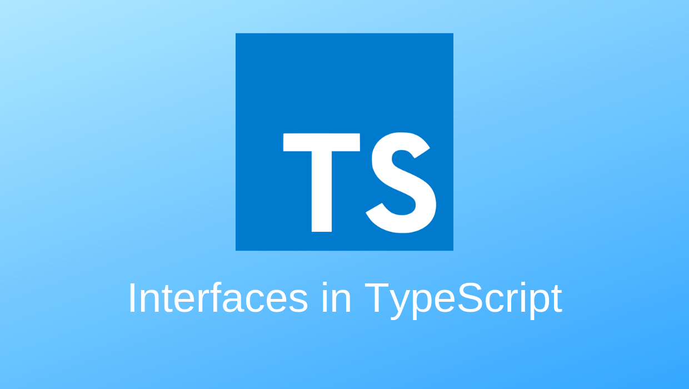

`TypeScript`的核心原则之一是对值所具有的**结构**进行类型检查。 有时被称做`鸭式辨型法`或`结构性子类型化`。 在`ts`里，接口的作用就是为这些类型命名和为你的代码或第三方代码定义契约。`TS`里面的接口和`GO`很像，只不过接口中可以定义属性。掌握接口最重要的一点就是了解接口也是一种类型。

## 对象接口

```ts
interface Player {
		id: number;
    nickname: string;
}

function play(player: Player) {
    console.log(player.id + ":" + player.name);
}

let cbtly = {
    id: 0x0001,
    nickname: "faker",
    age: 20,
};
play(cbtly);
```

类型检查器不会去检查属性的顺序，只要相应的属性存在并且类型也是对的就可以，注意属性名是必须相同的。同时接口的实现是隐式的，类型检查器会查看属性是否被实现。

> [注意：]()
>
> 对于对象(字面量)接口约束检查是非常严格的，字面量的属性必须和接口的一一对应，不能多也不能少，而对于类就没有那么严格了，类接口允许实例化的类对象拥有多于接口的属性和方法(但是也不能少)。

### 函数属性

当然函数也可以作为检查的属性，不过这个时候一定要使用具名函数，使用匿名函数的时候就默认是一个函数接口了。

```ts
interface PlayerPro {
    id: number;
    name: string;
    topUp(money: number): void;
}

function createProPlayer(): PlayerPro {
    let playerp = {
      id: 0x0002
			name = "cbt";
			topUp(money: number) {};
    };
    return playerp;
}

function playp(player: PlayerPro) {
    console.log(player.id + ":" + player.name);
  	player.topUp();
}

playp(createProPlayer());
```

### 可选属性

接口里的属性不全都是必需的。 有些是只在某些条件下存在，或者根本不存在。 可选属性在应用“option bags”模式时很常用，即给函数传入的参数对象中只有部分属性赋值了。

```ts
interface SquareConfig {
  color?: string;
  width?: number;
}

function createSquare(config: SquareConfig): {color: string; area: number} {
  let newSquare = {color: "white", area: 100};
  if (config.color) {
    newSquare.color = config.color;
  }
  if (config.width) {
    newSquare.area = config.width * config.width;
  }
  return newSquare;
}

let mySquare = createSquare({color: "black"});
```

### 只读属性

一些对象属性只能在对象刚刚创建的时候修改其值。 你可以在属性名前用 `readonly`来指定只读属性:

```ts
interface Point {
    readonly x: number;
    readonly y: number;
}
```

你可以通过赋值一个对象字面量来构造一个`Point`。 赋值后， `x`和`y`再也不能被改变了。

```ts
let p1: Point = { x: 10, y: 20 };
p1.x = 5; // error!
```

TypeScript具有`ReadonlyArray<T>`类型，它与`Array<T>`相似，只是把所有可变方法去掉了，因此可以确保数组创建后再也不能被修改：

```ts
let a: number[] = [1, 2, 3, 4];
let ro: ReadonlyArray<number> = a;
ro[0] = 12; // error!
ro.push(5); // error!
ro.length = 100; // error!
a = ro; // error!
```

上面代码的最后一行，可以看到就算把整个`ReadonlyArray`赋值到一个普通数组也是不可以的。 但是你可以用类型断言重写：

```ts
a = ro as number[];
```

>  **`readonly` vs `const`**：最简单判断该用`readonly`还是`const`的方法是看要把它做为变量使用还是做为一个属性。 做为变量使用的话用 `const`，若做为属性则使用`readonly`。

### 字符串索引签名

对象字面量会被特殊对待而且会经过**额外属性检查**，当将它们赋值给变量或作为参数传递的时候。 如果一个对象字面量存在任何“目标类型”不包含的属性时，你会得到一个错误。

```ts
// error: 'colour' not expected in type 'SquareConfig'
let mySquare = createSquare({ meterial: "F", width: 100 });
```

绕开这些检查非常简单。 最简便的方法是使用类型断言：

```ts
let mySquare = createSquare({ meterial: "F", width: 100 } as SquareConfig);
```

然而，最佳的方式是能够添加一个字符串索引签名，下面的这个索引签名表示 `SquareConfig` 有多个 `string: any` 类型约束的键值对：

```ts
interface SquareConfig {
    color?: string;
    width?: number;
    [propName: string]: any;
}
```

不过字符串索引签名同时限定了对象中的所有**键** `string` 类型的属性，比如下面就限定了所有 `string` 类型的键对应的值也都必须为 `string` 类型：

```TS
interface SquareConfig {
    width?: number; 
    // Property 'width' of type 'number' is not assignable to string index type 'string'
    [propName: string]: string;
}
```

### 数字索引签名

除了字符串索引签名之外还可以声明数字索引签名，

```ts
interface StringArray {
    [index: number]: string;
}

let foo: ReadonlyStringArray = ["json", "xml", "list"];
let bar: ReadonlyStringArray = "context";
```

数字索引的索引值(`0`: XXX)必须是字符串索引返回值类型的子类型。 这是因为当使用 `number`来索引时，JavaScript会将它转换成`string`然后再去索引对象，所以同时声明这个两个索引时对应的值类型必须相同，因为 `string` 类型索引其实是包含 `number ` 索引的：

```ts
interface dictory {
    [propName: string]: string;
    [propName: number]: number; // must be string or error
}
```

和字符串索引相同，数字索引限定所有数字类型键对应对的值，但是没有限定字符串类型键对应的值，因为数字索引是字符串索引的子集，所以下面的声明是合法的：

```ts
interface IDictoryArray {
    [propName: number]: string;
    length: number;
    name: string;
    info: object;
}
```

最后，你可以将索引签名设置为只读，这样就防止了给索引赋值：

```ts
interface ReadonlyStringArray {
    readonly [index: number]: string;
}
let myArray: ReadonlyStringArray = ["Alice", "Bob"];
myArray[2] = "Mallory"; // error!
```

## 函数类型

接口能够描述JavaScript中对象拥有的各种各样的外形。 除了描述带有属性的普通对象外，接口也可以通过匿名函数的格式描述函数类型。对于函数类型的类型检查来说，函数的参数名不需要与接口里定义的名字相匹配。

```ts
interface SearchFunc {
    (source: string, subString): boolean;
}

let mySearch: SearchFunc;
mySearch = function (source: string, subString: string): boolean {
    return true;
};

mySearch = function (src, sub) {
    return true;
};
```

## 类类型

### 实现接口

与 `C#` 或 `Java` 里接口的基本作用一样，`TypeScript` 也能够用它来明确的强制一个类去符合某种契约。

```ts
interface ClockInterface {
    currentTime: Date;
}

class Clock implements ClockInterface {
    currentTime: Datinterface ClockInterface {
    currentTime: Date;
    setTime(d: Date);
}

class Clock implements ClockInterface {
    currentTime: Date;
    setTime(d: Date) {
        this.currentTime = d;
    }
    constructor(h: number, m: number) { }
}
```

> **注意：**接口描述了类的公共部分，而不是公共和私有两部分。 它不会帮你检查类是否具有某些私有成员。

### 类静态部分与实例部分的区别

当你操作类和接口的时候，你要知道类是具有两个类型的：静态部分的类型和实例的类型。 你会注意到，当你用构造器签名去定义一个接口并试图定义一个类去实现这个接口时会得到一个错误。

一个类实现一个接口时，只对其实例部分进行类型检查。`constructor`存在于类的静态部分，所以不在检查的范围内。

```ts
interface ClockConstructor {
    new (hour: number, minute: number);
}

class Clock implements ClockConstructor {
    currentTime: Date;
    constructor(h: number, m: number) { }
}
```

那么类的静态部分有哪些？我们要先知道`class`的实现原理：

`class`的本质其实就是构造函数，每一个构造函数在创建的时候首先会和`Function`的原型链接，包括其本身的属性和`__proto__`上的属性都算是静态属性，因为这些属性在实例化的时候不会实例所继承，而实例会获得的其实是定义在`prototype`上的属性，每一个类函数创建的时候都会获得一个空的`prototype`，这才是真正的实例部分的属性。

```js
class A { eat() };	console.dir(A)
  arguments: (...)
  caller: (...)
  length: 0
  name: "A"
  prototype: 
    constructor: ƒ
    eat: f
  __proto__: ƒ ()
    apply: ƒ apply()
    arguments: (...)
    bind: ƒ bind()
    call: ƒ call()
    caller: (...)
    constructor: ƒ Function()
    length: 0
    name: ""
function A(name) { this.name = name };console.dir(A)
// 和 class A 基本相同，省略。
```

继承来的类的静态部分和实例部分又有那些？

这里我们只要知道继承背后原型链的操作就好了，可以看到其实继承的过程就是将`A`的原型引用给B，这样实例化的时候`A`的原型上的属性也算是实例属性。

```js
class B extends A {}
// B的实例继承A的实例
Object.setPrototypeOf(B.prototype, A.prototype);
// B继承A的静态属性
Object.setPrototypeOf(B, A);
```

## 混合类型

先前我们提过，接口能够描述JavaScript里丰富的类型。 因为JavaScript其动态灵活的特点，有时你会希望一个对象可以同时具有上面提到的多种类型。

```ts
interface Counter {
    (start: number): string;
    interval: number;
    reset(): void;
}

function getCounter(): Counter {
    let counter = <Counter>function (start: number) { };
    counter.interval = 123;
    counter.reset = function () { };
    return counter;
}

let c = getCounter();
c(10);
c.reset();
c.interval = 5.0;
```

## 继承接口

和类一样，接口也可以相互继承。 这让我们能够从一个接口里复制成员到另一个接口里，可以更灵活地将接口分割到可重用的模块里。

```ts
interface Shape {
    color: string;
}

interface Square extends Shape {
    sideLength: number;
}

let square = <Square>{};
square.color = "blue";
square.sideLength = 10;
```

一个接口可以继承多个接口，创建出多个接口的合成接口。

```ts
export interface IMultipleInfo extends IDeptInfo, IDevInfo {}

export interface IDevInfo {
  dev_id: number; // 1
  devname: string; // "自营设备1"
}

export interface IDeptInfo {
  dept_id: number;
  deptname: string;
}
```