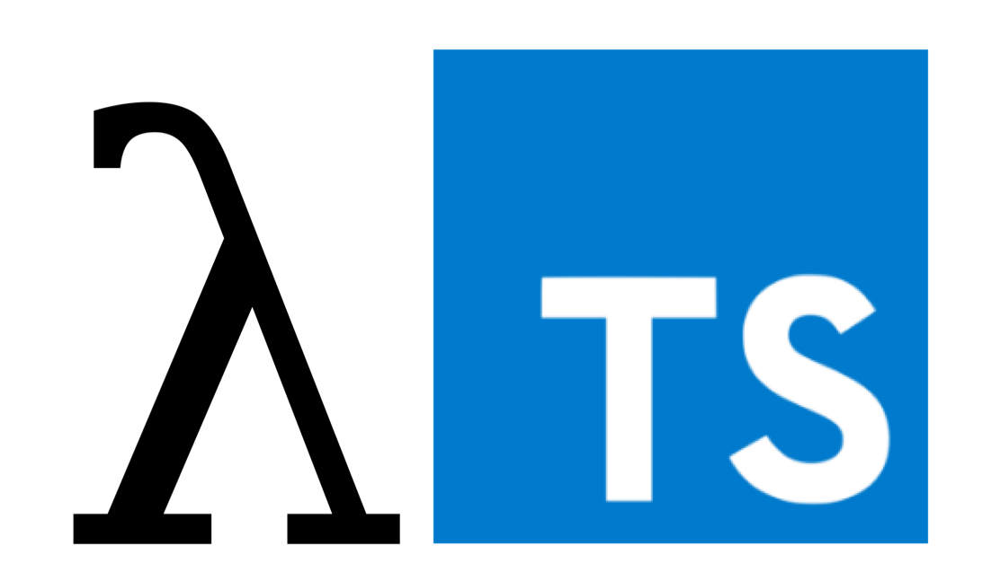

## 函数

函数是`JavaScript`应用程序的基础。 它帮助你实现抽象层，模拟类，信息隐藏和模块。` TypeScript`为`JavaScript`函数添加了额外的功能，让我们可以更容易地使用。

## 函数类型

### 函数声明

我们可以给每个参数添加类型之后再为函数本身添加返回值类型。` TypeScript`能够根据返回语句自动推断出返回值类型，因此我们通常省略它。

```ts
function addWithoutType(x, y) {
    return x + y;
}

function add(x: number, y: number): number {
    return x + y;
}
```

### 函数表达式

现在我们已经为函数指定了类型，下面让我们写出函数的完整类型。当然如果你在赋值语句的一边指定了类型但是另一边没有类型的话，TypeScript编译器会自动识别出类型：

```ts
let addExpression = function (x: number, y: number): number {
    return x + y;
};

let addFullExpression: (
    value: number,
    increament: number
) => number = function (x: number, y: number): number {
    return x + y;
};
```

> 这叫做“按上下文归类”，是类型推论的一种。 它帮助我们更好地为程序指定类型。

## 参数

### 可选参数和默认参数

在TypeScript里我们可以在参数名旁使用 `?`实现可选参数的功能：

```ts
function addWithOptional(x: number, y?: number): number {
    if (y) {
        return x + y;
    }
    return x + 10;
}
```

在TypeScript里，我们也可以为参数提供一个默认值当用户没有传递这个参数或传递的值是`undefined`时。 它们叫做有默认初始化值的参数。 

```ts
function addWithDefault(x: number, y = -99): number {
    return x + y;
}
```

与普通可选参数不同的是，带默认值的参数不需要放在必须参数的后面。 如果带默认值的参数出现在必须参数前面，用户必须明确的传入 `undefined`值来获得默认值。

```ts
function addWithDefaultStart(x = 10, y: number): number {
    return x + y;
}
// addWithDefaultStart(10); error
```

### 剩余参数

剩余参数会被当做个数不限的可选参数。 可以一个都没有，同样也可以有任意个。 编译器创建参数数组，名字是你在省略号（ `...`）后面给定的名字，你可以在函数体内使用这个数组。

```ts
function addMany(x: number, ...others: number[]): number {
    console.log(others);
    return x;
}
addMany(1, 2, 3);
```

## this

### 上下文 `this`

`ts` 对 `this` 的约束局限在顶级的方法，如果是对象这种有上下文的调用并不会对 `this` 进行约束：

```ts
let greeter: Greeter = {
    greeting: 'name',
    greet(word: string) {
			console.log(this.greeting);
    },
};
```

### 顶级 `this`

顶级的非方法式调用会将 `this`视为`window `(**注意：**在严格模式下， `this`为`undefined`而不是`window`会报错)。

```ts
function sub() {
	return this.x - this.y;  // 'this' implicitly has type 'any' because it does not have a type 
}

let deck = {
    suits: ["hearts", "spades", "clubs", "diamonds"],
    cards: Array(52),
    createCardPicker: function() {
        return function() {
            let pickedCard = Math.floor(Math.random() * 52);
            let pickedSuit = Math.floor(pickedCard / 13);
						// 'this' implicitly has type 'any' because it does not have a type 
            return {suit: this.suits[pickedSuit], card: pickedCard % 13};
        }
    }
}

let cardPicker = deck.createCardPicker();
let pickedCard = cardPicker();

alert("card: " + pickedCard.card + " of " + pickedCard.suit);
```

为了解决这个问题，箭头函数能保存函数创建时的 `this`值，而不是调用时的值，但是治标不治本：

```ts
let deck = {
    suits: ["hearts", "spades", "clubs", "diamonds"],
    cards: Array(52),
    createCardPicker: function() {
        return () => {
            let pickedCard = Math.floor(Math.random() * 52);
            let pickedSuit = Math.floor(pickedCard / 13);

            return {suit: this.suits[pickedSuit], card: pickedCard % 13};
        }
    }
}

```

### `this`参数

不幸的是，`this.suits[pickedSuit]`的类型依旧为`any`。 这是因为 `this`来自对象字面量里的函数表达式。 修改的方法是，提供一个显式的 `this`参数。 `this`参数是个假的参数(不要求传入也不占位置)，它出现在参数列表的最前面：

```ts
function f(this: void) {
    // make sure `this` is unusable in this standalone function
}
```

让我们往例子里添加一些接口，`Card` 和 `Deck`，让类型重用能够变得清晰简单些：

```ts
interface Card {
    suit: string;
    card: number;
}
interface Deck {
    suits: string[];
    cards: number[];
    createCardPicker(this: Deck): () => Card;
}
let deck: Deck = {
    suits: ["hearts", "spades", "clubs", "diamonds"],
    cards: Array(52),
    // NOTE: The function now explicitly specifies that its callee must be of type Deck
    createCardPicker: function(this: Deck) {
        return () => {
            let pickedCard = Math.floor(Math.random() * 52);
            let pickedSuit = Math.floor(pickedCard / 13);

            return {suit: this.suits[pickedSuit], card: pickedCard % 13};
        }
    }
}

let cardPicker = deck.createCardPicker();
let pickedCard = cardPicker();

alert("card: " + pickedCard.card + " of " + pickedCard.suit);
```

现在TypeScript知道`createCardPicker`期望在某个`Deck`对象上调用。 也就是说 `this`是`Deck`类型的，而非`any`，因此`--noImplicitThis`不会报错了。

## 重载

`Typescript`的重载要求参数数量相同，方法是为同一个函数提供多个函数类型定义来进行函数重载。 编译器会根据这个列表去处理函数的调用。 下面我们来重载 `pickCard`函数。

```ts
let suits = ["hearts", "spades", "clubs", "diamonds"];

function pickCard(x: {suit: string; card: number; }[]): number;
function pickCard(x: number): {suit: string; card: number; };
function pickCard(x): any {
    // Check to see if we're working with an object/array
    // if so, they gave us the deck and we'll pick the card
    if (typeof x == "object") {
        let pickedCard = Math.floor(Math.random() * x.length);
        return pickedCard;
    }
    // Otherwise just let them pick the card
    else if (typeof x == "number") {
        let pickedSuit = Math.floor(x / 13);
        return { suit: suits[pickedSuit], card: x % 13 };
    }
}
```