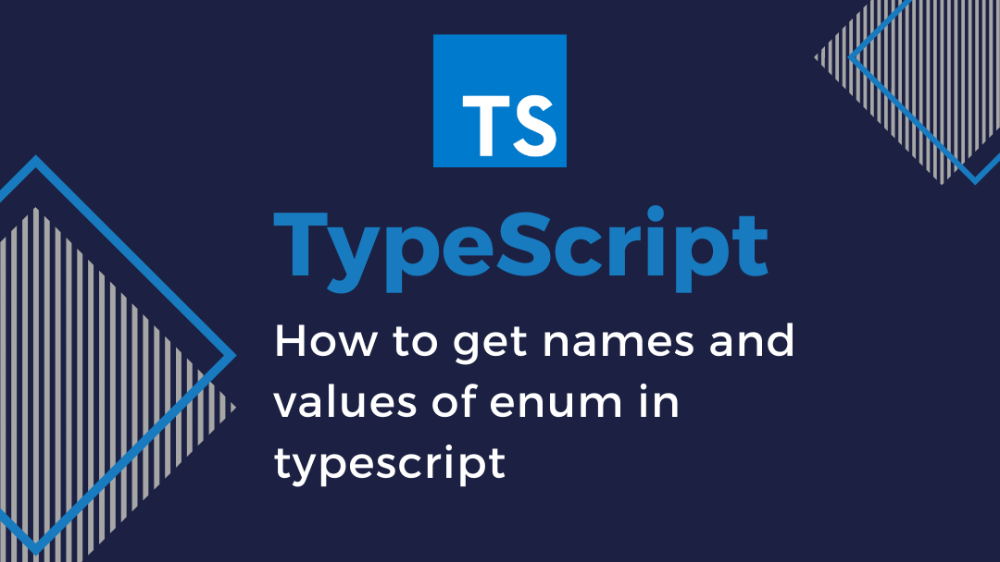

使用枚举我们可以定义一些带名字的常量。 使用枚举可以清晰地表达意图或创建一组有区别的用例。 TypeScript支持数字的和基于字符串的枚举。

## 基础枚举规则

### 数字枚举

首先我们看看数字枚举，如果你使用过其它编程语言应该会很熟悉。

```ts
enum Direction {
    Up = 1,		// 1
    Down,			// 2
    Left,			// 3
    Right			// 4
}
```

我们还可以完全不使用初始化器：`Up`的默认值为 `0`。

```ts
enum Direction {
    Up,
    Down,
    Left,
    Right,
}
```

这种通过等号的显式赋值称为 `initializer`。如果枚举中某个成员的值使用显式方式赋值，但后续成员未显示赋值 `TypeScript` 会基于当前成员的值加 `1` 作为后续成员的值，比如以下 `Enum` 枚举中的成员 `C`：

```ts
enum Enum {
  A,
  B,
  C = 4,
  D,
  E = 8,
  F,
}

assert.deepEqual(
  [Enum.A, Enum.B, Enum.C, Enum.D, Enum.E, Enum.F],
  [0, 1, 4, 5, 8, 9]
);
```

### 字符串枚举

字符串枚举的概念很简单，但是有细微的 [运行时的差别](https://www.tslang.cn/docs/handbook/enums.html#enums-at-runtime)。 在一个字符串枚举里，**每个成员都必须用字符串字面量初始化**，或另外一个字符串枚举成员进行初始化，不能再包含默认初始化和枚举表达式初始化。

```ts
enum InitWithLiteral {
  	None, 								// error must be a string
  	Single = 1 << 2, 			// error must be a string
    Or = Read | Write, 		// error must be a string
  	Prop = "123".length,	// error must be a string
    Up = "UP",
}
```

但是使用数字字面量是可以的，究其原因可以将数字字面量看作字符串字面量的子集：

```ts
enum InitWithLiteral {
  	Str = "str",
  	Num = 1,
}
```

### 异构枚举

最后一种枚举称为异构枚举。异构枚举的成员值是数字和字符串的混合：

```ts
enum Enum {
  A,
  B,
  C = 'C',
  D = 'D',
  E = 8,
  F,
}

assert.deepEqual(
  [Enum.A, Enum.B, Enum.C, Enum.D, Enum.E, Enum.F],
  [0, 1, 'C', 'D', 8, 9]
);
```

请注意，前面提到的规则也适用于此：如果先前的成员值为数字，则我们能省略初始化程序。异构枚举由于其应用较少而很少使用。

目前 TypeScript 只支持将数字和字符串作为枚举成员值。不允许使用其他值，比如 symbols。


### `const`枚举

大多数情况下，枚举是十分有效的方案。 然而在某些情况下需求很严格。 为了避免在额外生成的代码上的开销和额外的非直接的对枚举成员的访问，我们可以使用 `const`枚举。 常量枚举通过在枚举上使用 `const`修饰符来定义。

```ts
let a = 1;

const enum E {
    A = a,							// error
    B = "123".length,		// error
}
```

常量枚举只能使用常量枚举表达式，并且不同于常规的枚举，它们在编译阶段会被删除。 常量枚举成员在使用的地方会被内联进来。 之所以可以这么做是因为，常量枚举不允许包含计算成员。

```ts
const enum Directions {
    Up,
    Down,
    Left,
    Right
}

let directions = [Directions.Up, Directions.Down, Directions.Left, Directions.Right]
```

生成后的代码为：

```ts
var directions = [0 /* Up */, 1 /* Down */, 2 /* Left */, 3 /* Right */];
```

## 枚举成员

### 字面量枚举成员

如果枚举只有字面量成员，我们可以将这些成员用作类型：

```ts
enum NoYes {
  No = 'No',
  Yes = 'Yes',
}

function func(x: NoYes.No) {
  return x;
}

func(NoYes.No); // OK

//@ts-ignore: Argument of type '"No"' is not assignable to
//            parameter of type 'NoYes.No'.
func('No');

//@ts-ignore: Argument of type 'NoYes.Yes' is not assignable to
//            parameter of type 'NoYes.No'.
func(NoYes.Yes);
```

字面量面量枚举支持完整性检查!


### 常量枚举表达式

枚举成员使用 **常量枚举表达式** 初始化。 常数枚举表达式是`TypeScript`表达式的子集，它可以在编译阶段求值。 当一个表达式满足下面条件之一时，它就是一个常量枚举表达式：

- 一个枚举表达式字面量（主要是字符串字面量或数字字面量），和他们的某些属性。

- 一个对之前定义的常量枚举成员的引用（**可以是在不同的枚举类型中定义的**）。
- 带括号的常量枚举表达式。
- 一元运算符 `+`, `-`, `~`其中之一应用在了常量枚举表达式。
- 常量枚举表达式做为二元运算符 `+`, `-`, `*`, `/`, `%`, `<<`, `>>`, `>>>`, `&`, `|`, `^`的操作对象。 若常数枚举表达式求值后为 `NaN`或 `Infinity`，则会在编译阶段报错。

如果使用的不是`const`，枚举成员可以使用非枚举类型定义的数字类型的引用（不能字符串），而`const`不允许这种行为。

```ts
let def = 1;
let obj = {
    info: 2,
};

enum FileAccess {
   
    None = def,	 				// constant members
    Read = obj.info, 		// constant members
    Write = 1 << 2,
    ReadWrite = Read | Write,
    G = "123".length,		// computed member
}
```

## 运行时特性

`TypeScript` 将枚举编译为 `JavaScript` 对象。例如，定义以下枚举：

```ts
enum NoYes {
  No,
  Yes,
}
```

`TypeScript` 将该枚举编译为：

```js
var NoYes;
(function (NoYes) {
  NoYes[NoYes["No"] = 0] = "No";
  NoYes[NoYes["Yes"] = 1] = "Yes";
})(NoYes || (NoYes = {}));
```

有两组赋值操作：

+ 前两个赋值语句将枚举成员名称映射到值。
+ 后两个赋值语句将值映射到名称。这称为反向映射，我们将在后面介绍。

基于字符串的枚举在运行时具有更简单的表示形式。

考虑以下枚举：

```ts
enum NoYes {
  No = 'NO!',
  Yes = 'YES!',
}
```

它会被编译为以下 `JavaScript` 代码：

```js
var NoYes;
(function (NoYes) {
    NoYes["No"] = "NO!";
    NoYes["Yes"] = "YES!";
})(NoYes || (NoYes = {}));
```

`TypeScript` 不支持基于字符串枚举的反向映射。

## 反向映射

给定一个数字枚举：

```ts
enum NoYes {
  No,
  Yes,
}
```

普通的映射是从成员名称到成员值：

```ts
// 静态查找
assert.equal(NoYes.Yes, 1);

// 动态查找
assert.equal(NoYes['Yes'], 1);
```

数字枚举还支持从成员值到成员名称的反向映射：

```ts
assert.equal(NoYes[1], 'Yes');
```

