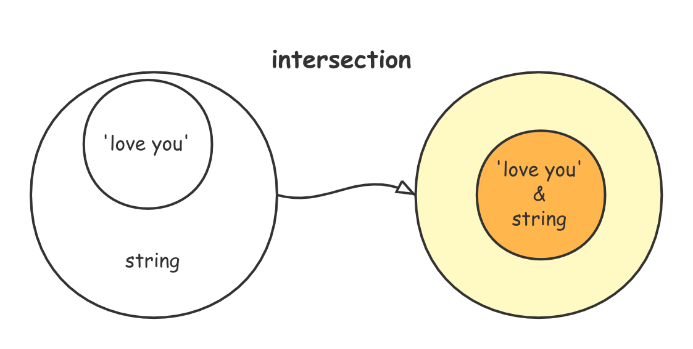
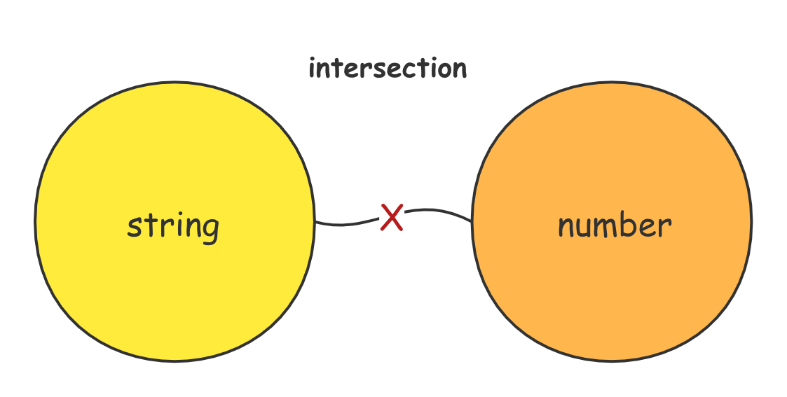

## 交叉类型（Intersection Types）

交叉类型是将多个类型合并为一个类型。 这让我们可以把现有的多种类型叠加到一起成为一种类型，它包含了所需的所有类型的特性。比如我们将自己定义的属性和原生的`HTML_ELEMENT`属性进行混合。

```tsx
type NativeButtonProps = BaseButtonProps &
    React.ButtonHTMLAttributes<HTMLButtonElement>;

type AnchorButtonProps = BaseButtonProps &
    React.AnchorHTMLAttributes<HTMLAnchorElement>;

export type ButtonProps = Partial<NativeButtonProps & AnchorButtonProps>;
```

 例如， `Person & Serializable & Loggable`同时是 `Person` *和* `Serializable` *和* `Loggable`。 就是说这个类型的对象同时拥有了这三种类型的成员。

我们大多是在混入(`mixins`)或其它不适合典型面向对象模型的地方看到交叉类型的使用。 （在 `JavaScript` 里发生这种情况的场合很多！） 下面是如何创建混入的一个简单例子：

```ts
function extend<T, U>(first: T, second: U): T & U {
    let result = <T & U>{};
    for (let id in first) {
        (<any>result)[id] = (<any>first)[id];
    }	
    for (let id in second) {
        if (!result.hasOwnProperty(id)) {
            (<any>result)[id] = (<any>second)[id];
        }
    }
    return result;
}
```

## 集合论

交叉类型，其实就是求交集，对任意两个类型进行交集操作，其实就是在找他们的最近公共子类型，可以直观的分为以下两种情况：

### 本身相交的类型

如果说其中一个类型是另一个类型的子类型(不包括接口、类、对象这种结构子类型)，那么两类型交叉的结果就是那个子类型：



数字类型和数字字面量，字符串类型和字符串字面量，布尔类型和布尔字面量，大整数类型和大整数字面量。这几个类型的交集其实就是字面量本身：

```ts
type love = string & 'love';
type one = number & 1;
type truthy = boolean & true;
type onen = bigint & 1n;
```

利用这个类型吞并的特性，我们可以也实现一个小技巧：如何过滤掉属性的 `optional` 修饰符同时保留其产生的 `undefined`？

 `string & keyof T` 重新计算出新的联合键值，可以过滤掉原键值上的 `optional` 修饰符，同时巧妙的运用交集吞并还避免了对原联合类型的影响：

```ts
export type LooseRequired<T> = { [P in string & keyof T]: T[P] }
export type LooseRequired<T> = { [P in never | keyof T]: T[P] }
```

==any==

除 `never`外任何类型和 `any` 交叉产生的都是 `any`，因为 `any`是所有类型的超类也是所有类型的子类型(`any`作为子类型可以赋值给任何类型)：

```ts
type T1 = any & unknow; // any
type T2 = any & string; // any
type T3 = any & void;   // any
type T4 = any & T1;			// any
```

==unknown==

任何类型和 `unknown` 交叉产生的都是任何类型本身，`unknown` 是所有类型的超类，而`unknown`作为值只能赋值给 `any`：

```ts
type T1 = unknown & string; // string
type T2 = unknown & void;   // void
type T3 = unknown & T1;     // string
```

==never==

任何类型和 `never` 交叉产生的都是 `never`，因为 `never` 是所有类型的子类型：

```ts
type NEVER1 = string & never; // all never
type NEVER2 = any & never;
type NEVER3 = unknown & never;
```

### 无法交叉类型

其余的本身不相交的类型，其实就是在求他们的最近公共子类型，但是有一些完全不相交的类型，这些类型的公共子类型是 `never`，这个公共子类型就是在表示两个类型无法相交：



除了 `Symbol` 之外的所有内置类型交叉都会产生一个 `never`，`never` 是他们的最近子类型：

```ts
type NEVER1 = string & number;    // all never
type NEVER2 = boolean & string;
type NEVER3 = undefined & string;
type NEVER4 = null & string;
type NEVER5 = undefined & null;
type NEVER6 = object & string;
```

### 最近公共子类型

对于对象/接口/类这些结构类型，虽然两个交叉元本身可能不是相交的，但是可以产生一个交叉类型成为二者的子类型：

比如说下面的例子中，`{a:string, b:number}` 即是 `{a:string}` 的子类型又是 `{b:number}`的子类型，交叉之后的结果就是原来二者所有的属性合并：


```ts
interface A {
  name: string;
}

type B = {};
type T1 = A & B;

class _A {}
class _B {}
type ABT = _A & _B & T1;
```

任何对象的子类型，比如元组、数组、函数等等，都可以正常的交叉：

```ts
type T4 = [number, string] & Array<number>;
type T5 = (name: any) => number & ((name: string) => number);
```

### 奇怪的交叉

`number`、`symbol`这样的类型居然可以和 `obj` 这样的结构类型进行交叉：

```ts
type nobj = number & { a: number };
type sobj = symbol & { a: number };
```

分析交叉之后的结果，我们就会发现，使用原始类型和结构类型进行交叉时，会对原始类型进行装箱找到其对应的构造类型接口：

```ts
type keys = keyof sobj;
//   ^ "toString" | "toFixed" | "toExponential" | "toPrecision" | "valueOf" | "toLocaleString" | "a"

interface Number {
    toString(radix?: number): string;
    toFixed(fractionDigits?: number): string;
    toExponential(fractionDigits?: number): string;
    toPrecision(precision?: number): string;
    valueOf(): number;
}
```

