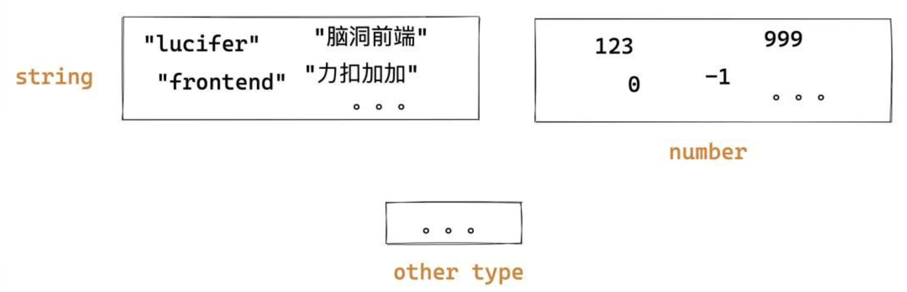
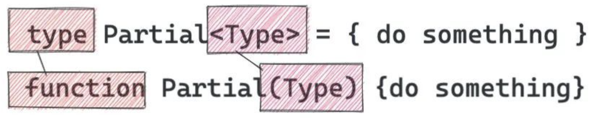
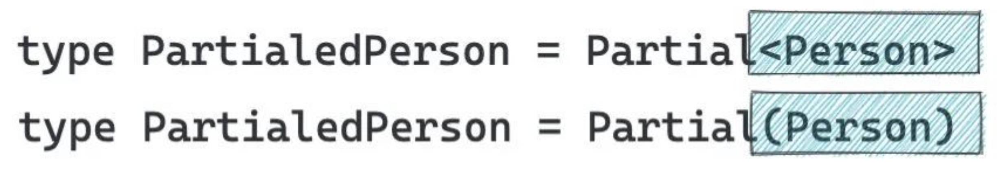
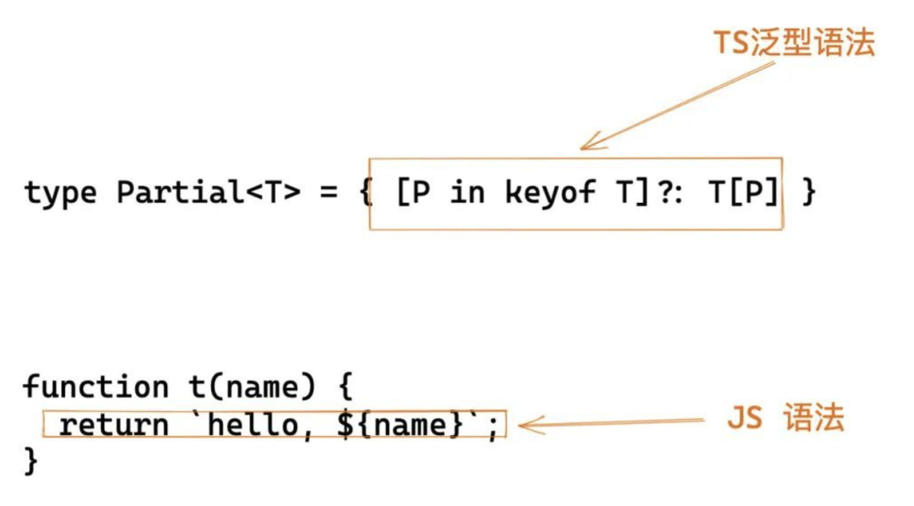
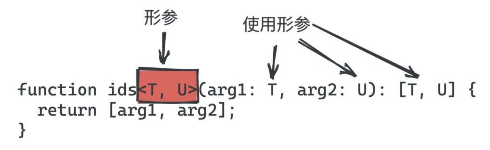
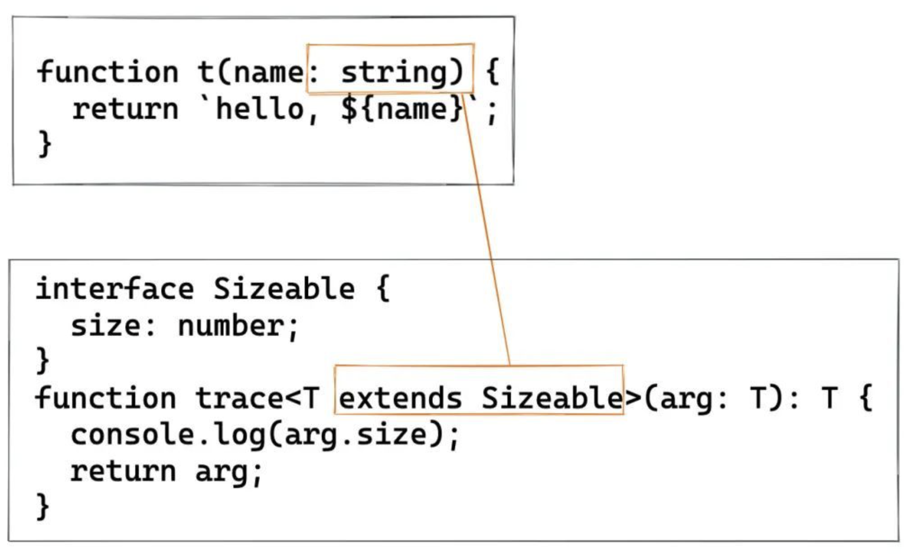

# 深入泛型

## 值和类型

简单来说，区别于平时我们对**「值」**进行编程，泛型是对**「类型」**进行编程。这个听起来比较抽象。之后我们会通过若干实例带你理解这句话，你先留一个印象就好。

为了明白上面这句话，·首先要区分“值”和“类型”。

我们平时写代码基本都是**「对值编程」**。比如：

```ts
if (person.isVIP) {
    console.log('VIP')
}
if (cnt > 5) {
    // do something
}

const personNames = persons.map(p => p.name)
```

可以看出这都是对具体的值进行编程，**「这符合我们对现实世界的抽象」**。从集合论的角度上来说， 值的集合就是类型，在 TS 中最简单的用法是对值限定类型，从根本上来说是限定值的集合。这个集合可以是一个具体的集合，也可以是多个集合通过集合运算(交叉并)生成的新集合。



再来看一个更具体的例子：

```javascript
function t(name: string) {
  return `hello, ${name}`;
}
t("lucifer");
```

字符串 "lucifer" 是 string **「类型」**的一个具体**「值」**。在这里 "lucifer" 就是值，而 string 就是类型。

TS 明白 "lucifer" 是 string 集合中的一个元素，因此上面代码不会有问题，但是如果是这样就会报错：

```javascript
t(123);
```

因为 `123` 并不是 `string` 集合中的一个元素，对于 `t("lucifer")` 而言，`TS` 判断逻辑的伪代码：

```javascript
v = getValue(); // will return 'lucifer' by ast
if (typeof v === "string") {
  // ok
} else {
  throw "type error";
}
```

> 由于是静态类型分析工具，因此 TS 并不会执行 JS 代码，但并不是说 TS 内部没有执行逻辑。

简单总结一下就是：值的集合就是类型，平时写代码基本都是对值编程，TS 提供了很多**「类型」**（也可以自定义）以及很多**「类型操作」**帮助我们**「限定值以及对值的操作」**。

## 泛型概念

上面已经铺垫了一番，大家已经知道了值和类型的区别，以及 TS 究竟帮我们做了什么事情。但是直接理解泛型仍然会比较吃力，接下来我会通过若干实例，慢慢带大家走进泛型。

首先来思考一个问题：`为什么要有泛型呢`？这个原因实际上有很多，在这里我选择大家普遍认同的一个切入点来解释。如果你明白了这个点，其他点相对而言理解起来会比较轻松。还是通过一个例子来进行说明。

### **不容小觑的 id 函数**

假如让你实现一个函数 `id`，函数的参数可以是任何值，返回值就是将参数原样返回，并且其只能接受一个参数，你会怎么做？

你会觉得这很简单，顺手就写出这样的代码：

```javascript
const id = (arg) => arg;
```

由于其可以接受任意值，也就是说你的函数的入参和返回值都应该可以是任意类型。现在让我们给代码增加类型声明：

```javascript
type idBoolean = (arg: boolean) => boolean;
type idNumber = (arg: number) => number;
type idString = (arg: string) => string;
```

一个笨的方法就像上面那样，也就是说 JS 提供多少种类型，就需要复制多少份代码，然后改下类型签名。这对程序员来说是致命的。这种复制粘贴增加了出错的概率，使得代码难以维护，牵一发而动全身。并且将来 JS 新增新的类型，你仍然需要修改代码，也就是说你的代码**「对修改开放」**，这样不好。还有一种方式是使用 any 这种“万能语法”。缺点是什么呢？我举个例子：

```javascript
id("string").length; // ok
id("string").toFixed(2); // ok
id(null).toString(); // ok
...
```

如果你使用 any 的话，怎么写都是 ok 的， 这就丧失了类型检查的效果。实际上我知道我传给你的是 string，返回来的也一定是 string，而 string 上没有 toFixed 方法，因此需要报错才是我想要的。也就是说我真正想要的效果是：`当我用到id的时候，你根据我传给你的类型进行推导`。比如我传入的是 string，但是使用了 number 上的方法，你就应该报错。

为了解决上面的这些问题，我们**「使用泛型对上面的代码进行重构」**。和我们的定义不同，这里用了一个 类型 T，这个 **「T 是一个抽象类型，只有在调用的时候才确定它的值」**，这就不用我们复制粘贴无数份代码了。

```javascript
function id<T>(arg: T): T {
  return arg;
}
```

为什么这样就可以了？为什么要用这种写法？这个尖括号什么鬼？万物必有因果，之所以这么设计泛型也是有原因的。那么就让我来给大家解释一下，相信很多人都没有从这个角度思考过这个问题。

### **泛型就是对类型编程**

上面提到了一个重要的点 `平时我们都是对值进行编程，泛型是对类型进行编程`。上面我没有给大家解释这句话。现在铺垫足够了，那就让我们开始吧！

继续举一个例子：假如我们定义了一个 Person 类，这个 Person 类有三个属性，并且都是必填的。这个 Person 类会被用于用户提交表单的时候限定表单数据。

```ts
interface Person {
  name: string;
  sex: string;
  age: number;
}
```

突然有一天，公司运营想搞一个促销活动，也需要用到 Person 这个 `shape`，但是这三个属性都可以选填，同时要求用户必须填写手机号以便标记用户和接受[短信](https://cloud.tencent.com/product/sms?from=10680)。一个很笨的方法是重新写一个新的类：

```ts
interface MarketPerson {
  name?: string;
  sex?: Sex;
  age?: number;
  phone: string;
}
```

这明显不够优雅。如果 Person 字段很多呢?这种重复代码会异常多，不利于维护。TS 的设计者当然不允许这么丑陋的设计存在。那么是否可以根据已有类型，生成新的类型呢？当然可以！答案就是前面我提到了两种对类型的操作：**「一种是集合操作，另一种是今天要讲的泛型。」**

这个时候我们虽然添加了一个必填字段 phone，但是没有做到`name, sex, age` 选填，似乎集合操作做不到这一点呀。我们脑洞一下，假如我们可以**「像操作函数那样操作类型」**，是不是有可能呢？比如我定义了一个函数 `Partial`，这个函数的功能入参是一个类型，返回值是新的类型，这个类型里的属性全部变成可选的。

```javascript
function Partial(Type) {
    type ans = 空类型
    for(k in Type) {
        空类型[k]  = makeOptional(Type, k)
    }
    return ans
}

type PartialedPerson = Partial(Person)
```

可惜的是上面代码不能运行，也不可能运行。不可能运行的原因有：

- 这里使用函数 `Partial` 操作类型，可以看出上面的函数我是没有添加签名的，我是故意的。如果让你给这个函数添加签名你怎么加？没办法加！
- 这里使用 `JS` 的语法对类型进行操作，这是不恰当的。首先这种操作依赖了 `JS` 运行时，而 `TS` 是静态分析工具，不应该依赖 `JS` 运行时。其次如果要支持这种操作是否意味者 `TS` 对 `JS` 妥协，`JS` 出了新的语法（比如早几年出的 `async await`），`TS` 都要支持其对 `TS` 进行操作。

因此迫切需要一种不依赖 JS 行为，特别是运行时行为的方式，并且逻辑其实和上面类似的，且不会和现有语法体系冲突的语法。我们看下 TS 团队是怎么做的：

```javascript
// 可以看成是上面的函数定义，可以接受任意类型。由于是这里的 “Type” 形参，因此理论上你叫什么名字都是无所谓的，就好像函数定义的形参一样。
type Partial<Type> = { do something with Person }
// 可以看成是上面的函数调用，调用的时候传入了具体的类型 Person
type PartialedPerson = Partial<Person>
```

先不管功能，我们来看下这两种写法有多像：

**definition**



**usage**



再来看下上面泛型的功能。上面代码的意思是对 T 进行处理，是返回一个 T 的子集，具体来说就是将 T 的所有属性变成可选。这时 `PartialedPerson` 就等于 :

```ts
interface Person {
  name?: string;
  sex?: Sex;
  age?: number;
}
```

最后来看下泛型 Partial的具体实现，可以看出其没有直接使用 JS 的语法，而是自己定义了一套语法，比如这里的 `keyof`，至此完全应证了我上面的观点。

```javascript
type Partial<T> = { [P in keyof T]?: T[P] };
```

> 刚才说了“由于是形参，因此起什么名字无所谓” 。因此这里就起了 T 而不是 Type，更短了。这也算是一种约定俗称的规范，大家一般习惯叫 T， U 等表示泛型的形参。

通过完全体的泛型我们就可以看出其和函数的相似之处：

- 从外表看只不过是 `function` 变成了 `type`，`()` 变成了 `<>`而已。
- 从语法规则上来看， 函数内部对标的是 ES 标准。而泛型对应的是 TS 实现的一套标准。



简单来说，将类型看成值，然后对类型进行编程，这就是泛型的基本思想。泛型类似我们平时使用的函数，只不过其是作用在类型上，思想上和我们平时使用的函数并没有什么太多不同，泛型产生的具体类型也支持类型的操作。比如：

```javascript
type ComponentType<P = {}> = ComponentClass<P> | FunctionComponent<P>;
```

有了上面的知识，我们通过几个例子来巩固一下。

```javascript
function id<T, U>(arg1: T, arg2: U): T {
  return arg1;
}
```

上面定义了泛型 id，其入参分别是 T 和 U，和函数参数一样，使用逗号分隔。定义了形参就可以在函数体内使用形参了。如上我们在函数的参数列表和返回值中使用了形参 T 和 U。

返回值也可以是复杂类型：

```javascript
function ids<T, U>(arg1: T, arg2: U): [T, U] {
  return [arg1, arg2];
}
```



## **泛型的种类**

实际上除了上面讲到的函数泛型，还有接口泛型和类泛型。不过语法和含义基本同函数泛型一样：

**接口泛型**

```javascript
interface id<T, U> {
  id1: T;
  id2: U;
}
```

**类泛型**

```javascript
class MyComponent extends React.Component<Props, State> {
   ...
}
```

总结下就是：泛型的写法就是在标志符后面添加尖括号（<>），然后在尖括号里写形参，并在 body（函数体， 接口体或类体） 里用这些形参做一些逻辑处理。

## 泛型的参数类型 - “泛型约束”

正如文章开头那样，我们可以对函数的参数进行限定。

```javascript
function t(name: string) {
  return `hello, ${name}`;
}
t("lucifer");
```

如上代码对函数的形参进行了类型限定，使得函数仅可以接受 string 类型的值。那么泛型如何达到类似的效果呢？

```javascript
type MyType = (T: constrain) => { do something };
```

还是以 id 函数为例，我们给 id 函数增加功能，使其不仅可以返回参数，还会打印出参数。熟悉函数式编程的人可能知道了，这就是 trace 函数，用于调试程序。

```javascript
function trace<T>(arg: T): T {
  console.log(arg);
  return arg;
}
```

假如我想打印出参数的 size 属性呢？如果完全不进行约束 TS 是会报错的：

```javascript
function trace<T>(arg: T): T {
  console.log(arg.size); // Error: Property 'size doesn't exist on type 'T'
  return arg;
}
```

报错的原因在于 T 理论上是可以是任何类型的，不同于 any，你不管使用它的什么属性或者方法都会报错（除非这个属性和方法是所有集合共有的）。那么直观的想法是限定传给 trace 函数的**「参数类型」**应该有 size 类型，这样就不会报错了。

如何去表达这个**「类型约束」**的点呢？实现这个需求的关键在于使用类型约束。使用 extends 关键字可以做到这一点。简单来说就是你定义一个类型，然后让 T 实现这个接口即可。

```ts
interface Sizeable {
  size: number;
}

function trace<T extends Sizeable>(arg: T): T {
  console.log(arg.size);
  return arg;
}
```



这个时候 T 就不再是任意类型，而是被实现接口的 shape，当然你也可以继承多个接口。**「类型约束是非常常见的操作，大家一定要掌握。」**

## **类型推导与默认参数**

类型推导和默认参数是 TS 两个重要功能，其依然可以作用到泛型上，我们来看下。

### **类型推导**

我们一般常见的类型推导是这样的：

```javascript
const a = "lucifer"; // 我们没有给 a 声明类型， a 被推导为 string
a.toFixed(); // Property 'toFixed' does not exist on type 'string'.
a.includes("1"); // ok
```

需要注意的是，类型推导是仅仅在初始化的时候进行推导，如下是无法正确推导的：

```javascript
let a = "lucifer"; // 我们没有给 a 声明类型， a 被推导为string
a.toFixed(); // Property 'toFixed' does not exist on type 'string'.
a.includes("1"); // ok
a = 1;
a.toFixed(); // 依然报错， a 不会被推导 为 number
```

而泛型也支持类型推导，以上面的 id 函数为例：

```javascript
function id<T>(arg: T): T {
  return arg;
}
id<string>("lucifer"); // 这是ok的，也是最完整的写法
id("lucifer"); // 基于类型推导，我们可以这样简写
```

这也就是为什么 useState 有如下两种写法的原因。

```javascript
const [name, setName] = useState("lucifer");
const [name, setName] = useState<string>("lucifer");
```

实际的类型推导要更加复杂和智能。相信随着时间的推进，TS 的类型推导会更加智能。

### **默认参数**

和`类型推导`相同的点是，默认参数也可以减少代码量，让你少些代码。前提是你要懂，不然伴随你的永远是大大的问号。其实你完全可以将其类比到函数的默认参数来理解。

举个例子：

```javascript
type A<T = string> = Array<T>;
```

## 在泛型中使用类类型

使用泛型在TypeScript中创建工厂时，有必要通过其构造函数来引用类类型。例如，

```ts
function create<Type>(c: { new (): Type }): Type {
  return new c();
}
```

一个更高级的示例使用prototype属性推断和约束构造函数和类类型的实例端之间的关系。

```ts
class BeeKeeper {
  hasMask: boolean;
}

class ZooKeeper {
  nametag: string;
}

class Animal {
  numLegs: number;
}

class Bee extends Animal {
  keeper: BeeKeeper;
}

class Lion extends Animal {
  keeper: ZooKeeper;
}

function createInstance<A extends Animal>(c: new () => A): A {
  return new c();
}

createInstance(Lion).keeper.nametag;
createInstance(Bee).keeper.hasMask;
```

