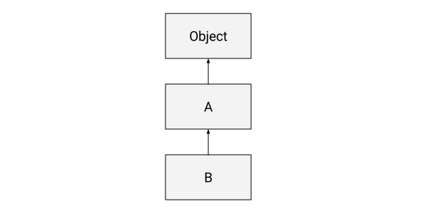
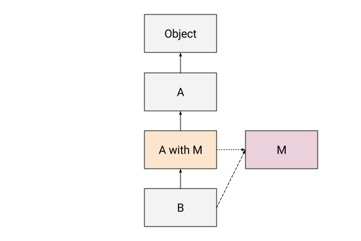
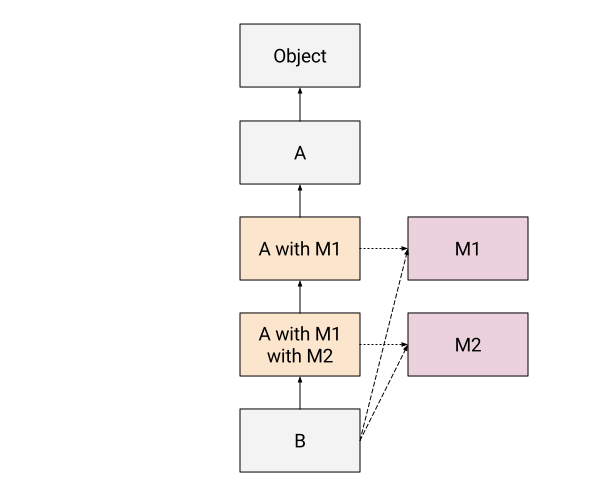

# Mixin

> `mixin` 是一个抽象子类；即一个子类定义，可以应用于不同的超(父)类以创建相关的修改类族群。
>
> ​																   —— Gilad Bracha 和 William Cook，[基于 Mixin 的继承](http://www.bracha.org/oopsla90.pdf)

上面是我能找到的 `mixin` 的最佳定义。它清楚地显示了 `mixin` 和 `normal class` 之间的区别，并强烈暗示了 `mixin` 如何在 `JavaScript` 中实现。

为了更深入地了解这个定义的含义，让我们在 `mixin` 词典中添加三个术语：

+ `super class`：在软件术语中，**被继承**的类一般称为**超类**，也有叫做父类。
+ `mixin definition`：可以应用于不同超类(父类)的抽象子类的定义。
+ `mixin application`：将 `mixin` 定义应用于某个特定的超类，产生一个新的子类。

`mixin defintion` 实际上是一个`subclass factory`，由超类来进行参数化，它生成 `mixin application`。`mixin application` 位于子类和超类之间的继承层次结构中。

`mixin` 和普通子类之间唯一的区别在于普通子类有一个固定的超类(父类)，而 `mixin` 定义的时候还没有超类。只有`mixin application`有自己的超类。可以将普通子类继承视为 `mixin` 继承的退化形式，其中超类在类定义时已知，并且只有一个 `application`。

## Mixin applyment

`javascript` 中其实没有特别为 `mixin` 准备的语法，所以我们拿 `Dart` 为例来看看 `Mixin` 的实际使用：

### Simple Mixin

下面是 `Dart` 中 `mixins` 的一个例子，它有一个很好的 `mixins` 语法，同时类似于 `JavaScript`：

```language-dart
class B extends A with M {}
```

这里`A`是基类，`B`是子类，`M`是`mixin definition`。`mixin application` 是将 `M` 混合到 `A` 中的特定组合，通常称为`A-with-M`。`A-with-M` 的超类是 `A`，而 `B` 的实际超类不是`A`，如您所料，而是`A-with-M`。

让我们从一个简单的类层级结构开始，`B`类继承自`A`类，`Object` 即根对象类：

```language-dart
class B extends A {}
```



现在让我们添加 `mixin`：

```language-dart
class B extends A with M {}
```



如您所见，`mixin application *A-with-M*`被插入到子类和超类之间的层次结构中。

> 注意：我使用长虚线表示 `mixin defintion`，使用短虚线表示 `mixin application` 的定义。

### Multiple Mixins

在 `Dart` 中，多个 `mixin` 以从左到右的顺序应用，导致多个 `mixin` 应用程序被添加到继承层次结构中，这里我们要知道 `Mixin definition` 上可以添加方法所以多层的 `mixin` 才有意义：



```js
class B extends A with M1, M2 {}
```

## Traditional JavaScript Mixins

`JavaScript` 中可以自由修改对象的能力意味着可以很容易地复制函数以实现代码重用，而无需依赖继承。

通常通过类似于以下的函数来实现：

```js
function mixin(target, source) {
  for (var prop in source) {
    if (source.hasOwnProperty(prop)) {
      target[prop] = source[prop];
    }
  }
}
```

它的一个版本甚至以 `Object.assign` 的形式出现在 `JavaScript` 中，所以我们经常能在源码看到这样的写法：

```js
const extend  = Object.assign;
const mixin  = Object.assign;
```

我们通常在原型上调用 `mixin()`：

```language-javascript
mixin(MyClass.prototype, MyMixin);
```

现在，`MyClass`拥有了`MyMixin`中定义的所有属性。

如果你真的理解上面在 `Dart` 中的 `Mixin` 关系图，你一定会有一些疑惑，如果 `MyClass.prototype` 指的是 `B`，那 `MyMixin` 指的是 `A` 还是 `A with M`。答案是这个不完备的实现方法中 `MyMixin` 指的是 `A` 而 `mixin(MyClass.prototype, MyMixin);` 这个过程相当于是给 `MyClass.prototype` 添加 `A with M`，且 `M` 是无实体的。

这显然会带来很多的问题，下面来具体的探讨一下；

### What's So Bad About That?

简单地将属性复制到目标对象中有一些问题。当然问题可以通过足够完备的 `mixin` 函数来解决：

**1.Prototypes are modified in place.**

当对原型对象使用 `mixin` 库时，原型会被直接改变。如果在任何其他不需要使用`mixin`来的属性的地方使用这个原型，那么就会出现问题。

**2.`super` doesn't work.**

既然`JavaScript`最终支持`super`， `mixin`也应该支持。不幸的实际上我们上面所实现的 `mixin` 直接对子类的 `prototype` 属性进行修改，并没有创建实际的 `A with M` 的中间层，`assign` 来的属性不包括 `__proto__` 所以在子类上调用 `super` 拿不到 `A with M` 也拿不到 `A`。

**3.Incorrect precedence(优先级).**

虽然不一定总是这样，但正如示例中经常显示的那样，通过重写属性，`mixin` 来的方法优先于子类中的方法。而正确的思路是子类方法应该只优先于超类方法，允许子类覆盖 `mixin` 中的方法。

**4.Composition is compromised(结构损坏)**

`Mixin` 通常需要基础给原型链上的其他 `mixin` 或对象，但是上面的传统的 `mixin` 没有自然的方法来做到这一点。 因为属性是被函数被复制到对象上，简单的实现会覆盖现有的方法。而不是创建一个实际的`mixin application` 中间层。

同时对函数的引用在 `mixin` 的所有应用程序中都是重复的，在许多情况下，它们可以捆绑在引用相同原型中。经过覆盖属性，原型的结构和 `JavaScript` 的一些动态特性被减少：你不能轻易地内省 `mixin` 或删除或重新排序 `mixin`，因为 `mixin` 已直接扩展到目标对象中。

## Better Mixins Through Class Expressions

了解了 `mixin` 这种模式的短处之后让我们来看看改进版。让我们快速列出我们想要启用的功能，以便我们可以根据它们来设计我们的实现：

- 根据上面的图，我们知道其实 `Mixin` 应该是被添加到子类和超类之间的中间类，所以在 `Javascript` 中 `Mixin`  应该被添加到原型链中。
- `Mixins application` 不需要修改现有的对象。
- 子类继承于 `Mixins application` 时不会修改子类。
- `super.foo` 属性访问适用于 `mixin` 和子类。
- `Super()`调用超类(`A` not `A with M`)构造函数。
- `Mixins` 可以继承于其他 `Mixins`。
- `instanceof` 有效果。

### SubClass Factory

上面我将 `mixin` 称为**“由超类进行参数化的子类工厂”**，在实际的实现中其实就是这样。

我们依赖于`JavaScript`类的两个特性来实现这个子类工厂：

1. 类可以用作表达式，也可以用作语句。作为表达式，它在每次求值时返回一个新类。

   ```ts
   let A = class {};
   let a = new A(); // A {}
   ```

2. `extends` 操作接受**返回类或构造函数的任意表达式**。

   ```ts
   class B extends function Foo(n) {this.n = n} { /* class B code */ }
   let b = new B(1); // B{}
   
   let rClass = (superClass) => class extends superClass;
   class C extends rClass(B) { /* class C code */ }
   ```

定义`mixin`所需要的只是一个接受超类然后创建子类作为返回的函数，就像这样：

```ts
let MyMixin = (superclass) => class extends superclass {
  foo() {
    console.log('foo from MyMixin');
  }
};
```

然后我们可以像这样在 `extends` 子句中使用它：

```ts
class MyClass extends MyMixin(MyBaseClass) {
  /* ... */
}
```

除了继承的方式还可以直接赋值生成没有子类属性和方法的 `Mixin` 类，这适用于只需要 `Mixin Definition` 和 `SuperClass` 的交集的时候：

```ts
class Point {
    constructor(public x: number, public y: number) {}
}

type Constructor<T> = new (...args: any[]) => T;
function Tagged<T extends Constructor<{}>>(Base: T) {
    return class extends Base {
        _tag: string;
        constructor(...args: any[]) {
            super(...args);
            this._tag = '';
        }
    };
}

const TaggedPoint = Tagged(Point);
let point = new TaggedPoint(10, 20);
point._tag = 'hospital';
// a hospital at [x: 10, y: 20]
```

难以置信的简单，也难以置信的强大！ 通过结合函数和类表达式，我们得到了一个完备的 `mixin` 解决方案，它也能很好地泛化。我们来看看这种实现方案下的原型链结构：

```txt
+---------------+						+---------------+						+---------------+
|							  |						|	 super Class  |						|							  |
|	 super Class  |---------->|			with  	  |---------->|	   MyClass		|
|							  |						|		 MyMixin    |						|							  |
+---------------+						+---------------+						+---------------+
  																	^
  																	|
  																	|
                            +---------------+
                            |							  |
                            |	   MyMixin    |
                            |							  |
                            +---------------+
```

在这个原型结构中，`MyMixin` 作为工厂函数成为原型链的一环，而其通过 `superClass` 参数化的返回值 `superClass with MyMixin` 则作为 `MyClass` 和 `superClass` 的中间层，拥有类实体。其本身通过 `__proto__ ` 连接 `superClass`，而 MyClass 则通过 `__proto__` 连接这个中间层。这和我们预期的结构完全一致。

如预期应用多个`mixins`工作:

```ts
class MyClass extends Mixin1(Mixin2(MyBaseClass)) {
  /* ... */
}
```

通过传递超类，`mixin`可以很容易地从其他`mixin`继承来：

```ts
let Mixin2 = (superclass) => class extends Mixin1(superclass) {
  /* Add or override methods here */
}
```

### Benefits of Subclass Factory

来看看这种方法实现的 `mixin` 的好处有哪些：

**1.SubClass can override mixin methods.**

正如我之前提到的，许多`JavaScript mixin`的例子都犯了这个错误，`mixin`会重写子类。通过我们的方法，创建了中间层，子类正确地重写了重写超类方法的`mixin`方法而不是直接修改子类方法。

**2.super works**

这种实现中，`super` 在子类和 `mixin` 的方法中工作。 由于我们永远不会覆盖类或 ``mixin`` 上的方法，因此它们可用于 ``super`` 寻址。

``super`` 调用的好处对于那些不熟悉 ``mixin`` 的人来说可能有点不直观，因为在 ``mixin definition`` 中不知道超类的存在，有时开发人员希望 ``super`` 指向声明的超类（``mixin`` 的参数），而不是 ``mixin application`` 。

**3.Composition is preserved.**

如果两个`mixin`可以定义相同的方法，并且只要每一层都调用`super`，它们都会被调用(即使覆盖`super`也可以调用父类方法)。有时，`mixin` 不知道超类是否具有特定的属性或方法，因此最好保护 `super` 调用。这么说可能不太清晰，来看看具体的效果：

```ts
let Mixin1 = (superclass) => class extends superclass {
  foo() {
    console.log('foo from Mixin1');
    if (super.foo) super.foo();
  }
};

let Mixin2 = (superclass) => class extends superclass {
  foo() {
    console.log('foo from Mixin2');
    if (super.foo) super.foo();
  }
};

class S {
  foo() {
    console.log('foo from S');
  }
}

class C extends Mixin1(Mixin2(S)) {
  foo() {
    console.log('foo from C');
    super.foo();
  }
}

new C().foo();

// foo from C
// foo from Mixin1
// foo from Mixin2
// foo from S
```

### Constructor

构造函数是造成`mixin`混乱的一个潜在因素。它们本质上类似于方法，除了被覆盖的方法往往具有相同的签名，而继承层次结构中的构造函数通常具有不同的签名。由于 `mixin` 不知道它可能被应用到哪个超类，因此也不知道它的超类构造函数签名，因此调用`super()`可能很棘手。处理这个问题的最佳方法是始终将所有构造函数参数传递给`super()`，要么根本不在 `superClass` 定义构造函数，要么使用扩展操作符:`super(…arguments)`。

```ts
let mixin = (superClass) =>
    class extends superClass {
        constructor(...args) {
            super(...args);
        }
    };

class GF {
    constructor(lastName) {
        this.lastName = lastName;
    }
}

class SON extends mixin(GF) {
    constructor(lastName) {
        super(lastName);
    }
}

let xiaoming = new SON('zhang');
```

## Mixin In Ts

上面的代码都是 `Js` 完成的，放到 `ts` 环境下会出现一点问题，比如我们这个超类参数的类型如何书写：

```ts
let mixin = (superClass) =>
							// ^
							// Parameter 'superClass' implicitly has an 'any' type.
    class extends superClass {
        constructor(...args) {
            super(...args);
        }
    };
```

还好`TypeScript 2.2`增加了对`ECMAScript 2015 mixin`类模式的支持，``mixin``超类构造类型指的是这样一种类型，它有一个构造签名，带有一个``rest``参数，类型为`any[]`和一个类对象返回类型。例如，给定一个类对象类型`X, new(…args: any[]) => X`是一个返回实例类型为 ``X`` 的 ``mixin``超类构造函数类型。有了这个类型再对 `mixin` 函数做一些限制：

+ `extends` 表达式的类型参数类型必须限制为 `mixin` 超类构造函数类型。
+ `mixin` 类（如果有）的构造函数必须有一个 `any[]` 类型的其余参数，并且必须使用扩展运算符将这些参数作为参数传递给 `super(...args)` 调用。

一个 `mixin` 之后类表现为 `mixin` 超类构造函数类型(默认的)和参数基类构造函数类型之间的交集。

当获取包含`mixin`构造函数类型的交集类型的构造签名时，`mixin` 超类构造函数类型(默认的)被丢弃，其实例类型混合到交集类型中其他构造签名的返回类型中。 例如，交集类型 `{ new(...args: any[]) => A } & { new(s: string) => B }` 具有单个构造签名 `new(s: string) => A & B`。

```ts
class Point {
  constructor(public x: number, public y: number) {}
}
class Person {
  constructor(public name: string) {}
}
type Constructor<T> = new (...args: any[]) => T;

function TaggedMixin<T extends Constructor<{}>>(SuperClass: T) {
  return class extends SuperClass {
    _tag: string;
    constructor(...args: any[]) {
      super(...args);
      this._tag = "";
    }
  };
}
const TaggedPoint = TaggedMixin(Point);
let point = new TaggedPoint(10, 20);
point._tag = "hello";

class Customer extends TaggedMixin(Person) {
  accountBalance: number;
}

let customer = new Customer("Joe");

customer._tag = "test";
customer.accountBalance = 0;
```

`Mixin` 类可以通过在类型参数的约束中指定构造签名返回类型来约束它们可以混合到的类的类型。 例如，以下 `WithLocation` 函数实现了一个子类工厂，该工厂将 `getLocation` 方法添加到满足 `Point` 接口的任何类（即具有类型为 `number` 的 `x` 和 `y` 属性）。

```ts
interface Point {
  x: number;
  y: number;
}
const WithLocation = <T extends Constructor<Point>>(Base: T) =>
  class extends Base {
    getLocation(): [number, number] {
      return [this.x, this.y];
    }
  };
```

