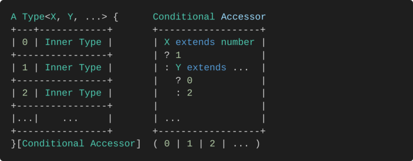
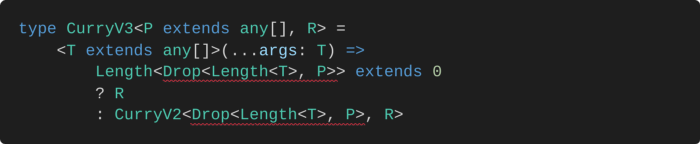

# Curry

尽管 `currying` 很流行，函数式编程（和 `TypeScript`）也兴起了，但今天使用 `curry` 并进行适当的类型检查仍然很麻烦。甚至像 `Ramda` 这样的著名库也不为他们的 `curry` 实现提供泛型类型。

## What is curry?

在我们开始之前先补全一下对 `curry` 的理解，柯里化是将一个接受多个参数的函数转换为一系列一次接受一个参数的函数的过程。我们举一个简单的例子：

```ts
let simpleAdd = (x: number, y: number) => x + y;
```

`Curry` 版本 `simpleAdd` 将是：

```ts
let curryAdd = (x: number) => (y: number) => x + y;
```

通常我们通过调用一个 `curry` 函数来实现这个过程：

```ts
let curryAdd = curry(simpleAdd);
curryAdd(1)(2);
```

不论 `curry` 函数的实现如何，我们需要一个 `Curry` 类型来表达柯里化后的函数类型：

```ts
let curryAdd: Curry<typeof simpleAdd> = (x: number) => (y: number) => x + y;
```

# Basic Curry

`basic curry` 即最简单，也是最标准的柯里化实现，函数式编程中柯里化函数每次只能接受一个参数，即实现我们上面 `curryAdd` 的效果：

```ts
let curryAdd = curry(simpleAdd);
curryAdd(1)(2);
```

## T Utils Basic Curry

构建我们很棒的 `Curry` 类型之前，我们要做一些前置准备，来实现一个泛型工具：

### Tuple

在我们开始学习最高级的 `TypeScript` 技术之前，我只想确保您了解**tuples**。元组类型允许您表达一个数组，其中固定数量的元素的类型是已知的。

```ts
type tuple = [number, string, 3]
```

### Parameters

首先我们需要一个能提取函数参数元组类型的工具：`Parameters`：

```ts
export type Parameters<T extends (...args: any) => any> = T extends (
    ...args: infer A
) => any
    ? A
    : never;
```

让我们测试一下，这个泛型工具能很好的工作并且返回了一个标签元组：

```ts
type Params = Parameters<typeof simpleAdd>;
// type Params = [x: number, y: number]
```

### Head

在 `basic curry` 这种模式中参数被一个一个地使用，现在我们已经有了将参数提取为元组的泛型工具，还需要一个`Head`工 具能接受一个元组类型`T  `并返回它包含的**第一个成员类型**。

```ts
type Head<T extends any[]> = T extends [any, ...any[]] ? T[0] : never;
```

让我们测试一下:

```ts
type First = Head<Params>;
// number
```

### Tail

一个“`basic curry`”函数**一个一个地使用**参数。这意味着，当我们使用`Head<Params<F>>`消耗时，我们需要以某种方式移动到尚未消耗的**下一个参数**。在过程编程中，我们可以使用 `shift` 移除数组的第一个元素，在这里我们使用 `Tail`工具，它方便地删除元组可能包含的第一个条目。

```ts
type Tail<T> = T extends [infer _, ...infer R] ? R : never;
```

对元组进行推论可以很轻松的解决这个问题：

```ts
type Rest1 = Tail<Params>; 								// [y: number]
type Rest2 = Tail<[1, 2, 3, 4, 'fuck']>; 	// [2, 3, 4, 'fuck']	
type Rest3 = Tail<Rest2>;									// [3, 4, 'fuck']
```

### HasTail

我们一点一点的消耗参数元组，当我们将参数耗尽的时候就是原函数的调用时机，而我们需要一个泛型工具来判断是否还有剩余参数：

```ts
type HasTail1 = HasTail<[1, 2]>;	// true
type NoTail1 = HasTail<[1]>;			// false
type NoTail2 = HasTail<[]>;     	// false
```

## Curry V1

热身🔥结束，我们已经为 `basic curry` 准备好了工具。但在我们开始之前，让我们（再次）总结一下`basic curry`必须能够做什么：

```ts
let simpleAdd = (x: number, y: number) => x + y;
let curryAdd = (x: number) => (y: number) => x + y;
```

我们的第一个 ``curry`` 类型必须接受一个参数元组``P``和一个返回类型``R``。它是一种递归函数类型，随``P``的长度而变化：

```ts
type CurryV1<P extends any[], R> = (
    arg0: Head<P>
) => HasTail<P> extends true ? CurryV1<Tail<P>, R> : R;
```

如果`HasTail`返回`false`，这意味着**所有**的参数都**消耗掉**，它**返回**的返回类型`R`。否则，还有参数**要消耗**，我们在我们的类型中**递归**。递归？是的，`CurryV0`描述了一个只要有`Tail`(`HasTail<P> extends true`)就返回`CurryV0`的函数。

来看看证明，`curryV0` 是一个没有任何实现的函数声明，我们需要的是正确的类型返回：

```ts
declare function curryV1<P extends any[], R>(
    fn: (...args: P) => R
): CurryV1<P, R>;
```

测试结果很明显，在两次调用后这个函数成功返回原函数返回值类型；

```ts
let curriedSimpleAddV1 = CurryV1(simpleAdd);
let curriedSimpleAddV1_1 = curriedSimpleAddV1(1);
let curriedSimpleAddV1_2 = curriedSimpleAddV1_1(2);
```

## Curry V2

上面的`basic curry`实现已经很好了，但我们忘记处理传递**rest参数**的场景，我们不能约束 `rest` 参数只传递一个进去：

```ts
let restAdd = (x: number, y: number, ...rest: number[]) => x + y;
let curriedMRestAdd = curryV0(multiAdd); 
let curriedMRestAdd_1 = curriedMRestAdd(1)(2); 	//-> (arg0: never) => CurryV0<never, number>
let curriedMRestAdd_2 = curriedMRestAdd_1(3, 4);
                                          // ^
                                          // Expected 1 arguments, but got 2.
```

这里出现了两个主要问题，首先在消耗掉两个单独参数只剩 `rest` 参数之后，`curriedMRestAdd_2` 函数的类型变成了 `(arg0: never) => CurryV0<never, number>`，这是为什么？让我们来仔细分析一下：

首先使用 `Tail` 提取到只剩 `rest` 的元组时会返回 `number[]`，这个行为很正确，`rest` 参数本身就是长度未知的元组成员：

```ts
type Rest = Tail<[y: number, ...rest: number[]]>;  // number[]
```

而对这个 `number[]` 使用 `Head` 参数会返回 `never` 类型，因为数组类型不像元组类型一样是支持索引的：

```ts
type Never = Head<number[]>; // never
```

这就酿成了我们上面的悲剧原本剩余参数的 `curriedMRestAdd_1` 参数变为了 `never` 类型，并且不支持多参数。

这是一个很大的设计问题，因为我们说过我们会强制采用单个 `arg0`。要支持 `rest` 那就一定得支持多参数。如果我们要实现每次柯里化支持多参数，就需要跟踪一次消耗的参数。因此，我们将首先摆脱 `arg0` 并开始跟踪消耗的参数：

```ts
type CurryV2<P extends any[], R> = <T extends any[]>(
    ...arg: T
) => <??? 判定参数剩余> ? CurryV2<跟踪参数消耗, R> : R;
```

`CurryV2` 是一个美好的设计雏形而我们需要解决的难题就是如何跟踪每次 `curry` 消耗掉的参数。


# Advanced Curry

前面我们实现了每次消耗单参数的 `curry` 函数类型，接下来我们的目标是实现一次消耗多参数以及剩余参数的处理，这种 `Curry` 就已经不属于标注柯里化的范畴了，是适应编程而生的高级柯里化：

```ts
let multiAdd = (x: number, y: number, z: number, k: number, l: number) => x + y;
let restAdd = (x: number, y: number, ...rest: number[]) => x + y;

let hyperCurriedMultiAdd = hyperCurry(multiAdd);
hyperCurriedMultiAdd(1, 2, 3)(4, 5)

let hyperCurriedRestAdd = hyperCurry(restAdd);
hyperCurriedRestAdd(1, 2)(4, 5, 6, 7)
```

## T Util Advanced Curry

如果我们希望实现每次消耗数量的参数的 `curry`(虽然这样就不是纯正的函数编程了)，我们就需要写出一个泛型工具来跟踪(计数)我们每次调用 `curry` 消耗的参数。

### Last

花点时间试着理解这个复杂而又非常短的类型。这泛型工具将一个元组作为参数，并提取其最后一项:

```ts
export type Last<T extends any[]> = T extends [...infer _, infer L] ? L : never;
```

在没有元组结构的 `ts` 版本下，还可以这样实现：

```ts
export type Last<T extends any[]> = {
  0: Last<Tail<T>>,
  1: Head<T>,
}[
	HasTail<T> extends true ? 0 : 1
]
```

来测试一下：

```ts
type LastEntry = Last<[1, 2, 3, 4, 5]>; // 5
```

此示例演示了条件类型用作索引类型的访问器时的强大功能，来看看这种类型设计模式：



这种技术是一种理想的方法，也是一种像我们刚才那样进行递归的安全方法。 但它不仅限于递归，它还是组织复杂条件类型的一种很好且直观的方式。

### Counter

在 `TypeScript 3.4.x` 中，没有这样的迭代协议可以让我们自由迭代(如 `for`)。 映射类型可以从一种类型映射到另一种类型，但是它们对于我们想要做的事情来说太有限了。因此，理想情况下，我们希望能设计某种计数器，想要实现一个计数器，我们需要两个元件：

+ `Length`： 一个能获取元组长度的泛型工具；
+ `Prepend`：一个每次能向元组中添加一个成员的泛型工具；

#### Length

`Length` 用于获取元组长度：

```ts
type Length<T extends any[]> = T['length'];
```

#### Prepend

`Prepend` 在元组的首部添加一个类型成员：

```ts
type Prepend<T, TT extends any[]> = [T, ...TT];
```

测试一下：

```ts
type prepended = Prepend<number, [string]>;  // [number, string];
```

### Drop

现在我们已经凑齐了两个计数器元件，而我们希望使用计数器实现的功能就是：从参数元祖中消耗掉当前 `curry` 使用参数数量的成员。即 `Drop` 它取一个元组`T`，去掉前 `N` 个元素。

```ts
type Drop<N, T extends any[], I extends any[] = []> = {
    0: Drop<N, Tail<T>, Prepend<any, I>>;
    1: T;
}[Length<I> extends N ? 1 : 0];
```

测试一下：

```ts
type Droped = Drop<3, [1, 2, 3, 4, 5, 6]>; // [4, 5, 6]
```

原理也不难 `Drop` 使用递归维护一个计数器，每次从元组中删除一个成员并且给计数器加 `1` 知道计数器的值等于`N`。

## Curry V3

有了上面的工具我们就能跟踪每次消耗掉的参数了，比如下面这个例子：

```ts
type Paramter = [number, string, boolean, number];
type Consumed = [number, string];
```

使用 `Drop` 我们可以根据 `Consumed` 的数量轻松的计算出剩余的参数：

```ts
type Rested = Drop<Consumed, Paramter>;
```

让我们修改我们之前版本的 `curry`，每次`curry`消耗掉参数的元组使用 `T` 在运行时解析，使用 `Drop` 来替换掉 `Tail`：



首先，`Drop<Length<T>, P>` 意味着我们删除了消耗的参数。然后，如果` Drop<Length<T>, P>`的长度不等于 `0`，我们的 `curry` 类型必须继续使用剩余参数进行递归，直到剩余参数等于`0`，返回类型为 `R`。

## Curry V4

但是我们上面还有另一个错误：`TS` 报错说我们的 `Drop` 返回的不是 `any[]` 类型。有时，`TS` 会提示(莫名其妙的)一种类型不是您期望的类型(这大概和递归深度的限制有关)，但你知道它是！因此，让我们向集合中添加另一个工具：

### Cast

它要求 `TS` 根据类型 `Y` 重新检查类型 `X`，在类型 `X` 匹配失败的时候会强制返回类型 `Y`。这样，我们就可以阻止 `TS` 的报错：

```ts
type Cast<X, Y> = X extends Y ? X : Y;
```

举个例子，对应 `CurryV3` 可能失败的情况：

```ts
type casted1 = Cast<any[], any[]> // any[];
type casted2 = Cast<never, any[]> // any[];
```

这样对我们写的 `CurryV3` 版本经过修改之后便不会因为潜在的递归问题而出错了：

```ts
type CurryV4<P extends any[], R> = <T extends any[]>(
    ...arg: T
) => Length<Cast<Drop<Length<T>, P>, any[]>> extends 0
    ? R
    : CurryV4<Cast<Drop<Length<T>, P>, any[]>, R>;
```

编写一个 `curry` 函数进行测试，发现都没有出现问题：

```ts
declare function curryV4<P extends any[], R>(
    fn: (...args: P) => R
): CurryV4<P, R>;

let curriedSimpleAddV4 = curryV4(simpleAdd);
let curriedSimpleAddV4_1 = curriedSimpleAddV4(1);
let curriedSimpleAddV4_2 = curriedSimpleAddV4_1(2); // number

let curriedMultiAddV4 = curryV4(multiAdd);
let curriedMultiAddV4_1 = curriedMultiAddV4(1);
let curriedMultiAddV4_2 = curriedMultiAddV4_1(2, 3); // number

let curriedRestAddV4 = curryV4(restAdd);
let curriedRestAddV4_1 = curriedRestAddV4(1);
let curriedRestAddV4_2 = curriedRestAddV4_1(2);
let curriedRestAddV4_3 = curriedRestAddV4_2(3, 4); // number
```

## Curry V5

你现在可能满心欢喜的以为我们已经可以处理 `rest` 参数了，但是事与愿违，上面的一切都是一个可笑的巧合，这是为什么？因为一旦 `P` 中包含了`rest` 类型的成员，我们的 `Drop` 返回的是 `never` 类型，这是为什么？原因和上面的 `Head<number[]>` 差不多，这次是因为 `Tail<number[]>`，分析下面这种场景：

```ts
type droped1 = Drop<4, [1, 2, 3, ...number[]]>;
type droped2 = Drop<2, [...number[]]>;
```

当我们消耗到一个 `rest` 成员的时候会发生什么，`never` 就又出现了：

```ts
type Never = Tail<[...rest: number[]]>; // never
```

你可能会有疑问，我们上面的测试结果没问题呀？所以让我们来看看这个巧合是怎么发生的：

```ts
Length<Cast<Drop<Length<[number]>, number[]>, any[]>> extends 0
// 1. Drop<Length<[number]>, number[]> -> never (Tail<number[]>)
// 2. Cast<never, number[]>, any[]>    -> never (never extends any[] === true (never是所有类型的子类型))
// 3. Length<never> 									 -> never
// 4. never extends 0									 -> true  (never是所有类型的子类型)
```

原来上面的一切只是 `never` 作为万能子类型而产生的闹剧。但是其实这种方式来界定是否已经将剩余参数消耗掉了也没有什么问题，虽然很巧合但是却意外的很好用，原文的作者没发现他的实现其实是个意外还在沾沾自喜。。。

同时就算问题没出在 `never` 上面，`Length<number[]>` 也会产生问题：

```ts
type num = Length<[string, number, ...string[]]>; // number
```

因为 `rest` 参数可以是无限的，所以 `TS` 最好的猜测是我们元组的长度是一个数字类型(`number`)而不是具体的字面量。所以，我们不能在处理其余参数时使用`Length`。

不过这个问题是可以解决的，当所有 `non-rest` 参数都被消耗掉时，`Drop<Length<T>, P>` 只能匹配 `[...any[]]`。 因此，我们使用 `[any,...any[]` 作为结束递归的条件。

