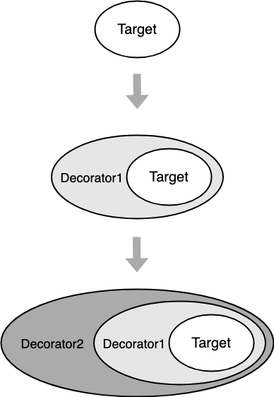

# 装饰器

来说说 `TS` 装饰器和设计模式中的`Decorator`的区别，首先 `TS` 装饰器并不严格要求装饰表达式实现了被装饰类的接口，而是允许定义新方法或者覆盖原属性，并且提供了多种装饰器类型。其次 `TS` 装饰器虽然省去了嵌套声明装饰的过程，但是却失去了运行时修改类的能力，所以`TS` 装饰器更倾向于是为类的声明及成员上通过元编程语法添加标注提供了一种方式。

```ts
interface Greetable {
    greet(): void;
}

function QQGreeterDecorator<T extends new (...args: any[]) => Greetable>(
    SuperClass: T
) {
    return class extends SuperClass {
        greet() {
            super.greet();
            console.log('qq hello');
        }
    };
}

@QQGreeterDecorator
class Greeter {
    greet() {
        console.log('basic hello');
    }
}
```

使用 `TS Decorator`  结合装饰器模式可以写出很优雅的**伪装饰器代码**，为什么是 '伪'？因为这种写法将装饰器锁死在类上，即改变了类本身，又没有运行时扩展的能力。可以说是很僵硬的装饰器构造语法糖：

```ts
const simple = new ConcreteComponent();
const decorator1 = new ConcreteDecoratorA(simple);
const decorator2 = new ConcreteDecoratorB(decorator1);
=====
@ConcreteDecoratorB
@ConcreteDecoratorA
class ConcreteComponent{}
```

用一张图来表示装饰者模式的原理：



从图中可以看出来，通过一层层的包装，增加了原先对象的功能。

## 装饰器语法

装饰器是一项实验性特性，在未来的版本中可能会发生改变。若要启用实验性的装饰器特性，你必须在命令行或`tsconfig.json`里启用`experimentalDecorators`编译器选项：

```ts
{
    "compilerOptions": {
        "target": "ES5",
        "experimentalDecorators": true
    }
}
```

装饰器是一种特殊类型的声明，它能够被附加到类(声明，方法， 访问符，属性或参数)上。 装饰器使用 `@expression`这种形式，`expression`求值后必须为一个函数，它会在运行时被调用，被**装饰的声明信息**做为**参数**传入。

例如，有一个`@sealed`装饰器，我们会这样定义`sealed`函数，其中 `@sealed` 被叫做装饰器声明，而 `sealed` 函数就是一个函数：

```ts
function sealed(target) {
    // do something with "target" ...
}
```

> `target` 的类型在不同的装饰器下定义不同，后面会详细介绍。

### 装饰器工厂

如果我们要给我们的装饰器添加参数可以使用装饰器工厂的形式：**装饰器工厂**就是一个简单的函数，它返回一个装饰器表达式，以供装饰器在运行时调用。

```ts
function sealed(shouldSealed: boolean) { // 这是一个装饰器工厂
    return function (target) { //  这是装饰器
        // do something with "target" and "value"...
    }
}
```

### 装饰器组合

多个装饰器可以同时应用到一个声明上，就像下面的示例：

+ 书写在同一行上：

  ```ts
  @f @g class ...
  ```

+ 书写在多行上：

  ```ts
  @f
  @g
  class ....
  ```

当多个装饰器应用于一个声明上，它们求值方式与复合函数相似。在这个模型下，当复合`f`和`g`时，复合的结果`(f∘g)(x)`等同于`f(g(x))`。

同样的，在`TypeScript`里，当多个装饰器应用在一个声明上时会进行如下步骤的操作：

1. **由上至下依次对装饰器表达式求值。**
2. 求值的结果会被当作函数，由下至上依次调用。

如果我们使用装饰器工厂的话，可以通过下面的例子来观察它们求值的顺序：

```ts
function f() {
    console.log("f(): evaluated");
    return function (target, propertyKey: string, descriptor: PropertyDescriptor) {
        console.log("f(): called");
    }
}

function g() {
    console.log("g(): evaluated");
    return function (target, propertyKey: string, descriptor: PropertyDescriptor) {
        console.log("g(): called");
    }
}

class C {
    @f()
    @g()
    method() {}
}
```

在控制台里会打印出如下结果：

```shell
f(): evaluated
g(): evaluated
g(): called
f(): called
```

至于为什么会这么打印，我们可以理解成，对装饰器工厂求值是顺序，并不是嵌套的也就是，所以会打印前两行：

```ts
@f()
@g()
```

而对装饰器应用则是递归的(嵌套的)，所以后两行如上所示：

```ts
@f()(@g()())
```

### 装饰器应用顺序

类中不同声明上的装饰器将按以下规定的顺序应用：

1. *参数装饰器*，然后依次是*方法装饰器*，*访问符装饰器*，或*属性装饰器*应用到每个实例成员。
2. *参数装饰器*，然后依次是*方法装饰器*，*访问符装饰器*，或*属性装饰器*应用到每个静态成员。
3. *参数装饰器*应用到构造函数。
4. *类装饰器*应用到类。

## 类装饰器

**类装饰器**在类声明之前被声明。类装饰器应用于类构造函数，可以用来**监视，修改或替换**类定义。

类装饰器不能用在声明文件中( `.d.ts`)，也不能用在任何外部上下文中（比如`declare`的类）。

类装饰器表达式会在运行时当作函数被调用，**类的构造函数作**为其唯一的参数。如果类装饰器返回一个值，它会**使用提供的构造函数来替换类的声明**。

> [注意：]()如果你要返回一个新的构造函数，你必须注意处理好原来的原型链。 在运行时的装饰器调用逻辑中不会为你做这些。

### @sealed

先来看一个例子，使用装饰器实现 `Object.seal` 功能(**密封:** 阻止添加新属性并将所有现有属性标记为不可配置)，下面是使用类装饰器(`@sealed`)的例子，应用在`Greeter`类：

```ts
@sealed
class Greeter {
    greeting: string;
    constructor(message: string) {
        this.greeting = message;
    }
    greet() {
        return "Hello, " + this.greeting;
    }
}
```

我们可以这样定义`@sealed`装饰器，当`@sealed`被执行的时候，它将密封此类的构造函数和原型：

```ts
function sealed(constructor: Function) {
    Object.seal(constructor);
    Object.seal(constructor.prototype);
}
```

### @qqDecorator

再来看一个重写构造函数返回值的例子：

```ts
interface Greetable {
    greet(): void;
}

function qqDecorator<T extends new (...args: any[]) => Greetable>(
    SuperClass: T
) {
    return class extends SuperClass {
        greet() {
            super.greet();
            console.log('qq hello');
        }
    };
}

@qqDecorator
class Greeter {
    greet() {
        console.log('basic hello');
    }
}
```

## 方法装饰器

**方法装饰器**声明在一个方法的声明之前，它会被应用到方法的**属性描述符**上，可以用来监视，修改或者替换方法定义。

 方法装饰器不能用在声明文件( `.d.ts`)，重载或者任何外部上下文（比如`declare`的类）中。

方法装饰器表达式会在运行时当作函数被调用，传入下列 `3` 个参数(成员就是属性和方法)：

1. **对于静态成员来说是类的构造函数，对于实例成员是类的原型对象**。
2. 成员的名字。
3. 成员的属性描述符。

```ts
function enumerable(target: any, propertyKey: string, descriptor: PropertyDescriptor) {
	descriptor.enumerable = value;
};
```

> [注意：]()如果代码输出目标版本小于`ES5`，属性描述符将会是`undefined`。

如果方法装饰器返回一个值，它会被用作方法的属性描述符。

> 注意：如果代码输出目标版本小于`ES5`返回值会被忽略。

### @enumerable

下面是一个方法装饰器（`@enumerable`）的例子，应用于`Greeter`类的方法上：

```ts
class Greeter {
    greeting: string;
    constructor(message: string) {
        this.greeting = message;
    }

    @enumerable(false)
    greet() {
        return "Hello, " + this.greeting;
    }
}
```

我们可以用下面的函数声明来定义`@enumerable`装饰器：

```ts
function enumerable(value: boolean) {
    return function (target: any, propertyKey: string, descriptor: PropertyDescriptor) {
        descriptor.enumerable = value;
    };
}
```

这里的`@enumerable(false)`是一个[装饰器工厂](https://www.tslang.cn/docs/handbook/decorators.html#decorator-factories)。 当装饰器 `@enumerable(false)`被调用时，它会修改属性描述符的`enumerable`属性。

## 访问器装饰器

*访问器装饰器*声明在一个访问器的声明之前。 访问器装饰器应用于访问器的 *属性描述符*并且可以用来监视，修改或替换一个访问器的定义。 

访问器装饰器不能用在声明文件中（`.d.ts`），或者任何外部上下文（比如 `declare`的类）里。

访问器装饰器表达式会在运行时当作函数被调用，传入下列3个参数：

1. 对于静态成员来说是类的构造函数，对于实例成员是类的原型对象。
2. 成员的名字。
3. 成员的*属性描述符*。

> 注意  如果代码输出目标版本小于`ES5`，*Property Descriptor*将会是`undefined`。

如果访问器装饰器返回一个值，它会被用作方法的*属性描述符*。

> 注意  如果代码输出目标版本小于`ES5`返回值会被忽略。

### @configurable

下面是使用了访问器装饰器（`@configurable`）的例子，应用于`Point`类的成员上：

```ts
class Point {
    private _x: number;
    private _y: number;
    constructor(x: number, y: number) {
        this._x = x;
        this._y = y;
    }

    @configurable(false)
    get x() { return this._x; }

    @configurable(false)
    get y() { return this._y; }
}
```

我们可以通过如下函数声明来定义`@configurable`装饰器：

```ts
function configurable(value: boolean) {
    return function (target: any, propertyKey: string, descriptor: PropertyDescriptor) {
        descriptor.configurable = value;
    };
}
```

