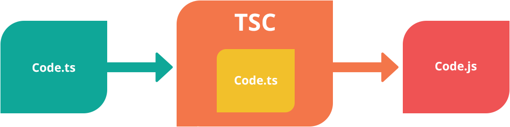

# tsconfig.json

如果一个目录下存在一个`tsconfig.json`文件，那么它意味着这个目录是TypeScript项目的根目录。 `tsconfig.json`文件中指定了用来编译这个项目的根文件和编译选项。 



不带任何输入文件的情况下调用`tsc`，编译器会从当前目录开始去查找`tsconfig.json`文件，逐级向上搜索父目录。当然我们也可以使用命令行参数`--project`（或`-p`）指定一个包含`tsconfig.json`文件的目录。

## compilerOptions 编译配置

`"compilerOptions"`可以被忽略，这时编译器会使用默认值，这里有完整的[编译器选项](https://www.tslang.cn/docs/handbook/compiler-options.html)列表。

````ts
{
    "compilerOptions": {
      	"target": "es5",
        //编译JS之后需要遵循的标准：es3,es5,es2015(es6)
        "module": "commonjs",
        // 定义遵循的JavaScript模块规范。commonjs、AMD和es2015
        "removeComments": true,
        // 编译生成的JavaScript文件是否移除注释
        "sourceMap": true,
        // 编译时是否生成对应的source map文件
        "outDir": "js",
        // 编辑js的输出目录
				"strict": true,
        // 是否开启严格模式
        "noImplicitAny": true
				// 开启某个严格模式检查
    }
}
````

所有编译配置都可以在tcs选项中指定，通过`--name`的方式开启。

```bash
> tsc --noImplicitAny
```

## 输入输出配置

如果`"files"`和`"include"`都没有被指定，编译器默认包含当前目录和子目录下所有的TypeScript文件`.ts`, `.d.ts` 和 `.tsx`，排除在`"exclude"`里指定的文件。JS文件`.js`和`.jsx`也被包含进来如果`allowJs`被设置成`true`。

如果指定了 `"files"`或`"include"`，编译器会将它们结合一并包含进来。 使用 `"outDir"`指定的目录下的文件永远会被编译器排除。

### include

`include`属性指定要编译的文件，该属性指定一个文件glob匹配模式列表。 支持的glob通配符有：

- `*` 匹配0或多个字符（不包括目录分隔符）
- `?` 匹配一个任意字符（不包括目录分隔符）
- `**/` 递归匹配任意子目录

如果一个glob模式里的某部分只包含`*`或`.*`，那么仅有支持的文件扩展名类型被包含在内（比如默认`.ts`，`.tsx`，和`.d.ts`， 如果 `allowJs`设置能`true`还包含`.js`和`.jsx`）。

```json
{
    "include": [
      	"src/**/*",
      	"js"
    ],
    "exclude": [
        "node_modules",
    ]
}
```

### files

`"files"`指定一个包含相对或绝对文件路径的列表。

```json
{
		"files": [
        "core.ts",
        "sys.ts",
        "types.ts",
        "scanner.ts"
    ]
}
```

### exclude

`exclude`用于列出编译时要忽略的目录。

```json
{
    "exclude": [
        "node_modules"
    ]
}
```

## compileOnSave

在最顶层设置`compileOnSave`标记，可以让IDE在保存文件时热更新编译目录。

```ts
{
    "compileOnSave": true,
}
```

## extends

`tsconfig.json`文件可以利用`extends`属性从另一个配置文件里继承配置。

**configs/base.json：**

```json
{
  "compilerOptions": {
    "noImplicitAny": true,
    "strictNullChecks": true
  }
}
```

**tsconfig.json**

```json
{
  "extends": "./configs/base",
  "files": [
    "main.ts",
    "supplemental.ts"
  ]
}
```

