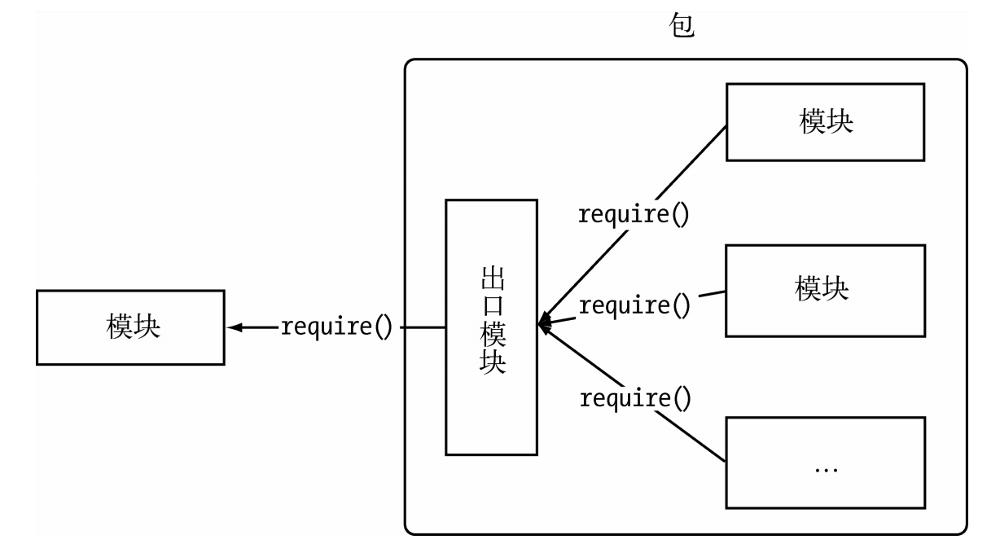
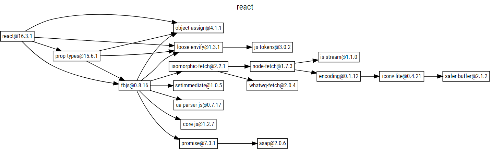
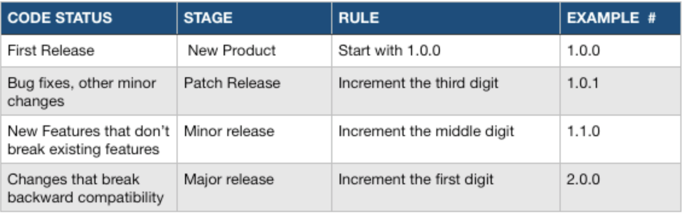

## CommonJS包规范

-----

`Node`组织了自身的核心模块，也使得第三方文件模块可以有序地编写和使用。但是在第三方模块中，模块与模块之间仍然是散列在各地的，相互之间不能直接引用。而在模块之外，包和`NPM`则是将模块联系起来的一种机制。

在介绍`NPM`之前，不得不提起`CommonJS`的包规范。`JavaScript`不似`Java`或者其他语言那样，具有模块和包结构。`Node`对模块规范的实现，一定程度上解决了变量依赖、依赖关系等代码组织性问题。包的出现，则是在模块的基础上进一步组织`JavaScript`代码。下图为包组织模块示意图。



#### 包结构

包实际上是一个存档文件，即一个目录直接打包为.`zip`或`tar.gz`格式的文件，安装后解压还原为目录。完全符合`CommonJS`规范的包目录应该包含如下这些文件。

+ `package.json`：包描述文件。
+ `bin`：用于存放可执行二进制文件的目录。
+ `lib`：用于存放`JavaScript`代码的目录。
+ `doc`：用于存放文档的目录。
+ `test`：用于存放单元测试用例的代码。

## NPM

------


`npm` 为你和你的团队打开了连接整个 `JavaScript` 天才世界的一扇大门。它是世界上最大的软件注册表，每星期大约有 30 亿次的下载量，包含超过 600000 个 `package` 。来自各大洲的开源软件开发者使用 `npm` 互相分享和借鉴。包的结构使您能够轻松跟踪依赖项和版本。

#### 安装

`npm`在安装`nodejs`的同时会自动安装，这里要注意使用`TLS`版本，并且版本应该高于`8.9`。

#### 更新

`npm`的更新频率比`Node.js`的更新频率高，因此请确保您具有最新版本，运行`npm -v`进行测试。

```bash
> npm -v
6.14.4
```

如果版本号不是最新可以通过下面的命令安装npm的最新官方经过测试的版本。

```bash
npm install npm@latest -g
```

要安装将来发布的版本，请运行：

```bash
npm install npm@next -g
```

## package.json

------

The best way to manage locally installed npm packages is to create a `package.json` file.

+ *name:* 包名：规范定义它需要由小写的字母和数字组成，可以包含.、_和-，但不允许出现空格。包名必须是唯一的，以免对外公布时产生重名冲突的误解。除此之外，`NPM`还建议不要在包名中附带上`node`或`js`来重复标识它是`JavaScript`或`Node`模块。

+ *description:* 包简介。

+ *version:* 版本号，一个语义化的版本号。

+ *keywords:* 关键词数组，NPM中主要用来做分类搜索。一个好的关键词数组有利于用户快速找到你编写的包。

+ *licenses* 当前包所使用的许可证列表，表示这个包可以在哪些许可证下使用。它的格式如下：

  ```json
  "licenses": [{ "type": "GPLv2", "url": "http://www.example.com/licenses/gpl.html", }]
  ```

+ *repositories:* 托管源代码的位置列表，表明可以通过哪些方式和地址访问包的源代码。

+ *dependencies:* 使用当前包所需要依赖的包列表。这个属性十分重要，NPM会通过这个属性帮助自动加载依赖的包。除了必选字段外，规范还定义了一部分可选字段，具体如下所示。

+ *homepage:* 当前包的网站地址。

+ *os:* 操作系统支持列表。这些操作系统的取值包括aix、freebsd、linux、macos、solaris、vxworks、windows。如果设置了列表为空，则不对操作系统做任何假设。

+ *cpu:* CPU架构的支持列表，有效的架构名称有arm、mips、ppc、sparc、x86和x86_64。同os一样，如果列表为空，则不对CPU架构做任何假设。

+ *builtin:* 标志当前包是否是内建在底层系统的标准组件。

+ *directories:* 包目录说明。

+ *scripts:* 脚本说明对象。它主要被包管理器用来安装、编译、测试和卸载包。

### cli

To create a `package.json` with values that you supply, run:

```bash
> npm init
```

This will initiate a command line questionnaire that will conclude with the creation of a `package.json` in the directory in which you initiated the command.

```bash
> npm init
This utility will walk you through creating a package.json file.
It only covers the most common items, and tries to guess sensible defaults.

See `npm help json` for definitive documentation on these fields
and exactly what they do.

Use `npm install <pkg>` afterwards to install a package and
save it as a dependency in the package.json file.

Press ^C at any time to quit.
package name: (javascript)
version: (1.0.0)
description:
entry point: (index.js)
test command:
git repository:
keywords:
author:
license: (ISC)
About to write to /Users/inno/projects/javascript/package.json:

{
  "name": "javascript",
  "version": "1.0.0",
  "description": "",
  "main": "index.js",
  "scripts": {
    "test": "echo \"Error: no test specified\" && exit 1"
  },
  "author": "",
  "license": "ISC"
}


Is this OK? (yes)
```

#### Default Config

To get a default `package.json`, run `npm init` with the `--yes` or `-y` flag:

```bash
> npm init --yes
```

This method will generate a default `package.json` using information extracted from the current directory.

```bash
> npm init --yes
Wrote to /home/ag_dubs/my_package/package.json:

{
  "name": "my_package",
  "description": "",
  "version": "1.0.0",
  "main": "index.js",
  "scripts": {
    "test": "echo \"Error: no test specified\" && exit 1"
  },
  "repository": {
    "type": "git",
    "url": "https://github.com/ashleygwilliams/my_package.git"
  },
  "keywords": [],
  "author": "",
  "license": "ISC",
  "bugs": {
    "url": "https://github.com/ashleygwilliams/my_package/issues"
  },
  "homepage": "https://github.com/ashleygwilliams/my_package"
}
```

> If there is no description field in the `package.json`, npm uses the first line of the `README.md` or README instead. The description helps people find your package when searching npm, so it's definitely useful to make a custom description in the `package.json` to make your package easier to find.

#### Customize Config

If you expect to create many package.json files, you might wish to customize the questions asked during the init process, so that the files always contain key information that you expect. You can customize the fields as well as the questions that are asked.

To do this, you create a custom `.npm-init.js` in your home directory `~/.npm-init.js`like this.

```ts
module.exports = {
  customField: 'Custom Field',
  otherCustomField: 'This field is really cool'
}
```

### Specifying Dependencies

To specify the packages your project depends on, you need to list the packages you'd like to use in your `package.json` file. There are 2 types of packages you can list:

- `dependencies`: These packages are required by your application in production.
- `devDependencies`: These packages are only needed for development and testing.

```json
{
  "name": "my_package",
  "version": "1.0.0",
  "dependencies": {
    "my_dep": "^1.0.0"
  },
  "devDependencies" : {
    "my_test_framework": "^3.1.0"
  }
}
```

## Local Package

-----

### npm install

有两种方式用来安装` npm `包：本地安装和全局安装。至于选择哪种方式来安装，取决于我们如何使用这个包，当我们会在命令行执行依赖的时候应该安装全局依赖，同时全局依赖是没有生产和开发之分的。

```bash
> npm install <package_name>
```

命令执行之后将会在当前的目录下创建一个 `node_modules` 的目录（如果不存在的话），然后将下载的包保存到这个目录下。

> 在本地目录中如果没有 `package.json` 这个文件的话，那么最新版本的包会被安装。
>
> 如果存在 `package.json` 文件，则会在 `package.json` 文件中查找针对这个包所约定的[语义化版本规则](https://www.npmjs.cn/getting-started/semantic-versioning)，然后安装符合此规则的最新版本。

#### Install All Dependience

Exec `npm install` to install all dependiences from the `package.json`.

```bash
> npm install 
```

#### The `--save` and `--save-dev` install flags

The easier (and more awesome) way to add dependencies to your `package.json` is to do so from the command line, flagging the `npm install` command with either `--save` or `--save-dev`, depending on how you'd like to use that dependency.

To add an entry to your `package.json`'s `dependencies`:

```bash
npm install <package_name> --save
```

To add an entry to your `package.json`'s `devDependencies`:

```bash
npm install <package_name> --save-dev
```

#### Managing dependency versions

If you have a `package.json` file in your directory and you run `npm install`, npm will look at the dependencies that are listed in that file and download the latest versions, using semantic versioning.

```ts
"dependencies": {
  "lodash": "^4.17.19"
}
```

Also you can install the version you want by `npm install`

```bash
> npm install lodash@1.0.0
+ lodash@1.0.0
```

### npm update

定期更新你的应用所依赖的`包（package）`是个好习惯。因为依赖包的开发者更新了代码，你的应用也就能够获得提升。

首先执行`npm update`更新所有的依赖。

```bash
> npm update

+ lodash@1.3.1
updated 1 package in 0.506s
```

执行 `npm outdated` 命令。不应该有任何输出。

```bash
> npm outdated
Package  Current  Wanted   Latest  Location
lodash     1.3.1   1.3.1  4.17.19  global
```

### npm uninstall

如需删除 node_modules 目录下面的包（package），请执行：

```bash
> npm uninstall lodash
```

如需从 `package.json` 文件中删除依赖，需要在命令后添加参数 `--save`:

```bash
npm uninstall --save lodash
```

> 注意：如果你将安装的包作为 "devDependency"（也就是通过 `--save-dev` 参数保存的），那么 `--save` 无法将其从 `package.json` 文件中删除。所以必须通过 `--save-dev` 参数可以将其卸载。

### npm list

查看所有全局包，包括所依赖的所有模块

```bash
> npm list -g
```

查看所有全局并显示梯度为`index`的依赖包，这里的`index`是依赖包的层级关系，`depth`为`0`的时候不显示所有依赖包。

```bash
> npm list -g --depth index
```

## Global Package

-----

#### Global Install

If you want to depend on the package from your own module, then install it [locally](https://docs.npmjs.com/getting-started/installing-npm-packages-locally). This is the choice you would use if you are using require statements, for example.

```bash
> npm install -g jshint
```

如果`Node`可执行文件的位置是/`usr/local/bin/node`，那么模块目录就是/`usr/local/lib/node`_`modules`。最后，通过软链接的方式将`bin`字段配置的可执行文件链接到`Node`的可执行目录下。

#### Global Update

To update global packages, type:

```bash
> npm update -g <package>
```

For example, to update a packages called jshint, you'd type:

```bash
> npm update -g jshint
```

To find out which packages need to be updated, type:

`npm outdated -g --depth=0`.

To update all global packages, type:

`npm update -g`.

#### Global Uninstall

Use `npm uninstall -g` to remove a package globally.

```bash
> npm uninstall -g <package>
```

Such as remove jshint from global.

```bash
> npm uninstall -g jshint
```

## Semantic versioning

-------

It's important to communicate the extent of changes in a new release of code, because sometimes updates can break code that a package needs. **Semantic versioning** (semver) is a standard that was designed to solve this problem.



### Semver for Publishers

If a project is going to be shared with others, it should start at `1.0.0`.



After this, changes should be handled as follows:

- 主版本`major`：当你做了不兼容的 API 修改.
- 次版本`minor`：当你做了向下兼容的功能性新增，可以理解为Feature版本.
- 修订号`patch`：当你做了向下兼容的问题修正，可以理解为Bug fix版本.

#### 先行版本

当要发布**大版本**或者**核心的Feature**时，但是又不能保证这个版本的功能 100% 正常。这个时候就需要通过发布**先行版本**。比较常见的先行版本包括：内测版、灰度版本了和RC版本。Semver规范中使用`alpha、beta、rc`来修饰即将要发布的版本。它们的含义是：

- `alpha` : 内部版本.
- `beta` : 公测版本.
- `rc(Release candiate)`正式版本的候选版本.

### Semver for Consumers

当执行npm install package -S 来安装三方包时，npm 会首先安装包的最新版本，然后将包名及版本号写入到 package.json 文件中。

```json
{
  "dependencies": {
    "react": "~16.2.0"
  }
}
```

项目对包的依赖可以使用下面的 3 种方法来表示(假设当前版本号是 16.2.0):

- 兼容模块新发布的补丁版本：`~16.2.0、16.2.x、16.2`
- 兼容模块新发布的小版本、补丁版本：`^16.2.0、16.x、16`
- 兼容模块新发布的大版本、小版本、补丁版本：`*、x`

当我们执行`npm install <package_name>`的时候也可以指定版本号：

```bash
> npm install lodash@1.0.0
```

### npm publish

通常我们发布一个包到`npm`仓库时，我们的做法是先修改 `package.json `为某个版本，然后执行` npm publish` 命令。

手动修改版本号的做法建立在你对`Semver`规范特别熟悉的基础之上，否则可能会造成版本混乱。`npm` 考虑到了这点，它提供了相关的命令来让我们更好的遵从`Semver`规范：

- 升级补丁版本号：`npm version patch`.
- 升级小版本号：`npm version minor`.
- 升级大版本号：`npm version major`

## Config

-----

#### ls

```bash
> npm config list
; cli configs
metrics-registry = "https://registry.npm.taobao.org/"
scope = ""
user-agent = "npm/6.14.5 node/v14.5.0 darwin x64"

; userconfig /Users/inno/.npmrc
proxy = "http://127.0.0.1:58591/"
registry = "https://registry.npm.taobao.org/"

; node bin location = /Users/inno/.nvm/versions/node/v14.5.0/bin/node
; cwd = /Users/inno
; HOME = /Users/inno
; "npm config ls -l" to show all defaults.
```

#### rm

```bash
> npm config rm <configPropName>
```

#### proxy

更改 http 代理：

```bash
> npm config set proxy=http://127.0.0.1:8087
```

配置 https 代理：

```bash
> npm config set https-proxy https://server:port
```

#### register

配置注册表`即依赖包数据库地址`：

```bash
npm config set registry https://registry.npm.taobao.org/
```

