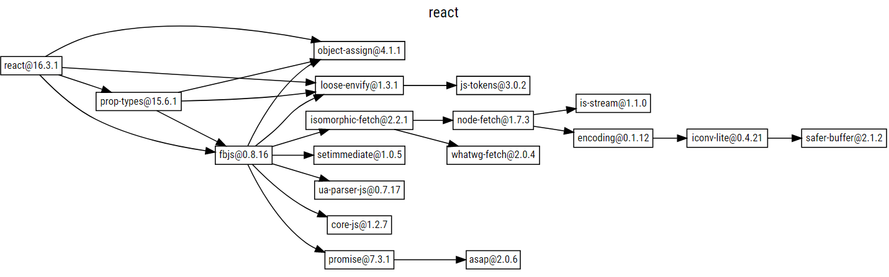

## Semantic versioning

It's important to communicate the extent of changes in a new release of code, because sometimes updates can break code that a package needs. **Semantic versioning** (semver) is a standard that was designed to solve this problem.



## Semver for Publishers

If a project is going to be shared with others, it should start at `1.0.0`.


After this, changes should be handled as follows:

- 主版本`major`：当你做了不兼容的 API 修改.
- 次版本`minor`：当你做了向下兼容的功能性新增，可以理解为Feature版本.
- 修订号`patch`：当你做了向下兼容的问题修正，可以理解为Bug fix版本.

#### 先行版本

当要发布**大版本**或者**核心的Feature**时，但是又不能保证这个版本的功能 100% 正常。这个时候就需要通过发布**先行版本**。比较常见的先行版本包括：内测版、灰度版本了和RC版本。Semver规范中使用`alpha、beta、rc`来修饰即将要发布的版本。它们的含义是：

- `alpha` : 内部版本.
- `beta` : 公测版本.
- `rc(Release candiate)`正式版本的候选版本.

## Semver for Consumers

当执行npm install package -S 来安装三方包时，npm 会首先安装包的最新版本，然后将包名及版本号写入到 package.json 文件中。

```json
{
  "dependencies": {
    "react": "~16.2.0"
  }
}
```

项目对包的依赖可以使用下面的 3 种方法来表示(假设当前版本号是 16.2.0):

- 兼容模块新发布的补丁版本：`~16.2.0、16.2.x、16.2`
- 兼容模块新发布的小版本、补丁版本：`^16.2.0、16.x、16`
- 兼容模块新发布的大版本、小版本、补丁版本：`*、x`

当我们执行`npm install <package_name>`的时候也可以指定版本号：

```bash
> npm install lodash@1.0.0
```

#### npm publish

通常我们发布一个包到`npm`仓库时，我们的做法是先修改 `package.json `为某个版本，然后执行` npm publish` 命令。

手动修改版本号的做法建立在你对`Semver`规范特别熟悉的基础之上，否则可能会造成版本混乱。`npm` 考虑到了这点，它提供了相关的命令来让我们更好的遵从`Semver`规范：

- 升级补丁版本号：`npm version patch`.
- 升级小版本号：`npm version minor`.
- 升级大版本号：`npm version major`


