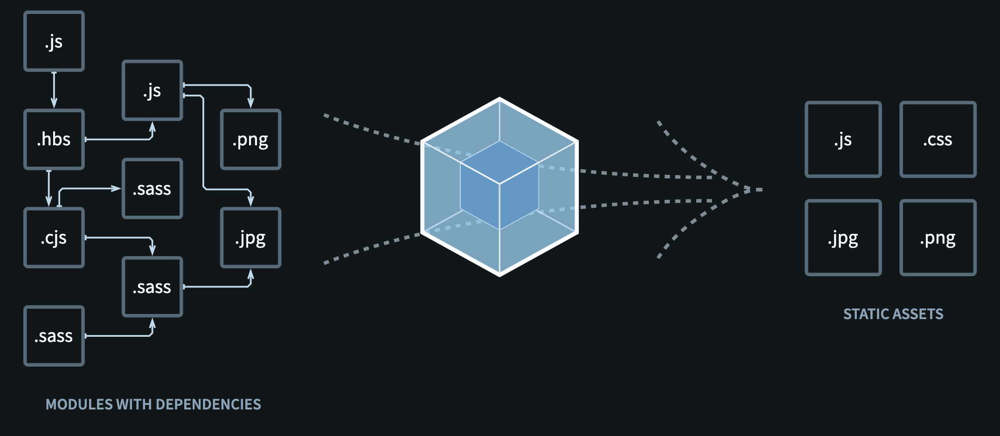
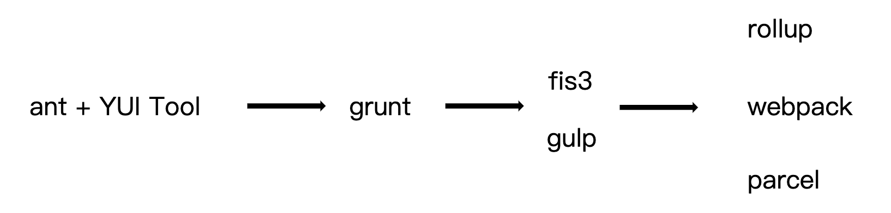

# Webpack


本质上，`webpack` 是一个用于现代 `JavaScript` 应用程序的_静态模块打包工具_。当 `webpack` 处理应用程序时，它会在内部构建一个 依赖图`(dependency graph)`，此依赖图对应映射到项目所需的每个模块，并生成一个或多个 `bundle`。



## why webpack

减少`http`请求次数，压缩混淆：防止代码语义泄露，图片压缩：`base64`。




## 安装

首先你需要安装**nvm**和**nodejs**的环境，并且使用**npm**安装**webpack**和**webpack-cli**到开发依赖。

```bash
> npm install webpack webpack-cli --save-dev
```

> 检查是否安装成功：`./node_modules/.bin/webpack -v`

## 配置

`webpack`的默认配置文件为`webpack.config.js`，进行打包时会在当前目录寻找。

### 基础配置

```js
module.exports = {
  entry: './src/index.js',
  output: './dist/main.js',
  mode: 'production',
  module: {
    rules: [{ test: /\.txt$/, use: 'raw-loader' }]
  },
  plugins: [
    new HtmlwebpackPlugin({template: './src/index.html'})
  ]
}

```

### webpack4.0的默认配置

```js
module.exports = {
    entry: "./src/index.js",		// 指定默认的entry为： ./src/index.js
    output: "./dist/main.js",		// 指定默认的output为：./dist/main.js
    mode: "production",
    module: { 
      rules: [{ test: /\.txt$/, use: "raw-loader" }] 
    },
}; 

```

## npmscript 快速启动

原理：模块局部安装会在node_modules/.bin⽬目录创建软链接

```json
{
  "name": "mypack",
  "version": "1.0.0",
  "description": "",
  "main": "index.js",
  "scripts": {
    "test": "echo \"Error: no test specified\" && exit 1",
    "build":"webpack"
  },
  "author": "",
  "license": "ISC",
  "devDependencies": {
    "webpack": "^4.39.2",
    "webpack-cli": "^3.3.6"
  }
}
```

芜湖，起飞。

```bash
> npm run build
```

## 浏览器兼容性(browser compatibility) 

webpack 支持所有符合 [ES5 标准](https://kangax.github.io/compat-table/es5/) 的浏览器（不支持 IE8 及以下版本）。webpack 的 `import()` 和 `require.ensure()` 需要 `Promise`。如果你想要支持旧版本浏览器，在使用这些表达式之前，还需要 [提前加载 polyfill](https://v4.webpack.docschina.org/guides/shimming/)。

